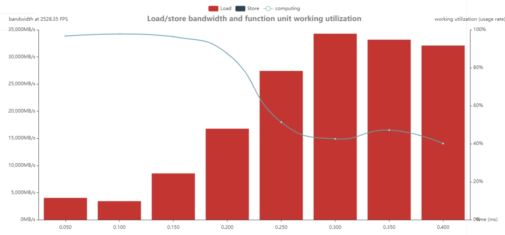
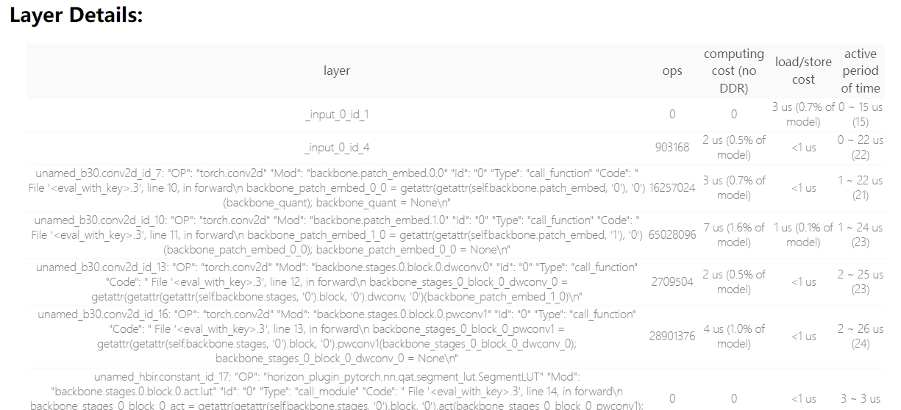

摘要：围绕 J6 BPU 特性给出高效模型设计、算子替换、结构优化和案例分析建议。

<callout emoji="pushpin" background-color="light-orange" border-color="light-orange">
该文档用于指导用户在J6平台上设计出贴合芯片特性的高效算法模型。
</callout>

# 1 J6 **BPU概述**
为了应对更复杂的智驾场景和方案，以及针对J5上部署智驾方案的痛点，地平线发布了征程6芯片来解决以上问题。在J6芯片上仍保持对CNN结构的高效支持，且具有更大的增幅，和J5相同的，为了保证兼容性和迁移性，J6 仍然保留了对 Depthwise/Group Conv 的硬件优化。
为了解决transformer部署难的问题，在 J6 平台，我们基于广泛的 Transformer 模型 Benchmark 进行性能仿真，从而先在硬件层面补齐 J5 存在的明显短板，将共性能力最大化。在J6上增强了的Vector 计算加速能力，并对每一个单元都做了能力增强。除此之外，对于 Pooling、Resizer、Warping 等操作增强了计算能力，J6 平台针对 J5 痛点，解除了 720*1024 的约束限制，并增加了单元数据，大幅提高效率。J5 因为侧重 CNN，所以引入了一些额外限定，例如默认数据四维，且第一维 Batch 也基本不会变动。基于这些限定，硬件的性价比会比较高，但在如今主流的 Transformer 模型中，这些强约束的限定被打破，每一维都会涉及 layout 变换，所以 J6 做了强悍的升级，把能想到的变换都做进去了。
因此在J6上部署模型相较于J5的约束会更小，同时我们也为用户提供了公版模型在J6上的性能表现，用于用户作为性能评估依据。

<lark-table rows="17" cols="8" column-widths="197,113,134,100,146,102,138,123">

  <lark-tr>
    <lark-td rowspan="2">
      <text bgcolor="light-gray">**模型名称**</text>
    </lark-td>
    <lark-td rowspan="2">
      <text bgcolor="light-gray">**输入尺寸**</text>
    </lark-td>
    <lark-td rowspan="2">
      <text bgcolor="light-gray">**计算量(OPS)**</text>
    </lark-td>
    <lark-td rowspan="2">
      <text bgcolor="light-gray">**模型类型**</text>
    </lark-td>
    <lark-td colspan="2">
      **J6E（DDR输入）**
    </lark-td>
    <lark-td colspan="2">
      **J6M（DDR输入）**
    </lark-td>
  </lark-tr>
  <lark-tr>
    <lark-td>
      **实测单核Latency**
    </lark-td>
    <lark-td>
      **实测FPS**
    </lark-td>
    <lark-td>
      **实测单核Latency**
    </lark-td>
    <lark-td>
      **实测FPS**
    </lark-td>
  </lark-tr>
  <lark-tr>
    <lark-td rowspan="2">
      MobileNet-v2
    </lark-td>
    <lark-td>
      1x224x224x3
    </lark-td>
    <lark-td>
      601,548,544
    </lark-td>
    <lark-td>
      CNN
    </lark-td>
    <lark-td>
      0.45
    </lark-td>
    <lark-td>
      4,623.98
    </lark-td>
    <lark-td>
      0.35
    </lark-td>
    <lark-td>
      5,958.80
    </lark-td>
  </lark-tr>
  <lark-tr>
    <lark-td>
      8x224x224x3
    </lark-td>
    <lark-td>
      4,812,388,352
    </lark-td>
    <lark-td>
      CNN
    </lark-td>
    <lark-td>
      1.07
    </lark-td>
    <lark-td>
      9,514.79
    </lark-td>
    <lark-td>
      0.80
    </lark-td>
    <lark-td>
      13,000.08
    </lark-td>
  </lark-tr>
  <lark-tr>
    <lark-td rowspan="2">
      EfficientNet_lite0
    </lark-td>
    <lark-td>
      1x224x224x3
    </lark-td>
    <lark-td>
      770,375,104
    </lark-td>
    <lark-td>
      CNN
    </lark-td>
    <lark-td>
      0.48
    </lark-td>
    <lark-td>
      3,884.32
    </lark-td>
    <lark-td>
      0.37
    </lark-td>
    <lark-td>
      5,198.32
    </lark-td>
  </lark-tr>
  <lark-tr>
    <lark-td>
      8x224x224x3
    </lark-td>
    <lark-td>
      6,163,000,832
    </lark-td>
    <lark-td>
      CNN
    </lark-td>
    <lark-td>
      1.26
    </lark-td>
    <lark-td>
      7,793.41
    </lark-td>
    <lark-td>
      0.94
    </lark-td>
    <lark-td>
      10,573.59
    </lark-td>
  </lark-tr>
  <lark-tr>
    <lark-td rowspan="2">
      Swin-T
    </lark-td>
    <lark-td>
      1x224x224x3
    </lark-td>
    <lark-td>
      9,566,951,940
    </lark-td>
    <lark-td>
      Transformer
    </lark-td>
    <lark-td>
      3.34
    </lark-td>
    <lark-td>
      323.09
    </lark-td>
    <lark-td>
      2.45
    </lark-td>
    <lark-td>
      442.91
    </lark-td>
  </lark-tr>
  <lark-tr>
    <lark-td>
      8x224x224x3
    </lark-td>
    <lark-td>
      76,535,615,520
    </lark-td>
    <lark-td>
      Transformer
    </lark-td>
    <lark-td>
      17.08
    </lark-td>
    <lark-td>
      476.28
    </lark-td>
    <lark-td>
      12.69
    </lark-td>
    <lark-td>
      643.12
    </lark-td>
  </lark-tr>
  <lark-tr>
    <lark-td rowspan="2">
      vit-base-patch16
    </lark-td>
    <lark-td>
      1x224x224x3
    </lark-td>
    <lark-td>
      35,993,826,918
    </lark-td>
    <lark-td>
      Transformer
    </lark-td>
    <lark-td>
      6.01
    </lark-td>
    <lark-td>
      173.47
    </lark-td>
    <lark-td>
      3.97
    </lark-td>
    <lark-td>
      263.79
    </lark-td>
  </lark-tr>
  <lark-tr>
    <lark-td>
      8x224x224x3
    </lark-td>
    <lark-td>
      287,950,615,344
    </lark-td>
    <lark-td>
      Transformer
    </lark-td>
    <lark-td>
      29.89
    </lark-td>
    <lark-td>
      270.38
    </lark-td>
    <lark-td>
      23.40
    </lark-td>
    <lark-td>
      344.86
    </lark-td>
  </lark-tr>
  <lark-tr>
    <lark-td rowspan="2">
      DETR-Resnet50
    </lark-td>
    <lark-td>
      1x608x608x3
    </lark-td>
    <lark-td>
      71,262,526,104
    </lark-td>
    <lark-td>
      Transformer
    </lark-td>
    <lark-td>
      6.63
    </lark-td>
    <lark-td>
      156.58
    </lark-td>
    <lark-td>
      5.00
    </lark-td>
    <lark-td>
      207.91
    </lark-td>
  </lark-tr>
  <lark-tr>
    <lark-td>
      1x800x1333x3
    </lark-td>
    <lark-td>
      209,890,854,436
    </lark-td>
    <lark-td>
      Transformer
    </lark-td>
    <lark-td>
      21.27
    </lark-td>
    <lark-td>
      47.61
    </lark-td>
    <lark-td>
      16.26
    </lark-td>
    <lark-td>
      62.09
    </lark-td>
  </lark-tr>
  <lark-tr>
    <lark-td rowspan="2">
      YoloV5x
    </lark-td>
    <lark-td>
      1x672x672x3
    </lark-td>
    <lark-td>
      90,010,406,226
    </lark-td>
    <lark-td>
      CNN
    </lark-td>
    <lark-td>
      7.80
    </lark-td>
    <lark-td>
      132.49
    </lark-td>
    <lark-td>
      5.66
    </lark-td>
    <lark-td>
      183.05
    </lark-td>
  </lark-tr>
  <lark-tr>
    <lark-td>
      8x672x672x3
    </lark-td>
    <lark-td>
      720,083,249,808
    </lark-td>
    <lark-td>
      CNN
    </lark-td>
    <lark-td>
      54.04
    </lark-td>
    <lark-td>
      148.96
    </lark-td>
    <lark-td>
      40.12
    </lark-td>
    <lark-td>
      200.94
    </lark-td>
  </lark-tr>
  <lark-tr>
    <lark-td>
      FCOS_efficientnet_b0
    </lark-td>
    <lark-td>
      1x512x512x3
    </lark-td>
    <lark-td>
      5,189,354,528
    </lark-td>
    <lark-td>
      CNN
    </lark-td>
    <lark-td>
      1.33
    </lark-td>
    <lark-td>
      1,047.07
    </lark-td>
    <lark-td>
      0.99
    </lark-td>
    <lark-td>
      1,437.92
    </lark-td>
  </lark-tr>
  <lark-tr>
    <lark-td>
      FCOS_efficientnet_b1
    </lark-td>
    <lark-td>
      1x640x640x3
    </lark-td>
    <lark-td>
      12,537,486,050
    </lark-td>
    <lark-td>
      CNN
    </lark-td>
    <lark-td>
      2.29
    </lark-td>
    <lark-td>
      521.49
    </lark-td>
    <lark-td>
      1.78
    </lark-td>
    <lark-td>
      676.61
    </lark-td>
  </lark-tr>
  <lark-tr>
    <lark-td>
      BEVFormer-Tiny-Resnet18
    </lark-td>
    <lark-td>
      6x512x960x3
    </lark-td>
    <lark-td>
      281,025,602,304
    </lark-td>
    <lark-td>
      Transformer
    </lark-td>
    <lark-td>
      31.78
    </lark-td>
    <lark-td>
      31.88
    </lark-td>
    <lark-td>
      24.01
    </lark-td>
    <lark-td>
      42.19
    </lark-td>
  </lark-tr>
</lark-table>

# 2 高效模型设计通用建议
## 2.1 使用BPU算子搭建模型
BPU 算子本身性能远高于 CPU 算子，且 CPU 和 BPU 之间的异构调度还会引入量化、反量化节点，该节点的计算因为需要遍历数据，所以耗时与 shape 大小成正比。
- **对于量化、反量化算子**：建议手动摘除，并将相关计算合入前、后处理代码中，可节省一次数据遍历的冗余耗时。同时在模型后处理中还可考虑先完成筛选过滤的操作，仅对剩下的数据做反量化，可进一步压缩耗时。
- **对于模型中的CPU算子**：可以根据算子约束列表来查看支持的公版算子，将CPU算子做替换或使用支持的算子拼出等效算子，保障模型尽可能BPU全一段的运行。
## 2.2 使用BPU高效Backbone
基于J6的硬件特性，我们提供了高效模型**HENet** (**H**ybri**d** **E**fficient **Net**work)

<lark-table rows="17" cols="7" header-row="true" column-widths="122,155,100,100,100,100,100">

  <lark-tr>
    <lark-td>
      **模型**
    </lark-td>
    <lark-td>
      **输入大小**
    </lark-td>
    <lark-td>
      **J6E 帧率（FPS）**
    </lark-td>
    <lark-td>
      **J6M 帧率（FPS）**
    </lark-td>
    <lark-td>
      **浮点精度**
    </lark-td>
    <lark-td>
      **量化精度**
    </lark-td>
    <lark-td>
      **数据集**
    </lark-td>
  </lark-tr>
  <lark-tr>
    <lark-td rowspan="2">
      resnet18
    </lark-td>
    <lark-td>
      1x3x224x224
    </lark-td>
    <lark-td>
      2456
    </lark-td>
    <lark-td>
      3146
    </lark-td>
    <lark-td>
      72.04
    </lark-td>
    <lark-td>
      71.59
    </lark-td>
    <lark-td>
      ImageNet
    </lark-td>
  </lark-tr>
  <lark-tr>
    <lark-td>
      1x3x704x1280
    </lark-td>
    <lark-td>
      306
    </lark-td>
    <lark-td>
      391
    </lark-td>
    <lark-td>
      /
    </lark-td>
    <lark-td>
      /
    </lark-td>
    <lark-td>
      ImageNet
    </lark-td>
  </lark-tr>
  <lark-tr>
    <lark-td rowspan="2">
      resnet50
    </lark-td>
    <lark-td>
      1x3x224x224
    </lark-td>
    <lark-td>
      1092
    </lark-td>
    <lark-td>
      1490
    </lark-td>
    <lark-td>
      77.38
    </lark-td>
    <lark-td>
      76.74
    </lark-td>
    <lark-td>
      ImageNet
    </lark-td>
  </lark-tr>
  <lark-tr>
    <lark-td>
      1x3x704x1280
    </lark-td>
    <lark-td>
      124
    </lark-td>
    <lark-td>
      168
    </lark-td>
    <lark-td>
      /
    </lark-td>
    <lark-td>
      /
    </lark-td>
    <lark-td>
      ImageNet
    </lark-td>
  </lark-tr>
  <lark-tr>
    <lark-td rowspan="2">
      efficientnet-b0
    </lark-td>
    <lark-td>
      1x3x224x224
    </lark-td>
    <lark-td>
      3379
    </lark-td>
    <lark-td>
      4004
    </lark-td>
    <lark-td>
      74.31
    </lark-td>
    <lark-td>
      73.85
    </lark-td>
    <lark-td>
      ImageNet
    </lark-td>
  </lark-tr>
  <lark-tr>
    <lark-td>
      1x3x704x1280
    </lark-td>
    <lark-td>
      472
    </lark-td>
    <lark-td>
      620
    </lark-td>
    <lark-td>
      /
    </lark-td>
    <lark-td>
      /
    </lark-td>
    <lark-td>
      ImageNet
    </lark-td>
  </lark-tr>
  <lark-tr>
    <lark-td rowspan="2">
      mobilenetv2
    </lark-td>
    <lark-td>
      1x3x224x224
    </lark-td>
    <lark-td>
      4172
    </lark-td>
    <lark-td>
      5988
    </lark-td>
    <lark-td>
      72.63
    </lark-td>
    <lark-td>
      71.53
    </lark-td>
    <lark-td>
      ImageNet
    </lark-td>
  </lark-tr>
  <lark-tr>
    <lark-td>
      1x3x704x1280
    </lark-td>
    <lark-td>
      732
    </lark-td>
    <lark-td>
      942
    </lark-td>
    <lark-td>
      /
    </lark-td>
    <lark-td>
      /
    </lark-td>
    <lark-td>
      ImageNet
    </lark-td>
  </lark-tr>
  <lark-tr>
    <lark-td rowspan="2">
      mixvargenet
    </lark-td>
    <lark-td>
      1x3x224x224
    </lark-td>
    <lark-td>
      3928
    </lark-td>
    <lark-td>
      4114
    </lark-td>
    <lark-td>
      71.32
    </lark-td>
    <lark-td>
      70.66
    </lark-td>
    <lark-td>
      ImageNet
    </lark-td>
  </lark-tr>
  <lark-tr>
    <lark-td>
      1x3x704x1280
    </lark-td>
    <lark-td>
      485
    </lark-td>
    <lark-td>
      653
    </lark-td>
    <lark-td>
      /
    </lark-td>
    <lark-td>
      /
    </lark-td>
    <lark-td>
      ImageNet
    </lark-td>
  </lark-tr>
  <lark-tr>
    <lark-td rowspan="2">
      vargnetv2
    </lark-td>
    <lark-td>
      1x3x224x224
    </lark-td>
    <lark-td>
      2661
    </lark-td>
    <lark-td>
      3307
    </lark-td>
    <lark-td>
      73.93
    </lark-td>
    <lark-td>
      73.21
    </lark-td>
    <lark-td>
      ImageNet
    </lark-td>
  </lark-tr>
  <lark-tr>
    <lark-td>
      1x3x704x1280
    </lark-td>
    <lark-td>
      631
    </lark-td>
    <lark-td>
      860
    </lark-td>
    <lark-td>
      /
    </lark-td>
    <lark-td>
      /
    </lark-td>
    <lark-td>
      ImageNet
    </lark-td>
  </lark-tr>
  <lark-tr>
    <lark-td rowspan="2">
      HENet_TinyE
    </lark-td>
    <lark-td>
      1x3x224x224
    </lark-td>
    <lark-td>
      qat: 2637
    </lark-td>
    <lark-td>
      qat: 3268
    </lark-td>
    <lark-td>
      77.67
    </lark-td>
    <lark-td>
      76.92
    </lark-td>
    <lark-td>
      ImageNet
    </lark-td>
  </lark-tr>
  <lark-tr>
    <lark-td>
      1x3x704x1280
    </lark-td>
    <lark-td>
      qat: 534
    </lark-td>
    <lark-td>
      qat: 737
    </lark-td>
    <lark-td>
      /
    </lark-td>
    <lark-td>
      /
    </lark-td>
    <lark-td>
      ImageNet
    </lark-td>
  </lark-tr>
  <lark-tr>
    <lark-td rowspan="2">
      HENet_TinyM
    </lark-td>
    <lark-td>
      1x3x224x224
    </lark-td>
    <lark-td>
      qat: 2467
    </lark-td>
    <lark-td>
      qat: 3114
    </lark-td>
    <lark-td>
      78.38
    </lark-td>
    <lark-td>
      77.62
    </lark-td>
    <lark-td>
      ImageNet
    </lark-td>
  </lark-tr>
  <lark-tr>
    <lark-td>
      1x3x704x1280
    </lark-td>
    <lark-td>
      qat: 444
    </lark-td>
    <lark-td>
      qat: 605
    </lark-td>
    <lark-td>
      /
    </lark-td>
    <lark-td>
      /
    </lark-td>
    <lark-td>
      ImageNet
    </lark-td>
  </lark-tr>
</lark-table>

<quote-container>
模型来源于OE 3.0.17，底软版本为LNX-PL4.0-WB-20240620 debug 20240622-153623
</quote-container>

为了加速算法开发速度以及在地平线计算平台上的部署速度，地平线算法工具链提供了丰富的参考算法，大家可持续关注[参考算法发布页面](https://developer.horizon.ai/api/v1/fileData/horizon_j5_reference_package_release/index.html)，目前已提供了数个高效backbone模型源码，模型场景覆盖雷达点云、视觉BEV、光流估计、车道线检测、3D检测、transformer等。
## 2.3 使用高效Horizon 算子
horizon_plugin_pytorch提供了一系列高效实现的算子作为python api便于用户直接使用。以下介绍常用的plugin算子。
归一化算子： LN，相比于公版的实现少了reshape操作，执行效率相比于公版更高。
```python {wrap}
# 原来使用方式
x = x.view(0, 3, 1, 2)
x = nn.LayerNorm(
    normalized_shape, eps, elementwise_affine, device, dtype, 1
)
x = x.view(0, 2, 3, 1)

# 使用QAT量化工具提供的layernorm
import horizon_plugin_pytorch as horizon
layer_norm = horizon.nn.LayerNorm(
    normalized_shape, eps, elementwise_affine, device, dtype, 1
)
```

Lidar相关的算子：point_pillars_preprocess，点云为4维，相比于公版的9维来说精度影响微小但是性能更高；也提供了PointPillarsScatter算子可以将其编译到hbm中。
注意力相关的算子：MultiScaleDeformableAttention，相较于原pytorch的实现，我们优化了显存占用，效率更高。
其他的算子见：[7.6.7. Horizon 算子 ¶](https://developer.horizon.cc/api/v1/fileData/horizon_j5_open_explorer_cn_doc/plugin/source/api_reference/horizon_operator.html)
## 2.4 对可fuse算子做融合
在量化阶段，会针对当前的模型结构对不同层做算子融合（fuse），BPU 硬件针对常见的模型基本结构做了优化，在计算 `Conv -> Add -> ReLU` 这种算子组合时，可使算子间的数据传递保留高精度的状态，提高模型整体的数值精度。因此在对模型进行量化时，我们可以将 `Conv -> Add -> ReLU` 视为一个整体。
由于训练工具对模型进行量化改造时以 `torch.nn.Module` 为单位，为了在量化时将 `Conv -> Add -> ReLU` 视为一个整体，需要将它们合并为一个 `Module`。
算子融合除了可以使中间结果保留高精度状态之外，也可以省去将中间结果转化为低精度表示的过程，因此执行速度和不融合相比也会更快。由于算子融合既可以提高模型精度，又可以提高模型速度，一般应该对所有可融合的部分进行融合。
jit模式下会自动做算子融合（需注意共享算子对算子融合的影响），**eager模式**下需要手动做算子融合，**大量未fuse**的算子会对性能造成一点影响。支持的算子融合可分为两大类：1. 吸收 BN；2. 融合 Add、ReLU/ReLU6。具体的算子组合见用户手册的*QAT--深入探索--算子融合章节*

<lark-table rows="3" cols="4" header-row="true" column-widths="207,144,144,154">

  <lark-tr>
    <lark-td>
      模型
    </lark-td>
    <lark-td>
      convert_mode
    </lark-td>
    <lark-td colspan="2">
      J6E 性能（FPS）
    </lark-td>
  </lark-tr>
  <lark-tr>
    <lark-td>

    </lark-td>
    <lark-td>

    </lark-td>
    <lark-td>
      未fuse
    </lark-td>
    <lark-td>
      fuse
    </lark-td>
  </lark-tr>
  <lark-tr>
    <lark-td>
      fcos_efficientnetb0_mscoco
    </lark-td>
    <lark-td>
      eager
    </lark-td>
    <lark-td>
      852.26FPS
    </lark-td>
    <lark-td>
      1206.89FPS
    </lark-td>
  </lark-tr>
</lark-table>

**推荐使用jit量化**方式，可以自行完成fuse，避免fuse导致的精度和性能问题。
## 2.5 遵循硬件对齐规则
J6 计算平台运算的时候有最小的对齐单位，若不满足规则时会对Tensor自动进行 padding，造成无效的算力浪费。不同的算子对齐规则有所差异，以下为初步的适用于通用情况下的对齐建议：
- **一般tensor**，各维度shape对齐到2的幂
- **conv like 使用的tensor**，H对齐到8，W对齐到16，C对齐到32

## 2.6 提高模型的计算/访存比
算子运行时间包括访存时间和计算时间，若要提高计算/访存比，则需要减少访存时间，最常见的导致访存时间增大的操作通常为数据搬运操作。以下是一些降低数据搬运消耗，提高模型计算/访存比的优化建议：
1. <text underline="true">**使用 GroupConv 缓解带宽压力**</text>。当模型 channel 比较小时，我们可以利用普通的稠密卷积去发挥BPU的强大算力；而随着模型加深，channel 会逐渐变大，当通道数较大时建议使用 GroupConv 来缓解带宽压力。
1. <text underline="true">**Block 间采用更小的 featuremap**</text>，这样可以减少 DDR 与 SRAM 之间的数据搬运。
1. <text underline="true">**避免weight参数量较大。**</text>过大的 kernel_size和过高的channel维度会增加 weight 的参数量，导致数据搬运更加频繁。对于高channel维度可以使用组卷积来增加收益。
1. <text underline="true">**Shortcut 不宜过长**</text>。过长的 shortcut 会导致 featuremap 在 SRAM 里驻存的时间过长，甚至会导致数据 dump 到 DDR 上。
1. <text underline="true">**小图多Batch**</text>。J6 因为算力较大，所以在大模型（720P及以上）上的性能表现比较好。对于小模型（分辨率 <= 256），则建议使用 batch 模式进行推理，可减少weight加载次数，从而能更有效地平衡计算/访存比。
1. <text underline="true">**减少数据transform操作**</text>**。**BPU是张量运算处理器，数据排布是多维表示，而Reshape，Transpose的表达语义是基于CPU/GPU的线性排布，因此在BPU上进行数据transform操作是会引入部分耗时的。reshape时减少改动的维度，使用reshape操作时，改动的维度越多，计算效率越低。
我们提供了算子级别的耗时分析工具。通过hbm_perf工具生成html文件，改文件中包含了算子名、load&store耗时、计算耗时、所处时间段信息。帮助用户可以根据算子的计算时长和加载时长来判断算子的瓶颈卡点，从来针对性优化。





# 3 模型优化案例
## 3.1 常规算子优化
在做J6模型迁移时，可能会遇到个别算子不支持或者运行效率不达预期的情况，以下列举常用的算子的优化思路。
### 3.1.1 不支持算子（CPU）等效替换思路

<lark-table rows="10" cols="3" header-row="true" column-widths="100,203,551">

  <lark-tr>
    <lark-td>
      不支持算子
    </lark-td>
    <lark-td>
      替换算子
    </lark-td>
    <lark-td>
      使用说明
    </lark-td>
  </lark-tr>
  <lark-tr>
    <lark-td>
      conv1d
    </lark-td>
    <lark-td>
      conv2d
    </lark-td>
    <lark-td>
      可等效替换
    </lark-td>
  </lark-tr>
  <lark-tr>
    <lark-td>
      maxpool1d
    </lark-td>
    <lark-td>
      maxpool2d
    </lark-td>
    <lark-td>
      可等效替换
    </lark-td>
  </lark-tr>
  <lark-tr>
    <lark-td>
      nonezeros
    </lark-td>
    <lark-td>
      masked_fill
    </lark-td>
    <lark-td>
      可等效替换
    </lark-td>
  </lark-tr>
  <lark-tr>
    <lark-td>
      not
    </lark-td>
    <lark-td>
      转换为大于或小于某个数值
    </lark-td>
    <lark-td>
      可等效替换，对应于where算子
    </lark-td>
  </lark-tr>
  <lark-tr>
    <lark-td>
      index
    </lark-td>
    <lark-td>
      slice
    </lark-td>
    <lark-td>
      可等效替换，将取值转换为slice：tensor[idx:idx+1]
    </lark-td>
  </lark-tr>
  <lark-tr>
    <lark-td>
      gather
    </lark-td>
    <lark-td>
      gridsample
    </lark-td>
    <lark-td>
      配置mode="nearest",align_corner=True
      930版本编译器自动替换，无需前端改动
    </lark-td>
  </lark-tr>
  <lark-tr>
    <lark-td>
      scatter
    </lark-td>
    <lark-td>
      gridsample
    </lark-td>
    <lark-td>
      <text bgcolor="yellow">同gather，需要前端改动</text>
    </lark-td>
  </lark-tr>
  <lark-tr>
    <lark-td>
      or
    </lark-td>
    <lark-td>
      替换为add+clip
    </lark-td>
    <lark-td>
      tmp=x+y
      result=tmp.clip(min=0,max=1).to(torch.bool)
    </lark-td>
  </lark-tr>
  <lark-tr>
    <lark-td colspan="3">
      后续持续补充
    </lark-td>
  </lark-tr>
</lark-table>

### 3.1.2 大尺寸warp操作优化
在BEV模型中常会使用到gridsample做BEV平面映射，若grid的size过大或H,W分布的不均匀则可能会有带宽问题（该问题在J5上常有发生，随着J6的带宽增加，对gridsample的约束限制降低）或运行到CPU上。以上问题我们可以通过对gridsample做拆分来使该算子运行效率更高。以下给出拆分思路。
修改前：
```python {wrap}
            sampling_grid_l_ = (
                sampling_grids[:, :, :, level : (level + 1)]
                .transpose(1, 2)
                .reshape(bs * num_heads, num_queries, num_points, 2)
            )
            # bs*num_heads, embed_dims, num_queries, num_points
            sampling_value_l_ = F.grid_sample(
                value_l_,
                sampling_grid_l_,
                mode="bilinear",
                padding_mode="zeros",
                align_corners=False,
            )
```

输入为8x22223x4x2，大多数的数据在H维度，会导致被padding后计算量相较于之前增加(<text bgcolor="yellow">添加被padding到的shape和计算量</text>)，将H维度数据搬运到其他维度使输入shape更均匀，grid的shape变化为：8x22223x4x2-->8x313x284x2
修改后：
```python {wrap}
            sampling_grid_l_ = (
                sampling_grids[:, :, :, level : (level + 1)]
                .transpose(1, 2)
                .reshape(bs * num_heads, num_queries, num_points, 2)
            )
            if self.split_h:
                sampling_grid_l_ = sampling_grid_l_.reshape(
                    bs * num_heads, self.split_h, self.split_w, num_points, 2).reshape(
                        bs * num_heads, self.split_h, self.split_w*num_points, 2
                    )
            sampling_value_l_ = F.grid_sample(
                value_l_,
                sampling_grid_l_,
                mode="bilinear",
                padding_mode="zeros",
                align_corners=False,
            )
            if self.split_h:
                sampling_value_l_ = sampling_value_l_.reshape(
                    bs * num_heads, -1, self.split_h, self.split_w, num_points
                ).reshape(bs * num_heads, -1, num_queries, num_points)

```

除了wrap算子，其他的算子也建议根据硬件对齐规则以及保持更均匀的分布，避免padding后计算量倍数激增的情况。

### 3.1.3 常量计算优化
模型中包含**固定的tensor计算**，且部署时也不存在频繁变动的情况时（常见的有mask、坐标点），可以将该部分计算后做为部署模型的输入，避免模型中包含该部分的计算造成性能开销。
例如以下为对coords的计算仅与h,w有关，计算出的coords的值是固定的，则可以将计算出的locations做为模型的输入，不必每次推理都在BPU中做coords的计算。
```python
#根据x的维度H,W,生成位置网格(X位置网格,Y位置网格)
def compute_coordinates(x):
    W = 40, 80
    y_loc = -1.0 + 2.0 * torch.arange(h, device=torch.devvice("cuda:0")) / (h - 1)
    x loc = -1.0 + 2.0 * torch.arange(w, device=torch.device("cuda:0")) / (w - 1)
    y_loc, x_loc = torch.meshgrid(y_loc, x_loc, indexing='ij')
    y_loc=y_loc.expand([1,1,-1,-1])
    x_loc = x loc.expand([1, 1, -1, -1])
    locations = torch.cat([x_loc, y_loc], 1)
    return locations
```

### 3.1.4 Element wise优化
对于J6我们新增了VAE用于Vector 计算加速，但是对于大尺寸的add、sum等element-wise操作可能会导致计算访存比降低，对于此可通过性能分析工具查看卡点，若导致性能瓶颈，可以使用conv替代以上element-wise操作来发挥J6大算力优势。但是需要注意，若输入较小下conv替换可能会导致负增益，建议编译时开启debug，根据hbm_perf的layer details或实测结果选择使用。

## 3.2 backbone优化
我们针对征程6的芯片特性提出不同量级的高效backbone，可以根据对性能和精度的需求选择合适的量级backbone 替换 运行不高效的backbone。HENet_TinyM (**H**ybrid **E**fficient **Net**work, Tiny for J6M) 采用了纯 CNN 架构，总体分为四个 stage：["GroupDWCB", "GroupDWCB", "AltDWCB", "DWCB"]，每个 stage 会进行一次 2 倍下采样。后续仍会对该结构持续性优化，使更贴近J6的特性，运行效率更高。
### 3.2.1 总体结构使用建议
1. 针对输入输出分辨率相近的场景，或者作为主 backbone 使用的场景，我们推荐直接使用 TinyM / TinyE 原生结构。针对其他场景，我们建议参考 TinyM 的基础 block 结构，灵活构建模型。
2. 对于感知模型中的多 camera backbone，我们推荐针对不同类型的 camera 使用不同量级的 backbone，比如对于 front/rear camera，推荐使用较强的结构，对于 side camera，推荐使用较轻量的结构
### 3.2.2 基础 block 使用建议
1. 如需快速构建 baseline，建议先全局使用 DWCB，然后尝试 GroupDWCB、AltDWCB 等结构提升速度精度
2. 建议在满足 ① channel 数量不太小 ② 较浅的位层 两个条件的 stage 尝试使用 GroupDWCB（例如 stage 2）
3. 建议在层数较多的 stage 尝试交替使用 AltDWCB
4. 建议在 backbone 最开始的降采样中谨慎使用S2DDown，优先尝试带有 overlap 的降采样方法（例如 k=2，s=3 的 conv）
## 3.3 场景模型优化
### 3.3.1 Lidar
工具链参考算法为大家提供多种Lidar算法，包括pointpillars、centerpoint和雷达多任务模型。
对于点云的前处理实现上，我们提供了CPU、DSP两种实现方式，其中DSP的实现相较于CPU的实现加速效果明显。
J5计算平台配置有2个Vision P6 DSP，J6E计算平台配置有1个Vision Q8 DSP。其对应的规格属性为：
<sheet token="MNNgsIPh0hGqFUtjqWQcVjmrnMR_V8yE2C"/>

相较于J5，J6上使用DSP做点云的前处理运算，其效率相比J5会有提升，若点云模型处理量较大且对性能需求较高，建议用户使用DSP做点云处理。

<lark-table rows="3" cols="8" header-row="true" column-widths="100,100,100,120,100,100,100,100">

  <lark-tr>
    <lark-td>
      数据集
    </lark-td>
    <lark-td>
      点云量
    </lark-td>
    <lark-td>
      voxel_num
    </lark-td>
    <lark-td>
      voxel_point
    </lark-td>
    <lark-td colspan="2">
      latency(CPU)
    </lark-td>
    <lark-td colspan="2">
      latency(DSP)
    </lark-td>
  </lark-tr>
  <lark-tr>
    <lark-td>
    </lark-td>
    <lark-td>
    </lark-td>
    <lark-td>
    </lark-td>
    <lark-td>
    </lark-td>
    <lark-td>
      J5(A55)
    </lark-td>
    <lark-td>
      J6(A78)
    </lark-td>
    <lark-td>
      J5(P6)
    </lark-td>
    <lark-td>
      J6(Q8)
    </lark-td>
  </lark-tr>
  <lark-tr>
    <lark-td>
      nuscenes
    </lark-td>
    <lark-td>
      30w
    </lark-td>
    <lark-td>
      40000
    </lark-td>
    <lark-td>
      20
    </lark-td>
    <lark-td>
      119.37ms
    </lark-td>
    <lark-td>
      16.12ms
    </lark-td>
    <lark-td>
      20.02ms
    </lark-td>
    <lark-td>
      5.170ms
    </lark-td>
  </lark-tr>
</lark-table>

<quote-container>
以上性能数据基于 16 份数据统计，pillar 数范围为 [6452, 40000]
</quote-container>

### 3.3.2 BEV
工具链的参考算法为大家提供多种BEV算法，包括ipm-based、lss-based、transformer-based、sparsed bev等。对业界较受关注的**bevformer**算法最终达到高于公版精度2个点的（NDS：0.37），性能达到19FPS的效果（模型仍在持续优化中）；对于**sparse BEV**我们也提供了在J6上部署的参考示例，目前达到的浮点精度指标为NDS：56.28，性能达到J6E 29.44 FPS。同时J6相比于J5对BEV转换常见算子支持能力也有所提升，例如在下半年我们将支持**bevpool算子**在CPU和BPU上的运行。对于BEV转换常用到的**gridsample算子，**随着J6带宽的增加，相比在J5上运行的约束条件J6也得以放宽。
在BEV模型搭建上，我们有以下建议：
- **若选择dense bev**，建议bev size的选择考虑性能影响。J6相比于J5带宽增大，但仍需注意bevsize过大导致访存时间过长对性能的影响，建议考虑实际部署情况选择合适的bevsize做性能验证。若出现性能问题可以通过优化backbone或者减少层数或者点数的方式来提升性能，但要注意以上操作可能会导致精度损失，请优先考虑对点数的减少等对精度的影响较小性能收益最高的操作。
- **若选择sparse bev**，需要注意量化精度的影响。sparse BEV相比于DenseBEV来说<text bgcolor="light-yellow">，anchor的生成和转换矩阵计算过程需要高精度的量化</text>，因此相比之下sparse BEV的量化更为困难（Dense BEV的grid一般做为模型输入，生成过程无需量化；sparse BEV的keypoint为可学习的，grid也就不固定了），需要在精度敏感层开启int16量化。在性能上可以尝试选取单层特征建议用户参考我们提供的bev_sparse模型在原模型上做优化，以达到预期的精度效果。

<lark-table rows="10" cols="8" header-row="true" column-widths="100,100,120,100,100,100,100,100">

  <lark-tr>
    <lark-td>
      模型
    </lark-td>
    <lark-td>
      数据集
    </lark-td>
    <lark-td>
      输入尺寸
    </lark-td>
    <lark-td>
      bevsize
    </lark-td>
    <lark-td>
      num_query
    </lark-td>
    <lark-td>
      J6E性能
    </lark-td>
    <lark-td>
      NDS
    </lark-td>
    <lark-td>
      MIOU
    </lark-td>
  </lark-tr>
  <lark-tr>
    <lark-td>
      bev_ipm
    </lark-td>
    <lark-td>
      Nuscenes
    </lark-td>
    <lark-td>
      (3, 512, 960)
    </lark-td>
    <lark-td>
      128x128
    </lark-td>
    <lark-td>
      /
    </lark-td>
    <lark-td>
      111
    </lark-td>
    <lark-td>
      0.3029
    </lark-td>
    <lark-td>
      0.5098
    </lark-td>
  </lark-tr>
  <lark-tr>
    <lark-td>
      bev_ipm_4d
    </lark-td>
    <lark-td>
      Nuscenes
    </lark-td>
    <lark-td>
      (3, 512, 960)
    </lark-td>
    <lark-td>
      128x128
    </lark-td>
    <lark-td>
      /
    </lark-td>
    <lark-td>
      108
    </lark-td>
    <lark-td>
      0.3736
    </lark-td>
    <lark-td>
      0.5387
    </lark-td>
  </lark-tr>
  <lark-tr>
    <lark-td>
      bev_lss
    </lark-td>
    <lark-td>
      Nuscenes
    </lark-td>
    <lark-td>
      (3, 256, 704)
    </lark-td>
    <lark-td>
      128x128
    </lark-td>
    <lark-td>
      /
    </lark-td>
    <lark-td>
      188
    </lark-td>
    <lark-td>
      0.3008
    </lark-td>
    <lark-td>
      0.5147
    </lark-td>
  </lark-tr>
  <lark-tr>
    <lark-td>
      bev_gkt
    </lark-td>
    <lark-td>
      Nuscenes
    </lark-td>
    <lark-td>
      (3, 512, 960)
    </lark-td>
    <lark-td>
      64x64
    </lark-td>
    <lark-td>
      /
    </lark-td>
    <lark-td>
      64
    </lark-td>
    <lark-td>
      0.2790
    </lark-td>
    <lark-td>
      0.4835
    </lark-td>
  </lark-tr>
  <lark-tr>
    <lark-td>
      detr3d
    </lark-td>
    <lark-td>
      Nuscenes
    </lark-td>
    <lark-td>
      (3, 512, 1408)
    </lark-td>
    <lark-td>
      /
    </lark-td>
    <lark-td>
      900
    </lark-td>
    <lark-td>
      28
    </lark-td>
    <lark-td>
      0.0280
    </lark-td>
    <lark-td>
      /
    </lark-td>
  </lark-tr>
  <lark-tr>
    <lark-td>
      petr
    </lark-td>
    <lark-td>
      Nuscenes
    </lark-td>
    <lark-td>
      (3, 512, 1408)
    </lark-td>
    <lark-td>
      /
    </lark-td>
    <lark-td>
      900
    </lark-td>
    <lark-td>
      14
    </lark-td>
    <lark-td>
      0.3737
    </lark-td>
    <lark-td>
      /
    </lark-td>
  </lark-tr>
  <lark-tr>
    <lark-td>
      bev_cft
    </lark-td>
    <lark-td>
      Nuscenes
    </lark-td>
    <lark-td>
      (3, 512, 1408)
    </lark-td>
    <lark-td>
      64x64
    </lark-td>
    <lark-td>
      /
    </lark-td>
    <lark-td>
      28
    </lark-td>
    <lark-td>
      0.3253
    </lark-td>
    <lark-td>
      /
    </lark-td>
  </lark-tr>
  <lark-tr>
    <lark-td>
      bevformer
    </lark-td>
    <lark-td>
      Nuscenes
    </lark-td>
    <lark-td>
      (450, 800)
    </lark-td>
    <lark-td>
      50x50
    </lark-td>
    <lark-td>
      900
    </lark-td>
    <lark-td>
      20
    </lark-td>
    <lark-td>
      36.86
    </lark-td>
    <lark-td>
      /
    </lark-td>
  </lark-tr>
  <lark-tr>
    <lark-td>
      bev_sparse
    </lark-td>
    <lark-td>
      Nuscenes
    </lark-td>
    <lark-td>
      (3, 256, 704)
    </lark-td>
    <lark-td>
      /
    </lark-td>
    <lark-td>
      900
    </lark-td>
    <lark-td>
      29
    </lark-td>
    <lark-td>
      0.5487
    </lark-td>
    <lark-td>
      /
    </lark-td>
  </lark-tr>
</lark-table>

### 3.3.3 注意力机制
- J6对非4维的支持可以和4维的同等效率，因此J6支持公版的注意力实现，不再限制维度。
- 工具链提供了公版的deformable-detr、VIT等算法实现，可以保持在J6上BPU全一段。
- horizon-plugin-pytorch和horizon-torch-sample为大家提供了MSDA算子和attention算子，用户可直接通过api调用。
- 在注意力机制中存在一些add、sum等ElementWise操作，对于导致性能瓶颈的可以考虑conv替换，对于造成量化风险的可以根据敏感度分析结果合理选择更高的量化精度，以确保注意力机制的部署。

