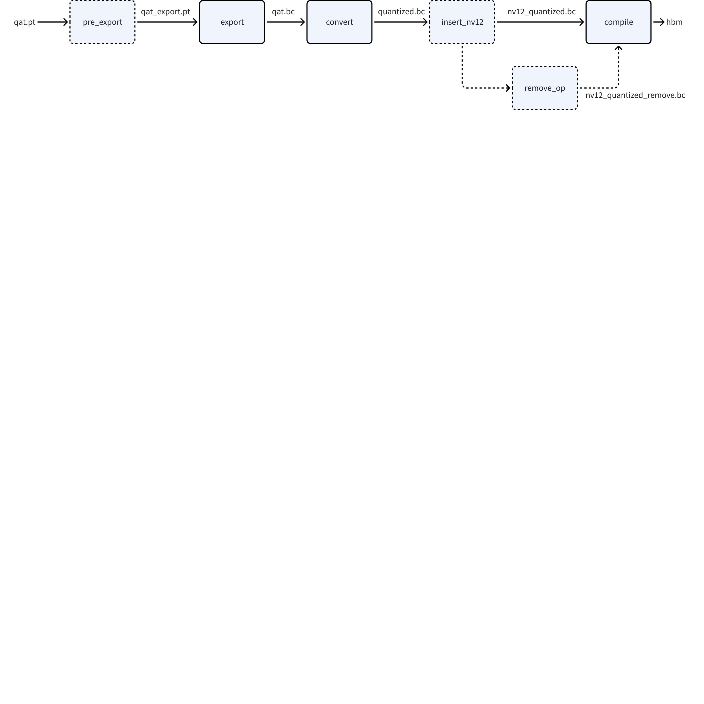
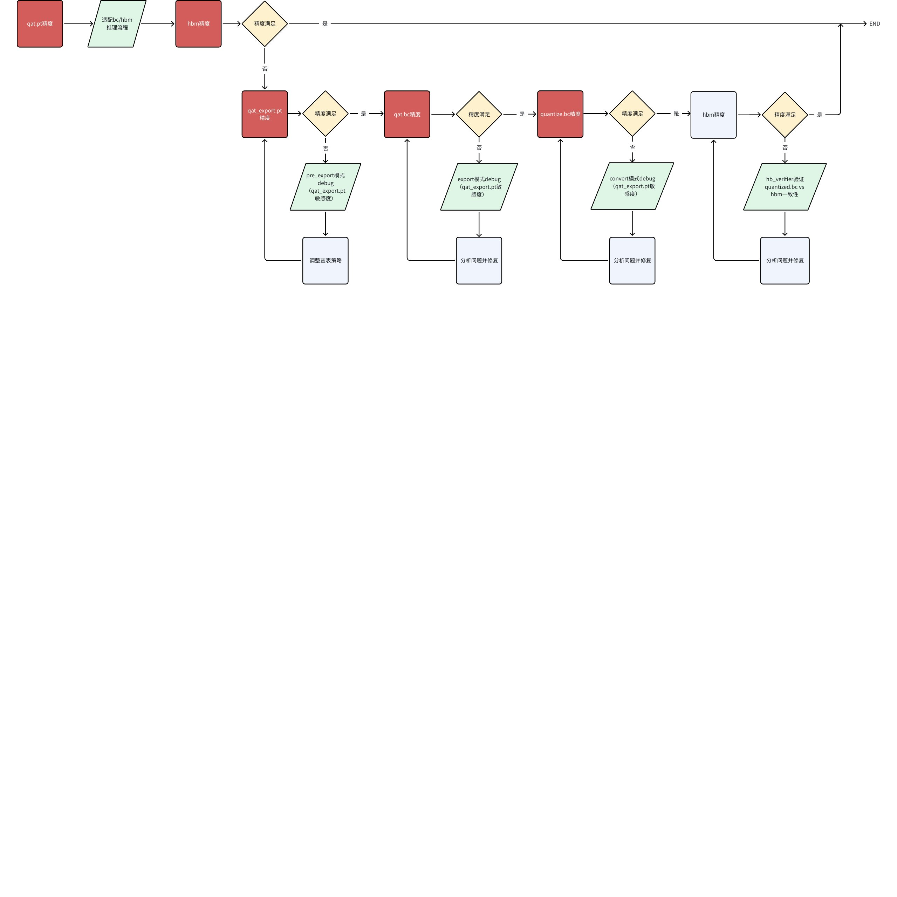
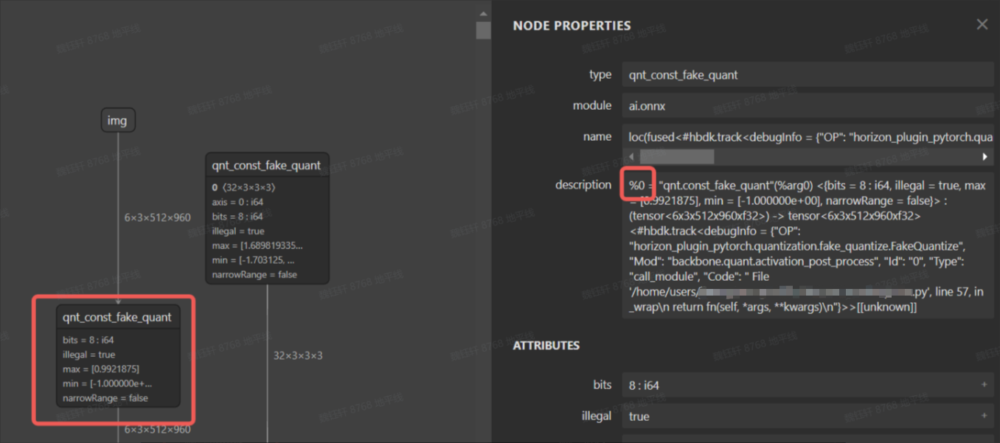
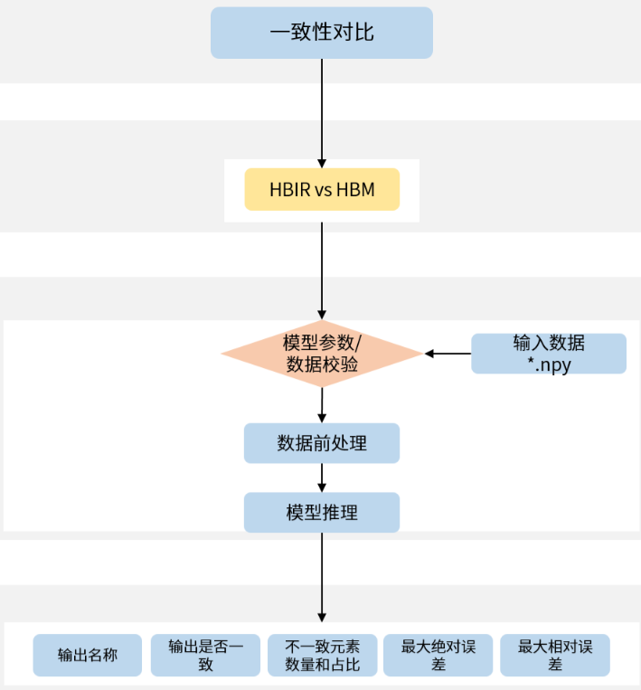

摘要：系统化说明 export、convert、compile 等阶段的一致性问题定义、分析前提与排查流程。

QAT训练完成后，从torch qat伪量化模型到 J6 板端部署hbm模型之间，有模型export导出、convert转定点、插入前处理节点以及compile编译等步骤，在这些步骤中，如果出现精度不一致的情况，说明存在一致性问题。一致性问题分为两类：
1. 用户侧问题。例如：前后处理不一致、训练与部署图不一致、工具代码误用等。
1. 工具侧问题。例如：查表算子转定点(非线性函数使用多项式近似或分段线性近似来代替精确计算)、不同硬件对于浮点/定点实现不一致、rgb/yuv444转nv12存在信息损失等，由于神经网络具有一定的鲁棒性，若不存在代码误用以及工具bug的情况下，板端hbm模型精度 与torch qat伪量化模型之间的误差很小。
不论哪类一致性问题，您都可以参考本文进行排查。
# 基础定义
一致性问题主要包括export前后、convert前后、compile前后，在分析过程中，可能还会引入查表算子转定点（pre_export）、插入nv12节点前后（insert_nv12）、删除首尾节点前后（remove_op）的一致性问题，在深入分析之前，大家先统一各阶段模型的概念：



<lark-table rows="7" cols="3" column-widths="146,214,650">

  <lark-tr>
    <lark-td>
      **主要模型**
    </lark-td>
    <lark-td>
      **说明**
    </lark-td>
    <lark-td>
      **获取方法**
    </lark-td>
  </lark-tr>
  <lark-tr>
    <lark-td>
      qat.pt
    </lark-td>
    <lark-td>
      torch qat 模型
    </lark-td>
    <lark-td>
      对插入quant/dequant后的浮点模型使用 prepare 接口
    </lark-td>
  </lark-tr>
  <lark-tr>
    <lark-td>
      qat_export.pt
    </lark-td>
    <lark-td>
      torch qat export 模型。相比于qat.pt 做了查表算子定点化。
      相比于qat.bc，计算逻辑一致，依旧为torch模型，可用gpu推理加速
    </lark-td>
    <lark-td>
      qat_pt要先eval和validation，再去pre_export
      ```python
      from horizon_plugin_pytorch.quantization.hbdk4 import pre_export
      qat_pt.eval()
      set_fake_quantize(qat_pt, FakeQuantState.VALIDATION)
      pre_export_pt = pre_export(qat_pt)
      ```
    </lark-td>
  </lark-tr>
  <lark-tr>
    <lark-td>
      qat.bc
    </lark-td>
    <lark-td>
      export导出产生的 hbir 模型
    </lark-td>
    <lark-td>
      ```python
      from horizon_plugin_pytorch.quantization.hbdk4 import export
      qat_pt.eval()
      set_fake_quantize(qat_pt, FakeQuantState.VALIDATION)
      qat_bc = export(qat_pt)
      ```
    </lark-td>
  </lark-tr>
  <lark-tr>
    <lark-td>
      quantized.bc
    </lark-td>
    <lark-td>
      由qat.bc convert定点化产出的 hbir 模型
    </lark-td>
    <lark-td>
      ```python
      from hbdk4.compiler import convert
      quantized_bc = convert(qat_bc, "nash-m")
      ```
    </lark-td>
  </lark-tr>
  <lark-tr>
    <lark-td>
      nv12_quantized.bc
    </lark-td>
    <lark-td>
      图像输入插入nv12节点
    </lark-td>
    <lark-td>
      在图像输入前插入nv12节点后进行定点化，示例可见《[J6E/M计算平台部署指南-6.3模型修改](https://developer.horizon.auto/blog/13119)》
    </lark-td>
  </lark-tr>
  <lark-tr>
    <lark-td>
      hbm
    </lark-td>
    <lark-td>
      编译产生的板端部署模型
    </lark-td>
    <lark-td>
      对 quantized.bc 模型使用 compile 接口
    </lark-td>
  </lark-tr>
</lark-table>


# 一致性问题定位流程
当出现一致性问题时，大家**先确认自己的horizon-plugin-pytorch、horizon-plugin-profiler、hbdk4-compiler已升级到最新版本（本文发布时为OE3.****7****.0，最新版本获取可见**[**地平线算法工具链官网**](https://oe.horizon.auto/download/oe)**）**，然后按照如下流程确认一致性问题发生阶段，参考下文介绍的每个阶段一致性定位方法进行排查。


# export一致性分析
## 分析前提
1. 分析export一致性时，请**先确认qat.pt eval精度与单帧可视化符合预期**；
1. qat.bc与qat.pt eval共用一套前后处理，保证不存在前后处理差异导致的一致性问题；
1. qat.bc多帧数据可视化均不符合预期；
## 分析思路
### **仅查表转定点**
export出现一致性问题时，通常需要先判断是否为 查表转定点导致的。具体方式为：将qat.pt模型通过pre_export接口仅转查表，验证pre_export_pt可视化。
```plaintext {wrap}
from horizon_plugin_pytorch.quantization.hbdk4 import pre_export
pre_export_pt = pre_export(qat_pt)
pre_export_ret = qat_export_pt(example_input) # 查表转定点后模型的推理结果，可以验证此时精度/可视化是否损失
```

1. 若pre_export_pt 多帧可视化 or 验证集精度指标 符合预期：说明查表算子没问题，跳过该章节
1. 若pre_export_pt 多帧可视化 or 验证集精度指标 不符合预期：说明是查表算子转定点引起的问题，需要排查具体是哪个查表造成的。
参考如下代码，运行QAT debug工具来分析查表算子的误差`qat_pt_vs_pre_export_pt`（QAT debug工具详细用法可见 《[工具链在线手册-量化感知训练-开发指南-精度调优工具使用指南](https://docs.oe.horizon.auto/guide/plugin/user_guide/quant_analysis.html)》）
```python {wrap}
from horizon_plugin_profiler import QuantAnalysis
from horizon_plugin_pytorch.quantization.hbdk4 import pre_export

# qat.pt和qat.export.pt跑一致性敏感度和逐层对比
qa = QuantAnalysis(qat_pt, pre_export_pt, "pre_export", out_dir="./qatpt_vs_qatexportpt")
qa.set_bad_case(bad_example_input)
qa.run()
qa.compare_per_layer()
qa.sensitivity()
```

判断正确运行plugin debug工具方法：
1. compare_per_layer_out.txt：存在对比结果
1. output_xxx_sensitive_ops.txt：敏感度有高有低，且最后几个算子的量化敏感度接近于 0
通常debug工具产出物可以直观快速地帮助大家定位到产生一致性误差的算子。
1. 【**定位具体查表op**】如果从debug工具产出物中 未明确 分析出是哪个(些)查表算子造成的一致性问题，可根据plugin debug工具的敏感度排序，设置敏感度高的部分 查表算子 取消转定点，缩小问题算子范围。如果将部分 查表算子 取消转定点后，pre_export_pt精度上升/可视化正常，则说明确实是这些 查表算子导致。
```python {wrap}
# 此接口需要在 load qat.ckpt后添加
from horizon_plugin_pytorch.quantization.hbdk4 import pre_export
pre_export_pt = pre_export(qat_pt)
# output_xxx_sensitive_ops.txt top1
pre_export_pt.get_submodule("model.pts_bbox_head_pvb._generated_sin_0.sin").quantized_forward = False

# 取消多个查表转定点时
# op_fallback_list = set()
# op_fallback_list.add("header.cls_header.type_encoder.1.var_mean.mean")
# op_fallback_list.add("backbone.traj_encoder.mlp2.nn.2.lut")
# for op_name in op_fallback_list:
#     module = pre_export_pt.get_submodule(op_name)
#     module.quantized_forward = False
```

1. 【查表转定点常见解决方案】常见有一致性问题的查表算子：rsqrt、reciprocal、sin/cos等，定位到具体查表算子后，可尝试**增大表项num_tables**的数值来优化查表算子的一致性。用于拟合非线性函数的表项num_tables需配置为6的倍数，不同查表算子默认num_tables不同，从经验看，num_tables超出126后对查表一致性几乎不再有收益。配置num_tables的示例如下（在qat.pt加载权重后，pre_export前配置）：
```python {wrap}
qat_pt._generated_rsqrt_0.rsqrt.num_tables = 108
```

常见有一致性问题的sin/cos查表算子，如果发现输入范围较大（超出-pi~pi一个周期），可以将 sin/cos替换为 plugin的自定义算子，并配置single_period=True，然后**重新 calib/qat（替换后，性能会差一点点，因此未工具层面自动替换）。**
```python {wrap}
import horizon_plugin_pytorch.nn as hnn
class modelnet(nn.module):
    def __init__(self,):
        ...
        self.sin=hnn.Sin(single_period=True)
        self.cos=hnn.Cos(single_period=True)

```

也可以自行处理sin/cos的输入，按照周期性将输入处理到[-pi, pi)之间，然后**重新 calib/qat。**
```python {wrap}
x = x - 2 * torch.floor(x * ( 0.5 / torch.pi) + 0.5) * torch.pi
```

如果上述方案无法解决查表阶段的一致性问题，请准备好debug工具产出物**qatpt_vs_qatexportpt中的txt文件**，在[地平线开发者社区-工具链板块](https://developer.horizon.auto/forumtype/toolchain)上提问。
### **图一致性**
在确认仅查表转定点的pre_export_pt模型 精度/多帧可视化 符合预期后，若qat.bc依旧存在精度问题，请优先检查export通路代码中是否存在只有部署才走的通路（例如 if deploy开关），若存在，请先尝试 不走部署逻辑export导出生成qat.bc，并验证此时qat.bc可视化是否符合预期。
1. **若符合预期**：说明 if逻辑 造成图不一致，影响了权重加载或代码有误。
对于图不一致的排查方法，还可以查看prepare时产出物`fx_graph.txt`，从中获取到模型中 op/module 的上下游调用关系，从而排查导出计算图是否发生改变。例如当存在算子`called times`为0未被调用的情况，可以通过Graph定位到上下文算子，从而定位未被调用的原因（通常因为存在if逻辑判断或for循环次数改变）；
```python
# 模型Graph图结构信息
Graph:
opcode         name                                           target                                                                    args                                                                                           kwargs
-------------  ---------------------------------------------  ------------------------------------------------------------------------  ---------------------------------------------------------------------------------------------  -----------------------------
placeholder    input_0                                        input_0                                                                   ()                                                                                             {}
call_module    quant                                          quant                                                                     (input_0,)                                                                                     {}
call_module    traj_decoder_src_proj_0_0                      traj_decoder_src_proj.0.0                                                 (quant,)                                                                                       {}
call_function  __getitem__                                    <slot wrapper '__getitem__' of 'torch.Size' objects>                      (__get__, 0)                                                                                   {}
call_function  __getitem___1                                  <slot wrapper '__getitem__' of 'torch.Size' objects>                      (__get__, 1)                                                                                   {}
call_function  __getitem___2                                  <slot wrapper '__getitem__' of 'torch.Size' objects>                      (__get__, 2)                                                                                   {}
...
```

重点关注的Graph信息：
- `opcode`为算子调用类型，详细介绍可见torch.fx的文档《[torch.fx.Node](https://docs.pytorch.org/docs/1.10/fx.html#torch.fx.Node)》
- `name`为当前算子名称，需注意和`model_check_result.txt`中的`module.submodule`名称区别
- `target`为算子输出
- `args`为算子输入
1. **若不符合预期**：往下尝试 plugin debug工具
### **plugin debug工具**
当qat_export.pt精度指标正常，qat.bc不符合预期，且没有图不一致的问题时，需要运行plugin debug工具来分析“export”阶段一致性问题，
```python {wrap}
from horizon_plugin_profiler import QuantAnalysis

qa = QuantAnalysis(pre_export_pt, qat_bc, "export", out_dir="./pre_export_pt_vs_qatbc")

# torch 与 bc 可接受同一格式输入时，一起跑统计量
qa.set_bad_case(badcase)
qa.run()

# torch 与 bc 不可接受同一格式输入时，分开跑统计量，pt_badcase 与 bc_badcase 除格式外全部相同。
qa.set_bad_case(pt_badcase)
qa.run(run_baseline_model=True, run_analysis_model=False)
qa.set_bad_case(bc_badcase)
qa.run(run_baseline_model=False, run_analysis_model=True)

# 逐层对比
qa.compare_per_layer()

# qat.export.pt 跑一致性敏感度，qat_bc起到占位作用
qa = QuantAnalysis(pre_export_pt, qat_bc, "export", out_dir="./pre_export_pt_vs_qatbc")
qa.set_bad_case(pt_badcase)
qa.sensitivity()
```

分析pre_export_pt_vs_qatbc阶段的debug工具产出物，若未发现问题所在或不知如何修改，请准备好**pre_export_pt_vs_qatbc产出物中的txt文件+qat.bc、qat.onnx**，在[地平线开发者社区-工具链板块](https://developer.horizon.auto/forumtype/toolchain)上提问。
# convert一致性分析
## 分析前提
1. 分析convert一致性时，说明qat.bc精度/可视化符合预期，quantized.bc多帧数据可视化不符合预期；
1. 确保qat.bc与quantized.bc使用相同的输入和后处理，避免非模型部分引起的误差；
## 分析思路
### J6EM高一致性策略【OE3.5.0为beta功能】
<callout emoji="zap" background-color="light-orange" border-color="light-yellow">
**注意**：
1. 高一致性level1/2策略仅适用于J6EM，OE3.7.0开始正式支持，请大家使用时关注用户手册《[QAT-训练部署一致性-高一致性 QAT 策略](https://docs.oe.horizon.auto/guide/plugin/user_guide/consistency.html)》章节
1. 高一致性策略对查表转定点无影响，仅影响convert前后的一致性
</callout>

高一致性策略封装在 horizon_plugin_pytorch.qat_mode.ConsistencyStrategy 下，可以使用 set_consistency_level 接口设置一致性策略等级。
当前支持三个等级（ 0 - 2 ）的策略，等级越高，一致性越好，但 QAT 精度可能受到轻微影响。推荐大家遇到convert一致性问题时，优先使用 level 1，在多数情况下对 QAT 精度影响很小，甚至可以改善因截断误差引起的精度问题，对性能和一致性也有正收益。
```python
from horizon_plugin_pytorch.qat_mode import ConsistencyStrategy

# 必须在 prepare 之前设置一致性策略
ConsistencyStrategy.set_consistency_level(1)
...
qat_pt = prepare(float_model)
...
qat_bc = export(qat_pt, example_inputs)
# 如果在prepare前设置 ConsistencyStrategy.set_consistency_level(0), 可以做如下检查
# print(qat_bc._high_precision_qpp)    # 需要是 true，不要用assert检查
# print(qat_bc._fuse_requantize)       # 需要是 false, 不要用assert检查

quantized_bc = convert(qat_bc, march)
```

<quote-container>
level1 在convert阶段，linear与conv会有一个scale的误差，其它op是对齐的
level2 在convert阶段，linear与conv也会有一个scale的误差，但概率会降低到万分之几
linear/conv将bias去掉，level2的情况下，二者convert阶段将没有误差
</quote-container>

<text bgcolor="light-yellow">OE3.5.0为试用功能，支持五个等级（ 0 - 4 ）的策略，OE3.7.0高一致性策略 level 变更：取消原level1、3，原level2 变更为level1，原level4变更为level2。</text>
### **plugin debug工具**
当J6EM采用高一致性策略未解决“convert”前后一致性问题时，或J6PHB遇到“convert”阶段的一致性问题，需要运行plugin debug工具来分析，debug工具运行示例如下
```python {wrap}
from horizon_plugin_profiler import QuantAnalysis
from horizon_plugin_pytorch.quantization.hbdk4 import pre_export

# qat.bc 和 quantized.bc 跑逐层对比
qa = QuantAnalysis(qat_bc, quantized_bc, "convert", out_dir="./qatbc_vs_quantizedbc")
qa.set_bad_case(bad_example_input)
qa.run()
qa.compare_per_layer()

# qat.export.pt 跑一致性敏感度，quantzed_bc起到占位作用
qa = QuantAnalysis(pre_export_pt, quantized_bc, "convert", out_dir="./qatbc_vs_quantizedbc")
qa.set_bad_case(bad_example_input)    # 注意，此处bad_example_input与跑逐层的一致
qa.sensitivity()
```

分析qatbc_vs_quantizedbc阶段的debug工具产出物，若未发现问题所在或不知如何修改，请准备好**qatbc_vs_quantizedbc产出物中的txt文件+qat.bc+qat.onnx+quantized.bc+quantized.onnx**，在[地平线开发者社区-工具链板块](https://developer.horizon.auto/forumtype/toolchain)上提问。
### 分段转浮点
绝大部分情况下，plugin debug工具都可以分析解决convert前后一致性问题，若您发现plugin debug工具失效或不想适配使用plugin debug工具，工具链还支持分段转浮点的方法来分析convert前后一致性，具体做法是将qat.bc中 某个算子 或 一定范围的算子 配置为浮点，从而定位出引起convert定点化过程中掉点的算子。
在qat.bc中，每个节点都有一个id，根据id将对应伪量化节点删除可以使得模型中一部分变成cpu算子，下图为qat.onnx的可视化图。


[bc编辑工具](http://j6.doc.oe.hobot.cc/guide/plugin/user_guide/consistency.html)在horizon_plugin_profiler/bc_editor/bc_editor.py，使用方式如下：
```python
python3 bc_editor.py --bc_path qat.bc --new_bc_path new_qat.bc --config_path config.json
```

config.json配置内容可以参考horizon_plugin_profiler/bc_editor/config_template.json，指定需要删除的伪量化算子 id，可以是一个区间id，也可以是单个算子 id。
```python
{
    "remove_fake_quant": [[1, 100], 102]
}
```

确认引起convert一致性的算子后，若不知如何修改，请记录分析过程，在[地平线开发者社区-工具链板块](https://developer.horizon.auto/forumtype/toolchain)上提问。
# qdq节点删除前后一致性分析
在模型量化部署流程中，quantized.bc包含 qdq（Quantize/DeQuant）算子，在某些场景中，这些 qdq 算子可以删除融合到前后处理使用c++实现，但必须确保删除前后的 quantized.bc vs quantized_remove.bc 推理结果保持一致。
- **quantized.bc**：包含完整 qdq 的量化模型
- **quantized_remove_qdq.bc**：将 qdq 删除后的版本
验证思路如下：
1. 加载两个 bc 模型
1. 根据包含 qdq 模型输入类型构造随机输入
1. 对 remove_qdq 版本进行手动量化输入构造
1. 推理两个bc模型
1. 对 remove_qdq 的输出进行反量化
1. 逐输出节点计算误差（max diff / bool mismatch），判断删除 qdq 前后模型是否一致
完整验证代码可见：
```python
from hbdk4.compiler import load
import numpy as np

np.random.seed(42)
name_list_npy = []
input_dict = {}
input_dict_part_int = {}

# 预测模型
quantized = load("quantized.bc")
quantized_remove = load("quantized_remove_qdq.bc")

# =========准备输入=========
for input in quantized[0].flatten_inputs:
    data = np.random.randn(*input.type.shape).astype(input.type.np_dtype)
    input_dict[input.name] = data

    found_quant = False

    for input_remove in quantized_remove[0].flatten_inputs:
        # 该节点是否有量化信息
        if input_remove.quant_info is None:
            continue

        if input_remove.name == input.name:
            scale = input_remove.quant_info.scales[0]
            data_int = np.round(data / scale)

            if input_remove.type.np_dtype == np.int16:
                dtype_ = np.int16
                min_ = -32768
                max_ = 32767
            elif input_remove.type.np_dtype == np.int8:
                dtype_ = np.int8
                min_ = -128
                max_ = 127

            data_int = np.clip(data_int, min_, max_).astype(dtype_)
            input_dict_part_int[input.name] = data_int
            found_quant = True
            break

    if not found_quant:
        input_dict_part_int[input.name] = data

# =========获取输出量化信息=========
out_scale_dict = dict()
out_axis_dict = dict()
for node in quantized_remove[0].flatten_outputs:
    if node.quant_info is None:
        continue
    if node.quant_info.axis is not None:
        out_axis_dict[node.name] = node.quant_info.axis
    out_scale = node.quant_info.scales
    out_scale_dict[node.name] = out_scale

# =========模型推理=========
quantized_outputs = quantized[0].feed(input_dict)
quantized_remove_outputs = quantized_remove[0].feed(input_dict_part_int)

# =========输出反量化 & 对比=========
for idx, v in enumerate(quantized[0].flatten_outputs):
    quantized_data = quantized_outputs[v.name]
    quantized_remove_data = quantized_remove_outputs[v.name]

    if v.name in out_scale_dict.keys():
        scale = out_scale_dict[v.name]

        # ---------------------- per-channel ----------------------
        if v.name in out_axis_dict:
            axis = out_axis_dict[v.name]
            scale_arr = np.array(scale, dtype=np.float32)

            channel_dim = quantized_remove_data.shape[axis]
            scale_dim = scale_arr.shape[0]

            if channel_dim != scale_dim:
                raise ValueError(
                    f"[Error] Per-channel scale size mismatch for node '{v.name}':\n"
                    f"  axis = {axis}\n"
                    f"  tensor channel count = {channel_dim}\n"
                    f"  scale count = {scale_dim}\n"
                    f"  scales = {scale}\n"
                )

            shape = [1] * quantized_remove_data.ndim
            shape[axis] = scale_dim
            scale_broadcast = scale_arr.reshape(shape)

            quantized_remove_data = (
                quantized_remove_data.astype(np.float32) * scale_broadcast
            )

        # ---------------------- per-tensor ------------------------
        else:
            quantized_remove_data = quantized_remove_data * out_scale_dict[v.name]

    # 比较输出差异
    if quantized_data.dtype == np.bool_:
        diff = np.logical_xor(quantized_data, quantized_remove_data)
        diff = diff.reshape(-1)
        print(f"{v.name} (bool) mismatch count = {diff.sum()}")

    else:
        q = quantized_data.astype(np.float32).reshape(-1)
        r = quantized_remove_data.astype(np.float32).reshape(-1)

        # ----------- max error -----------
        diff = np.abs(q - r)
        max_err = diff.max()

        # ----------- L1 / L2 / MSE -----------
        l1 = np.mean(np.abs(q - r))
        l2 = np.sqrt(np.mean((q - r)**2))

        # ----------- Cosine Similarity -----------
        dot = np.dot(q, r)
        norm_q = np.linalg.norm(q)
        norm_r = np.linalg.norm(r)
        cosine = dot / (norm_q * norm_r + 1e-12)

        print(f"{v.name}:")
        print(f"  Max Error     = {max_err:.6f}")
        print(f"  L1            = {l1:.6f}")
        print(f"  L2            = {l2:.6f}")
        print(f"  Cosine Sim    = {cosine:.6f}")
```

# nv12节点插入一致性分析
板端视频通路传输给模型的图像数据格式为nv12，通常算法同学会使用RGB/YUV444训练模型，由于nv12数据量是RGB/YUV444等格式的一半，因此必然存在信息损失，通常情况下，神经网络的鲁棒性是可以接受这种误差的。J6 工具链支持在模型前端插入 前处理节点，以实现颜色空间转换（如 NV12 -> BGR），该节点可由 BPU 加速处理，具体实现示例可见《[J6E/M计算平台部署指南-6.3模型修改](https://developer.horizon.auto/blog/13119)》。
## 分析前提
1. 分析nv12节点插入一致性时，说明quantized.bc精度/可视化符合预期，nv12_quantized.bc多帧数据可视化不符合预期；
1. quantized.bc与nv12_quantized.bc使用相同的后处理，避免因后处理差异引入一致性问题；
## 分析思路
nv12输入理论上对于模型输出影响很小，可以按照如下三个思路来挨个验证：
1. nv12节点插入代码误用
1. nv12输入数据准备差异
1. 确实是nv12引入的误差（非bug类）
### nv12节点插入代码误用
nv12节点插入具体细节请参考工具链用户手册 或 配套的迁移文档，常见的代码误用 在insert_image_preprocess中的 mode 参数，具体示例如下，详见代码注释：
```python {wrap}
    from hbdk4.compiler import save, convert, visualize, compile, load

    qat_model = load("qat.bc")
    quantized_hbir_model = convert(qat_model, march)
    save(quantized_hbir_model, "quantized_no_insert.bc")

    qat_model = load("qat.bc")
    func = qat_model.functions[0]
    for input in func.inputs[::-1]:
        # pyramid&resizer 只支持 NHWC 的 input layout，若原始输入layout为NHWC，则无需插入transpose
        node = input.insert_transpose(permutes=[0, 3, 1, 2])
        # 插入前处理节点，mode=None适用于使用YUV444训练的模型
        # node = node.insert_image_preprocess(mode=None, divisor=1, mean=[128, 128, 128], std=[128, 128, 128])
        # 插入前处理节点，mode="yuvbt601full2rgb"适用于使用RGB训练的模型
        node = node.insert_image_preprocess(mode="yuvbt601full2rgb", divisor=1, mean=[128, 128, 128], std=[128, 128, 128])
        node.insert_image_convert("nv12")

    quantized_insert = convert(qat_model, march)
    save(quantized_insert, "nv12_quantized.bc")
```

### nv12输入数据准备差异
opencv与PIL生成的nv12数据是有一点差异的，推荐参考如下代码准备nv12数据
```python {wrap}
from hbdk4.compiler import load, visualize
import numpy as np
from PIL import Image

def generate_nv12(img):
    w,h = img.size
    # Convert images to YUV format
    yuv_img = img.convert('YCbCr')
    y_data, u_data, v_data = yuv_img.split()

    # Convert Y, U, and V channel data to byte streams
    y_data_bytes = y_data.tobytes()
    u_data_bytes = u_data.resize((u_data.width // 2, u_data.height // 2)).tobytes()
    v_data_bytes = v_data.resize((v_data.width // 2, v_data.height // 2)).tobytes()

    # Arrange the UV data in the form of UVUVUVUV...
    uvuvuv_data = bytearray()
    for u_byte, v_byte in zip(u_data_bytes, v_data_bytes):
        uvuvuv_data.extend([u_byte, v_byte])

    # Input for the hbir model
    y = np.frombuffer(y_data_bytes, dtype=np.uint8).reshape(1, h, w, 1).astype(np.uint8)
    # np.save("y_data.npy", y)
    uv = np.frombuffer(uvuvuv_data, dtype=np.uint8).reshape(1, h//2, w//2, 2).astype(np.uint8)
    # np.save("uv_data.npy", uv)
    return y, uv

# Generate random RGB values in the range 0-255
# image_data = np.random.randint(0, 256, (32, 32, 3), dtype=np.uint8)

# 建议读取使用场景中的真实图片
image = Image.open("test.jpg").convert("RGB")  # 转为RGB三通道
# 转成numpy数组，形状为 [H, W, 3]
image_data = np.array(image, dtype=np.uint8)

# Convert the numpy array to a PIL image
img = Image.fromarray(image_data)
y, uv = generate_nv12(img)
quantized_insert_inputs = {"_input_0_y": y, "_input_0_uv": uv}
```

### 非bug类nv12引入的误差
如果不是上述两个原因，说明你的网络模型对插入nv12节点造成 非bug 误差特别敏感，此时需要将该误差带入到模型训练中，可参考如下代码进行适配：
```python {wrap}
import horizon_plugin_pytorch.nn.bgr_to_yuv444 as b2y
class BgrToYuv444(object):
    """
    BgrToYuv444 is used for color format convert.
    .. note::
        Affected keys: 'img'.
    Args:
        rgb_input (bool): The input is rgb input or not.
    """
    def __init__(self, affect_key: str = "img", rgb_input: bool = False):
        self.affect_key = affect_key
        self.rgb_input = rgb_input
    def __call__(self, data):
        if isinstance(data, dict) and self.affect_key not in data:
            return data
        image = data[self.affect_key] if isinstance(data, dict) else data
        ndim = image.ndim
        if ndim == 3:
            image = torch.unsqueeze(image, 0)
        if image.dtype is not torch.uint8:
            image = image.to(dtype=torch.uint8)
        if image.shape[1] == 6:
            image1 = b2y.bgr_to_yuv444(image[:, :3], self.rgb_input).float()
            image2 = b2y.bgr_to_yuv444(image[:, 3:], self.rgb_input).float()
            image = torch.cat((image1, image2), dim=1)
        else:
            image = b2y.bgr_to_yuv444(image, self.rgb_input)
            image = image.float()
        if ndim == 3:
            image = image[0]
        if isinstance(data, dict):
            data[self.affect_key] = image
            return data
        else:
            return image
```

其中，bgr_to_yuv444内部实现了bgr->nv12->yuv444的转换。
# compile一致性分析
## 分析前提
1. 分析compile一致性时，说明quantized.bc 或 nv12_quantized.bc 精度/可视化没问题。
1. 模型中没有浮点算子时，可以做到小数点后4位一致，如果有浮点算子，由于不同硬件平台对浮点算子的 实现方式、支持精度（FP32/FP16）、底层数学库 等存在差异，一致性有误差是普遍存在的，不一定能做到小数点后4位对齐。
1. bc与hbm使用的前后处理一致。
## 分析思路
为了方便不同编码习惯的用户快速比对compile前后bc与hbm的一致性，工具链提供了三种分析方法：
1. 使用**命令行工具**hb_verifier快速比对
1. 使用**python API**：hbdk接口快速比对（<text bgcolor="light-green">同时支持x86与板端推理hbm，接口更简单</text>）
1. 使用**python API**：hbm_infer接口快速比对（<text bgcolor="light-green">推理速度更快</text>）
### **hb_verifier工具**
hb_verifier工具相关用法描述如下：
<sheet token="Pmeus7hQxhXRVOtAXzzcJku4n8f_Vm9N6B"/>

bc与hbm一致性比对时，输出信息如下：


比对示例如下：hbm推理支持板端与x86仿真两种运行方式，二者结果是一样的，板端推理速度会更快一些。
```python {wrap}
hb_verifier -m quantized_nv12.bc,quantized_nv12.hbm -i y_data.npy,uv_data.npy --ip None,xx.xx.xx.xx
```

1. **若比对一致**：则一致性问题出现在前后处理没对齐。
1. **若比对不一致**：请提供**quantized.bc与hbm**，在[地平线开发者社区-工具链板块](https://developer.horizon.auto/forumtype/toolchain)上提问。
### **hbdk接口推理**
使用hbdk提供的 .feed 接口，相同输入的情况下，推理quantized.bc与hbm（hbm推理<text bgcolor="light-green">支持板端与x86仿真两种运行方式</text>，二者结果是一样的，板端推理速度会更快一些），验证他们的输出一致性/可视化。带nv12输入的验证示例如下：
```python {wrap}
from hbdk4.compiler import load, Hbm
import numpy as np
from PIL import Image

def generate_nv12(img):
    w,h = img.size
    # Convert images to YUV format
    yuv_img = img.convert('YCbCr')
    y_data, u_data, v_data = yuv_img.split()

    # Convert Y, U, and V channel data to byte streams
    y_data_bytes = y_data.tobytes()
    u_data_bytes = u_data.resize((u_data.width // 2, u_data.height // 2)).tobytes()
    v_data_bytes = v_data.resize((v_data.width // 2, v_data.height // 2)).tobytes()

    # Arrange the UV data in the form of UVUVUVUV...
    uvuvuv_data = bytearray()
    for u_byte, v_byte in zip(u_data_bytes, v_data_bytes):
        uvuvuv_data.extend([u_byte, v_byte])

    # Input for the hbir model
    y = np.frombuffer(y_data_bytes, dtype=np.uint8).reshape(1, h, w, 1).astype(np.uint8)
    # np.save("y_data.npy", y)
    uv = np.frombuffer(uvuvuv_data, dtype=np.uint8).reshape(1, h//2, w//2, 2).astype(np.uint8)
    # np.save("uv_data.npy", uv)
    return y, uv

def compare_arrays(array1, array2, decimal_places=2):
    """
    Compare two arrays for consistency up to a specified number of decimal places.

    Parameters:
    - array1: First numpy array.
    - array2: Second numpy array.
    - decimal_places: Number of decimal places to consider for alignment.

    Returns:
    - are_equal: True if arrays are consistent up to the specified decimal places, False otherwise.
    - max_difference: Maximum difference (absolute value) if arrays are not consistent, else 0.
    """
    # Round the arrays to the specified decimal places
    rounded1 = np.round(array1, decimals=decimal_places)
    rounded2 = np.round(array2, decimals=decimal_places)

    # Check equality
    are_equal = np.array_equal(rounded1, rounded2)

    # Calculate maximum difference if not equal
    max_difference = 0
    if not are_equal:
        max_difference = np.max(np.abs(array1 - array2))

    return are_equal, max_difference

hbir = load("./quantized_nv12_remove_stage3.bc")
hbm = Hbm("./quantized_nv12_remove_stage3.hbm")

# Create a random image with the shape (1, 512, 960, 3)
# Generate random RGB values in the range 0-255
image_data = np.random.randint(0, 256, (512, 960, 3), dtype=np.uint8)
# Convert the numpy array to a PIL image
img = Image.fromarray(image_data)
y, uv = generate_nv12(img)

inputs = {"input_0_y": y, "input_0_uv": uv}

# 分别进行hbir和Hbm推理
hbir_outputs = hbir[0].feed(inputs)
# print("hbir_outputs:", hbir_outputs)
hbm_x86_outputs = hbm[0].feed(inputs)        # x86推理
# print("hbm_x86_outputs:", hbm_x86_outputs)

# # 远程连接BPU，实现板端Hbm推理
# # 运行前需要安装 `hbdk4_runtime_aarch64`的wheel包，根据需要选择nash。
hbm_arrch64_outputs = hbm[0].feed(inputs, remote_ip="10.64.60.165", remote_port="22", remote_work_root="/map/xxx/")
# print("hbm_arrch64_outputs:", hbm_arrch64_outputs)

# 比较Hbir和hbm输出
for idx, v in enumerate(hbir[0].flatten_outputs):
    hbir_data = hbir_outputs[v.name]
    hbm_arrch64_data1 = hbm_x86_outputs[v.name]
    are_equal, max_difference = compare_arrays(hbir_data, hbm_arrch64_data1, decimal_places=4)
    if not are_equal:
        print("Maximum difference:", max_difference)
    else:
        print(f"{v.name} is equal!")
```

若验证他们的输出不一致：请准备好**quantized.bc+hbm+复现脚本**，在[地平线开发者社区-工具链板块](https://developer.horizon.auto/forumtype/toolchain)上提问。
### **hbm_infer接口推理**
当有J6开发板时，可以使用 hbm_infer工具 实现板端加速推理hbm来验证一致性，hbm_infer工具详细介绍可参考用户手册《[UCP-模型推理开发-模型推理工具介绍-hbm_infer工具介绍](https://docs.oe.horizon.auto/guide/ucp/runtime/tool_introduction/hbm_infer.html)》。
如下代码以.bin文件为例，经过量化然后输入bc与hbm模型，输入数据的读取代码需要用户根据实际的目录和文件格式进行修改。如果是numpy或者pkl文件，可根据实际情况进行读取和处理。
```python {wrap}
from hbdk4.compiler import load, Hbm
import numpy as np
from PIL import Image
import os
import pickle
import numpy as np
from hbm_infer.hbm_rpc_session_flexible import HbmRpcSession, init_server, deinit_server, init_hbm, deinit_hbm

if __name__ =="__main__":
    data_path="inputs"
    #删除
    hbir = load("./model_quantized_removequant.bc")
    hbm_path1="./modelp_remove_quan.hbm"
    hbm_rpc_server1 = init_server(host="xx.xx.xx.xx")  # 确保有root权限
    hbm_handle1 = init_hbm(hbm_rpc_server=hbm_rpc_server1, local_hbm_path=hbm_path1)
    hbm_model1 = HbmRpcSession(
        hbm_handle=hbm_handle1,
        hbm_rpc_server=hbm_rpc_server1,
    )
    # hbm.show_input_output_info()
    print("========= BEGIN test_validate ! =========")
    inputs=hbir[0].flatten_inputs
    input_data={}
    for i,input in enumerate(inputs):
        path=os.path.join(data_path,input.name,"0.bin")
        data=np.fromfile(path, dtype=np.float32).reshape(input.type.shape)
        scale=input.quant_info.scales[0]
        if input.type.torch_dtype=="torch.int16":
            dtype_=np.int16
            min_=-32768
            max_=32767
        if input.type.torch_dtype=="torch.int8":
            dtype_=np.int8
            min_=-128
            max_=127
        data = data / scale
        data = np.round(data)
        data= np.clip(data, min_, max_)
        data= data.astype(dtype_)
        np.save(f"{i}_quan.npy",data)
        input_data[input.name]=data

    hbir_outputs = hbir[0].feed(input_data)
    hbm_arrch64_outputs1 = hbm_model1(input_data)

    for idx, v in enumerate(hbir[0].flatten_outputs):
        hbir_data = hbir_outputs[v.name]
        hbm_arrch64_data1 = hbm_arrch64_outputs1[v.name]
        diff = np.abs(hbm_arrch64_data - hbm_arrch64_data1).reshape(np.prod(hbm_arrch64_data.shape))
        print(f"{v.name} max error is {max(diff)}")
    hbm_model.close_server()        # 删除log
    deinit_server(hbm_rpc_server)   # 删除板端 server 文件，避免资源占用
    deinit_hbm(hbm_handle)          # 删除板端 hbm 文件，避免资源占用
```

若不一致：请准备好**quantized.bc+hbm+复现脚本**，在[地平线开发者社区-工具链板块](https://developer.horizon.auto/forumtype/toolchain)上提问。
