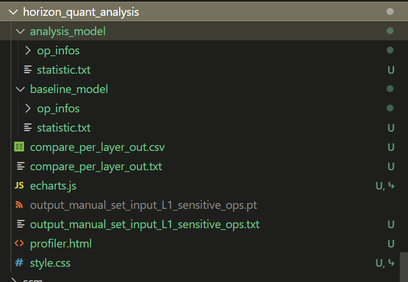
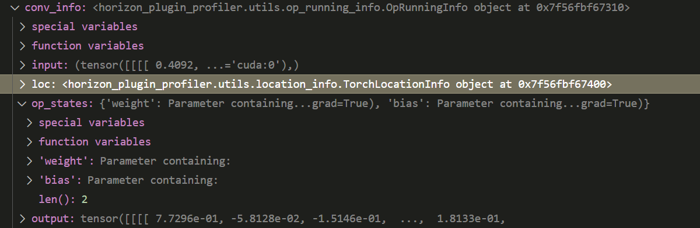
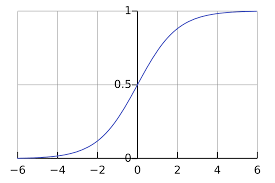
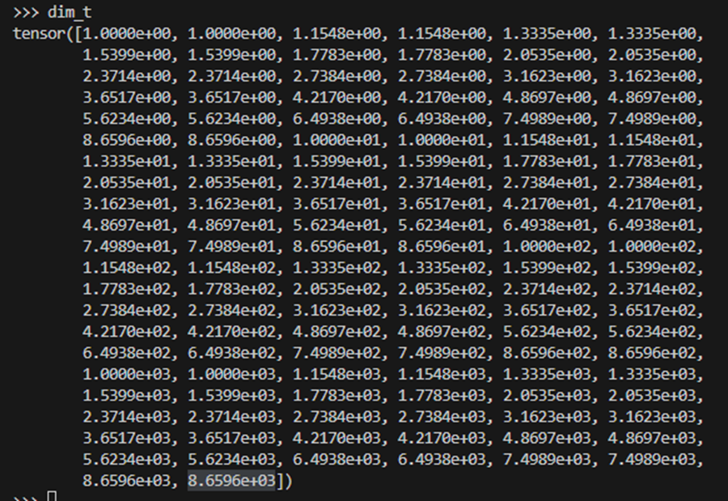
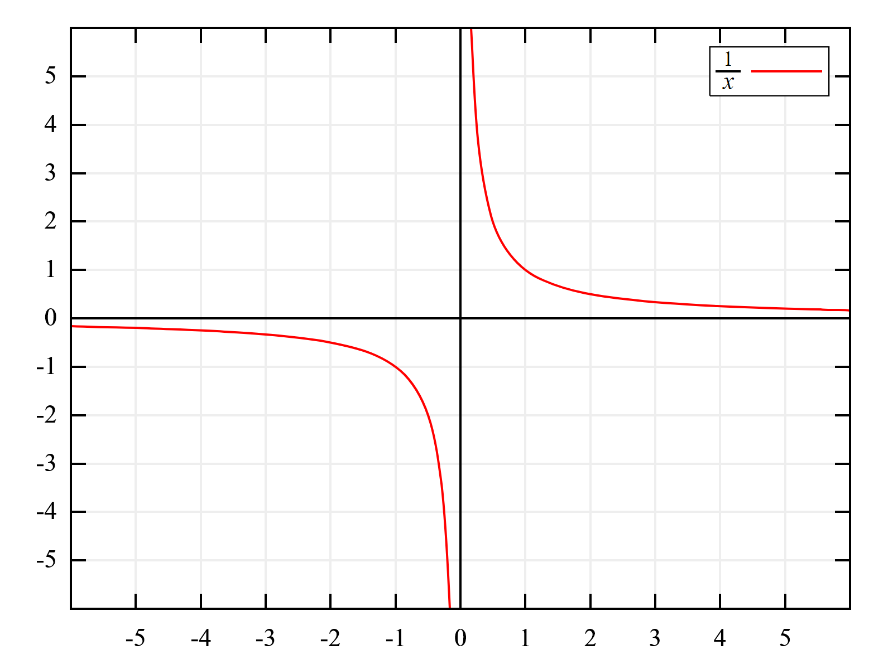
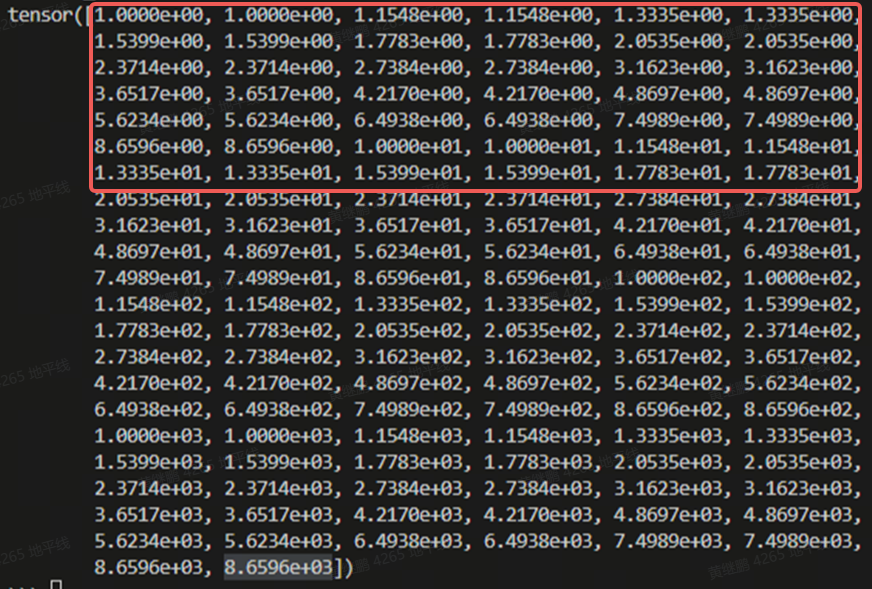

摘要：总结 QAT 精度调优中常见问题、debug 产物判读方法与逐项排查要点。

用户手册：[Accuracy Tuning Tool Guide](https://doc.oe.horizon.auto/guide/plugin/user_guide/quant_analysis.html#quant_analysis)
# 1 精度调优
<quote-container>
精度调优的本质是多约束优化，面向部署的精度调优本质是多约束多目标优化，必然不是一个简单问题。
</quote-container>


**量化的误差来自于哪里？**
1. round舍入误差，qmax*scale可以覆盖数值范围。
1. clamp截断误差，qmax*scale无法覆盖数值范围。可能产生较大截断误差的原因：
  1. 校准数据不够全，校准方法不合适，导致scale统计的不合理。
  1. 应该设置fixed scale的地方没有设置或者设置的scale不对。
## 1.1 工具产出物内容介绍
工具产出物包括qat检查产出的model_check_result.txt和debug工具的一系列结果。


### 1.1.1 model_check_result
在精度调优前尽量都解决这里能看出来的问题，对于共享这种不太好解决的，可以先跑debug观察一下再决定要不要拆。
假设我们有这样一个模型：
```python
class Net(nn.Module):
    def __init__(self):
        super(Net, self).__init__()

        self.quant = QuantStub()
        self.quant_grid = QuantStub(1.1 / 32768.0)
        self.dequant = DeQuantStub()
        self.conv = nn.Conv2d(3, 3, 1)
        self.bn = nn.BatchNorm2d(3)
        self.add1 = FloatFunctional()
        self.add2 = FloatFunctional()
        self.grid_sample = GridSample()

    def forward(self, data, grid):
        x = self.quant(data)
        x = self.conv(x)
        x = self.bn(x)
        grid = self.quant_grid(grid)
        out0 = F.grid_sample(x, grid, "bilinear", "zeros", False)
        out1 = self.grid_sample(x, grid)
        value, index = x.topk(5)
        out0 = self.add2.add(out0, out1)
        out1 = self.add1.add(value, value)
        out0 = self.dequant(out0)
        out1 = self.dequant(out1)
        return out0, out1
```

对应的model_check_result是：
```python
# 检查fuse问题
All fusable modules are fused in model!
# 检查共享问题
All modules in the model run exactly once.

# 结合下面each layer qconfig查看设置的qconfig有没有生效，重点看dtype/observer
# 1. observer：对于activation，模板默认calib用mse，qat用minmax。对于weight，任何情况下都是minmax
# 2. dtype：dtype是否符合预期
#    a. layernorm softmax等拼接算子中间默认是int16，不受qconfig控制
#    b. default模板会从grid sample的grid不断向前找，直到gemm类算子，把这中间的算子都设置为int16。
#    c. 高精度输出在这里是torch.float32类型，不是int32。重点看dequant的输入是不是torch.float32, 对着下面找到具体是哪一个dequant，再去模型里面看为什么没有高精度。
#    d. 不考虑混合fp16/fp32，除了quant dequant，是否所有算子都是int8或int16输入，如果仍然存在其他类型的输入，对着下面找到具体是哪一个算子，检查有没有正确地插入quant。
# 注意：配置某一个op的激活指的是他的输出，某一个算子的输入要看他上一个算子的输出
input dtype statistics:
+----------------------------------------------------------------------------+-----------------+---------+----------+
| module type                                                                |   torch.float32 |   qint8 |   qint16 |
|----------------------------------------------------------------------------+-----------------+---------+----------|
| <class 'horizon_plugin_pytorch.nn.qat.stubs.QuantStub'>                    |               2 |       0 |        0 |
| <class 'horizon_plugin_pytorch.nn.qat.conv2d.Conv2d'>                      |               0 |       1 |        0 |
| <class 'horizon_plugin_pytorch.nn.qat.functional_modules.FloatFunctional'> |               0 |       2 |        0 |
| <class 'horizon_plugin_pytorch.nn.qat.stubs.DeQuantStub'>                  |               0 |       2 |        0 |
| total                                                                      |               2 |       5 |        0 |
+----------------------------------------------------------------------------+-----------------+---------+----------+

output dtype statistics:
+----------------------------------------------------------------------------+-----------------+---------+----------+
| module type                                                                |   torch.float32 |   qint8 |   qint16 |
|----------------------------------------------------------------------------+-----------------+---------+----------|
| <class 'horizon_plugin_pytorch.nn.qat.stubs.QuantStub'>                    |               0 |       1 |        1 |
| <class 'horizon_plugin_pytorch.nn.qat.conv2d.Conv2d'>                      |               0 |       1 |        0 |
| <class 'horizon_plugin_pytorch.nn.qat.functional_modules.FloatFunctional'> |               0 |       2 |        0 |
| <class 'horizon_plugin_pytorch.nn.qat.stubs.DeQuantStub'>                  |               2 |       0 |        0 |
| total                                                                      |               2 |       4 |        1 |
+----------------------------------------------------------------------------+-----------------+---------+----------+

Each layer out qconfig:
+---------------+----------------------------------------------------------------------------+--------------------+-----------------+----------------+----------------+
| Module Name   | Module Type                                                                | Input dtype        | out dtype       | ch_axis        | observer       |
|---------------+----------------------------------------------------------------------------+--------------------+-----------------+----------------+----------------|
| quant         | <class 'horizon_plugin_pytorch.nn.qat.stubs.QuantStub'>                    | [torch.float32]    | ['qint8']       | -1             | MinMaxObserver |
| conv          | <class 'horizon_plugin_pytorch.nn.qat.conv2d.Conv2d'>                      | ['qint8']          | ['qint8']       | -1             | MinMaxObserver |

| # 旧模板                                                                                                                                                             |
| conv          | <class 'horizon_plugin_pytorch.nn.qat.ConvRelu2d'>                         | ['qint8']          | ['qint8']       | -1             | MinMaxObserver |
| # 新模板                                                                                                                                                             |
| conv          | <class 'horizon_plugin_pytorch.nn.qat.conv2d.Conv2d'>                      | ['qint8']          | [torch.float32] | -1             | MinMaxObserver |
| relu          | <class 'horizon_plugin_pytorch.nn.qat.relu.Relu'>                          | [torch.float32]    | ['qint8']       | -1             | MinMaxObserver |
|                                                                                                                                                                     |
| quant_grid    | <class 'horizon_plugin_pytorch.nn.qat.stubs.QuantStub'>                    | [torch.float32]    | ['qint16']      | -1             | MinMaxObserver |
| add2[add]     | <class 'horizon_plugin_pytorch.nn.qat.functional_modules.FloatFunctional'> | ['qint8', 'qint8'] | ['qint8']       | -1             | MinMaxObserver |
| add1[add]     | <class 'horizon_plugin_pytorch.nn.qat.functional_modules.FloatFunctional'> | ['qint8', 'qint8'] | ['qint8']       | -1             | MinMaxObserver |
| dequant       | <class 'horizon_plugin_pytorch.nn.qat.stubs.DeQuantStub'>                  | ['qint8']          | [torch.float32] | qconfig = None |                |
| dequant(1)    | <class 'horizon_plugin_pytorch.nn.qat.stubs.DeQuantStub'>                  | ['qint8']          | [torch.float32] | qconfig = None |                |
+---------------+----------------------------------------------------------------------------+--------------------+-----------------+----------------+----------------+

Weight qconfig:
+---------------+-------------------------------------------------------+----------------+-----------+----------------+
| Module Name   | Module Type                                           | weight dtype   |   ch_axis | observer       |
|---------------+-------------------------------------------------------+----------------+-----------+----------------|
| conv          | <class 'horizon_plugin_pytorch.nn.qat.conv2d.Conv2d'> | qint8          |         0 | MinMaxObserver |
+---------------+-------------------------------------------------------+----------------+-----------+----------------+

# fixed scale设置是否正确
Please check if these OPs qconfigs are expected..
+---------------+---------------------------------------------------------+-------------------------------------+
| Module Name   | Module Type                                             | Msg                                 |
|---------------+---------------------------------------------------------+-------------------------------------|
| quant_grid    | <class 'horizon_plugin_pytorch.nn.qat.stubs.QuantStub'> | Fixed input scale 3.35693359375e-05 |
+---------------+---------------------------------------------------------+-------------------------------------+

# 异常计算类型
conv            float32*int8

fx_graph.txt
# 新增了一个图信息，可以快速根据上下文定位到算子。
Graph:
opcode         name                          target                                                                    args                                        kwargs
-------------  ----------------------------  ------------------------------------------------------------------------  ------------------------------------------  ---------------------------------------------------------------------
placeholder    input_0                       input_0                                                                   ()                                          {}
call_module    quant                         quant                                                                     (input_0,)                                  {}
call_module    conv                          conv                                                                      (quant,)                                    {}
call_module    bn                            bn                                                                        (conv,)                                     {}
placeholder    input_1                       input_1                                                                   ()                                          {}
call_module    quant_grid                    quant_grid                                                                (input_1,)                                  {}
call_function  __get__                       <method-wrapper '__get__' of getset_descriptor object at 0x7fa703f720c0>  (bn,)                                       {}
call_function  autocasted_grid_sample_outer  <function autocasted_grid_sample_outer at 0x7fa5c215bbe0>                 (bn, quant_grid)                            {'mode': 'bilinear', 'padding_mode': 'zeros', 'align_corners': False}
call_function  warp                          <function warp at 0x7fa5c215bc70>                                         (bn, quant_grid, 'bilinear', 'zeros')       {}
call_function  scope_end                     <function Tracer.scope_end at 0x7fa59024a320>                             ('grid_sample',)                            {}
call_function  topk                          <method 'topk' of 'torch._C._TensorBase' objects>                         (bn, 5)                                     {}
call_function  __getitem__                   <slot wrapper '__getitem__' of 'tuple' objects>                           (topk, 0)                                   {}
call_function  __getitem___1                 <slot wrapper '__getitem__' of 'tuple' objects>                           (topk, 1)                                   {}
get_attr       add2                          add2                                                                      ()                                          {}
call_method    add                           add                                                                       (add2, autocasted_grid_sample_outer, warp)  {}
get_attr       add1                          add1                                                                      ()                                          {}
call_method    add_1                         add                                                                       (add1, __getitem__, __getitem__)            {}
call_module    dequant                       dequant                                                                   (add,)                                      {}
call_module    dequant_1                     dequant                                                                   (add_1,)                                    {}
call_function  scope_end_1                   <function Tracer.scope_end at 0x7fa59024a320>                             ('',)                                       {}
output         output                        output                                                                    ((dequant, dequant_1),)                     {}
```

### 1.1.2 compare_per_layer_out
csv和txt都可以看
```python
# 相似度仅辅助作用，有时不靠谱，不能作为主要指标，重点看mean，max，min的对比
# 1. 最大值最小值是否产生较大的截断误差？ qscale * qmax 能否覆盖数值范围？mean是否能反应较大的舍入误差？
# 2. fuse应对比输出位置的算子，而不是中间结果，工具已经筛除了中间结果的相似度，但为了显示完整模型，统计量还是放在上面的，注意不要对错了。
+----+-------------+----------------------------------------------------------------------------+----------------------------------------------------------------------+----------------------------+---------------+-----------+-----------+-----------+-----------+-------------------+------------------+-------------------+------------------+-------------------+-------------------+--------------------+
|    | mod_name    | base_op_type                                                               | analy_op_type                                                        | shape                      | quant_dtype   |    qscale |    Cosine |        L1 |      Atol |   max_qscale_diff |   base_model_min |   analy_model_min |   base_model_max |   analy_model_max |   base_model_mean |   analy_model_mean |
|----+-------------+----------------------------------------------------------------------------+----------------------------------------------------------------------+----------------------------+---------------+-----------+-----------+-----------+-----------+-------------------+------------------+-------------------+------------------+-------------------+-------------------+--------------------|
|  0 | quant       | horizon_plugin_pytorch.quantization.stubs.QuantStub                        | horizon_plugin_pytorch.nn.qat.stubs.QuantStub                        | torch.Size([18, 3, 17, 7]) | qint8         | 0.0078425 | 0.9999925 | 0.0019682 | 0.0039212 |         0.4999948 |       -0.9998152 |        -0.9959978 |        0.9999191 |         0.9959978 |         0.0060736 |          0.0060765 |
|  1 | conv        | torch.nn.modules.conv.Conv2d                                               | horizon_plugin_pytorch.nn.qat.conv2d.Conv2d                          |                            | qint8         | 0.0082740 |           |           |           |                   |       -1.0464442 |        -1.0507929 |        0.6825767 |         0.6950126 |        -0.0927172 |         -0.0872770 |
|  2 | bn          | torch.nn.modules.batchnorm.BatchNorm2d                                     | torch.nn.modules.linear.Identity                                     | torch.Size([18, 3, 17, 7]) | qint8         | 0.0082740 | 0.9999726 | 0.0023596 | 0.0088963 |         1.0752156 |       -1.0548558 |        -1.0507929 |        0.6918184 |         0.6950126 |        -0.0872810 |         -0.0872770 |
|  3 | quant_grid  | horizon_plugin_pytorch.quantization.stubs.QuantStub                        | horizon_plugin_pytorch.nn.qat.stubs.QuantStub                        | torch.Size([18, 8, 5, 2])  | qint16        | 0.0000336 | 1.0000000 | 0.0000084 | 0.0000168 |         0.5007102 |       -0.9984837 |        -0.9984863 |        0.9958880 |         0.9959015 |        -0.0134041 |         -0.0134042 |
|  4 |             | horizon_plugin_pytorch.nn.grid_sample.autocasted_grid_sample_outer         | horizon_plugin_pytorch.nn.grid_sample.autocasted_grid_sample_outer   | torch.Size([18, 3, 8, 5])  | qint8         | 0.0082740 | 0.9999570 | 0.0024030 | 0.0093807 |         1.1337616 |       -0.9268014 |        -0.9266835 |        0.5589110 |         0.5543553 |        -0.0883798 |         -0.0883245 |
|  5 | grid_sample | horizon_plugin_pytorch.nn.grid_sample.warp                                 | horizon_plugin_pytorch.nn.grid_sample.warp                           | torch.Size([18, 3, 8, 5])  | qint8         | 0.0082740 | 0.9999532 | 0.0024225 | 0.0088696 |         1.0719883 |       -0.8721045 |        -0.8687658 |        0.5592290 |         0.5626293 |        -0.0791863 |         -0.0791657 |
|  6 |             | torch.Tensor.topk                                                          | torch.Tensor.topk                                                    | torch.Size([18, 3, 17, 5]) | qint8         | 0.0082740 | 0.9999592 | 0.0023580 | 0.0088128 |         1.0651248 |       -0.9006146 |        -0.9018617 |        0.6918184 |         0.6950126 |         0.0219691 |          0.0216529 |
|  7 | add2        | horizon_plugin_pytorch.nn.quantized.functional_modules.FloatFunctional.add | horizon_plugin_pytorch.nn.qat.functional_modules.FloatFunctional.add | torch.Size([18, 3, 8, 5])  | qint8         | 0.0126543 | 0.9999536 | 0.0044265 | 0.0178684 |         1.4120450 |       -1.6115571 |        -1.6070950 |        1.0174880 |         1.0123433 |        -0.1675661 |         -0.1672710 |
|  8 | add1        | horizon_plugin_pytorch.nn.quantized.functional_modules.FloatFunctional.add | horizon_plugin_pytorch.nn.qat.functional_modules.FloatFunctional.add | torch.Size([18, 3, 17, 5]) | qint8         | 0.0141468 | 0.9999377 | 0.0056415 | 0.0224277 |         1.5853524 |       -1.8012292 |        -1.7966499 |        1.3836368 |         1.3863913 |         0.0439383 |          0.0433405 |
|  9 | dequant     | torch.ao.quantization.stubs.DeQuantStub                                    | horizon_plugin_pytorch.nn.qat.stubs.DeQuantStub                      | torch.Size([18, 3, 8, 5])  | torch.float32 |           | 0.9999536 | 0.0044265 | 0.0178684 |                   |       -1.6115571 |        -1.6070950 |        1.0174880 |         1.0123433 |        -0.1675661 |         -0.1672710 |
| 10 | dequant     | torch.ao.quantization.stubs.DeQuantStub                                    | horizon_plugin_pytorch.nn.qat.stubs.DeQuantStub                      | torch.Size([18, 3, 17, 5]) | torch.float32 |           | 0.9999377 | 0.0056415 | 0.0224277 |                   |       -1.8012292 |        -1.7966499 |        1.3836368 |         1.3863913 |         0.0439383 |          0.0433405 |
+----+-------------+----------------------------------------------------------------------------+----------------------------------------------------------------------+----------------------------+---------------+-----------+-----------+-----------+-----------+-------------------+------------------+-------------------+------------------+-------------------+-------------------+--------------------+
```

### 1.1.3 statistic
会比compare_per_layer_out更详细一些，每个算子的input/output都有，conv还会有weight bias。看的方法与compare_per_layer_out一致，一般是compare_per_layer_out里面看不到想要的信息时（<text bgcolor="light-yellow">比如weight敏感度较高，逐层比较中没有weight</text>）才去statistic中看。
```python
+---------+----------------------------------------------------------------------+------------+---------+---------------+-----------+------------+-----------+------------+-----------+---------------------------+
| Index   | Op Name                                                              | Mod Name   | Attr    | Dtype         | Scale     | Min        | Max       | Mean       | Var       | Shape                     |
|---------+----------------------------------------------------------------------+------------+---------+---------------+-----------+------------+-----------+------------+-----------+---------------------------|
| 0       | horizon_plugin_pytorch.nn.qat.stubs.QuantStub                        | quantx     | input   | torch.float32 |           | -0.9993581 | 0.9997096 | 0.0119124  | 0.3349643 | torch.Size([6, 3, 8, 15]) |
| 0       | horizon_plugin_pytorch.nn.qat.stubs.QuantStub                        | quantx     | output  | qint8         | 0.0078409 | -0.9957892 | 0.9957892 | 0.0118629  | 0.3349107 | torch.Size([6, 3, 8, 15]) |
| 1       | horizon_plugin_pytorch.nn.qat.stubs.QuantStub                        | quanty     | input   | torch.float32 |           | -1.6893446 | 1.6233547 | 0.1159041  | 0.3247083 | torch.Size([6, 3, 8, 15]) |
| 1       | horizon_plugin_pytorch.nn.qat.stubs.QuantStub                        | quanty     | output  | qint8         | 0.0094101 | -1.2044872 | 1.1950772 | 0.1116268  | 0.3075537 | torch.Size([6, 3, 8, 15]) |
| 2       | horizon_plugin_pytorch.nn.qat.functional_modules.FloatFunctional.add | add        | input_0 | qint8         | 0.0078409 | -0.9957892 | 0.9957892 | 0.0118629  | 0.3349107 | torch.Size([6, 3, 8, 15]) |
| 2       | horizon_plugin_pytorch.nn.qat.functional_modules.FloatFunctional.add | add        | input_1 | qint8         | 0.0094101 | -1.2044872 | 1.1950772 | 0.1116268  | 0.3075537 | torch.Size([6, 3, 8, 15]) |
| 2       | horizon_plugin_pytorch.nn.qat.functional_modules.FloatFunctional.add | add        | output  | qint8         | 0.0169127 | -2.1648207 | 2.1479080 | 0.1235251  | 0.8341358 | torch.Size([6, 3, 8, 15]) |
| 3       | horizon_plugin_pytorch.nn.qat.conv2d.Conv2d                          | conv       | input   | qint8         | 0.0169127 | -2.1648207 | 2.1479080 | 0.1235251  | 0.8341358 | torch.Size([6, 3, 8, 15]) |
| 3       | horizon_plugin_pytorch.nn.qat.conv2d.Conv2d                          | conv       | weight  | torch.float32 |           | -0.4921377 | 0.5123628 | 0.1102852  | 0.1120881 | torch.Size([3, 3, 1, 1])  |
| 3       | horizon_plugin_pytorch.nn.qat.conv2d.Conv2d                          | conv       | bias    | torch.float32 |           | -0.5682725 | 0.4857830 | -0.0925686 | 0.2856607 | torch.Size([3])           |
| 3       | horizon_plugin_pytorch.nn.qat.conv2d.Conv2d                          | conv       | output  | qint8         | 0.0131980 | -1.6893446 | 1.6761466 | 0.0963149  | 0.5368329 | torch.Size([6, 3, 8, 15]) |
| 4       | horizon_plugin_pytorch.nn.qat.stubs.DeQuantStub                      | dequant    | input   | qint8         | 0.0131980 | -1.6893446 | 1.6761466 | 0.0963149  | 0.5368329 | torch.Size([6, 3, 8, 15]) |
| 4       | horizon_plugin_pytorch.nn.qat.stubs.DeQuantStub                      | dequant    | output  | torch.float32 |           | -1.6893446 | 1.6761466 | 0.0963149  | 0.5368329 | torch.Size([6, 3, 8, 15]) |
| 5       | torch.Tensor.detach                                                  |            | input   | torch.float32 |           | -1.6893446 | 1.6761466 | 0.0963149  | 0.5368329 | torch.Size([6, 3, 8, 15]) |
| 5       | torch.Tensor.detach                                                  |            | output  | torch.float32 |           | -1.6893446 | 1.6761466 | 0.0963149  | 0.5368329 | torch.Size([6, 3, 8, 15]) |
+---------+----------------------------------------------------------------------+------------+---------+---------------+-----------+------------+-----------+------------+-----------+---------------------------+
```

### 1.1.4 op_infos
目录下存储的是每一个算子的输入输出统计信息，用来复现和定位问题。使用torch load加载之后，查看里面的input/output/loc/op_states，可以根据这个本地复现问题。
```python
conv_info = torch.load("horizon_quant_analysis/baseline_model/op_infos/conv_0.opinfo")
```



### 1.1.5 **sensitivie_ops**
单一伪量化对模型输出的影响，从高到低，一般先看这里的敏感算子是哪个，再去逐层比较和statistics里面找原因，最后再根据分析出来的原因想解决方法。
```python
op_name     sensitive_type    op_type                                                                              L1  quant_dtype    flops
----------  ----------------  --------------------------------------------------------------------------  -----------  -------------  --------------
add2        activation        <class 'horizon_plugin_pytorch.nn.qat.functional_modules.FloatFunctional'>  0.00364654   qint8          0(0%)
conv        activation        <class 'horizon_plugin_pytorch.nn.qat.conv2d.Conv2d'>                       0.00266579   qint8          36720(100.00%)
bn          activation        <class 'horizon_plugin_pytorch.nn.qat.batchnorm.BatchNorm2d'>               0.00253051   qint8          0(0%)
conv        weight            <class 'horizon_plugin_pytorch.nn.qat.conv2d.Conv2d'>                       0.00116543   qint8          36720(100.00%)
quant       activation        <class 'horizon_plugin_pytorch.nn.qat.stubs.QuantStub'>                     0.00103114   qint8          0(0%)
quant_grid  activation        <class 'horizon_plugin_pytorch.nn.qat.stubs.QuantStub'>                     3.56923e-05  qint16         0(0%)
add1        activation        <class 'horizon_plugin_pytorch.nn.qat.functional_modules.FloatFunctional'>  0            qint8          0(0%)
```

<callout emoji="baguette_bread" background-color="light-orange" border-color="light-orange">
即使非常难量化的模型，也应当存在一些算子的量化敏感度是较低的，所以在正常的敏感度表中，敏感度应当是有高有低的，且最后几个算子的量化敏感度应当接近于 0。如果发现最后几个算子的误差仍然较大，那么考虑模型中是否存在没有去除干净的后处理，<text bgcolor="light-yellow">nms</text><text bgcolor="light-yellow">、argmax</text><text bgcolor="light-yellow"> </text>等。输入不一致，对比模型不一致的问题，之后工具都会检查。
</callout>

## 1.2 如何分析产出物
**误差对精度的影响有多大？**
量化必然产生误差，但误差对精度的影响程度却不同，原因如下：
1. 有些离群点有较大截断误差对模型几乎没有影响。
1. sigmoid，softmax等算子，对输入在特定定义域内误差的容忍度比较高。


1. 模型具有一定的鲁棒性，泛化性，小的误差可以视作训练中的正则化方法。
<text bgcolor="light-yellow">**基于这些原因，建议优先查看敏感度（与精度掉点相关的输出），看完敏感度再看逐层比较**</text>：
1. 逐层比较是累计误差对当前算子输出的影响，当前算子输出对整个模型输出的影响不确定。
1. 前面的算子产生的误差会影响后面的算子，很难一次性发现所有问题，往往是修了前面的问题才发现后面又有新问题。
以bev模型为例，dim_t_quant敏感度明显高于其他的算子
```python
op_name                                                                        sensitive_type    op_type                                                                             L1  quant_dtype
-----------------------------------------------------------------------------  ----------------  --------------------------------------------------------------------------  ----------  -------------
model.map_head.sparse_head.decoder.gen_sineembed_for_position0.dim_t_quant     activation        <class 'horizon_plugin_pytorch.nn.qat.stubs.QuantStub'>                     0.82213     qint16
model.map_head.sparse_head.decoder.gen_sineembed_for_position1.dim_t_quant     activation        <class 'horizon_plugin_pytorch.nn.qat.stubs.QuantStub'>                     0.184159    qint16
model.map_head.sparse_head.pts_branches.0.6                                    activation        <class 'horizon_plugin_pytorch.nn.qat.linear.Linear'>                       0.131423    qint16
model.map_head.sparse_head.decoder.gen_sineembed_for_position2.dim_t_quant     activation        <class 'horizon_plugin_pytorch.nn.qat.stubs.QuantStub'>                     0.111852    qint16
model.map_head.sparse_head.pts_branches.1.6                                    activation        <class 'horizon_plugin_pytorch.nn.qat.linear.Linear'>                       0.0930651   qint16
model.map_head.sparse_head.sigmoid                                             activation        <class 'horizon_plugin_pytorch.nn.qat.segment_lut.SegmentLUT'>              0.0887103   qint16
model.map_head.sparse_head.pts_branches.2.6                                    activation        <class 'horizon_plugin_pytorch.nn.qat.linear.Linear'>                       0.0728263   qint16
model.map_head.sparse_head.reference_points.2                                  activation        <class 'horizon_plugin_pytorch.nn.qat.linear.Linear'>                       0.0689369   qint16
```

**确定是舍入误差还是截断误差？**
查看逐层比较，量化范围为32768*0.2642754≈8659.77，没有明显的截断误差。<text bgcolor="light-yellow">由于数值范围较大</text>，怀疑可能有较大的舍入误差。
```python
+------+-------------------------------------------------------------------------------+-----------------------------------------------------------------------------------+-----------------------------------------------------------------------------+----------------------------------+---------------+------------+------------+-------------+-----------+------------+-------------+-------------+-------------------------------------------------+------------------+-------------------+------------------+-------------------+-------------------+--------------------+------------------+-------------------+-----------------+-------------------+
|      | mod_name                                                                      | base_op_type                                                                      | analy_op_type                                                               | shape                            | quant_dtype   |     qscale |     Cosine |         MSE |        L1 |         KL |        SQNR |        Atol |                                            Rtol |   base_model_min |   analy_model_min |   base_model_max |   analy_model_max |   base_model_mean |   analy_model_mean |   base_model_var |   analy_model_var |   max_atol_diff |   max_qscale_diff |
|------+-------------------------------------------------------------------------------+-----------------------------------------------------------------------------------+-----------------------------------------------------------------------------+----------------------------------+---------------+------------+------------+-------------+-----------+------------+-------------+-------------+-------------------------------------------------+------------------+-------------------+------------------+-------------------+-------------------+--------------------+------------------+-------------------+-----------------+-------------------|
...
| 1296 | model.map_head.sparse_head.decoder.gen_sineembed_for_position0.dim_t_quant    | torch.ao.quantization.stubs.QuantStub                                             | horizon_plugin_pytorch.nn.qat.stubs.QuantStub                               | torch.Size([128])                | qint16        |  0.2642754 |  0.9999999 |   0.0058058 | 0.0670551 |  0.0000000 |  89.0683746 |   0.1328125 |                                       0.0845878 |        1.0000000 |         1.0571015 |     8659.6435547 |      8659.5107422 |      1009.3834229 |       1009.3997803 |  3694867.5000000 |   3694819.5000000 |       0.1328125 |         0.5025535 |
...
```

观察到均值正常，且已经是int16了，那么误差的原因需要更进一步分析。这时可以将dim_t_quant的输入从op_infos里拉出来看一下。scale为0.26，在数值较小时，会产生明显的舍入误差。


且dim_t是一个除法分母，当dim_t较小时，误差会被除法放大。所以其实是因为在小数值上产生的舍入误差导致dim_t_quant敏感。
```python
class PositionEmbedding(torch.nn.Module):
    def forward(self, pos_tensor):
        scale = 2 * math.pi
        dim_t = torch.arange(128, dtype=torch.float32, device=pos_tensor.device)
        dim_t = 10000 ** (2 * (dim_t // 2) / 128)
        dim_t = self.dim_t_quant(dim_t)
        pos_x = x_embed[:, :, None] / dim_t
        pos_y = y_embed[:, :, None] / dim_t
```




**如何减小误差？**
在确定某一个算子敏感，误差会对输出产生较大影响时，使用如下方法减小误差：
1. 截断误差。
  1. 设置fixed scale, 使得qmax * qscale >= max。
  1. 不确定数值范围，不能设置fixed scale时，通过校准数据，校准方法的调优使得scale更大一些。
1. 舍入误差。
  1. 用更高的精度类型，int8->int16，工具会根据敏感度自动做。
  1. 对于int16也无法解决的舍入误差或芯片不支持int16回退int8导致的舍入误差，需要对tensor做拆分。观察产生误差的tensor分布是否有规律，将数值范围接近的分在一组。对于上面carizon和绝影的例子，dim_t是固定的，而且知道前几个小数值的舍入误差影响较大，我们只要将他分成两组量化后面div之后再cat起来就行，这样就能保证第一组scale变小，减小舍入误差。
  

## 1.3 调优注意项
1. 全int16 calib要有一个没有崩溃的精度。精度崩溃说明有使用问题或者量化不友好，整个过程是不断debug，按照上面介绍的方法，分析top敏感算子，修改量化配置的过程，直到有一个不崩溃的精度为止。有些修改并不会立即反映出有精度上的提升，但**应该能观察到修改相关的算子敏感度变低了。**
2. 全int16 qat精度不应低于calib，如果低了，说明pipeline有问题或者参数没调好。排查方法：
  3. 去掉prepare方法，用 qat pipeline finetune 浮点模型，排除训练pipeline的问题。
  4. 打开prepare方法，关掉fake quant进行qat训练。理论上应该与浮点几乎一致
  ```python
  set_fake_quantize(model, FakeQuantState._FLOAT)
  ```

  5. lr=0进行qat训练。理论上应该与calib精度几乎一致
  6. 尝试精度调优指南里的调参方法（lr）。
  7. [# Quantization Accuracy Tuning](https://doc.oe.horizon.auto/guide/plugin/user_guide/precision_tuning.html#calibration)
8. 全int16 qat精度高于calib，但仍未达标。继续使用calib模型debug并分析，之后修改完不用急着做qat，观察到calib精度有明显提升后再qat验证一下提升有多大。
<callout emoji="sunrise" background-color="light-orange" border-color="light-orange">
上面提到的全int16配置都是部署导向的，如果发现top敏感度算子有需要weight int16的情况，可以通过qconfig设置为weight int16再验证精度。如果发现top敏感度算子有编译器不支持int16的情况，可以取消回退逻辑再验证精度。验证有效后：
1. 给编译器提需求，看是否可以以较小性能代价支持。
1. 从浮点角度想办法改掉这个结构。
1. 从qat角度尝试调整weight decay等超参，通过训练消除对精度的影响。
</callout>

