摘要：覆盖 J6E/M 与 J6H/P 的 QAT 调优流程、校准与训练策略、逐层 qconfig 分析及案例经验。

# 1 QAT调优流程：
**J6E/M流程总览：**
<quote-container>
针对J6E/M的硬件特性，以int8+int16的混合精度量化为主要调优配置，可尝试少量fp16算子如LayerNorm
</quote-container>

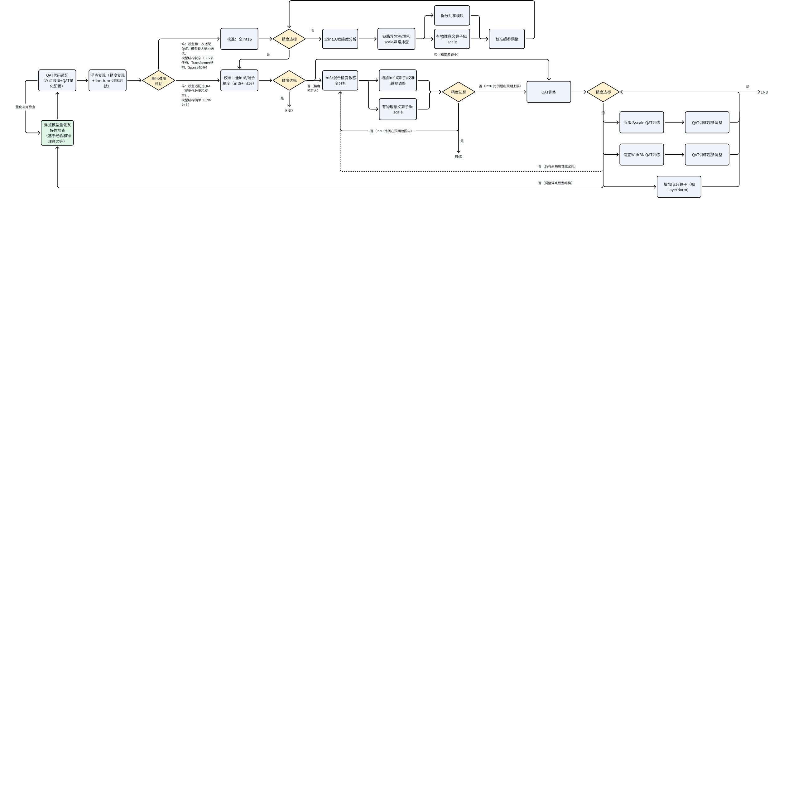

**J6H/P流程总览：**
<quote-container>
针对J6H/P的硬件特性，以int8+int16+fp16的混合精度量化为主要调优配置，会增加较多的fp16设置来优化量化精度
</quote-container>

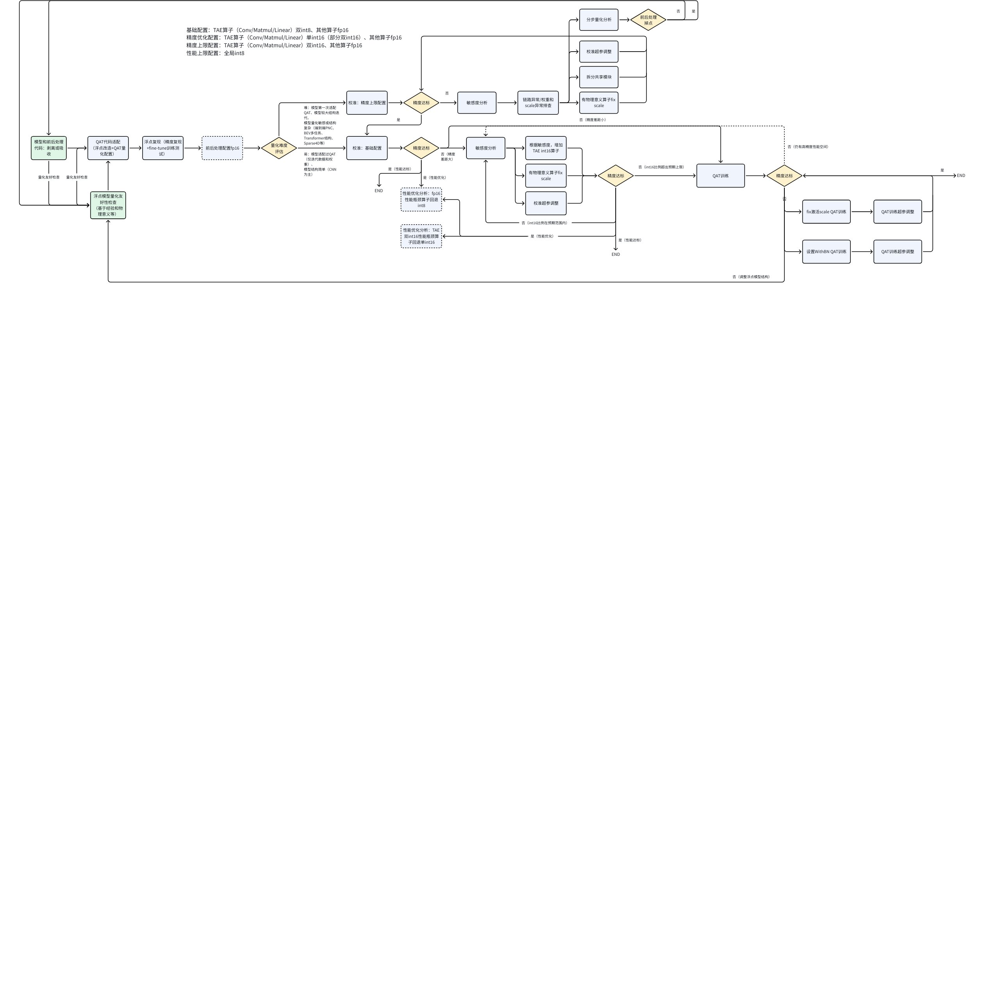

<callout emoji="bulb" background-color="light-orange" border-color="light-orange">
需要注意，J6H/P上会用到更多fp16高精度和GEMM类算子双int16等的配置，为了配置方式更加简单灵活，QAT量化工具提供了一套新的qconfig量化配置模板，具体使用方式和注意事项参考：https://developer.horizon.auto/blog/13112
</callout>

**调优原则：**
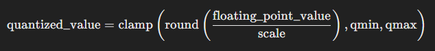

如上是一个标准的对称量化公式，产生误差的地方主要有：
1. round 产生的舍入误差。例如：当采用 int8 量化，scale 为 0.0078 时，浮点数值 0.0157 对应的定点值为 round(0.0157 / 0.0078) = round(2.0128) = 2，浮点数值 0.0185 对应的定点值为 round(0.0185 / 0.0078) = round(2.3718) = 2，两者均产生了舍入误差，且由于舍入误差的存在，两者的定点值一致。

  对于舍入误差，可以使用更小的 scale，这样可以使得单个定点值对应的浮点值范围变小。由于直接减小 scale 会导致截断误差，所以常用的方法是使用更高的精度类型，比如：将 int8 换成 int16，由于定点值范围变大， scale 将减小。

1. clamp 产生的截断误差。当 qmax * scale 无法覆盖需要量化的数值范围时，可能产生较大截断误差。例如：当采用 int8 量化，scale 为 0.0078 时，qmax * scale = 127 * 0.0078 = 0.9906，大于 0.9906 的值对应的定点值将被截断到 127。

  对于截断误差，可以使用更大的 scale。scale 一般是由量化工具使用统计方法得到，scale 偏小的原因是校准数据不够全，校准方法不对，导致 scale 统计的不合理。比如：某一输入的理论范围为 [-1, 1]，但校准或 qat 过程中，没有观测到最大值为 1 或最小值为 -1 的样本或观测到此类样本的次数太少。应该增加此类数据或者根据数值范围，手动设置固定 scale。在截断误差不大的情况下，可以调整校准参数，通过不同的校准方法和超参缓解截断误差。

因此，QAT量化精度调优以减少上述两种误差为基本原则，下文将针对QAT每个阶段做调优介绍：

## 1.1 浮点训练 & 评测
一般情况下，QAT精度调优以训练好的浮点模型作为初始条件，理想情况下，浮点模型的设计和迭代应充分考虑量化风险，主要包括2个方面：
1. **在保持浮点精度的情况下，尽可能使用量化友好的结构和算子：**特征提取部分尽可能使用CNN结构、尽量裁剪多余的attention和elementwise（add/mul/sub等）操作、激活函数首选ReLU、bbox回归和位置编码常用的sigmoid/inverse_sigmoid等的操作避免量化（从模型移除到前后处理）、使用可被QAT融合的结构例如Conv+<text bgcolor="light-yellow">普通BN2d</text>+ReLU、模型尾部保持TAE算子（GEMM/Conv/Linear/Matmul）直接输出
1. **调整浮点数据流和浮点训练策略，尽可能量化友好：**输入数据做[-1, 1]的归一化、图像训练数据建议做bgr->yuv420->yuv444的处理感知部署时nv12输入数据的颜色损失、Conv/Linear后多增加BN和LN约束数据范围、<text bgcolor="light-yellow">Concat算子多输入前添加BN约束数据范围避免数值范围差异过大（Concat算子会综合多输入的数据范围重新统计scale，存在“大数吃小数”的风险）</text>、INF/NAN等特殊类型的数据替换为例如100或-1、极大的数值（如float64的掩码值）根据物理意义做手动的截断、合理选择weight_decay避免weight数值分布不均或数值极小
此外还可以参考用户手册对应章节：[构建量化友好模型](https://doc.oe.horizon.auto/guide/plugin/user_guide/float_model_requirements.html#%E6%9E%84%E5%BB%BA%E9%87%8F%E5%8C%96%E5%8F%8B%E5%A5%BD%E6%A8%A1%E5%9E%8B)

首先需要在浮点链路上完成训练和评测整体流程的打通，需要成功复现浮点模型的精度，一方面熟悉模型结构和评测流程，为接下来的量化调优做准备；另一方面避免浮点数据流的bug影响量化调优

此外有条件的情况下，建议对已有的浮点模型和权重做小lr的fine-tune，lr可以复用浮点最后一个epoch的配置，或者参考QAT建议选择浮点收敛学习率的1/10~1/20，来提前排除模型过拟合相关风险

浮点模型更多算子/结构优化建议可以参考算法方案优化集锦
https://developer.horizon.auto/blog/13133
## 1.2 模型改造
QAT校准和QAT训练都依赖对浮点模型代码做一定的改造，主要为在模型首尾插入量化（QuantStub）和反量化（DeQuantStub）标识算子，以及添加量化精度配置的代码。这一部分从上手到实践建议参考用户手册标准流程和配置：
1. 快速入门：http://doc.oe.horizon.auto/guide/plugin/qat_quickstart/qat_quickstart.html
1. QConfig详解：http://doc.oe.horizon.auto/guide/plugin/user_guide/qconfig.html
1. Prepare详解：http://doc.oe.horizon.auto/guide/plugin/user_guide/prepare.html

### 1.2.1 常见问题

<lark-table rows="4" cols="3" column-widths="277,186,501">

  <lark-tr>
    <lark-td>
      问题
    </lark-td>
    <lark-td>
      建议
    </lark-td>
    <lark-td>
      示例
    </lark-td>
  </lark-tr>
  <lark-tr>
    <lark-td>
      多输入、多输出模型如何插入QuantStub和DeQuantStub
    </lark-td>
    <lark-td>
      对每个输入或输出的tensor插入各自的QuantStub和DeQuantStub
    </lark-td>
    <lark-td>
      ```python
      class Model(nn.Module):
          def __init__(self, ) -> None:
              super().__init__()
              self.quant1 = QuantStub()
              self.quant2 = QuantStub()
              self.dequant1 = DeQuantStub()
              self.dequant2 = DeQuantStub()
              self.backbone = BackboneModule(...)

          def forward(self, input1, input2):
              input1 = self.quant1(input1)
              input2 = self.quant2(input2)
              output1, output2 = self.backbone(input1, input2)
              return self.dequant1(output1), self.dequant2(output2)
      ```
    </lark-td>
  </lark-tr>
  <lark-tr>
    <lark-td>
      模型中的标量、常量和bool类型的tensor应该怎么处理
    </lark-td>
    <lark-td>
      在最新的版本中（OE 3.2.0以及之后）对于int8/int16/bool类型的标量或者常量tensor，无需量化处理；<text bgcolor="light-yellow">对于浮点类型的常量tensor，建议统一量化；</text>
    </lark-td>
    <lark-td>
      ```python
      ...
          def forward(self, data, index): # data为浮点类型tensor，index为int16类型tensor
              data = self.quant(data)
              data_mask = (data > 0) # bool类型标量，无需量化
              output_index = torch.where(data_mask == True, index, -1) # output_index为int8/16类型tensor
              return output_index
      ```
    </lark-td>
  </lark-tr>
  <lark-tr>
    <lark-td>
      对于模型分段部署的场景，应该如何插入QuantStub和DeQuantStub
    </lark-td>
    <lark-td>
      根据部署要求，可以在模型分段处插入1对DeQuantStub+QuantStub来实现，同时控制分段处的scale一致
    </lark-td>
    <lark-td>
      ```python
      class EncoderModule(nn.Module):
          def __init__(self, ) -> None:
              super().__init__()
              self.dequant = DeQuantStub()
              self.conv = ConvModule(...)

          def forward(self, input1, input2):
              input1 = self.conv(input1)
              output = input1 + input2
              if env.get("EXPORT_DEPLOY", 0) == 1:
                  return self.dequant(output)
              return output
      class DecoderModule(nn.Module):
          def __init__(self, ) -> None:
              super().__init__()
              self.quant = QuantStub()
              self.conv = ConvModule(...)

          def forward(self, data):
              if env.get("EXPORT_DEPLOY", 0) == 1:
                  data = self.quant(data)
              data = self.conv(data)
              return data
      class Model(nn.Module):
          def __init__(self, ) -> None:
              super().__init__()
              self.quant1 = QuantStub()
              self.quant2 = QuantStub()
              self.dequant = DeQuantStub()
              self.encoder = EncoderModule(...)
              self.decoder = DecoderModule(...)

          def forward(self, input1, input2):
              input1 = self.quant1(input1)
              input2 = self.quant2(input2)
              output = self.encoder(input1, input2)
              output = self.decoder(output)
              return self.dequant(output)
      ```
    </lark-td>
  </lark-tr>
</lark-table>


## 1.3 模型检查
完成模型改造和量化配置后，调用Prepare接口时会对模型做算子支持和量化配置上的检查，这些检查一定程度上反映了模型量化存在的问题。对于不支持的算子将以报错的形式提醒用户，一般有两种情况：
1. 未正确进行模型的量化改造。Prepare过程中QAT量化工具会对模型进行trace来获取完整的计算图，在这个过程中会完成算子替换等的优化，对于这些已替换的算子，输入输出类型如果是torch.tensor而非经过QuantStub转化后的qtensor，则会触发不支持算子的报错，表现为`xxx is not implemented for QTensor`；
1. 确实存在不支持的算子。工具链已支持业界大量的常用算子，但对于部分非常见算子的不支持情况，需考虑进行算子替换并且作为算子需求向工具链团队导入。

Prepare运行成功后会在当前目录下自动保存模型检查文件`model_check_result.txt`和`fx_graph.txt`，建议参考下列解读顺序：
1. 算子融合检查。算子融合作为QAT量化工具的标准优化手段，常见的融合组合为Conv+ReLU+BN和Conv+Add等，未融合的算子会在txt文件中给出，未按预期融合的算子可能是因为共享没有融合成功或者是QAT量化工具的融合逻辑变更（针对新版qconfig量化模板enable_optimize=True情况），需要检查代码，确认未融合的情况是否符合预期：
  ```python
  # 示例：未融合的Conv+Add算子
  Fusable modules are listed below:
  name                                              type
  ------------------------------------------------  --------------------------------------------------------------------------
  model.view_transformation.input_proj.0.0(shared)  <class 'horizon_plugin_pytorch.nn.qat.conv2d.Conv2d'>
  model.view_transformation._generated_add_0        <class 'horizon_plugin_pytorch.nn.qat.functional_modules.FloatFunctional'>
  ```

  未融合的算子对模型性能会有一定影响，对于精度的影响需视量化敏感度具体分析，一般来说，Conv/Linear+ReLU+BN未融合建议手动修改融合
1. 共享模块检查。一个 module 只有一组量化参数，多次使用将会共享同一组量化参数，<text bgcolor="light-yellow">多次数据分布差异较大时</text>，会产生较大误差：
  ```python
  # 示例：该共享模块被调用8次
  Each module called times:
  name                                                                                       called times
  ---------------------------------------------------------------------------------------  --------------
  ...
  model.map_head.sparse_head.decoder.gen_sineembed_for_position.div.reciprocal                          8
  ```

  called times > 1 的模块可能有很多个，全部改写成非共享是一劳永逸的。对于修改简单且精度影响大的共享算子如<text bgcolor="light-yellow">QuantStub，强烈建议取消共享</text>；对于DeQuantStub算子，共享不会对模型精度产生影响，但是会影响Debug结果的分析，也建议取消共享，修改方式参考“模型改造-常见问题”。

  例如下面的共享模块，量化表示的最大值为 128 * 0.0446799 ≈ 5.719，在第一次使用中，输出范围明显小于 [-5.719, 5.719]，误差较小, 第二次使用中，输出范围超出 [-5.719, 5.719]，数值被截断，产生了较大误差。两次数值范围的差异也造成了统计出的scale不准确，因此该共享模块必须修改
  ```python
  +------+-------------------------------------------------------------------------------+-----------------------------------------------------------------------------------+-----------------------------------------------------------------------------+--------------------------------+---------------+------------+------------------+-------------------+------------------+-------------------+
  |      | mod_name                                                                      | base_op_type                                                                      | analy_op_type                                                               | shape                          | quant_dtype   |     qscale |   base_model_min |   analy_model_min |   base_model_max |   analy_model_max |
  |------+-------------------------------------------------------------------------------+-----------------------------------------------------------------------------------+-----------------------------------------------------------------------------+--------------------------------+---------------+------------+------------------+-------------------+------------------+-------------------+
  ...
  | 1227 | model.map_head.sparse_head.decoder.gen_sineembed_for_position.div             | horizon_plugin_pytorch.nn.div.Div                                                 | horizon_plugin_pytorch.nn.qat.functional_modules.FloatFunctional.mul        | torch.Size([1, 1600, 128])     | qint8         |  0.0446799 |        0.0002146 |         0.0000000 |        4.5935526 |         4.5567998 |
  ...
  | 1520 | model.map_head.sparse_head.decoder.gen_sineembed_for_position.div             | horizon_plugin_pytorch.nn.div.Div                                                 | horizon_plugin_pytorch.nn.qat.functional_modules.FloatFunctional.mul        | torch.Size([1, 1600, 128])     | qint8         |  0.0446799 |        0.0000000 |         0.0000000 |        6.2831225 |         5.7190272 |
  ...
  ```

  上面共享算子的修改方式可以参考：
  ```python
  class Model(nn.Module):
      def __init__(self, ) -> None:
          super().__init__()
          ...
          self.steps = 2
          for step in range(self.steps):
              setattr(self, f'div{step}', FloatFunctional())

      def forward(self, data):
          ...
          for step in range(self.steps):
              data = getattr(self, f'div{step}').div(x)
          ...
  ```

  对于不带权重的function类算子都可以参考上面的拆分方式，但是也存在部分共享算子或模块带有权重参数拆分起来比较复杂，是否需要拆分建议先根据量化敏感度进行分析。<text bgcolor="light-yellow">带有权重参数算子拆分时需要复制权重</text>，拆分方式可以参考：
  ```python
  class Model(nn.Module):
      def __init__(self, ) -> None:
          super().__init__()
          ...
          self.steps = 2
          self.conv0 = nn.Conv2d(...)
          self.conv1 = nn.Conv2d(...)
          self.conv1.weight = self.conv0.weight
          self.conv1.bias = self.conv0.bias

      def forward(self, data):
          ...
          for step in range(self.steps):
              data = getattr(self, f'conv{step}')(x)
          ...
  ```

  此外，未调用的模块也会在文件中体现，`called times`为0，当Calibration/QAT/模型导出出现miss_key时，可以检查模型中是否有模块未被trace。

1. 量化配置检查。txt文件中会给出模型量化精度的统计信息：
  ```python
  # 算子输入量化精度统计
  input dtype statistics:
  +----------------------------------------------------------------------------+-----------------+---------+----------+
  | module type                                                                |   torch.float32 |   qint8 |   qint16 |
  |----------------------------------------------------------------------------+-----------------+---------+----------+
  | <class 'horizon_plugin_pytorch.nn.qat.stubs.QuantStub'>                    |             290 |      15 |        0 |
  | <class 'horizon_plugin_pytorch.nn.qat.linear.Linear'>                      |               5 |     117 |        9 |
  | <class 'horizon_plugin_pytorch.nn.qat.stubs.DeQuantStub'>                  |               0 |       8 |        0 |
  ...

  # 算子输出量化精度统计
  output dtype statistics:
  +----------------------------------------------------------------------------+-----------------+---------+----------+
  | module type                                                                |   torch.float32 |   qint8 |   qint16 |
  |----------------------------------------------------------------------------+-----------------+---------+----------+
  | <class 'horizon_plugin_pytorch.nn.qat.stubs.QuantStub'>                    |               0 |     123 |      182 |
  ...

  # 使用fp16量化精度的算子，量化精度统计
  +----------------------------------------------------------------------------+-----------------+---------+----------+-----------------+
  | module type                                                                |   torch.float32 |   qint8 |   qint16 |   torch.float16 |
  |----------------------------------------------------------------------------+-----------------+---------+----------+-----------------|
  | <class 'horizon_plugin_pytorch.nn.qat.stubs.QuantStub'>                    |              34 |       0 |        0 |               0 |
  | <class 'torch.nn.modules.padding.ZeroPad2d'>                               |               0 |      11 |        0 |               0 |
  | <class 'horizon_plugin_pytorch.nn.qat.functional_modules.FloatFunctional'> |              48 |      14 |        9 |              50 |
  ...
  ```

重点检查的信息有：
1. `<class 'horizon_plugin_pytorch.nn.qat.stubs.QuantStub'>`的input dtype应为`torch.float32`，对于`qint8`或者`qint16`的input dtype，一般是冗余的QuantStub算子可以改掉，不会对精度产生影响但可能会对部署模型性能有影响（算子数量）
1. 模型中的算子不应出现`torch.float32`的输入精度，如上图的`<class 'horizon_plugin_pytorch.nn.qat.linear.Linear'>`，需要检查是否漏插`QuantStub`未转定点，未转定点的算子在导出部署模型时会cpu计算从而影响模型性能。对于模型中的一些浮点常量tensor，工具已支持自动插入`QuantStub`转定点，建议获取最新版本
1. 对于GEMM类算子（Conv/Matmul/Linear）作为模型输出时支持高精度输出（J6E/M支持int32输出，J6B/H/P支持浮点输出），体现到这里则是`<class 'horizon_plugin_pytorch.nn.qat.stubs.DeQuantStub'>`的input dtype应为`torch.float16`或`torch.float32`，对于`qint8`或`qint16`输入的`DeQuantStub`需要检查是否符合高精度输出的条件，符合条件但未高精度输出的需修改。此外对于下面左图的结构，也建议优化为右图结构来保证高精度输出的优化
  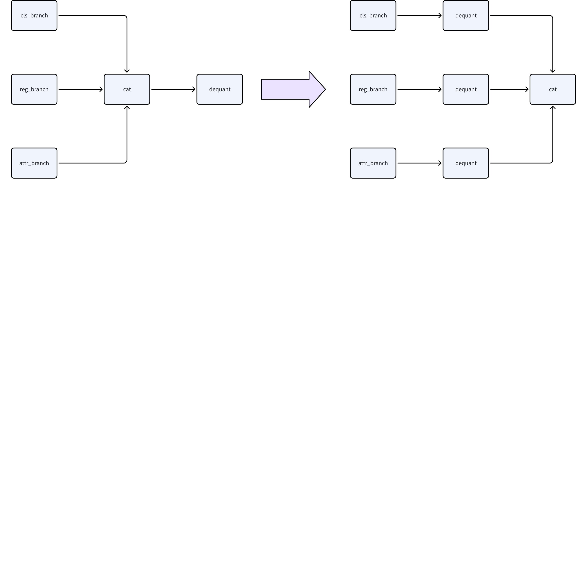

1. `qint8`和`qint16`算子的占比，可以协助判断是否配置全int16生效；`torch.float16`算子的占比，可以协助判断是否配置fp16生效

txt文件同时会给出逐层的量化配置信息：
```python
# 激活逐层qconfig
Each layer out qconfig:
+---------------------------------------------+----------------------------------------------------------------------------+----------------------+-----------------+------------------------------------------------------------------------------------------------+---------------------------------------------------------------------------------------------------------+
| Module Name                                 | Module Type                                                                | Input dtype          | out dtype       | ch_axis                                                                                        | observer                                                                                                |
|---------------------------------------------+----------------------------------------------------------------------------+----------------------+-----------------+------------------------------------------------------------------------------------------------+---------------------------------------------------------------------------------------------------------|
# 固定scale
| quant                                       | <class 'horizon_plugin_pytorch.nn.qat.stubs.QuantStub'>                    | [torch.float32]      | ['qint16']      | -1                                                                                             | FixedScaleObserver(scale=tensor([3.0518e-05], device='cuda:0'),zero_point=tensor([0], device='cuda:0')) |
# QAT训练激活scale更新
| mod2.1.attn.q                               | <class 'horizon_plugin_pytorch.nn.qat.conv2d.Conv2d'>                      | ['qint16']           | ['qint16']      | -1                                                                                             | MinMaxObserver(averaging_constant=0.01)                                                                 |
# QAT训练激活scale不更新
| mod2.1.FFN.out_conv.1.0                     | <class 'horizon_plugin_pytorch.nn.qat.conv2d.Conv2d'>                      | ['qint16']           | ['qint16']      | -1                                                                                             | MinMaxObserver(averaging_constant=0)                                                                    |
# 激活fp16 qconfig
| bev_fusion.multi_view_cross_attn.32.global_cross_window_attn._generated_add_2[add]           | <class 'horizon_plugin_pytorch.nn.qat.functional_modules.FloatFunctional'> | [torch.float16, torch.float32]                               | [torch.float16] | FakeCast(dtype=torch.float16, min_val=-0.0009765625, max_val=0.0009765625)                     |               |


# 权重逐层qconfig
Weight qconfig:
+-------------------------+-------------------------------------------------------+----------------+-----------+-----------------------------------------+
| Module Name             | Module Type                                           | weight dtype   |   ch_axis | observer                                |
|-------------------------+-------------------------------------------------------+----------------+-----------+-----------------------------------------|
| mod1.0                  | <class 'horizon_plugin_pytorch.nn.qat.conv2d.Conv2d'> | qint8          |         0 | MinMaxObserver(averaging_constant=0.01) |
```

重点检查的信息有：
1. 每层算子的输入输出dtype、权重的dtype，是否符合量化配置；若和量化配置不符合，比如配置了int16，但是算子显示为int8，则需要关注下算子回退信息，例如<text bgcolor="light-yellow">Conv+Add的融合，Conv不支持int16输入则会导致前序算子的输出回退到int8</text>。**新的qconfig量化配置模板下算子回退过程需查看**`**qconfig_changelogs.txt**`**，详细参考****https://developer.horizon.auto/blog/13112**
1. 配置了fix scale的算子，是否正确显示FixedScaleObserver信息，scale值是否正确
1. 逐层算子的observer是否正确：权重默认MinMaxObserver，QAT校准时激活默认MSEObserver，QAT训练时激活默认MinMaxObserver
1. 若为QAT训练阶段且配置了固定校准的激活scale，查看averaging_constant，判断是否生效，生效为averaging_constant=0（即不更新scale），默认为0.01（更新scale）

对于`fx_graph.txt`，可以从中获取到模型中op/module的上下游调用关系，例如当存在算子`called times`为0未被调用的情况，可以通过Graph定位到上下文算子从而定位未被调用的原因（通常因为存在逻辑判断或循环次数变化）；此外当出现导出的部署模型（bc模型）精度异常，<text bgcolor="light-yellow">也可以通过Graph信息来排查是否是导出计算图改变导致的</text>
```python
# 模型Graph图结构信息
Graph:
opcode         name                                           target                                                                    args                                                                                           kwargs
-------------  ---------------------------------------------  ------------------------------------------------------------------------  ---------------------------------------------------------------------------------------------  -----------------------------
placeholder    input_0                                        input_0                                                                   ()                                                                                             {}
call_module    quant                                          quant                                                                     (input_0,)                                                                                     {}
call_module    traj_decoder_src_proj_0_0                      traj_decoder_src_proj.0.0                                                 (quant,)                                                                                       {}
call_function  scope_end                                      <function Tracer.scope_end at 0x7f4477d7dc60>                             ('traj_decoder_src_proj.0',)                                                                   {}
call_function  __get__                                        <method-wrapper '__get__' of getset_descriptor object at 0x7f460922b800>  (traj_decoder_src_proj_0_0,)                                                                   {}
call_function  __getitem__                                    <slot wrapper '__getitem__' of 'torch.Size' objects>                      (__get__, 0)                                                                                   {}
call_function  __getitem___1                                  <slot wrapper '__getitem__' of 'torch.Size' objects>                      (__get__, 1)                                                                                   {}
call_function  __getitem___2                                  <slot wrapper '__getitem__' of 'torch.Size' objects>                      (__get__, 2)                                                                                   {}
call_function  __getitem___3                                  <slot wrapper '__getitem__' of 'torch.Size' objects>                      (__get__, 3)                                                                                   {}
call_function  permute                                        <method 'permute' of 'torch._C.TensorBase' objects>                       (traj_decoder_src_proj_0_0, 0, 2, 3, 1)                                                        {}
...
```

重点关注的Graph信息：
- `opcode`为算子调用类型
- `name`为当前算子名称，需注意和`model_check_result.txt`中的`module.submodule`名称区别
- `target`为算子输出
- `args`为算子输入

## 1.4 QAT校准
### 1.4.1 int8+int16混合精度调优
QAT校准是QAT精度调优流程中的一个关键环节，校准不涉及繁重的训练，只需要从训练集中选取分布均衡的校准数据校准就可以快速获取模型逐层的量化阈值。此外因为校准不改变模型的原始权重，可以帮助用户快速地排查影响精度的QAT链路问题，以及定位模型存在的量化参数配置问题。建议用户预估当前模型调优难度来选取合适的校准策略：
- 较易量化的模型：模型曾完成QAT并且当前仅迭代数据和权重、模型结构简单（例如以CNN结构为主的检测/分类模型）等。这一类模型可以选择全int8的量化精度进行校准，或者延用之前调优的混合精度（int8+int16）配置，具体的量化配置请参考“模型改造”章节；
- 较难量化的模型：模型第一次适配QAT、模型存在较大结构迭代、模型结构复杂（BEV多任务、Transformer结构、Sparse4D等）。这一类模型可以选择全int16的量化精度进行校准，具体的量化配置请参考“模型改造”章节。

对于全int16配置下的模型量化精度不达标或者很差，建议运行QAT Debug工具来进行量化敏感度分析，Debug工具运行和产出物的分析方式请参考“Debug产出物解读”章节，请结合Debug结果做精准分析，一般来说全int16下精度不达标的可能原因有：
1. QAT链路适配存在问题，模型在校准和评测下伪量化节点（fake_quant）和统计观测节点（observer）的状态异常、模型校准参数异常未更新等；
1. 模型存在异常的数据，例如INF或者NAN，这些值很大程度上影响量化效果，需进行修改；
1. 模型部分层/模块有很大的截断误差，一方面可能由于校准数据选择到了极端的数据，无法获取合理的量化阈值；另一方面一些带有物理意义的数据（例如距离、速度），仅通过统计无法获取合适的量化阈值，需要在充分考虑应用场景下手动指定固定的量化阈值。
全int16配置下的模型通常性能无法满足部署要求，除了只看精度上限的场景，在完成全int16调优后，模型最终都要回到全int8和混合精度调优上，以期望得到一个部署精度和部署性能平衡的量化模型。

对于全int8或者混合精度配置下的模型，针对不同的精度表现采用不同的调优策略：
1. 精度表现很差甚至无精度，且未尝试全int16调优，优先尝试全int16调优，参考前文；
1. 精度表现距离浮点差距较大（`量化精度/浮点精度 <= 90%`，经验值），建议运行QAT Debug工具来进行量化敏感度分析，结合Debug结果做精准分析，一般的优化手段有：增加int16的配置、对有物理意义的数据手动指定固定的量化阈值。此外需注意int16算子的比例，int16算子过多会影响部署性能，如果int16算子比例已超出部署预期，则可以考虑回退部分int16算子后尝试QAT训练
1. 精度表现距离浮点差距较小（`量化精度/浮点精度 > 90%`，经验值），直接尝试QAT训练，在`量化精度/浮点精度 >= 95%`（经验值）的情况下，建议优先尝试固定校准激活scale的QAT训练（仅调整权重感知量化误差）

对于不同精度配置下的QAT校准，都有一些校准超参可以调整，需要用户结合具体模型去做调参优化，其中主要的参数有校准数据的batch size、校准的steps，详细的参数参考：
1. 基础调优手段：http://doc.oe.horizon.auto/guide/plugin/user_guide/precision_tuning.html#calibration
1. 高级调优手段：http://doc.oe.horizon.auto/guide/plugin/user_guide/precision_tuning.html#calibration-1

**总结来说，int8+int16混合精度调优的重点应放在全 int16 调优，这里需要把使用问题，量化不友好模块等等各种千奇百怪的问题都解决，务必要把全int16的精度调优做扎实，看到模型的精度上限，然后根据模型部署的性能要求进行int8和int16混合精度的调优，达成部署精度和部署性能的平衡。**
### 1.4.2 int8+int16+fp16混合精度调优
<quote-container>
如果模型中吸收了前后处理的相关算子和操作，这部分默认需要fp16精度进行量化
</quote-container>

对于int8+int16+fp16混合精度而言，主要的量化配置如下（配置方式参考https://developer.horizon.auto/blog/13112）：
- 基础配置：TAE算子（Conv/Matmul/Linear）双int8、其他算子fp16
- 精度优化配置：TAE算子（Conv/Matmul/Linear）单int16（部分双int16）、其他算子fp16
- 精度上限配置：TAE算子（Conv/Matmul/Linear）双int16、其他算子fp16
- 性能上限配置：全局int8，建议仅在测试模型最优性能（精度无保证）或作为高精度耗时优化的对比参考时配置
同样的对于较难量化的模型而言，初始应使用**精度上限配置**，在这个配置下解决量化流程可能的问题，优化量化风险较大的算子/模块，往往通过Debug工具进行定位，但在使用Debug工具较难定位到量化瓶颈时，可以使用分步量化的小技巧（参考“调优技巧1”），也即对选中算子取消量化后对比精度，如定位到前后处理的算子/模块产生明显掉点，建议从模型中剥离；定位到模型中算子/模块，可以使用设置fix_scale和拆分共享模块等方式，或者从量化友好角度修改浮点模型（参考“浮点训练 & 评测”）

精度上限配置下的模型较难满足部署侧的延时要求，因此对于较难量化和较易量化模型而言，解决掉上述的量化瓶颈后需要回归到**基础配置**。在基础配置上通过敏感度的分析结果，增加TAE的int16算子，也就是**精度优化配置**。在基础配置和精度优化配置下精度达标的模型，视延时情况可能需要高精度的性能优化，主要方向为：
1. 基础配置下，回退fp16性能瓶颈算子到低精度int8
1. 精度优化配置下，回退双int16的TAE算子到单int16，回退fp16性能瓶颈算子到低精度int8

精度优化配置下如果int16算子比例已超出部署预期但精度仍有一定差距，则可以考虑回退部分int16算子后尝试QAT训练；基础配置下精度表现距离浮点差距较小（`量化精度/浮点精度 > 90%`，经验值），直接尝试QAT训练，在`量化精度/浮点精度 >= 95%`（经验值）的情况下，建议优先尝试固定校准激活scale的QAT训练（仅调整权重感知量化误差）

**总结来说，int8+int16+fp16混合精度调优的重点应放在TAE双int16+其他算子fp16的调优上，这里需要把使用问题，量化不友好模块等等各种千奇百怪的问题都解决，看到模型的精度上限，然后根据模型部署的性能要求进行TAE int8和int16混合精度的调优，最后对非TAE算子进行int8+fp16混合精度的调优，最终达成部署精度和部署性能的平衡。**
### 1.4.3 Debug产出物解读
Debug工具比对的对象是QAT校准模型和浮点模型，由于模型权重在QAT训练过程中已经发生了改变，不建议对比QAT训练后的模型和浮点模型。工具使用和运行请参考：http://doc.oe.horizon.auto/guide/plugin/user_guide/quant_analysis.html，整个过程是工具自动在传入的数据集中查找badcase或者用户手动设置badcase -> 运行badcase -> 逐层比较 -> 计算敏感度。

工具运行完成后会在指定目录下生成如下一些关键的文件，按照用到的文件重要性和使用频率分成：
P0-调优重点参考
P1-调优辅助分析
P2-用户不必关注，需要时可提供研发分析
```python
floatvscalib
├── abnormal_layer_advisor.txt # P1，异常层信息和修改建议：异常的数值范围和异常scale等
├── ...
├── analysis_model # QAT校准模型
│   ├── op_infos # P2，保存的逐层输出/权重值
│   ├── statistic.csv
│   └── statistic.txt # P1，逐层统计量
├── ...
├── baseline_model # 浮点模型
│   ├── op_infos
│   ├── statistic.csv
│   └── statistic.txt
├── compare_per_layer_out.csv
├── compare_per_layer_out.txt # P1，校准模型和浮点模型逐层统计量比对信息
├── output_pred_boxes_L1_sensitive_ops.pt # P0，box输出对应量化敏感算子和敏感度，用于load到量化配置中
├── output_pred_boxes_L1_sensitive_ops.txt # P0，box输出对应量化敏感算子和敏感度，用于用户阅读
├── output_pred_logits_L1_sensitive_ops.pt # P0，同上
├── output_pred_logits_L1_sensitive_ops.txt # P0，同上
└── ...
```

建议分析流程为：
1. 结合模型精度情况，找到和掉点精度相关的输出敏感度文件，举个例子，量化后模型3D检测框的朝向误差大，精度低，则找到rot/angle输出对应的敏感度文件pt和txt。如果相关输出较多，则需要综合分析
1. 分析敏感度txt文件
  ```python
  # 示例：量化敏感度
  op_name                                                sensitive_type    op_type                                                                            L1  quant_dtype    flops
  -----------------------------------------------------  ----------------  --------------------------------------------------------------------------  ---------  -------------  -----------------
  head.head.reg_convs_list.1.1.0.0                       activation        <class 'horizon_plugin_pytorch.nn.qat.conv2d.Conv2d'>                       0.363303   qint8          13271040(0.07%)
  backbone.mod1.0                                        activation        <class 'horizon_plugin_pytorch.nn.qat.conv2d.Conv2d'>                       0.308664   qint8          79626240(0.41%)
  backbone.mod2.0.head_layer.conv.1.0                    activation        <class 'horizon_plugin_pytorch.nn.qat.conv2d.Conv2d'>                       0.226762   qint8          188743680(0.97%)
  ```

  1. 查看敏感度衡量指标，上面示例中为L1，其他较推荐的如ATOL、余弦相似度等，根据经验，ATOL在量化敏感的输出或指标上更能反映量化损失，例如预测轨迹输出或误差类指标。误差大，敏感度高的算子排序靠前，对应这些敏感算子激活量化精度为`qint8`，如果是已经配置了高精度，需要判断这里配置未生效的原因，可能是不支持的精度组合工具自动回退
  1. 具体分析算子量化敏感原因，分析`compare_per_layer_out.txt`文件：
    ```python
    # 示例：统计量对比
    +------+-------------------------------------------------------------------------------+-----------------------------------------------------------------------------------+-----------------------------------------------------------------------------+--------------------------------+---------------+------------+------------+--------------+------------+------------+-------------+-------------+-------------------------------------------------+------------------+-------------------+------------------+-------------------+-------------------+--------------------+------------------+-------------------+-----------------+-------------------+
    |      | mod_name                                                                      | base_op_type                                                                      | analy_op_type                                                               | shape                          | quant_dtype   |     qscale |     Cosine |          MSE |         L1 |         KL |        SQNR |        Atol |                                            Rtol |   base_model_min |   analy_model_min |   base_model_max |   analy_model_max |   base_model_mean |   analy_model_mean |   base_model_var |   analy_model_var |   max_atol_diff |   max_qscale_diff |
    |------+-------------------------------------------------------------------------------+-----------------------------------------------------------------------------------+-----------------------------------------------------------------------------+--------------------------------+---------------+------------+------------+--------------+------------+------------+-------------+-------------+-------------------------------------------------+------------------+-------------------+------------------+-------------------+-------------------+--------------------+------------------+-------------------+-----------------+-------------------|
    ...
    |  791 | model.view_transformation.transformer.layers.0.quant                          | horizon_plugin_pytorch.quantization.stubs.QuantStub                               | horizon_plugin_pytorch.nn.qat.stubs.QuantStub                               | torch.Size([1, 1875, 24, 2])   | qint8         |  0.7764707 |  0.9999968 |    0.1134158 |  0.3205845 |  0.0000081 |  46.6785774 |   0.3882294 |                                       1.0000000 |      -99.0000000 |       -98.6117706 |        0.9999269 |         0.7764707 |       -53.0977783 |        -52.8312225 |     2459.8188477 |      2446.8227539 |       0.3882294 |         0.4999923 |
    ...
    |  883 | model.obstacle_head.decoder.layers.0.cross_attn.quant_normalizer              | horizon_plugin_pytorch.quantization.stubs.QuantStub                               | horizon_plugin_pytorch.nn.qat.stubs.QuantStub                               | torch.Size([1, 7500, 8, 32])   | qint8         |  0.0522360 |  0.3601017 |    0.9630868 |  0.6762735 |  0.0000729 |  -0.6995326 |  12.4819937 |                                  601413.5625000 |       -9.2183294 |        -6.5295014 |       10.2716885 |         6.6339736 |        -0.0177280 |         -0.0255637 |        0.8194664 |         0.6810485 |      12.4819937 |       238.9537970 |
    ...
    ```

    对于`model.view_transformation.transformer.layers.0.quant`，scale 是 0.7764707，能表示的浮点范围为 0.776 * (-128) = -99.38 到 0.776 * 127 = 98.61。结合这里的物理含义，此 quant 的输入范围应该是 -100 到 1，所以会产生少量的截断误差。同时，此数值范围较大，对于 int8 来说，也会产生较大的舍入误差。所以需要改为 int16 量化并按输入范围设置固定 scale 为 100 / 32768。对于 `model.obstacle_head.decoder.layers.0.cross_attn.quant_normalizer`也一样是类似的问题。对于量化精度较低导致的截断误差/舍入误差问题，工具支持按敏感度比例批量配置高精度`qint16`
  1. 对于舍入误差，可以修改为int16量化，对于截断误差，可以修改为int16，也可以手动指定固定的量化scale来cover数值范围。“对症下药”修改后，体现到对应算子的敏感度应降低（如没有降低，首先确认修改是否生效，其次确认修改是否正确），整体敏感度均降低后，体现到模型精度指标对应上升

**总结：**
1. Debug工具会提供逐层的误差衡量指标，但最终的调优目标仍是模型整体精度，而非单算子或单层误差指标，原因是部分算子对量化误差并不敏感（如sigmoid和softmax等）且模型整体具有噪声鲁棒性和泛化性；
1. 优先查看敏感度（与精度掉点相关的输出），看完敏感度再看逐层比较。确定某一算子敏感后，先通过逐层比较或统计量确认造成的误差是舍入误差还是截断误差，然后再针对性地调整量化配置或修改模型结构。
#### 1.4.3.1 Badcase 调优
对于实车或回灌反馈的可视化badcase，利用Debug工具的调优流程为：
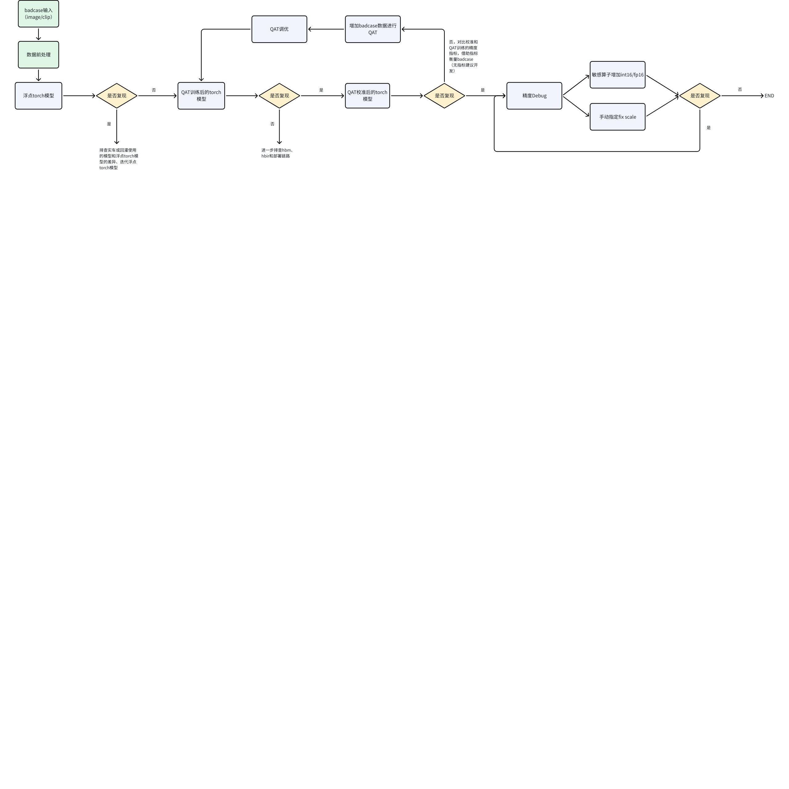


## 1.5 QAT训练
大部分模型仅通过QAT校准就可以获得较好的量化精度，对于部分较难调优的模型，以及还需要继续优化误差类指标的模型，通常校准设置的高精度比例导致延时超过部署上限，但精度仍无法达标，这种情况可以尝试QAT训练来获得满足预期性能-精度平衡的量化模型。

根据前文所述，在QAT校准`量化精度/浮点精度 >= 95%`（经验值）的情况下，充分利用校准阶段较好的激活量化参数，优先尝试固定校准激活scale的QAT训练（仅调整权重感知量化误差），设置方式具体参考“模型改造-QConfig详解”

参考浮点训练，QAT训练在大部分配置保持和浮点训练一致的基础上，也涉及到部分超参的调整来提升量化训练的精度，例如QAT的学习率、weight_decay、迭代次数等，详细的参数调整策略参考：
1. 基础调优手段：https://doc.oe.horizon.auto/guide/plugin/user_guide/precision_tuning.html#qat
1. 高级调优手段：https://doc.oe.horizon.auto/guide/plugin/user_guide/precision_tuning.html#qat-1

浮点和QAT训练中都涉及到对BN的状态控制，在浮点训练中可能会采用FreezeBN fine-tune的方式来提升模型精度，在多任务训练中也会采用FreezeBN的技巧。因此在QAT训练中，提供了FuseBN和WithBN两种训练方式：
1. FuseBN即在Prepare后，QAT训练前将BN的weight和bias吸收到Conv的weight和bias中，在训练过程中不再单独更新，这一吸收过程是无损的。FuseBN也是QAT默认的训练方式。
1. WithBN则是在QAT训练阶段保持Conv+BN不融合，带着BN进行训练，BN的参数单独更新，在训练结束后转成部署模型时再做融合。浮点训练阶段如果采用了FreezeBN的训练方式，QAT训练时需设置WithBN，设置方式如下：
```python
from horizon_plugin_pytorch.qat_mode import QATMode, set_qat_mode
set_qat_mode(QATMode.WithBN)
# prepare
```


通过观察QAT训练过程的Loss变化来初步判断QAT训练的量化效果，一般来说和浮点最后的Loss结果越接近越好，Loss过大可能难以收敛，Loss过小可能影响泛化性，对于异常的Loss建议的优化手段：
1. 异常INF和NAN的Loss值，或者初始Loss极大且无收敛迹象，按如下顺序排查：
  <callout emoji="bulb" background-color="light-orange" border-color="light-orange">
  辅助训练loss的逻辑量化，也会影响初始loss且收敛存在问题。
  </callout>

  1. 去掉 prepare 模型的步骤，用 qat pipeline finetune 浮点模型，排除训练 pipeline 的问题，Loss如果仍异常，需要检查训练链路的配置如优化器optimizer和lr_updater等
  1. 保持当前QAT训练配置，只关闭伪量化节点后观察训练的Loss现象，理论上和浮点无差异
  ```python
  from horizon_plugin_pytorch.quantization import set_fake_quantize, FakeQuantState
  ...
  set_fake_quantize(qat_model, FakeQuantState._FLOAT)
  train(qat_model, qat_dataloader)
  ```

  1. lr 设置为 0，进行 qat 训练，排除参数调整不到位的问题。qat 训练的精度应该与 calibration 精度几乎一致
  1. 此外还需要检查是否使用了<text bgcolor="light-yellow">特殊的数据增强策略</text>（如旋转、马赛克等会改变真实的数据分布）、加速收敛 <text bgcolor="light-yellow">dn_mask</text> 关闭

1. 在排查完链路问题后出现初始Loss较大，有收敛迹象但收敛较慢，这种情况可以尝试调整学习率，延长QAT迭代次数，因为QAT训练本质上是对已收敛浮点模型的fine-tune，本身存在一定的随机性，用较大的学习率可以快速波动到一个理想精度（依赖一些中间权重的评测）
1. **对于少数模型，QAT训练以及尝试了多次超参调整后精度仍无法达标，建议回归QAT校准阶段增加少量高精度算子（int16/fp16，例如尝试对**<text bgcolor="light-yellow">**Layernorm层配置少量fp16高精度**</text>**）、回归浮点结构检查是否还存在量化不友好的结构如使用了大量GeLU等（参考“浮点训练 & 评测”）**

### 1.5.1 QAT训练效率
由于QAT训练过程需要感知模型量化所带来的损失，因此模型中会被插入必要的量化相关的节点：数据观测节点Observer和伪量化节点FakeQuant。数据观测节点会不断统计模型中数据的数值范围，伪量化节点会根据量化公式对数据做模拟量化和反量化，两者都会存在开销，此外就是QAT工具内部会对部分算子例如LN层做拆分算子的实现，因此相同配置下的QAT训练效率是会略低于浮点训练效率，具体还和模型参数规模、算子数量等有关。

对于用户可明显感知到的QAT训练效率降低，建议的优化手段有：
1. 使用QAT工具提供的算子，这些算子优化了训练效率，例如MultiScaleDeformableAttention: [# nn.MultiScaleDeformableAttention](https://doc.oe.horizon.auto/guide/plugin/plugin_api_reference/horizon_operator/horizon_plugin_pytorch_nn_MultiScaleDeformableAttention.html)
1. 更新到最新的horizon-plugin-pytorch版本，新版本会有持续的bug fix和新特性优化，如模型中某些结构或者算子训练耗时增加明显，可以向工具链团队导入
<callout emoji="rocket" background-color="light-orange" border-color="light-orange">
地平线HAT训练框架也在持续探索QAT训练提速的优化策略，例如CUDAGraph和Python算子下沉CPP等，因此对于地平线HAT训练框架的用户，除了上述的优化手段，建议持续关注并合入相关优化改动
</callout>


## 1.6 模型导出部署
完成QAT精度调优后得到的模型仍是PyTorch伪量化模型，需要使用简单易用的接口来一步步导出编译成部署模型：
`PyTorch``伪量化``模型 -> ``*export*`` -> ``*convert-> compile*`
<quote-container>
export得到qat.bc；
convert得到quantized.bc；
compile得到hbm
</quote-container>

由于导出生成物中计算差异的存在，对于每个生成物需简单验证其精度，可通过单张可视化或mini数据集

# 2 调优案例集锦（定点混合精度）：
## 2.1 RT-DETR（开源）：
<quote-container>
开源算法QAT调优流程示例<text bgcolor="light-yellow">（基于老模板配置）</text>
</quote-container>

### 2.1.1 指标总览
<sheet token="LFwPs9fBRhYyRxtQs0ucThGJnMb_VIsCcU"/>

### 2.1.2 浮点复现
浮点公版精度：
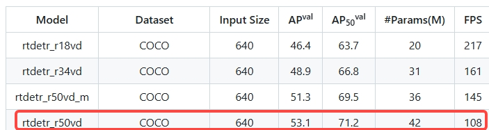

浮点复现精度（一致）：
<view type="1">

  <file token="Ne5VbCcSDouwM5xDFcacsQwgnNh" name="float_checkpoint0069.pth"/>

</view>

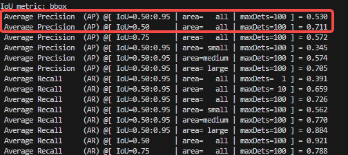


### 2.1.3 浮点模型改造 & Prepare
QAT选择建议的<text bgcolor="light-yellow">JIT_STRIP模式</text>，因此浮点改造只需插入QuantStub/DeQuantStub，其次就是明确模型量化部署范围，一个快速的方式是参考公版export_onnx脚本
```python
    class Model(nn.Module):
        def __init__(self, ) -> None:
            super().__init__()
            self.model = cfg.model.deploy()
            self.postprocessor = cfg.postprocessor.deploy()

        def forward(self, images, orig_target_sizes):
            outputs = self.model(images)
            outputs = self.postprocessor(outputs, orig_target_sizes) # 无需部署
            return outputs

    model = Model()

    data = torch.rand(1, 3, args.input_size, args.input_size)
    size = torch.tensor([[args.input_size, args.input_size]])
    _ = model(data, size)

    dynamic_axes = {
        'images': {0: 'N', },
        'orig_target_sizes': {0: 'N'}
    }

    torch.onnx.export(
        model,
        (data, size),
        args.output_file,
        input_names=['images', 'orig_target_sizes'],
        output_names=['labels', 'boxes', 'scores'],
        dynamic_axes=dynamic_axes,
        opset_version=16,
        verbose=False,
        do_constant_folding=True,
    )
```

对浮点模型进行QAT校准阶段的prepare
```plaintext
    cfg.model.load_state_dict(checkpoint, strict=True) # 先加载浮点权重
    class Model(nn.Module):
        def __init__(self, ) -> None:
            super().__init__()
            self.quant = QuantStub()
            self.model = cfg.model

        def forward(self, images):
            images = self.quant(images) # 对输入插入QuantStub
            outputs = self.model(images)
            return outputs # 输出DeQuantStub插入在Decoder模块中，便于控制模型输出算子

    float_model = Model()
    march = March.NASH_M
    set_march(march)

    float_model.eval() # 设置模型状态，避免training阶段的操作被trace而报错
    example_input = torch.rand(args.calib_batch_size, 3, args.input_size, args.input_size)
    calib_qconfig = (
        calibration_8bit_weight_16bit_act_qconfig_setter # QAT初始状态选择全int16模板
    )
    calib_model = prepare(
        model=copy.deepcopy(float_model),
        example_inputs=example_input,
        qconfig_setter=calib_qconfig,
        method=PrepareMethod.JIT_STRIP,
    )
```

### 2.1.4 分析model_check_result
在默认全int16模板下分析model_check_result信息，检查模型不合理结构：
1. 取消Bbox head的relu复用：`src/zoo/rtdetr/rtdetr_decoder.py`
无权重的简单算子复用，建议改掉；对于带权重的算子或整个module复用，视敏感度列表酌情改
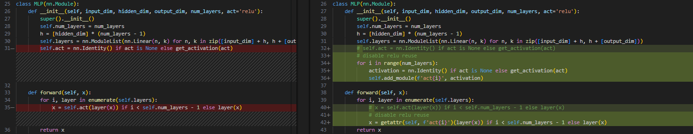

1. encoder输入的pos_embed需要手动量化：`src/zoo/rtdetr/hybrid_encoder.py`
model_check_result会提示存在mix precision input信息
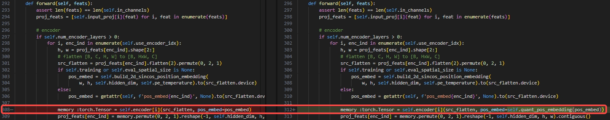

1. decoder输入的anchors需要手动量化：`src/zoo/rtdetr/rtdetr_decoder.py`
model_check_result会提示存在mix precision input信息


1. 替换backbone自定义的FrozenBatchNorm2d为nn.BatchNorm2d（否则不会和conv融合且出现单独的mul和add）：`configs/rtdetr/include/rtdetr_r50vd.yml`
BN没有融合，model_check_result会提示存在mix precision input信息
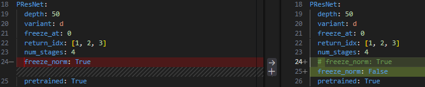


### 2.1.5 Calibration
<quote-container>
开始Calibration前先导出部署模型，验证算子后端和模型性能，见”部署导出“
</quote-container>

#### 2.1.5.1 全int16：
小成本bs 16，10 steps校准下模型精度为0：
1. 首先排查链路问题，取消伪量化后精度和浮点一致，排除链路问题
```python
        calib_checkpoint = torch.load(os.path.join("checkpoints", f"calib-checkpoint-{args.steps}.ckpt"), map_location=args.device)
        calib_model.load_state_dict(calib_checkpoint, strict=True)
        # set_fake_quantize(calib_model, FakeQuantState.VALIDATION)
        set_fake_quantize(calib_model, FakeQuantState._FLOAT)
        evaluate_calib(calib_model.to(torch.device(args.device)), cfg, args, val_dataloader)
```

1. 适配Debug工具，分析敏感算子
  1. encoder输入的pos_embed需要手动量化：`src/zoo/rtdetr/hybrid_encoder.py`
  

  值域[-1, 1]，给定fix_scale，统计量也可反映
  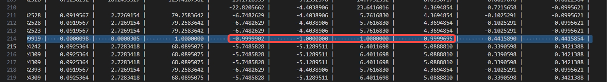

  1. decoder输入的anchors需要手动量化（anchors前处理放在模型外）：`src/zoo/rtdetr/rtdetr_decoder.py`
  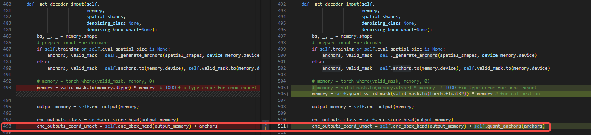

  避免anchors计算中的inf值，mask掉的无效锚点替换inf为100：
  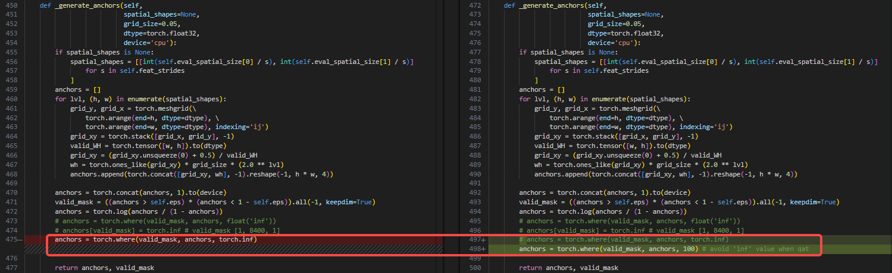

  同时指定quant_anchors和anchors_add为int16的fix_scale<text bgcolor="light-yellow">（需要通过identity解决sumin的回退）</text>：
  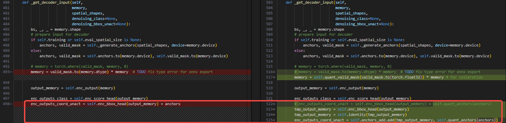

  1. bbox输出的sigmoid相关操作放到后处理（linear层高精度输出），<text bgcolor="light-yellow">debug时带上</text>：`src/zoo/rtdetr/rtdetr_decoder.py`
  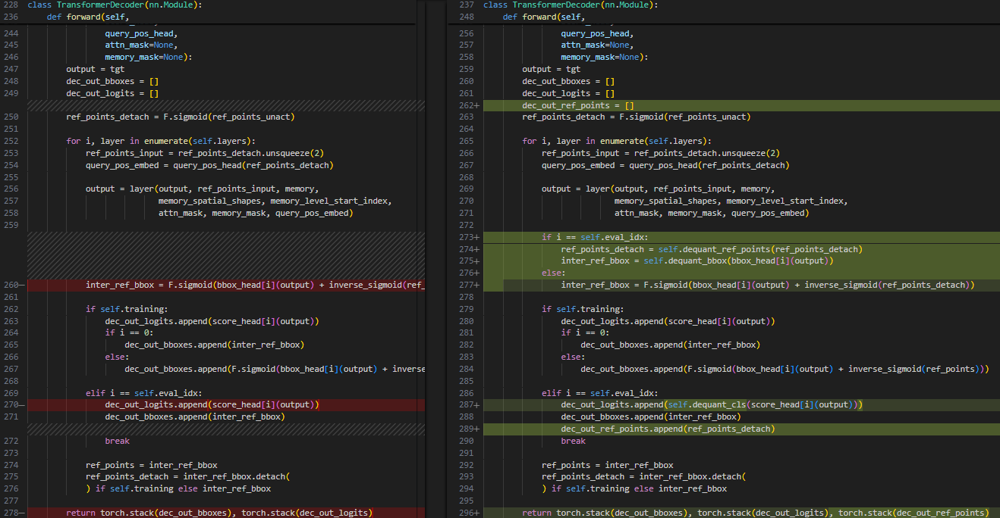

  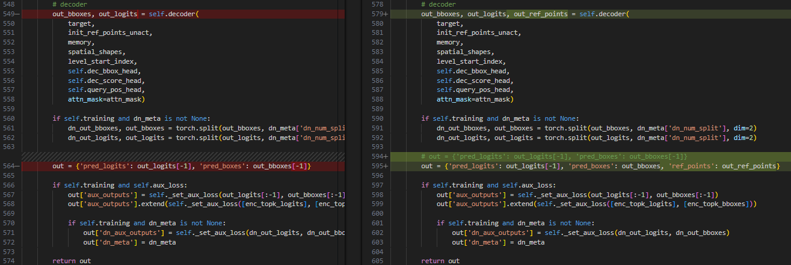

  `src/zoo/rtdetr/rtdetr_postprocessor.py`
  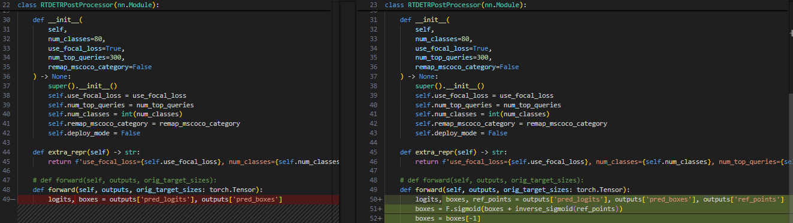

  1. 将敏感度top2的`model.backbone.conv1.conv1_1.conv`和`model.backbone.conv1.conv1_2.conv`由激活int16改为权重int16，指标有微小提升，进一步可修改为权重激活双int16
  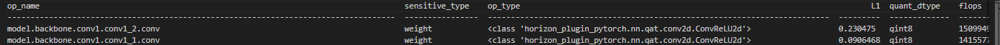

全int16量化配置：
```plaintext
    module_name_qconfig = {
        "quant": QConfig(
            output=FakeQuantize.with_args(
                observer=FixedScaleObserver,
                dtype=qint8,
                scale=1 / QINT8_MAX,
            )
        ),
        "model.backbone.conv1.conv1_1.conv": QConfig(
            weight=FakeQuantize.with_args(
                observer=MinMaxObserver,
                averaging_constant=0.01,
                dtype=qint16,
                qscheme=torch.per_channel_symmetric,
                ch_axis=0,
            ),
            output=FakeQuantize.with_args(
                observer=MSEObserver,
                dtype=qint8,
                qscheme=torch.per_tensor_symmetric,
                ch_axis=-1,
            )
        ),
        "model.backbone.conv1.conv1_2.conv": QConfig(
            weight=FakeQuantize.with_args(
                observer=MinMaxObserver,
                averaging_constant=0.01,
                dtype=qint16,
                qscheme=torch.per_channel_symmetric,
                ch_axis=0,
            ),
            output=FakeQuantize.with_args(
                observer=MSEObserver,
                dtype=qint8,
                qscheme=torch.per_tensor_symmetric,
                ch_axis=-1,
            )
        ),
        "model.decoder.quant_anchors": QConfig(
            output=FakeQuantize.with_args(
                observer=FixedScaleObserver,
                dtype=qint16,
                scale=100 / QINT16_MAX,
            )
        ),
        "model.decoder.enc_bbox_head.layers.2": QConfig(
            weight=FakeQuantize.with_args(
                observer=MinMaxObserver,
                averaging_constant=0.01,
                dtype=qint8,
                qscheme=torch.per_channel_symmetric,
                ch_axis=0,
            ),
            output=FakeQuantize.with_args(
                observer=MSEObserver,
                dtype=qint16,
                qscheme=torch.per_tensor_symmetric,
                ch_axis=-1,
            )
        ),
        "model.decoder.anchors_add": QConfig(
            weight=FakeQuantize.with_args(
                observer=MinMaxObserver,
                averaging_constant=0.01,
                dtype=qint8,
                qscheme=torch.per_channel_symmetric,
                ch_axis=0,
            ),
            output=FakeQuantize.with_args(
                observer=FixedScaleObserver,
                dtype=qint16,
                scale=100 / QINT16_MAX,
            )
        ),
        "model.encoder.quant_pos_embedding": QConfig(
            output=FakeQuantize.with_args(
                observer=FixedScaleObserver,
                dtype=qint16,
                scale=1 / QINT16_MAX,
            )
        ),
    }
    calib_qconfig = (
        ModuleNameQconfigSetter(module_name_qconfig),
        calibration_8bit_weight_16bit_act_qconfig_setter
    )
```


#### 2.1.5.2 混合精度：
基于全int16配置，仅将全int16模板改为全int8模板，精度为0，通过Debug工具分析敏感度算子，增加int16配置
最简混合精度量化配置：
```plaintext
    module_name_qconfig = {
        "quant": QConfig(
            output=FakeQuantize.with_args(
                observer=FixedScaleObserver,
                dtype=qint8,
                scale=1 / QINT8_MAX,
            )
        ),
        "model.backbone.conv1.conv1_1.conv": QConfig(
            weight=FakeQuantize.with_args(
                observer=MinMaxObserver,
                averaging_constant=0.01,
                dtype=qint16,
                qscheme=torch.per_channel_symmetric,
                ch_axis=0,
            ),
            output=FakeQuantize.with_args(
                observer=MSEObserver,
                dtype=qint8,
                qscheme=torch.per_tensor_symmetric,
                ch_axis=-1,
            )
        ),
        "model.backbone.conv1.conv1_2.conv": QConfig(
            weight=FakeQuantize.with_args(
                observer=MinMaxObserver,
                averaging_constant=0.01,
                dtype=qint16,
                qscheme=torch.per_channel_symmetric,
                ch_axis=0,
            ),
            output=FakeQuantize.with_args(
                observer=MSEObserver,
                dtype=qint8,
                qscheme=torch.per_tensor_symmetric,
                ch_axis=-1,
            )
        ),
        "model.decoder.quant_anchors": QConfig(
            output=FakeQuantize.with_args(
                observer=FixedScaleObserver,
                dtype=qint16,
                scale=100 / QINT16_MAX,
            )
        ),
        "model.decoder.enc_bbox_head.layers.2": QConfig(
            weight=FakeQuantize.with_args(
                observer=MinMaxObserver,
                averaging_constant=0.01,
                dtype=qint8,
                qscheme=torch.per_channel_symmetric,
                ch_axis=0,
            ),
            output=FakeQuantize.with_args(
                observer=MSEObserver,
                dtype=qint16,
                qscheme=torch.per_tensor_symmetric,
                ch_axis=-1,
            )
        ),
        "model.decoder.anchors_add": QConfig(
            weight=FakeQuantize.with_args(
                observer=MinMaxObserver,
                averaging_constant=0.01,
                dtype=qint8,
                qscheme=torch.per_channel_symmetric,
                ch_axis=0,
            ),
            output=FakeQuantize.with_args(
                observer=FixedScaleObserver,
                dtype=qint16,
                scale=100 / QINT16_MAX,
            )
        ),
        "model.encoder.quant_pos_embedding": QConfig(
            output=FakeQuantize.with_args(
                observer=FixedScaleObserver,
                dtype=qint16,
                scale=1 / QINT16_MAX,
            )
        ),
        "model.decoder.decoder._generated_div_0.mul": QConfig(
            weight=FakeQuantize.with_args(
                observer=MinMaxObserver,
                averaging_constant=0.01,
                dtype=qint8,
                qscheme=torch.per_channel_symmetric,
                ch_axis=0,
            ),
            output=FakeQuantize.with_args(
                observer=MSEObserver,
                dtype=qint16,
                qscheme=torch.per_tensor_symmetric,
                ch_axis=-1,
            )
        ),
        "model.decoder.decoder._generated_div_1.mul": QConfig(
            weight=FakeQuantize.with_args(
                observer=MinMaxObserver,
                averaging_constant=0.01,
                dtype=qint8,
                qscheme=torch.per_channel_symmetric,
                ch_axis=0,
            ),
            output=FakeQuantize.with_args(
                observer=MSEObserver,
                dtype=qint16,
                qscheme=torch.per_tensor_symmetric,
                ch_axis=-1,
            )
        ),
        "model.decoder.decoder._generated_div_2.mul": QConfig(
            weight=FakeQuantize.with_args(
                observer=MinMaxObserver,
                averaging_constant=0.01,
                dtype=qint8,
                qscheme=torch.per_channel_symmetric,
                ch_axis=0,
            ),
            output=FakeQuantize.with_args(
                observer=MSEObserver,
                dtype=qint16,
                qscheme=torch.per_tensor_symmetric,
                ch_axis=-1,
            )
        ),
        "model.decoder.decoder._generated_div_3.mul": QConfig(
            weight=FakeQuantize.with_args(
                observer=MinMaxObserver,
                averaging_constant=0.01,
                dtype=qint8,
                qscheme=torch.per_channel_symmetric,
                ch_axis=0,
            ),
            output=FakeQuantize.with_args(
                observer=MSEObserver,
                dtype=qint16,
                qscheme=torch.per_tensor_symmetric,
                ch_axis=-1,
            )
        ),
        "model.decoder.decoder._generated_div_4.mul": QConfig(
            weight=FakeQuantize.with_args(
                observer=MinMaxObserver,
                averaging_constant=0.01,
                dtype=qint8,
                qscheme=torch.per_channel_symmetric,
                ch_axis=0,
            ),
            output=FakeQuantize.with_args(
                observer=MSEObserver,
                dtype=qint16,
                qscheme=torch.per_tensor_symmetric,
                ch_axis=-1,
            )
        ),
    }
    calib_qconfig = (
        ModuleNameQconfigSetter(module_name_qconfig),
        default_calibration_qconfig_setter,
    )
```


### 2.1.6 QAT

### 2.1.7 部署导出
提前导出验证发现模型存在cast、linear、mul、topk算子在cpu上，修改`src/zoo/rtdetr/rtdetr_decoder.py`：
1. bool类型tensor转浮点并量化
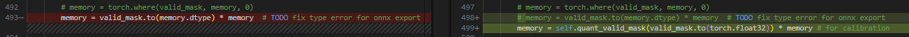

1. topk后的int64索引接gather，需手动cast
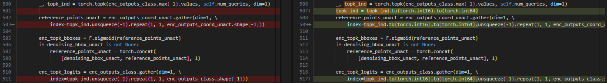

修改后算子统计如下（topk可以通过bpu spu吸收、qdq可删除）：
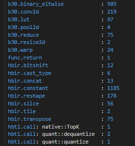


## 2.2 标志牌检测（客户A）：
<quote-container>
Sumin回退int8的精度问题（HAT中模型Prepare和部署导出相关内容参考案例-标志牌识别，基于老模板配置）
</quote-container>

### 2.2.1 Calibration
<sheet token="LFwPs9fBRhYyRxtQs0ucThGJnMb_PcYjiR"/>

全int8和全int16 Calib精度不达标（同时尝试了全int8和全int16 qat指标不理想，未继续精调QAT超参），首要Debug算子量化敏感度，Debug发现敏感算子基本为backbone & neck部分的sumin add，插Identity取消回退
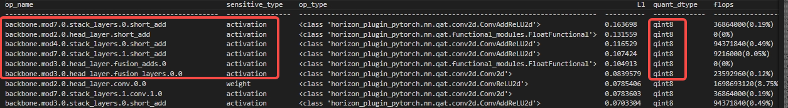

适配Debug工具时需移除后处理的TopK算子，因为后处理部分全为fp16 fakecast，也可直接去除后处理：
```python
quant_analysis_loader = copy.deepcopy(predict_loaders)
quant_analysis_loader = quant_analysis_loader[1]["loaders"]["traffic_sign_6049899"] # 选取精度不达标的数据集做Debug
analysis_model = copy.deepcopy(predict_model)
analysis_model["nodes"]["traffic_sign_head"]["postprocess"]["early_return"] = True # 为了移除后处理TopK算子
# analysis_model["nodes"]["traffic_sign_head"].pop("postprocess") # 或者去除后处理

quant_analysis_solver = dict(
    type="QuantAnalysis",
    model=analysis_model,
    device_id=0,
    dataloader=quant_analysis_loader,
    num_steps=100,
    baseline_model_convert_pipeline=float_model_convert_pipeline,
    analysis_model_convert_pipeline=calibration_predictor[
        "model_convert_pipeline"
    ],
    analysis_model_type="fake_quant",
    out_dir="tmp_output_/fsd_multitask/quant_analysis_6049899_5%"
)
```

拆sumin后5% int16 Calib，100 steps & bs 2即可达到精度要求，但性能较差，因此降低至2% int16，混合精度配置为：
```plaintext
module_name_qconfig = {
    "backbone.quant": QConfig( # 保证图像输入int8
        weight=FakeQuantize.with_args(
            observer=MinMaxObserver,
            averaging_constant=0.01,
            dtype=qint8,
            qscheme=torch.per_channel_symmetric,
            ch_axis=0,
        ),
        output=FakeQuantize.with_args(
            observer=MSEObserver,
            averaging_constant=0,
            dtype=qint8,
            qscheme=torch.per_tensor_symmetric,
            ch_axis=-1,
        ),
    ),
}
calib_qconfig_setter = (
    ModuleNameQconfigSetter(module_name_qconfig),
    sensitive_op_calibration_8bit_weight_16bit_act_qconfig_setter(reg_table_0, ratio=0.02),
    sensitive_op_calibration_8bit_weight_16bit_act_qconfig_setter(reg_table_1, ratio=0.02),
    sensitive_op_calibration_8bit_weight_16bit_act_qconfig_setter(reg_table_2, ratio=0.02),
    sensitive_op_calibration_8bit_weight_16bit_act_qconfig_setter(cls_table_0, ratio=0.02),
    sensitive_op_calibration_8bit_weight_16bit_act_qconfig_setter(cls_table_1, ratio=0.02),
    sensitive_op_calibration_8bit_weight_16bit_act_qconfig_setter(cls_table_2, ratio=0.02),
    sensitive_op_calibration_8bit_weight_16bit_act_qconfig_setter(ct_table_0, ratio=0.02),
    sensitive_op_calibration_8bit_weight_16bit_act_qconfig_setter(ct_table_1, ratio=0.02),
    sensitive_op_calibration_8bit_weight_16bit_act_qconfig_setter(ct_table_2, ratio=0.02),
    default_calibration_qconfig_setter,
)
```


### 2.2.2 QAT
<sheet token="LFwPs9fBRhYyRxtQs0ucThGJnMb_jbNFu5"/>

初始lr 1e-10 & wd 1e-5在全int8和全int16的QAT训练精度提升较小，始终无法波动到达标精度，检查浮点训练log，接近浮点结束的lr也只衰减至1e-6量级，wd不变
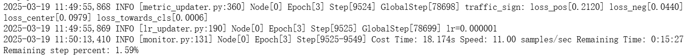

重新配置超参lr 1e-7 & wd 1e-5，实验在1134 steps精度波动达标（根据QAT log里loss来做ckpt初步筛选，loss并非越小越好，选择接近浮点最后loss结果的ckpt评测精度指标）
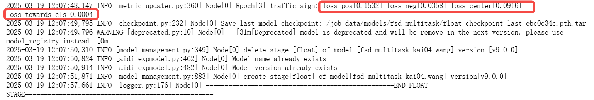


混合精度配置：
```python
qat_qconfig_setter = (
    ModuleNameQconfigSetter(module_name_qconfig),
    sensitive_op_qat_8bit_weight_16bit_act_qconfig_setter(reg_table_0, ratio=0.02),
    sensitive_op_qat_8bit_weight_16bit_act_qconfig_setter(reg_table_1, ratio=0.02),
    sensitive_op_qat_8bit_weight_16bit_act_qconfig_setter(reg_table_2, ratio=0.02),
    sensitive_op_qat_8bit_weight_16bit_act_qconfig_setter(cls_table_0, ratio=0.02),
    sensitive_op_qat_8bit_weight_16bit_act_qconfig_setter(cls_table_1, ratio=0.02),
    sensitive_op_qat_8bit_weight_16bit_act_qconfig_setter(cls_table_2, ratio=0.02),
    sensitive_op_qat_8bit_weight_16bit_act_qconfig_setter(ct_table_0, ratio=0.02),
    sensitive_op_qat_8bit_weight_16bit_act_qconfig_setter(ct_table_1, ratio=0.02),
    sensitive_op_qat_8bit_weight_16bit_act_qconfig_setter(ct_table_2, ratio=0.02),
    default_qat_qconfig_setter,
)
```


## 2.3 PV3D（客户A）：
<quote-container>
特殊qconfig配置介绍：head输出int32高精度不回退的int16配置（基于老模板配置）
</quote-container>

混合精度配置：
```python
ops_calib = dict()

ops_calib["backbone.quant"] = default_calib_8bit_fake_quant_qconfig
ops_calib["traffic_animal_head.head"] = default_calib_8bit_weight_16bit_act_fake_quant_qconfig
ops_calib["traffic_cone_head.head"] = default_calib_8bit_weight_16bit_act_fake_quant_qconfig
cali_qconfig_setter = (
    TemplateQconfigSetter(
        default_calib_8bit_fake_quant_qconfig,
        [
            HighPrecisionOutputTemplate(),
        ]
    ),
    ModuleNameQconfigSetter(ops_calib),
    default_calibration_qconfig_setter
)
```


## 2.4 静态感知：
### 2.4.1 客户B
<quote-container>
车道线弯折等静态检测badcase精度调优
</quote-container>

#### 2.4.1.1 Badcase现象
Calibration和QAT均出现车道线可视化弯折现象，浮点无此现象，且现有量化指标良好无法反映此现象
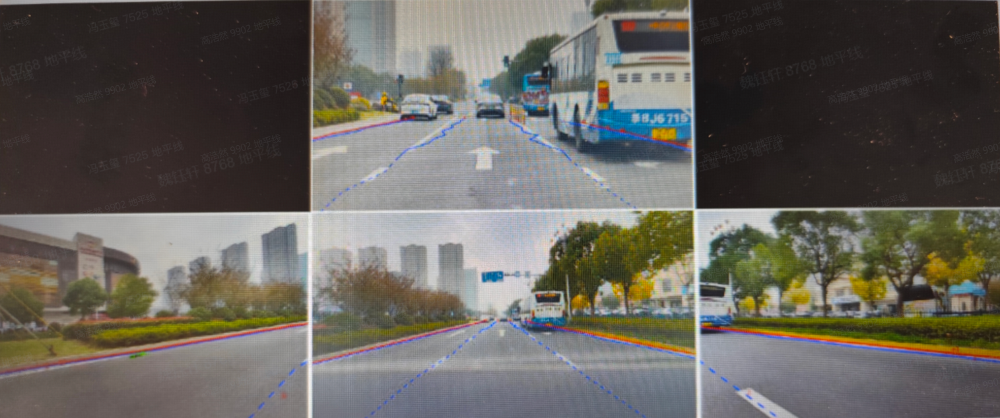

#### 2.4.1.2 Badcase调优
**Step1：**定位Calibration阶段复现问题，出问题的可视化直接跑Debug工具，对应修改
1. 使用精度上限双int16模板
1. decoder中linear层改写wx+b实现权重int16<text bgcolor="light-yellow">（</text><text bgcolor="light-yellow">**现直接支持配置权重int16**</text><text bgcolor="light-yellow">）</text>
1. head中mul/sum使用fix_scale
解决弯折问题，出现新问题：车道线横向偏移
**Step2：**QAT训练解决车道线横向偏移过程中重新出现弯折问题，对QAT模型分段量化定位到<text bgcolor="light-yellow">**辅助头量化引入较大量化**</text>**误差**，取消辅助头量化后同时解决车道线弯折和横向偏移问题
**Step3：**量化精度风险点解除，根据性能要求进行回退
1. 量化精度上回退int16比例
1. 结构上回退回原linear层
#### 2.4.1.3 总结

<lark-table rows="4" cols="2" header-row="true" column-widths="170,503">

  <lark-tr>
    <lark-td>
      步骤
    </lark-td>
    <lark-td>
      说明
    </lark-td>
  </lark-tr>
  <lark-tr>
    <lark-td>
      step1：使用w16a16模版
    </lark-td>
    <lark-td>
      1. 有效：继续step2
      1. 无效：
        1. 根据敏感度表，设置fix scale
        1. 替换低精度算子为高精度实现
    </lark-td>
  </lark-tr>
  <lark-tr>
    <lark-td>
      step2：使用w8a16模版
    </lark-td>
    <lark-td>
      1. 有效：继续step3
      1. 无效：
        1. 可能部分算子需要设置w16，根据敏感度表检查设置
    </lark-td>
  </lark-tr>
  <lark-tr>
    <lark-td>
      step3：进一步压缩耗时
    </lark-td>
    <lark-td>
      1. 使用w8a16模版，分模块回退int8，可以从backbone，neck开始进行回退，因为它们一般不敏感，同时结合敏感度表，对部分op手动设置激活int16
      1. 使用w8a8模版，根据敏感度表，按照topk的比例自动配置
    </lark-td>
  </lark-tr>
</lark-table>

1. 精度debug工具，定位到敏感算子，高精度无法解决的问题，往往需要对敏感算子进行fix_scale配置或者改写调整
1. 对于实际部署没有使用的结构，量化上需要谨慎（例如此案例的辅助头）；算子选择上，选择BPU支持的算子以保证模型可导出部署
1. 针对Badcase现象，设计增加评价指标

# 3 调优案例集锦（浮点混合精度）：
## 3.1 红绿灯检测（客户A）：
<quote-container>
浮点精度下数值范围超限场景
</quote-container>

红绿灯检测，除norm.mul出现nan之外，有个mul的敏感度最高，且数值断层领先。查看统计量可以发现是输出范围很大，在fp16精度下都产生截断误差：
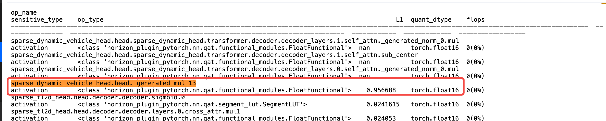

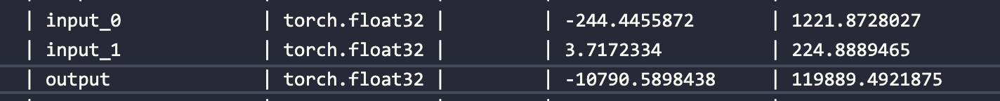

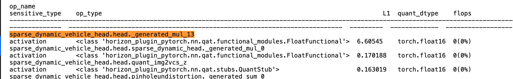

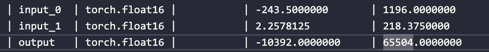

**调优方式：**
1. 放缩，mul -> matmul -> add结构
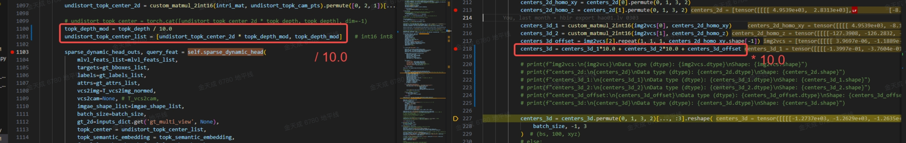

mul的操作数除10来降低数值范围，做完matmul和add后再乘10恢复到原来的单位尺度下
1. 在matmul之前插入norm层对数据做归一化
**总结：**

<lark-table rows="5" cols="3" column-widths="122,338,350">

  <lark-tr>
    <lark-td>
      **方案**
    </lark-td>
    <lark-td>
      **优点**
    </lark-td>
    <lark-td>
      **缺点**
    </lark-td>
  </lark-tr>
  <lark-tr>
    <lark-td>
      直接手动 clip（仅数值范围超限）
    </lark-td>
    <lark-td>
      1. 简单有效
    </lark-td>
    <lark-td>
      1. 适用范围有限（grid 范围，sum 等）
    </lark-td>
  </lark-tr>
  <lark-tr>
    <lark-td>
      使用 FP32
    </lark-td>
    <lark-td>
      1. 直接有效
      1. 方便流程自动化
    </lark-td>
    <lark-td>
      1. 当前算子的输入输出都需要 FP32，bpu支持的算子范围小
      1. 最坏情况下，需要设置多个连续的 FP32 算子，量化模型性能存在风险
    </lark-td>
  </lark-tr>
  <lark-tr>
    <lark-td>
      回退 int16
    </lark-td>
    <lark-td>
      1. 在某些值域范围内，表示精度高于 FP16
    </lark-td>
    <lark-td>
      1. 存在 INT16 和 FP16 交错出现的情况，会出现较多 quant/dequant，存在性能风险
      1. 出现截断时，需要手动设置固定 scale
    </lark-td>
  </lark-tr>
  <lark-tr>
    <lark-td>
      放缩
    </lark-td>
    <lark-td>
      1. 性能优于 FP32
    </lark-td>
    <lark-td>
      1. 需要手动修改模型结构，难以自动化
      1. 仅适用线性变化
    </lark-td>
  </lark-tr>
</lark-table>


# 4 调优技巧：
## 4.1 分步量化：
1. 下面这种方式仅适用于 Calib 阶段，QAT 阶段因为模型已经适应了量化误差，关闭伪量化精度无法保证
```plaintext
from horizon_plugin_pytorch.utils.quant_switch import GlobalFakeQuantSwitch             # 使能 int 算子状态
from horizon_plugin_pytorch.quantization.fake_cast import FakeCast                      # 使能 fp16 算子状态
class Model(nn.Module):
    def _init_(...):
    def forward(self, x):
        x = self.quant(x)
        x = self.backbone(x)
        x = self.neck(x)
        GlobalFakeQuantSwitch.disable() # 使伪量化失效
        FakeCast.disable()              # 关闭 fake cast
        # --------- float32 ---------
        x = self.head(x)
        # ---------------------------
        GlobalFakeQuantSwitch.enable() # 重新打开伪量化
        FakeCast.enable()               # 打开 fake cast
        return self.dequant(x)
```


## 4.2 部分层冻结下的QAT训练
模型 QAT 训练时，要求模型为 train() 状态，此时若部分层冻结，则需要对应修改状态，参考代码如下：
```plaintext
from horizon_plugin_pytorch.quantization import (
    QuantStub,
    prepare,
    set_fake_quantize,
    FakeQuantState,
)

qat_model = prepare(model, example_inputs=xxx, qconfig_setter=(xxx))
qat_model.load_state_dict("calib_model_ckpt.pth")

qat_model.train()
# 关闭requires_grad可固定权重不更新，但Drop、BN仍然会更新
for param in qat_model.backbone.parameters():
    param.requires_grad = False
# 配置eval()可固定Drop、BN不更新，但不会固定权重，因此两者需要配合使用
qat_model.backbone.eval()
set_fake_quantize(qat_model.backbone, FakeQuantState.VALIDATION)

#配置head的FakeQuant为QAT状态
set_fake_quantize(qat_model.head, FakeQuantState.QAT)
```


## 4.3 Calib/QAT过程NaN值定位
修改`horizon_plugin_pytorch/quantization/fake_quantize_base.py`中`check_nan_scale="forward"`，出现NaN值会在calib/qat forward过程中报错，有助于定位到具体的算子。常见的可能出现NaN值的结构：
1. Multi-head Attention的attn mask，需要手动做数值的clamp
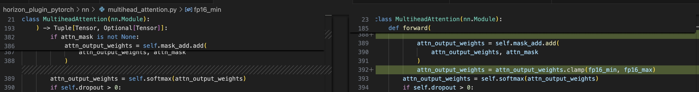


