摘要：整理 ScatterND、Inverse Sigmoid、Matmul、GridSample 等常见部署问题的优化思路与替换方案。

<callout emoji="bulb" background-color="light-red" border-color="light-red">
社区更新URL：[【地平线J6工具链进阶教程】算子优化方案集锦](https://developer.horizon.auto/blog/13133)
</callout>

## 0.1 scatternd的产生和消除
<text bgcolor="light-yellow">ScatterND 由 slice 之后 inplace 进行运算</text>，因此会引入CPU算子。若导出的onnx中均存在大量 ScatterND，希望从算法侧进行移除， 等价替换相关操作即可。以下给出几种使用场景：
场景1：
生成带有ScatterND的代码与onnx模型结构
```python {wrap}
# dummy code to generate ScatterND
import torch
from torch import nn

class DummyModel(nn.Module):
    def __init__(self):
        super().__init__()


    def forward(self, x):
        x[:, :2] = x[:, :2].sigmoid()
        return x

    # 优化版本
    def forward(self, x):
        tmp1 = x[:, :2]
        tmp2 = x[:, 2:]
        tmp1 = tmp1.sigmoid()
        return torch.cat([tmp1, tmp2], dim=1

x = torch.rand(1, 20, 100, 100)
model = DummyModel()

torch.onnx.export(
    model,
    x,
    'dummy.onnx',
    opset_version=11
)
```

<grid cols="2">
  <column width="46">
    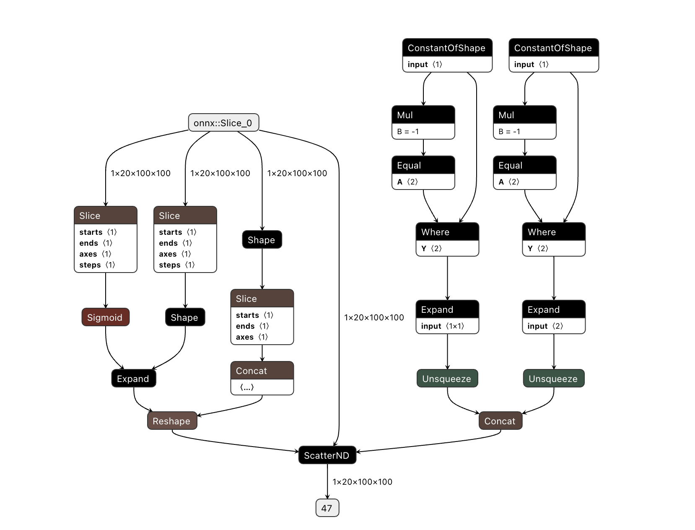

  </column>
  <column width="53">
    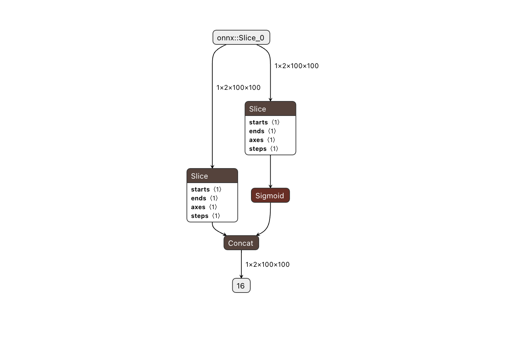

  </column>
</grid>

场景2：
修改前onnx中带有ScatterND算子的代码示例
```python {wrap}
###### 修改前onnx中带有ScatterND算子的代码 ######
block_warp_offset = torch.clone(
    offset[
        :,
        pad_u : self.height - pad_b,
        pad_l : self.width - pad_r,
        :,
    ]
)
block_warp_offset[:, :, :, 0] += pad_l
block_warp_offset[:, :, :, 1] += pad_u

# 优化版本
a = block_warp_offset[:, :, :, :1] + pad_l
b = block_warp_offset[:, :, :, 1:2] + pad_u
block_warp_offset = torch.concat((a, b), dim=3)
```

场景3：
如下代码会引入scatterND
```python
# intri_mat shape为(1,4,4,4), intrinsic shape为(1,4,3,3)
intri_mat = torch.eye(4).unsqueeze(0).repeat(1, 4, 1, 1)
intri_mat[:, :, :3, :3] = intrinsic
```

修改与验证代码如下：
```python
import torch
from torch import nn

class DummyModel(nn.Module):
    def __init__(self):
        super().__init__()

    def forward(self, intri_mat,intrinsic):
        ## ============方案1 wyx=============
        # tmp1 = intri_mat[:, :, :3, :3]
        # tmp1 = intrinsic
        # tmp2 = intri_mat[:, :, 3:, :3]
        # intri_mat1 = torch.concat([tmp1, tmp2], dim=2)
        # tmp3 = intri_mat[:, :, :, 3:]
        # intri_mat_new = torch.concat([intri_mat1, tmp3], dim=3)
        ## ===========方案2 kjj===============
        tmp0, tmp1 = torch.split(intri_mat, [3,intri_mat.shape[-1] - 3], dim=-1)
        tmp0_0, tmp0_1 = torch.split(tmp0, [3,tmp0.shape[-2] - 3], dim=-2)
        tmp0_0 = intrinsic
        tmp0 = torch.cat([tmp0_0, tmp0_1], dim=-2)
        intri_mat_new = torch.cat([tmp0, tmp1], dim=-1)
        return intri_mat_new

# x = torch.eye(4).unsqueeze(0).repeat(1, 4, 1, 1)
intri_mat = torch.eye(4).unsqueeze(0).repeat(1, 4, 1, 1)
intrinsic = torch.randn(1, 4, 3, 3)
model = DummyModel()
out = model(intri_mat, intrinsic)

intri_mat[:, :, :3, :3] = intrinsic
print("intri_mat:", intri_mat)

are_equal = torch.equal(intri_mat, out)
print(are_equal)  # 输出: True

torch.onnx.export(
    model,
    (intri_mat,intrinsic),
    'intri_mat.onnx',
    opset_version=11
)
```

方案1与方案2思想一样
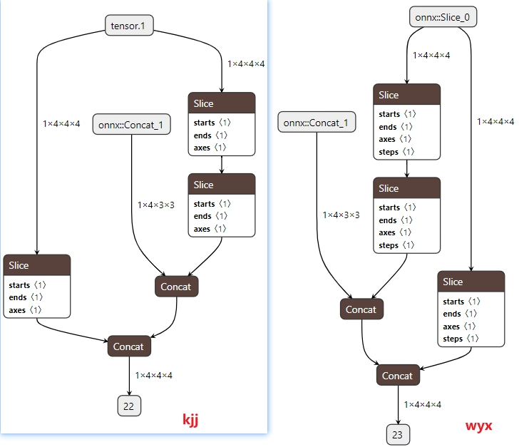

场景4：
原：
```python
key_points = self.scale_mul.mul(scale, self.exp.exp(anchor[1][..., None, 0:3])
rotation_mat[:, :, 0, 0] = anchor[2][:, :, 1] # cos
rotation_mat[:, :, 0, 1] = -anchor[2][:, :, 0] # sin
rotation_mat[:, :, 1, 0] = anchor[2][:, :, 0]
rotation mat[:. :, 1, 1] = anchor[2][:, :,1]
```

改为：
```plaintext
key_points = self.scale_mul.mul(scale, self.exp.exp(anchor[1][..., None, 0:3]))
temp_cos = anchor[2][:, :, 1]
temp_sin = anchor[2][:, :, 0]
temp_zeros = self.rotation_quant(temp_cos.new_zeros([bs, num_anchor]))
temp_ones = self.rotation_quant(temp_cos.new_ones([bs, num_anchor]))
temp1 = self.stack1.stack([temp_cos, -temp_sin, temp_zeros], dim=-1)
temp2 = self.stack2.stack([temp_sin, temp_cos, temp_zeros], dim=-1)
temp3 = self.stack3.stack([temp_zeros, temp_zeros, temp_ones], dim=-1)
rotation_mat = self.stack4.stack([temp1, temp2, temp3], dim=-2)

```

场景5：
Swin Transformer中为滑动注意力窗口计算对应的掩码值，不同区域做标识符区分
原：
```python
# calculate attention mask for SW-MSA
# +-----------+-----------+-----------+
# | Region 0  | Region 1  | Region 2  |
# +-----------+-----------+-----------+
# | Region 3  | Region 4  | Region 5  |
# +-----------+-----------+-----------+
# | Region 6  | Region 7  | Region 8  |
# +-----------+-----------+-----------+
img_mask = torch.zeros((1, H_pad, W_pad, 1), device=query.device)
h_slices = (
    slice(0, -self.window_size),
    slice(-self.window_size, -self.shift_size),
    slice(-self.shift_size, None),
)
w_slices = (
    slice(0, -self.window_size),
    slice(-self.window_size, -self.shift_size),
    slice(-self.shift_size, None),
)
cnt = 0
for h in h_slices:
    for w in w_slices:
        img_mask[:, h, w, :] = cnt
```

改：
主要思路，把对原tensor划区域的赋值方式修改为划区域的拼接，先对w维度进行拼接，再对h维度拼接
```python
cnt = 0
img_mask_patches = []
for h in [
    H_pad - self.window_size,
    self.window_size - self.shift_size,
    self.shift_size,
]:
    img_mask_patches.append([])
    for w in [
        W_pad - self.window_size,
        self.window_size - self.shift_size,
        self.shift_size,
    ]:
        img_mask_patches[-1].append(torch.ones([h, w]) * cnt)
        cnt += 1
img_mask = torch.cat(
    [torch.cat(x, dim=1) for x in img_mask_patches], dim=0
)
img_mask = (
    img_mask.unsqueeze(-1).unsqueeze(0).to(device=query.device)
)
```


## 0.2 Inverse_sigmoid 部署方案
Inverse sigmoid为sigmoid的反函数，把0-1的值映射回-inf ～ + inf，值域过大时容易出现bc导出掉点问题，若遇到此问题：
方式一：将segmentlut的参数从"curvature"改为"evenly"。
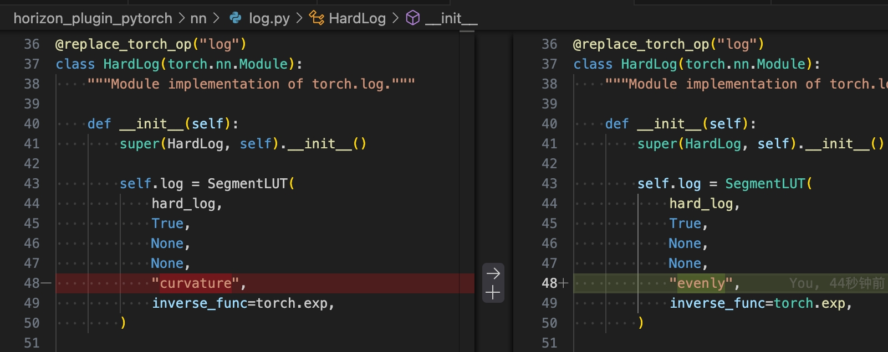

方式二：算法上去除Inverse sigmoid算子（需重训，此方案需要验证对浮点的影响）。可参考算法bevformer的decoder:
<grid cols="2">
  <column width="49">
    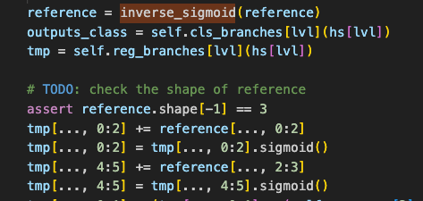

  </column>
  <column width="50">
    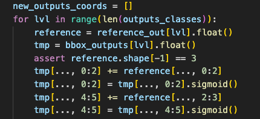

  </column>
</grid>

为表示更加精确，可以对sigmoid的输入做clamp：
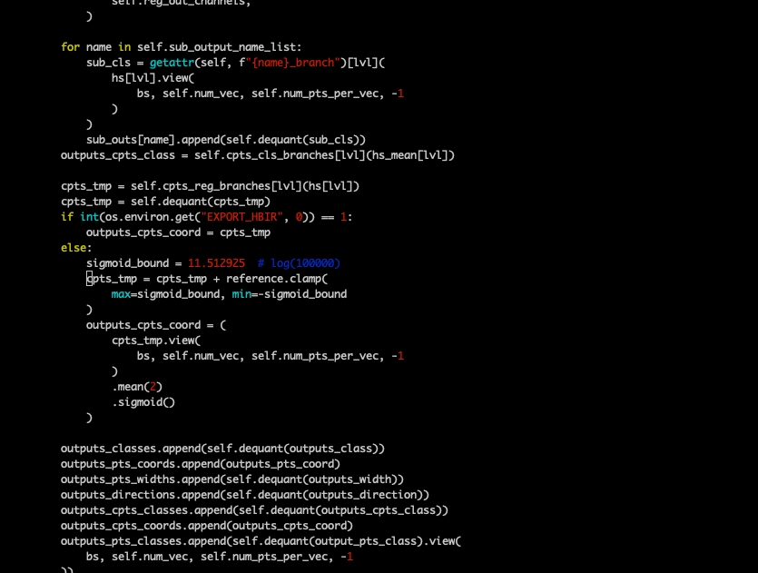

<quote-container>
注意：此示例中为提高torch qat精度，将+ reference 放在了cpu，若torch qat并不存在精度问题可以放在bpu中。
</quote-container>

## 0.3 Matmul 高精度
<text bgcolor="light-yellow">OE3.2.0</text><text bgcolor="light-yellow">前matmul不支持双int16的量化</text>，当客户存在matmul 量化问题时可以通过对矩阵做拆分来降低int8的损失：
拆分思路：A*(B+C)=A*B+A*C，B为原scale能表示的int8的最大部分，C为剩余部分。
```python {wrap}
self.mod = MAX(T_mat) / 128 # MAX-max absolute value
T_mat_high = torch.trunc(torch.div(T_mat, self.mod)) * self.mod
T_mat_low = torch.fmod(T_mat, self.mod)
T_mat_high = self.quant_high(T_mat_high) # int8, fixed-scale with scale==self.mod
T_mat_low = self.quant_low(T_mat_low) # int8, no need fixed-scale
sample_points_pv = torch.matmul(sample_points, T_mat_high) + torch.matmul(sample_points, T_mat_low)
```


若要工具自动拆分，需要保证OE包版本为3.5.0及以上，并且使用新版本的qconfig，可以通过以下方式开启工具的自动拆分：
<text bgcolor="light-yellow">OE 3.5.0 已经支持GEMM类算子(Conv/Linear/Matmul)双int16的量化</text>，如需要双int16输入则配置两个输入为int16量化即可。
若使用时存在CPU的bitshift或add时，可以开启VPU使其运行到VPU中，若不需要VPU或双int16存在性能问题时则可以通过修改plugin源码方式自动做拆分，需要将红框后面的减法去掉：


<quote-container>
<text bgcolor="light-yellow">注：该方式为int15量化，编译器自动拆分为int16</text>
</quote-container>

<grid cols="2">
  <column width="46">
    

  </column>
  <column width="53">
    

  </column>
</grid>

## 0.4 gridsample拆分
由于BPU采用定点数值计算，grid_sample 算子在处理较大的W维度时，受限于硬件位宽精度，量化后的数值无法精确表示原始网格坐标，导致nearest （最近邻）和bilinear （双线性插值）两种采样方式均引入一定的精度误差。
解决方式为H、W维度都不能超过4096，若超过则在超出的维度上拆为多个gridsample。
示例：
```plaintext
class OriGridSample(nn.Module):
    def __init__(self):
        super(OriGridSample, self).__init__()
        self.unitconv = nn.Conv2d(1, 1, (1, 1))
        nn.init.constant_(self.unitconv.weight, 1)
        nn.init.constant_(self.unitconv.bias, 0)
        self.gridsample = hnn.GridSample(
            mode='bilinear',
            padding_mode='zeros',
            align_corners=True,
        )
        self.quant1 = QuantStub()
        self.quant2 = QuantStub()
        self.dequant = DeQuantStub()

    def forward(self, featuremap, grid):
        featuremap = self.unitconv(featuremap)
        res = self.gridsample(featuremap, grid)
        return res
```

拆分后：
```plaintext
class SplitGridSample(nn.Module):
    def __init__(self):
        super(SplitGridSample, self).__init__()
        self.unitconv = nn.Conv2d(1, 1, (1, 1))
        nn.init.constant_(self.unitconv.weight, 1)
        nn.init.constant_(self.unitconv.bias, 0)
        self.gridsample1 = hnn.GridSample(
            mode='bilinear',
            padding_mode='zeros',
            align_corners=True,
        )
        self.gridsample2 = hnn.GridSample(
            mode='bilinear',
            padding_mode='zeros',
            align_corners=True,
        )
        self.gridsample3 = hnn.GridSample(
            mode='bilinear',
            padding_mode='zeros',
            align_corners=True,
        )
        self.gridsample4 = hnn.GridSample(
            mode='bilinear',
            padding_mode='zeros',
            align_corners=True,
        )

    def forward(self, featuremap, grid):
        featuremap = self.unitconv(featuremap)
        B, C, H, W = featuremap.shape[0], featuremap.shape[1], featuremap.shape[2], featuremap.shape[3]
        h_offset = H // 2
        w_offset = W // 2

        feat00 = featuremap[:, :, :h_offset, :w_offset]
        feat01 = featuremap[:, :, h_offset:, :w_offset]
        feat10 = featuremap[:, :, :h_offset, w_offset:]
        feat11 = featuremap[:, :, h_offset:, w_offset:]

        feat01_grid_x = grid[:, :, :, 0:1] - w_offset
        feat01_grid_y = grid[:, :, :, 1:]
        feat01_grid = torch.cat([feat01_grid_x, feat01_grid_y], dim=3)

        feat10_grid_x = grid[:, :, :, 0:1]
        feat10_grid_y = grid[:, :, :, 1:] - h_offset
        feat10_grid = torch.cat([feat10_grid_x, feat10_grid_y], dim=3)

        feat11_grid_x = grid[:, :, :, 0:1] - w_offset
        feat11_grid_y = grid[:, :, :, 1:] - h_offset
        feat11_grid = torch.cat([feat11_grid_x, feat11_grid_y], dim=3)

        tmp1 = self.gridsample1(feat00, grid)
        tmp2 = self.gridsample2(feat01, feat01_grid)
        tmp3 = self.gridsample3(feat10, feat10_grid)
        tmp4 = self.gridsample4(feat11, feat11_grid)

        res = tmp1 + tmp2 + tmp3 + tmp4
        return res
```

## 0.5 Resize/Interplote
resize/interplote 为上采样操作，目前对这两个算子仅支持Int8量化，会导致前一个op只能int8输出，若存在量化精度问题，可以考虑使用反卷积替换，反卷积可以支持双int16，对量化精度更友好，性能可能会变差。
上采样：nn.PixelShuffle       下采样：nn.PixelUnshuffle
## 0.6 Weight高低位拆分（工具已支持）
在用户不重训浮点的情况下，量化训练前需要对用户的浮点ckpt 部分linear weight 进行高低位拆分：
model拆分：
```plaintext
#=============== 用户原 model =============
self.enc_bbox_head = MLP(hd, hd, 4, num_layers=3)
class MLP(nn.Module):
    """Very simple multi-layer perceptron (also called FFN)"""

    def __init__(self, input_dim, hidden_dim, output_dim, num_layers):
        super().__init__()
        self.num_layers = num_layers
        h = [hidden_dim] * (num_layers - 1)
        self.layers = nn.ModuleList(
            nn.Linear(n, k) for n, k in zip([input_dim] + h, h + [output_dim])
        )

    def forward(self, x):
        for i, layer in enumerate(self.layers):
            x = F.relu(layer(x)) if i < self.num_layers - 1 else layer(x)
        return x

#=============== 工具链拆分weight后的 model =============
self.enc_bbox_head = MLP_OPT(hd, hd, 4, num_layers=3)
class MLP_OPT(nn.Module):
    """Very simple multi-layer perceptron (also called FFN)"""

    def __init__(self, input_dim, hidden_dim, output_dim, num_layers):
        super().__init__()
        self.num_layers = num_layers
        h = [hidden_dim] * (num_layers - 1)
        self.layers = nn.ModuleList(
            nn.Linear(n, k) for n, k in zip([input_dim] + h, h + [output_dim])
        )
        self.identity = nn.Identity()
        self.layer_out1 = nn.ModuleList(nn.Linear(n, k) for n, k in zip([input_dim] + h, h + [output_dim]))
        self.layer_out2 = nn.ModuleList(nn.Linear(n, k, bias=False) for n, k in zip([input_dim] + h, h + [output_dim]))

    def forward(self, x):
        for i, layer in enumerate(self.layers): # x: torch.Size([2, 23040, 256])
            # x = F.relu(layer(x)) if i < self.num_layers - 1 else layer(x)
            if i < self.num_layers - 2:
                x = layer(x)
                x = self.identity(x)
            else:
                x1 = self.layer_out1[i](x)
                x2 = self.layer_out2[i](x)
                x = self.identity(x1) + self.identity(x2)

            if i < self.num_layers - 1:
                x = F.relu(x)
        return x
```

Ckpt weight拆分：
```plaintext
def update_state_dict_task(state_dict, input_sequence_length=None):
    state_dict_new = copy.deepcopy(state_dict)
    state_dict_new["sparse_dynamic_vehicle_head.head.sparse_dynamic_head.transformer.decoder.norm1_1.weight"] = copy.deepcopy(state_dict["sparse_dynamic_vehicle_head.head.sparse_dynamic_head.transformer.decoder.norm1.weight"])
    state_dict_new["sparse_dynamic_vehicle_head.head.sparse_dynamic_head.transformer.decoder.norm1_1.bias"] = copy.deepcopy(state_dict["sparse_dynamic_vehicle_head.head.sparse_dynamic_head.transformer.decoder.norm1.bias"])

    for k, v in state_dict.items():

        if "sparse_tl2d_head." in k:
            params = copy.deepcopy(v)
            new_key = k.replace("sparse_tl2d_head", "traffic_light_head")
            state_dict_new[new_key] = copy.deepcopy(params)
        if "sparse_tl2d_side_head." in k:
            params = copy.deepcopy(v)
            new_key = k.replace("sparse_tl2d_side_head", "traffic_light__side_head")
            state_dict_new[new_key] = copy.deepcopy(params)

    state_dict_new_stage2 = copy.deepcopy(state_dict_new)

    for k, v in state_dict_new_stage2.items():
        if "decoder.decoder_layer." in k:
            # print("==================================")
            params = state_dict_new.pop(k)
            for i in range(4):
                new_key = k.replace("decoder_layer", f"decoder_layers.{i}")
                state_dict_new[new_key] = copy.deepcopy(params)
        if ".query_pos_head." in k:
            # print("==================================")
            params = state_dict_new[k]
            for i in range(6):
                new_key = k.replace("query_pos_head", f"decoder.query_pos_head.{i}")
                state_dict_new[new_key] = copy.deepcopy(params)

        for i in range(3):
            max_value = 5.0
            if i == 1:
                max_value = 3.0

            if f"traffic_light_head.head.decoder.enc_bbox_head.layers.{i}.weight" in k:
                mode = max_value/ 127
                params = state_dict_new[k]
                high_bit_params = torch.trunc(torch.div(params, mode)) * mode
                low_bit_params = torch.fmod(params, mode)
                k1 = k.replace(f"layers.{i}.weight", f"layer_out1.{i}.weight")
                state_dict_new[k1] = copy.deepcopy(high_bit_params)
                k2 = k.replace(f"layers.{i}.weight", f"layer_out2.{i}.weight")
                state_dict_new[k2] = copy.deepcopy(low_bit_params)
```


若要工具自动拆分，需要保证OE包版本为3.5.0及以上，并且使用新版本的qconfig，可以通过以下方式开启工具的自动拆分：
OE 3.5.0 已经支持GEMM类算子(Conv/Linear/Matmul)双int16的量化，如需要双int16输入则配置两个输入为int16量化即可。
若使用时存在CPU的bitshift或add时，可以开启VPU使其运行到VPU中，若不需要VPU或双int16存在性能问题时则可以通过修改plugin源码方式自动做拆分，需要将红框后面的减法去掉：
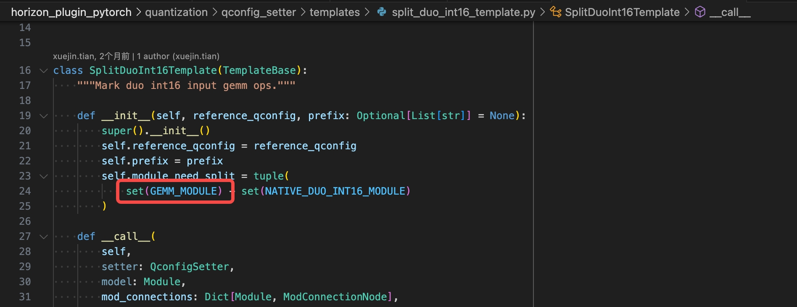

<quote-container>
注：该方式为int15量化，编译器自动拆分为int16
</quote-container>

<grid cols="2">
  <column width="46">
    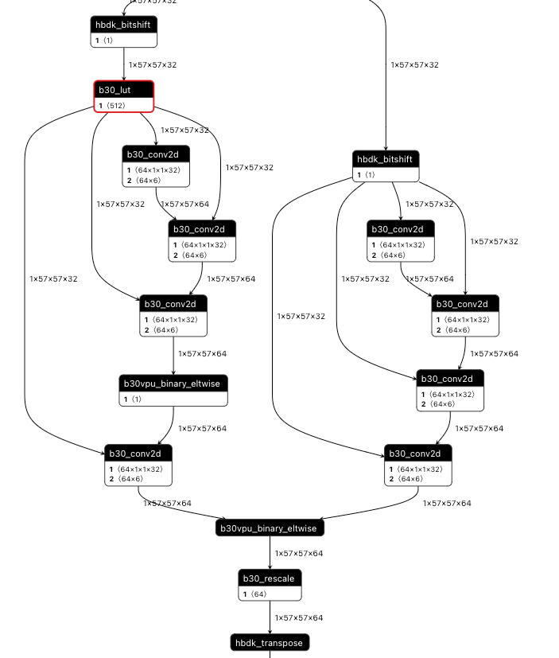

  </column>
  <column width="53">
    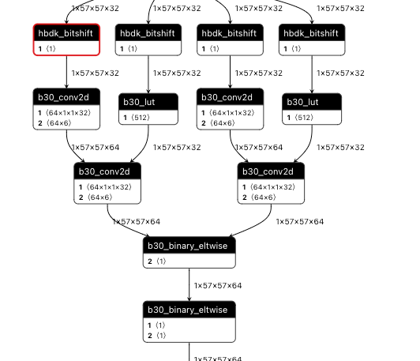

  </column>
</grid>

## 0.7 Topk算子
工具链OE3.2.0已支持topk算子在SPU上运行，在convert时配置<text bgcolor="light-yellow">enable_spu=True</text>后算子将会被指定在SPU上运行。若topk算子后接的gather、index算子出现CPU的cast算子时，建议将OE版本升级到OE-3.5.0(或者将hbdk升级到4.5.5及以上版本)。
## 0.8 Argmax后cast消除
argmax输出的idx为int64类型，若不做改动会导致引入CPU算子，可以将idx 的类型转为int8/int16（视数值范围而定避免溢出）避免引入的开销，参考下图：
```python
        x=x.argmax(dim=1, keepdim=True).to(torch.int8)#.to(torch.int16)
        x = self.dequant(x)
```

<grid cols="3">
  <column width="34">
    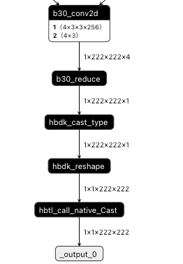

  </column>
  <column width="40">
    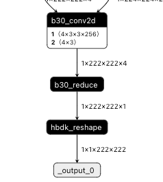

  </column>
  <column width="25">
    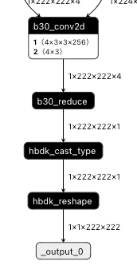

  </column>
</grid>


## 0.9 多个eltwise操作效率提升
当多个大尺寸的op做add时，若一次性add可能会引入带宽问题。若存在带宽问题，即load&store的时间大于计算时间，建议拆为逐个add相加，示例如下：
方式1:
```python
        homo_feats = []
        for i in range(12):
            homo_feat = self.grid_sample(
                feat,
                fpoints[i * B : (i + 1) * B],
            )

            homo_dfeat = self.dgrid_sample(
                dfeat,
                dpoints[i * B : (i + 1) * B],
            )
            homo_feat = self.floatFs.mul(homo_feat, homo_dfeat)
            homo_feats.append(homo_feat)
        trans_feat = torch.stack(homo_feats, dim=0)
        trans_feat=torch.sum(trans_feat,dim=0)
```

方式2:
```python
        for i in range(12):
            homo_feat = self.grid_sample(
                feat,
                fpoints[i * B : (i + 1) * B],
            )

            homo_dfeat = self.dgrid_sample(
                dfeat,
                dpoints[i * B : (i + 1) * B],
            )
            homo_feat = self.floatFs.mul(homo_feat, homo_dfeat)
            if i==0:
                trans_feat=homo_feat
            else:
                trans_feat=self.floatFs.add(trans_feat,homo_feat)
```

性能表现：
```plaintext
input = {
    "feat": torch.randn(size=(1, 80, 238, 60)).to(torch.device("cuda:0")),
    "dfeat": torch.randn(size=(1, 1, 1260, 2040)).to(torch.device("cuda:0")),
    "fpoints": torch.randn(size=(12, 64, 256, 2)).to(torch.device("cuda:0")),
    "dpoints": torch.randn(size=(12, 64, 256, 2)).to(torch.device("cuda:0")),
    }
```

方式1 ：3.267 ms
方式2：2.321 ms
时序图：
<grid cols="2">
  <column width="50">
    

  </column>
  <column width="49">
    

  </column>
</grid>

## 0.10 dyt替换layernorm
https://cloud.tencent.com/developer/article/2509912
论文：https://arxiv.org/abs/2503.10622
Dynamic Tanh(DyT)是由何恺明、Yarnn LeCun等研究者提出的新结构，用于替代Transformer中的归一化层(如LayerNorm)，原理简单，在于归一化层的input-output mapping曲线近似tanh函数，可以直接使用tanh函数来拟合线性归一化层的效果。其设计简单高效，仅需9行代码即可实现，展现出优于或持平传统归一化层的性能，不仅部署性能明显优于ln，训练速度也会有明显提升：
```python
class DyT(nn.Module):
    def __init__(self, num_features, alpha_init=0.5):
        super().__init__()
        self.alpha = nn.Parameter(torch.ones(1)*alpha_init)
        self.weight = nn.Parameter(torch.ones(num_features))
        self.bias = nn.Parameter(torch.zeros(num_features))
    def forward(self, x):
        x = torch.tanh(self.alpha * x)
        return x * self.weight + self.bias
```

对于transformer模型的J6部署，替换为dyt也是一个很高效的选择，<text bgcolor="light-yellow">layernorm会被拆分为8个算子，而dyt只有4个算子</text>，且避免了reducemean的计算（相对来说不是那么高效，且量化不友好），部署性能以及量化友好度都有提升。
<grid cols="2">
  <column width="40">
    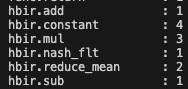

  </column>
  <column width="59">
    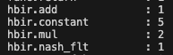

  </column>
</grid>


## 0.11 传统Attention 优化
论文：https://arxiv.org/pdf/2206.08898
Simple Softmax-free Attention（简称SimA）针对传统Transformer Self-Attention存在的主要问题，例如长序列任务的计算复杂度高；softmax指数运算导致的梯度爆炸或消失等，完全移除Softmax，<text bgcolor="light-yellow">采用线性相似度计算降低计算复杂度</text>，同时保持模型近似表达能力，在主流的ViT/NLP模型中取得相当或更好的模型精度同时，有效降低了部署推理的延时，同时减少了训练时间
```python
import torch
import torch.nn as nn
import torch.nn.functional as F

# 传统Attention
class Attention(nn.Module):
    """attention block
    """
    def __init__(self, embed_dim, num_heads=8, qkv_bias=False, attn_drop=0., proj_drop=0.):
        super().__init__()
        self.num_heads = num_heads

        self.q_attn = nn.Linear(embed_dim, embed_dim, bias=qkv_bias)
        self.k_attn = nn.Linear(embed_dim, embed_dim, bias=qkv_bias)
        self.v_attn = nn.Linear(embed_dim, embed_dim, bias=qkv_bias)

        self.attn_drop = nn.Dropout(attn_drop)
        self.proj = nn.Linear(embed_dim, embed_dim)
        self.proj_drop = nn.Dropout(proj_drop)

        self.scale = 1.0 / (embed_dim // self.num_heads) ** 0.5

    def forward(self, q, k, v):

        B, N, T, C = q.size()
        # calculate query, key, values for all heads
        q = self.q_attn(q)
        k = self.k_attn(k)
        v = self.v_attn(v)

        KN, KT, = k.shape[1:3]
        q = q.reshape(B, N, T, self.num_heads, C // self.num_heads).permute(0, 3, 1, 2, 4).reshape(B*self.num_heads, N, T, C // self.num_heads)
        k = k.reshape(B, KN, KT, self.num_heads, C // self.num_heads).permute(0, 3, 1, 2, 4).reshape(B*self.num_heads, KN, KT, C // self.num_heads)
        v = v.reshape(B, KN, KT, self.num_heads, C // self.num_heads).permute(0, 3, 1, 2, 4).reshape(B*self.num_heads, KN, KT, C // self.num_heads)


        att = (q @ k.transpose(-2, -1)) * self.scale
        att = F.softmax(att, dim=-1)
        att = self.attn_drop(att)
        x = (att @ v)
        x = x.reshape(B, self.num_heads, N, T, C // self.num_heads).permute(0, 2, 3, 1, 4).reshape(B, N, T, C)

        x = self.proj(x)
        x = self.proj_drop(x)
        return x

# SimA实现
class SimAttention(nn.Module):
    """ SimA attention block
    """
    def __init__(self, embed_dim, num_heads=8, qkv_bias=False, proj_drop=0.):
        super().__init__()
        self.num_heads = num_heads

        self.q_attn = nn.Linear(embed_dim, embed_dim, bias=qkv_bias)
        self.k_attn = nn.Linear(embed_dim, embed_dim, bias=qkv_bias)
        self.v_attn = nn.Linear(embed_dim, embed_dim, bias=qkv_bias)

        self.proj = nn.Linear(embed_dim, embed_dim)
        self.proj_drop = nn.Dropout(proj_drop)

    def forward(self, q, k, v, attn_mask=None):

        B, N, T, C = q.size()
        # calculate query, key, values for all heads
        q = self.q_attn(q)
        k = self.k_attn(k)
        v = self.v_attn(v)

        KN, KT = k.shape[1:3]
        q = q.reshape(B, N, T, self.num_heads, C // self.num_heads).permute(0, 3, 1, 2, 4).reshape(B*self.num_heads, N, T, C // self.num_heads)
        k = k.reshape(B, KN, KT, self.num_heads, C // self.num_heads).permute(0, 3, 1, 2, 4).reshape(B*self.num_heads, KN, KT, C // self.num_heads)
        v = v.reshape(B, KN, KT, self.num_heads, C // self.num_heads).permute(0, 3, 1, 2, 4).reshape(B*self.num_heads, KN, KT, C // self.num_heads)

        k = F.normalize(k, p=1.0, dim=-2) # 核心
        q = F.normalize(q, p=1.0, dim=-2) # 核心

        if attn_mask is None: # attn_mask这一参数在offical版本中不被考虑
            if T < (C // self.num_heads) :
                x = ((q @ k.transpose(-2, -1)) @ v)
                x = x.reshape(B, self.num_heads, N, T, C // self.num_heads).permute(0, 2, 3, 1, 4).reshape(B, N, T, C)
            else:
                x = (q @ (k.transpose(-2, -1) @ v))
                x = x.reshape(B, self.num_heads, N, T, C // self.num_heads).permute(0, 2, 3, 1, 4).reshape(B, N, T, C)
        else:
            att = (q @ k.transpose(-2, -1))
            att = att.masked_fill(attn_mask, float(0.0))
            x = (att @ v)
            x = x.reshape(B, self.num_heads, N, T, C // self.num_heads).permute(0, 2, 3, 1, 4).reshape(B, N, T, C)

        x = self.proj(x)
        x = self.proj_drop(x)
        return x

    @torch.jit.ignore
    def no_weight_decay(self):
        return {}

if __name__ == '__main__':

    bs = 12
    embed_dim = 64
    num_heads = 2
    q = torch.randn(bs, 16, 512, embed_dim)
    k = torch.randn(bs, 16, 280, embed_dim)
    v = torch.randn(bs, 16, 280, embed_dim)

    # Test the SimAttention module
    sim_attention = SimAttention(embed_dim, num_heads)
    sim_output = sim_attention(q, k, v)
    print(sim_output.shape)  # Expected output shape: (12, 16, 512, 64)

if __name__ == '__main__':

    bs = 12
    embed_dim = 64
    num_heads = 2
    q = torch.randn(bs, 16, 512, embed_dim)
    k = torch.randn(bs, 16, 280, embed_dim)
    v = torch.randn(bs, 16, 280, embed_dim)

    # Test the Vanilla Attention module
    attention = Attention(embed_dim, num_heads)
    output = attention(q, k, v)
    print(output.shape)  # Expected output shape: (2, 16, 512, 64)
```

值得注意的是，实际使用中，在多层attention的encoder结构中，如果使用SimA做替换优化，<text bgcolor="light-yellow">往往保留最后一层为传统softmax attention做数值修正来保证模型整体精度效果</text>，避免每层线性归一化带来的累计数值误差从而对encoder输出产生影响
## 0.12 Norm优化
从计算效率从高到低排序：batchnorm > dyt > layernorm/instancenorm > groupnorm
但在实际算法场景中例如transformer类的模型，替换batchnorm后浮点精度可能无法训回来，因此layernorm更常用，此外还有groupnorm和instancenorm
对于group norm而言，groups=1就是layernorm，groups=channels就是instancenorm，所以对于group norm的实现：
plugin导出时通过transpose+reshape将gn转成ln
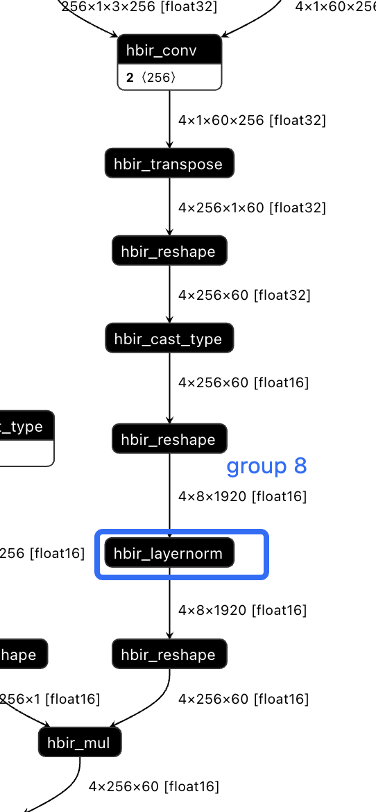

经实验layernorm比group norm要快（因为可以避免前后reshape），但是用户手动将group norm替换layernorm1d，需要手动在前后加permute（因为ln从最后一维开始norm），替换比较麻烦。推荐使用plugin的SplitLayerNorm替换group norm，可以支持对channel维度做norm，同时避免引入前后的permute：
```python
from horizon_plugin_pytorch.nn.layer_norm import SplitLayerNorm
SplitLayerNorm(normalized_shape=[c, 1], dim=1)
```

## 0.13 nn.Embedding 优化
torch.nn.Embedding要求输入tensor为LongTensor，也就是int32/int64，对于E/M而言会引入bpu不支持的cast算子从而跑在cpu上影响性能，常规的做法是`.to(torch.int16).to(torch.int64)`dequantize+cast：
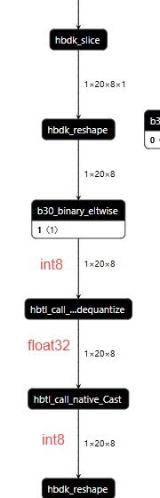

例如下面结构，让embedding的一路维持定点类型可优化
```python
data = {
    # 定点输入
    "sdnavi_link_tbt_info": torch.ones((2, 20, 8, 7), dtype=torch.int16),
    # 浮点输入
    "sdnavi_link_info": torch.ones((2, 20, 8, 256), dtype=torch.float32),
}

class Encoder(nn.Module):
    def __init__(self,
                 ...
                 ) -> None:
            super(Encoder, self).__init__()
            ...
            self.quant = QuantStub()
            self.quant_navi = QuantStub()
            self.dequant = DeQuantStub()
            self.is_ahead_embedding = nn.Embedding(
                2, self.embed_dims
            )
            self.is_left_embedding = nn.Embedding(
                2, self.embed_dims
            )
            self.is_right_embedding = nn.Embedding(
                2, self.embed_dims
            )
            ...
            self.lane_mlp = MLP(self.embed_dims * 6, self.embed_dims)

    def forward(self, navi_dict):
        sdnavi_link_info = self.quant_navi(navi_dict["sdnavi_link_info"]) # 浮点数输入正常quant
        sdnavi_link_tbt_info = navi_dict["sdnavi_link_tbt_info"]  # 定点数直接输入
        # 对于下面sdnavi_link_tbt_info相关的定点数操作，避免出现转浮点的操作，其他保持dtype一致
        lane_valid = sdnavi_link_tbt_info[..., 0].unsqueeze(-1)
        ...

        # embedding的输入需要全部转为int64
        is_front_lane = sdnavi_link_tbt_info[..., 1].clamp(min=0, max=1).to(torch.int64)

        is_ahead = self.clamp_idx_input(sdnavi_link_tbt_info[..., 2], 2)
        is_ahead = self.is_ahead_embedding(is_ahead)

        is_left = self.clamp_idx_input(sdnavi_link_tbt_info[..., 3], 2)
        is_left = self.is_left_embedding(is_left)

        is_right = self.clamp_idx_input(sdnavi_link_tbt_info[..., 4], 2)
        is_right = self.is_right_embedding(is_right)

        lane_feat = torch.cat(...)
        # 经过mlp，输出lane_feat为浮点数
        lane_feat = self.lane_mlp(lane_feat)
        # 浮点数的qtensor和定点数的tensor操作（加减乘除等）需要对tensor做quant避免后面的结构被cpu化
        lane_feat = lane_feat * self.quant(lane_valid.float())

        lane_feat = lane_feat + sdnavi_link_info
        ...
        return self.dequant(lane_feat)

    # embedding的输入需要全部转为int64
    def clamp_idx_input(self, x, max_num):
        x = x.clamp(min=0)
        x[x >= max_num] = 0
        return x.to(torch.int64)
```

对定点数tensor的quant需要给scale=1的fix_scale配置，参考如下
```python
module_name_qconfig = {
    "quant": QConfig(
        output=FakeQuantize.with_args(
            observer=FixedScaleObserver,
            dtype=qint8,
            scale=1,
        )
    ),
}

qat_model = prepare(
    model,
    data,
    # calibration_8bit_weight_16bit_act_qconfig_setter
    (
        ModuleNameQconfigSetter(module_name_qconfig),
        default_calibration_qconfig_setter
    )
    # model_qconfig_setter
)
qat_model.eval()
set_fake_quantize(qat_model, FakeQuantState.CALIBRATION)
qat_model(data) # 一定要做calib，使得scale不为1
```

优化后可实现BPU全一段。

## 0.14 torch.where算子
对于PNC以及静态目标检测模型，<text bgcolor="light-yellow">模型中较多逻辑判断涉及到bool数据类型的赋值和mask操作</text>，这一类操作可以考虑替换为torch.where算子，可以消除潜在的cpu算子并提升模型性能，例如
```python
tfl_mask[valid == 0] = float("-65504")
```

该操作在E/M会引入cast和equal算子cpu，如下
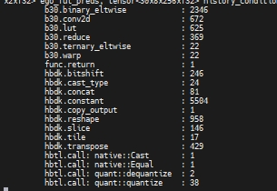

可以修改为
```python
x = torch.where(valid_mask == 0, torch.tensor(float("-65504"), device=x.device), x)
```

## 0.15 nonzero替换
```python
# 修改前
key_mask=agent_mask.clone()
key_mask = key_mask.reshape(-1, self.T)
index=torch.nonzero(key_mask[:, -1]
key_mask[index,:] = 0

# 修改后
key_mask=agent_mask.clone()
key_mask = key_mask.reshape(-1, self.T)
mask_filter = ~key_mask[:, -1]
key_mask = mask.logical_and(mask_filter.unsqueeze(1))
```


## 0.16 torch.einsum等效替换
```python {wrap}
import torch
A = torch.randn(2, 3, 4, 5, 6) # 形状为 (a=2, b=3, c=4, i=5, j=6)
B = torch.randn(6, 7, 2, 3) # 形状为 (j=6, k=7, a=2, b=3)
# 使用einsum进行操作
result = torch.einsum('abcij, jkab -> abcik', A, B)
# 直接等价实现
# 扩展张量A和B以对齐维度
A = A.unsqueeze(-1) # 扩展为 (a, b, c, i, j, 1)
B = B.unsqueeze(0).unsqueeze(-1).permute(3, 4, 5, 0, 1, 2) # 扩展为 (a, b, 1, 1, j, k)
# 逐元素相乘并对j维度进行求和
result_alt = torch.sum(A * B, dim=[4])
compare = torch.allclose(result, result_alt, rtol=0.00001, atol=0.00001)
print(compare)
```

```python {wrap}
import torch
A = torch.randn(2, 3, 4, 5, 6) # 形状为 (a=2, b=3, c=4, i=5, j=6)
B = torch.randn(6, 7, 2, 3, 4) # 形状为 (j=6, k=7, a=2, b=3, c=4)
# 使用einsum进行操作
result = torch.einsum('abcij, jkabc -> abcik', A, B)
B = B.permute(2, 3, 4, 0, 1) # tanspose为 (a, b, c, j, k)
result_alt = torch.matmul(A, B)
compare = torch.allclose(result, result_alt, rtol=0.00001, atol=0.00001)
print(compare)
```

## 0.17 sin/cos 算子去周期
1. export时如果发现敏感度排在前面的是sin/cos算子，且输入范围较大（超出-pi~pi一个周期），可以将 sin/cos替换为 plugin的自定义算子，并配置single_period=True，<text bgcolor="light-yellow">并重新 calib/qat</text>
```python {wrap}
import horizon_plugin_pytorch.nn as hnn
class modelnet(nn.module):
    def __init__(self,):
        ...
        self.sin=hnn.Sin(single_period=True)
        self.cos=hnn.Cos(single_period=True)

```

<quote-container>
工具不自动对torch做替换的原因说明：
1. 公版torch.sin/cos不一定有精度和一致性问题，性能更好
1. 替换为horizon.sin/cos，且打开周期开关，精度一致性没问题，但性能会差一些。
综合考虑二者，工具不自动对torch做替换。
</quote-container>


1. 也可以自行处理sin/cos输入，按照周期性将输入处理到[-pi, pi)之间，<text bgcolor="light-yellow">并重新 calib/qat</text>
```python {wrap}
x = x - 2 * torch.floor(x * ( 0.5 / torch.pi) + 0.5) * torch.pi
```

