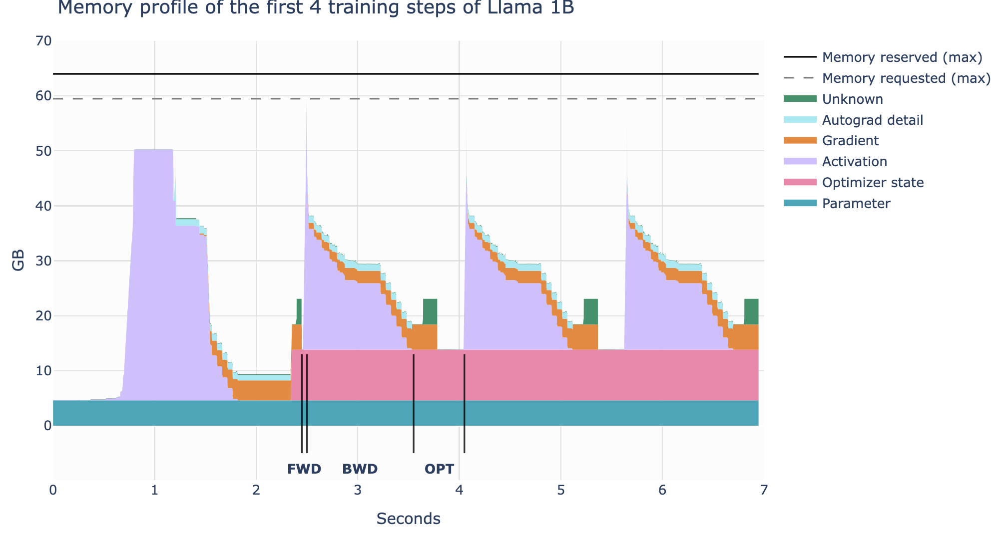
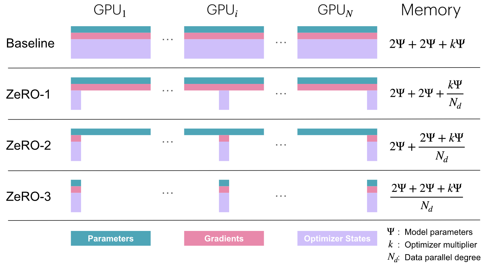
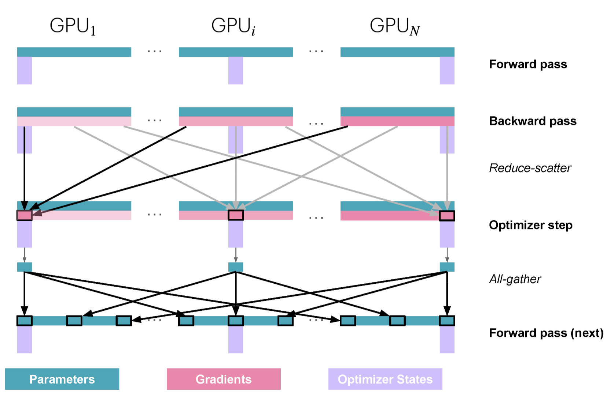
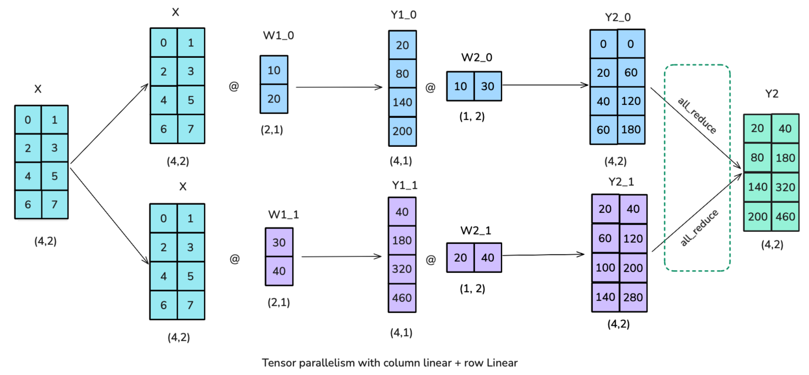
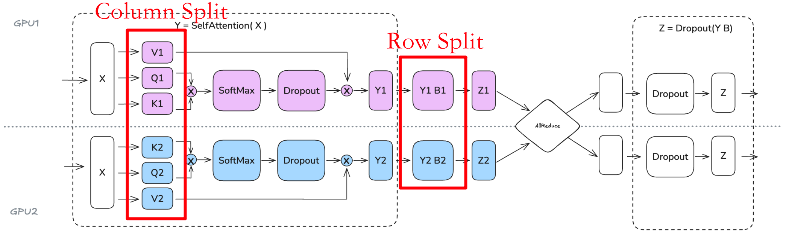

# 1 Phase 2-A VLM 模型工程认知学习文档

## 1.1 学习目标

面对可能需要开源 VLM 数据适配的 OMS demo，本阶段需要建立一条可用于工程决策的训练扩展主线：先理解一次训练 step 如何消耗显存和计算资源，再学习单 GPU 上的优化手段；当单卡仍受容量或吞吐限制时，进入多 GPU 数据并行；当数据并行暴露完整副本和通信问题时，再选择后续的状态分片或计算切分方案。

训练扩展持续处理三个相互制约的问题：

1. **显存容量**：一次训练 step 的所有必要状态能否装入设备。
2. **计算效率**：GPU 是否在执行有效计算，还是在等待数据、同步或调度。
3. **通信开销**：多卡之间传输的数据量、频率和等待时间是否抵消并行收益。

常见优化都在这三者之间做交换。例如 activation recomputation 用计算换显存，data parallelism 用更多设备换吞吐，同时引入梯度通信。学习每种技术时都应回答：它直接改变了什么、代价是什么、什么条件下会失效、应该用什么 profile 证据验证。

## 1.2 OMS VLM 训练背景

本阶段沿用以下 VLM SFT 主链作为应用场景：

```text
授权数据与任务合同
→ 图像/视频预处理 + chat template
→ visual tokens + text tokens
→ labels 与 loss mask
→ forward 得到 logits/loss
→ backward 生成梯度
→ optimizer/scheduler 更新可训练参数
→ checkpoint + 固定评测合同
→ 与 zero-shot/few-shot 基线比较
```

常见 SFT 只让 assistant answer token 贡献 loss，prompt、padding 和无效位置使用 ignore index。训练配置还要明确 vision encoder、projector 和 language model 中哪些参数被冻结、使用 LoRA 或参与全量更新，并核对 optimizer 实际持有的参数。

训练链路成功运行只是执行证据。数据是否覆盖目标错误、loss 是否监督预期输出、独立验证数据是否稳定提升，仍由评测合同判断。

本文建立单卡显存、混合精度、activation 优化、gradient accumulation、data parallelism、算子 IO 和 profiling 的认知。完整 SFT、多机训练、复杂 pipeline schedule 以及 CUDA/Triton kernel 实现不属于当前实践门禁。

对应学习记录：[[02_Projects/AI-Career-Transition/20_学习记录/P02A_VLM模型工程认知_学习记录]]。

# 2 单 GPU 训练与优化

## 2.1 一个训练 step 的资源生命周期

一次训练 step 包含 forward、backward 和 optimizer step。显存中的主要内容为：

```text
模型参数 + 参数梯度 + optimizer states + activations
+ CUDA context / kernel workspace / 临时 buffer / allocator reserve
```

这些内容出现和释放的时间不同。模型参数长期存在；forward 逐层保存反向传播需要的 activation；backward 产生梯度，并随着计算推进释放不再使用的 activation；optimizer step 使用全部梯度更新参数，首次执行时通常还会创建 optimizer states。缓存分配器、临时张量和碎片使实际峰值高于静态张量估算。



图中第一步包含缓存准备和 optimizer state 初始化，后续 step 才接近稳定形态。实际测量需要经过 warmup，并同时记录峰值出现在哪个 phase、`allocated` 与 `reserved` 的差距，以及 forward、backward、optimizer 各自的时间。

## 2.2 参数量与模型状态显存

对于简单、稠密的 decoder-only Transformer，可以用下式估算参数数量级：

$$
N \approx h v + L\left(12h^2 + 13h\right) + 2h
$$

其中 $h$ 为 hidden size，$v$ 为 vocabulary size，$L$ 为 Transformer 层数。随着 hidden size 增大，$h^2$ 项逐渐主导参数规模。

VLM 的完整参数量还包括 vision encoder 和 projector；embedding 是否共享、GQA、MoE 等架构差异也会改变公式。因此工程预算先按实际模块统计参数，再按每类 tensor 的 dtype 计算字节数。

以下是常见模型状态预算起点，尚未包含 activation、临时 buffer 和 allocator reserve：

| 配置示例 | 参数 | 梯度 | Adam states | 额外副本 | 合计 |
|---|---:|---:|---:|---:|---:|
| FP32 参数与梯度、FP32 Adam | $4N$ | $4N$ | $8N$ | 0 | 约 $16N$ bytes |
| BF16 参数与梯度、FP32 master weights、FP32 Adam | $2N$ | $2N$ | $8N$ | $4N$ | 约 $16N$ bytes |
| 上述配置增加 FP32 gradient accumulation buffer | $2N$ | $2N$ | $8N$ | $8N$ | 约 $20N$ bytes |

以 $16N$ bytes 粗略估算，7B 参数的模型状态约需 112 GB；这还没有加入 activation 和运行时 buffer。这个例子说明，权重文件能装入 GPU 并不能推出全参数训练也能装入。

## 2.3 混合精度提升计算效率

混合精度让适合的 forward/backward 运算使用 BF16 或 FP16，同时为数值敏感的计算或状态保留更高精度。它通常带来三类收益：

- 低精度 Tensor Core 在受支持硬件上具有更高吞吐。
- tensor 字节数减少，降低 HBM 带宽压力并提高 cache 有效容量。
- forward 保存的部分 activation 变小，释放更多显存预算。

FP32 master weights 用于保留小幅 optimizer update，避免更新在低精度权重表示中被舍入；这一机制只适用于确实维护 master-weight 副本的训练布局。混合精度对模型状态显存的影响由具体布局决定，对 activation 和临时张量的节省通常更直接。

## 2.4 Activation 随输入扩大

在 简单 Transformer 和混合精度假设下，activation 显存可近似写为：

$$
m_{\mathrm{act}}
= L \cdot s \cdot b \cdot h
\left(34 + \frac{5 n_{\mathrm{heads}} s}{h}\right)
$$

其中 $s$ 为 sequence length，$b$ 为 micro-batch size，$n_{\mathrm{heads}}$ 为 attention head 数。该式包含以下关系：

- micro-batch size 增大时，activation 近似线性增加；
- sequence length 同时出现在一次项和 attention 相关二次项中；
- 层数和 hidden size 增大会扩大每层保存的中间状态。

VLM 的输入 shape 还由图像分辨率、patch 数、视频帧数和视觉 token 压缩方式决定，vision encoder 自身也会保存中间特征。输入合同因此需要同时记录文本长度和视觉 token 数。

FlashAttention 通过 tiling 在片上存储中处理局部 Q/K/V 块，并在 backward 按需重算部分量，减少 HBM 流量和 attention 中间量的物化。它优化给定 attention 的执行方式，核心 attention 计算量仍随序列长度二次增长。

## 2.5 Activation recomputation：用计算换显存

Activation recomputation，也称 gradient checkpointing，在 forward 只保存若干关键边界 activation，其余中间状态在 backward 时从最近的边界重新计算。

`full` 策略保留更少的中间状态，显存节省最大，同时接近额外执行一次 forward 的部分或全部计算。`selective` 策略保留计算昂贵的边界，优先重算占用 activation 较大且相对便宜的子图，在显存节省和 step time 之间取得平衡。

重计算增加硬件实际执行的 FLOPs，却可能减少 HBM 访问。
## 2.6 Gradient accumulation：用串行 micro-batch 换单次容量

Gradient accumulation 把一个 effective batch 拆成多个 micro-batch，依次执行 forward/backward，在一次 optimizer step 前累积梯度：

$$
\mathrm{global\ batch}
= \mathrm{micro\ batch}
\times \mathrm{grad\ accumulation\ steps}
\times \mathrm{data\ parallel\ world\ size}
$$

单卡阶段的 data-parallel world size 为 1。减小 micro-batch 可以直接降低单次 activation 峰值，而参数、梯度和 optimizer states 仍需完整保留。

固定大小 micro-batch 常通过将 loss 除以 accumulation steps 保持梯度尺度。对于变长序列或 SFT 样本，各 micro-batch 的有效监督 token 数可能不同，此时应根据目标函数按有效 token 正确归一化。optimizer step、gradient clipping、unscale 和 scaler update 都应在一个 effective batch 累积完成后执行。

Gradient accumulation 的各次 forward/backward 顺序执行，增加 kernel launch 和调度开销，也无法获得真正的多设备并行吞吐。当 micro-batch 已经很小、accumulation steps 持续增加时，单卡利用率和完成训练所需时间会成为新的限制。

## 2.7 单 GPU 优化地图及其边界

| 杠杆 | 直接改变 | 主要收益 | 代价或剩余限制 |
|---|---|---|---|
| micro-batch | 单次 activation | 降低峰值显存 | 过小会降低 GPU 利用率 |
| gradient accumulation | effective batch 的执行方式 | 在较小 micro-batch 下保持 global batch | 顺序执行，不减少模型状态 |
| checkpointing | activation 保存策略 | 显著降低 activation | backward 增加重计算 |
| BF16/FP16 | 部分计算与 tensor dtype | 提高吞吐、降低带宽和部分显存 | 受硬件、kernel 和稳定性约束 |
| FlashAttention | attention 的 IO 与中间量物化 | 降低 HBM 流量和 attention activation | 收益依赖 shape、版本和硬件 |
| LoRA | 可训练参数集合 | 减少梯度和 optimizer states | base weights 与 activation 仍存在 |
| QLoRA | base weights 存储精度 | 进一步降低 base-weight 显存 | 引入量化误差与 kernel/框架约束 |

单卡优化首先处理 activation、计算精度和可训练参数规模。以下两类情况会把问题推向多 GPU：

1. 完整训练状态在最小 micro-batch 和 recomputation 下仍无法放入单卡。
2. 单卡能够运行，但串行 accumulation 或有限算力使训练时间不可接受。

第二种情况首先引出数据并行：让多个 GPU 同时处理不同 micro-batch，以空间并行替代一部分串行 accumulation。

# 3 多 GPU 优化：Data Parallelism

## 3.1 从串行 accumulation 到并行 micro-batch

标准 Data Parallel/DistributedDataParallel 在每个 data-parallel rank 上保留一份完整模型。各 rank 同时处理不同 micro-batch，独立完成 forward 和 backward，随后通过 all-reduce 对梯度求和或平均，使所有副本执行一致的 optimizer update。

从 global batch 角度看，gradient accumulation 在时间维度顺序处理 micro-batch，data parallelism 在设备维度同时处理 micro-batch。二者可以组合：每个 rank 先进行本地 accumulation，所有 rank 再在 optimizer step 前形成一致梯度。

DDP 的容量前提是每个 rank 能够容纳完整参数、梯度、optimizer states，以及最小 micro-batch 的 activation、临时 buffer 和通信 buffer。在这一前提成立时，增加 DP ranks 可以提高每个 step 同时处理的样本或 token 数。

## 3.2 梯度同步与计算重叠

朴素实现可以等整个 backward 完成后再同步全部梯度，此时 GPU 在通信阶段需要等待。更高效的做法是在 backward 过程中逐步启动通信：后层参数的梯度先产生，对应梯度准备完成后即可开始 all-reduce，同时 GPU 继续计算更早层的梯度。

这种 overlap 能隐藏的通信时间取决于两段时间是否匹配。如果剩余 backward 计算足够长，部分通信可以被覆盖；当网络较慢、消息过碎或最后一个 bucket 完成得太晚时，step 尾部仍会暴露通信等待。

## 3.3 Gradient bucketing

逐参数发起 all-reduce 会产生大量小消息和 collective 启动开销。Gradient bucketing 将多个参数的梯度放入连续 buffer，一个 bucket 内的梯度全部 ready 后再启动一次 collective。

bucket size 决定粒度：

- 小 bucket 更早 ready，有利于与 backward 重叠，但通信次数更多；
- 大 bucket 减少启动开销，却可能推迟首次通信，并占用更大的连续通信 buffer。

## 3.4 Gradient accumulation 与 `no_sync()`

当 DDP 与 gradient accumulation 同时使用时，前 $k-1$ 个 micro-batch 的梯度只需保留在本地，最后一个 micro-batch 完成 backward 时再进行跨 rank 同步。PyTorch DDP 可用 `no_sync()` 暂停前几次 backward 的梯度同步。

```text
前 k-1 个 micro-batch：local forward/backward + local gradient accumulation
第 k 个 micro-batch：local forward/backward + bucket-ready all-reduce
all buckets synchronized → optimizer step
```

## 3.5 Data Parallelism 的扩展边界

DP 通过并行样本提高吞吐，每个 rank 的模型状态显存基本保持不变。随着 GPU 数量增加，以下限制逐渐显现：

- 每卡仍复制完整参数、梯度和 optimizer states，单副本放不下的问题没有被解决；
- all-reduce 的数据量、collective latency 和跨节点带宽开始占据更多 step 时间；
- ring latency、网络拓扑和最慢 rank 使通信无法完全隐藏；
- global batch 过度增大还可能改变训练收敛行为，不能只为占满 GPU 无限扩大。

因此 DP 的有效扩展条件为：完整训练副本能够单卡容纳，目标 global batch 允许增加并行 rank，并且新增计算吞吐大于通信与同步成本。

# 4 从 DP 到 ZeRO/FSDP：消除模型状态冗余

标准 DP 在每个 rank 上复制完整参数、梯度和 optimizer states。增加 DP ranks 可以并行处理更多数据，却不会降低每卡模型状态显存。ZeRO（Zero Redundancy Optimizer）沿 data-parallel 维度逐步分片这些重复状态，让每个 rank 只长期保存自己负责的部分，并在计算需要时通过 collective 恢复一致视图。

## 4.1 ZeRO 的显存递进

设模型参数量为 $\Psi$，data-parallel degree 为 $N_d$。在 Playbook 的混合精度示例中，BF16 参数和梯度各占 $2\Psi$ bytes，FP32 master weights 与 Adam states 合并记为 $k\Psi$ bytes。忽略 activation、临时张量、通信 buffer 和 allocator reserve 后，各 stage 的长期模型状态近似为：

| 方案 | 每 rank 保留的状态 | 近似显存 |
|---|---|---:|
| Baseline DP | 完整参数、完整梯度、完整 optimizer states | $2\Psi + 2\Psi + k\Psi$ |
| ZeRO-1 | 完整参数、完整梯度、分片 optimizer states | $2\Psi + 2\Psi + \frac{k\Psi}{N_d}$ |
| ZeRO-2 | 完整参数、分片梯度、分片 optimizer states | $2\Psi + \frac{2\Psi+k\Psi}{N_d}$ |
| ZeRO-3 | 分片参数、分片梯度、分片 optimizer states | $\frac{2\Psi+2\Psi+k\Psi}{N_d}$ |



这些公式表达的是分片对象和数量级。实际峰值还包含 activation、collective 临时 buffer、预取参数、尚未释放的旧分片和内存碎片，因此每卡显存不会随着 $N_d$ 无限趋近于零。

## 4.2 Reduce-scatter 与 all-gather

ZeRO 的训练数据流依赖两个 collective：

- **Reduce-scatter**：先对各 rank 的张量做 sum/average reduction，再把规约结果切成 $N_d$ 份，每个 rank 只接收自己负责的一份。
- **All-gather**：每个 rank 提供自己的 shard，并接收其他 rank 的 shard，最终在各 rank 上组成完整张量或当前计算需要的视图。

从通信语义和典型 ring 实现来看，All-Reduce 可分解为 Reduce-Scatter 和 All-Gather 两个阶段。ZeRO 不再总是执行完整 All-Reduce，而是根据模型状态的分片布局显式使用这两个 collective：梯度规约后通常停留在 Reduce-Scatter 得到的 shard 状态，参数在需要完整参与计算时再通过 All-Gather 临时恢复。

## 4.3 ZeRO-1：先分片 optimizer states

ZeRO-1 的稳定定义是 optimizer states 按参数范围分给不同 ranks，参数和梯度仍以完整形态参与 forward/backward。在 Playbook 描述的实现中，一个 step 按以下顺序进行：

```text
每个 rank 用完整 BF16 参数处理不同 micro-batch
→ backward 产生局部梯度
→ reduce-scatter 得到本 rank 负责的规约梯度 shard
→ 本 rank 使用对应 FP32 master weight 与 Adam states 更新参数 shard
→ all-gather 更新后的 BF16 参数 shard
→ 所有 ranks 获得一致的完整参数，进入下一次 forward
```



参数 all-gather 可以在某个参数 shard 更新完成后提前启动，与剩余 optimizer update 重叠；也可以按层预取下一次 forward 所需参数。通信能隐藏多少，取决于计算窗口、bucket 粒度、网络和实现调度。

## 4.4 ZeRO-2：继续分片梯度

ZeRO-2 在 optimizer-state 分片的基础上保留规约后的 gradient shard。backward 期间，梯度 bucket ready 后执行 reduce-scatter；每个 rank 留下与其 optimizer-state shard 对应的梯度，其余梯度可以释放。

相较 ZeRO-1，主要新增收益是把长期梯度显存从 $2\Psi$ 降到约 $2\Psi/N_d$。在 Playbook 的简化通信模型中，ZeRO-1/2 都可以用一次等价规模的 reduce-scatter 与一次参数 all-gather 完成同步，总通信量与普通 DP 的梯度 all-reduce 同阶。ZeRO-2 还会改变梯度 buffer、释放时机和框架调度，实际 step time 仍需测量。

## 4.5 ZeRO-3：参数也按层按需恢复

ZeRO-3 进一步让参数保持分片状态。forward 到达某层前，ranks all-gather 该层参数；计算完成后可以立即 reshard 并释放完整参数。backward 以相反顺序再次取得所需参数，产生的梯度通过 reduce-scatter 回到各 rank 的 shard。

```text
prefetch layer n+1 parameters
↘
all-gather layer n parameters → compute layer n → reshard/release
                                              ↘
                              reduce-scatter gradient shards
```

在“forward 后立即 reshard、backward 再次 gather”的简化模型中，参数通信约包含一次 forward all-gather、一次 backward all-gather 和一次 gradient reduce-scatter，可记为约 $3\Psi$；ZeRO-2 约为 $2\Psi$。`reshard_after_forward`、prefetch、持久化小参数、bucket 大小和框架实现都会改变 collective 次数、峰值和可重叠比例。

FSDP 与 ZeRO-3 共享 fully-sharded data-parallel 的核心思想。它们的参数表示、wrap 粒度、reshard 策略、mixed-precision policy 和 prefetch 行为由具体实现决定，工程配置应以所用框架的实际语义为准。

## 4.6 ZeRO 的边界如何引出 TP

ZeRO 主要减少跨 DP ranks 重复的参数、梯度和 optimizer states。每个 rank 处理不同 micro-batch，其 activation 由本地样本产生；ZeRO stages 本身不系统切分这些 activation。长序列、高分辨率图像或视频 token 仍可能让 activation 成为峰值主体。

ZeRO-3 还需要在算子执行前恢复当前层参数。更细的分片可以降低长期显存，同时增加 collective 频率、临时全参数峰值和调度复杂度。当问题进一步表现为“单层矩阵和中间 activation 也需要跨设备拆分”时，优化主线进入 Tensor Parallelism。

# 5 Tensor Parallelism：切分算子本身

TP 让多个 ranks 对同一个样本、同一个算子执行不同数学分片。权重 shard 长期位于对应 rank，输入或局部输出按照布局通过 collective 组合。它减少每卡参数和部分中间 activation，同时把通信直接放入每层 forward/backward 的关键路径。

## 5.1 矩阵乘法的两种分块方式

采用数学记号 $Y=XW$，其中 $X\in\mathbb{R}^{B\times d_{in}}$，$W\in\mathbb{R}^{d_{in}\times d_{out}}$。PyTorch `Linear` 在存储中使用转置后的权重形状，但不改变以下分块关系。

沿输出维切分 $W=[W_1\ W_2\ \cdots\ W_p]$：

$$
XW = X[W_1\ W_2\ \cdots\ W_p]
= [XW_1\ XW_2\ \cdots\ XW_p]
$$

沿输入维切分 $X=[X_1\ X_2\ \cdots\ X_p]$，并将 $W$ 纵向分块：

$$
XW
= [X_1\ X_2\ \cdots\ X_p]
\begin{bmatrix}
W_1\\W_2\\\vdots\\W_p
\end{bmatrix}
= \sum_{i=1}^{p}X_iW_i
$$

前一种对应 column-parallel linear，后一种对应 row-parallel linear。

## 5.2 Column-parallel linear

Column parallel 沿 $W$ 的输出维分片。各 rank 接收相同的 $X$，计算局部输出 $Y_i=XW_i$。所有 $Y_i$ 在输出维拼接后得到完整 $Y$。

输入“相同”是一种布局条件：若上游已经让 $X$ 在 TP ranks 间保持一致，就不需要在当前层再次 broadcast。局部输出也可以继续保持 sharded；只有下游需要完整 $Y$ 时才执行 all-gather。

## 5.3 Row-parallel linear

Row parallel 沿输入维切分 $X$，并沿 $W$ 的对应输入维分片。各 rank 计算局部部分和 $Y_i=X_iW_i$，随后通过 all-reduce 得到：

$$
Y=\sum_{i=1}^{p}Y_i
$$

如果 $X$ 已由前一层以正确布局分片，本层无需重新 scatter。输出还要继续保持分片时，也可以采用兼容布局的 reduce-scatter；collective 的选择取决于相邻算子的输入输出合同。

## 5.4 Transformer MLP：Column 接 Row

Transformer MLP 通常先把 hidden dimension 扩大，再投影回原维度。第一层采用 column parallel 后，中间 activation 自然沿扩展维分片；第二层直接以 row parallel 消费这些 shards。两层之间无需恢复完整 activation，只在第二层局部结果完成后规约 block 输出。



```text
replicated X
→ column-parallel FC1
→ sharded activation + local nonlinearity
→ row-parallel FC2
→ all-reduce/reduce-scatter block output
```

Column→Row 的配对把通信集中在 block 边界；Row→Column 会更早需要恢复或重新分发 activation，通常产生更多通信。

## 5.5 Multi-head attention 的 TP 布局

Attention 中，Q/K/V projection 可以沿 heads 或输出维做 column parallel，每个 rank 计算一个或一组完整 attention heads；output projection 再使用 row parallel，并在输出处规约。



TP degree 需要与 head 布局兼容。普通 MHA 通常要求 heads 能被 TP degree 合理划分；GQA/MQA 的 KV heads 少于 query heads，较高 TP degree 可能需要复制 KV heads 或采用更复杂布局，并付出额外显存或通信成本。训练配置应明确 Q heads、KV heads、每 rank heads 和复制策略。

## 5.6 TP 的收益与扩展边界

TP 能同时分片权重、对应梯度/optimizer states 以及部分矩阵中间 activation，但 residual stream、LayerNorm、dropout 等状态可能仍在 ranks 间复制。Sequence Parallelism 可以继续切分部分原本复制的 activation。

与 ZeRO 的参数预取相比，TP collective 是算子数学结果的一部分。每个 Transformer block 都会遇到 all-reduce、all-gather 或 reduce-scatter，同步通信往往直接增加关键路径；分块 GEMM 和异步 collective 可以隐藏一部分时间，但无法假设完全重叠。

TP degree 越高，每卡矩阵计算越小，collective 相对成本越大。实践中通常先把 TP 放在 NVLink/NVSwitch 等高速节点内互联域，再用 DP、PP 或其他维度跨节点扩展。

TP 之后的主线继续由剩余瓶颈决定：

| 剩余问题 | 后续方向 | 主要新增代价 |
|---|---|---|
| residual/LayerNorm 等复制 activation 仍过大 | Sequence/Context Parallelism | sequence 布局、attention 通信和负载均衡 |
| 整个模型按层纵向仍无法容纳 | Pipeline Parallelism | pipeline bubble、micro-batch 调度和 stage 平衡 |
| 需要跨节点扩大吞吐 | 组合 DP/FSDP 与节点内 TP | 多维 process group、拓扑映射和通信竞争 |

## 5.7 ZeRO-3 与 TP：存储分片和算子分片

| 维度 | ZeRO-3 / FSDP | Tensor Parallelism |
|---|---|---|
| 并行语义 | 各 DP rank 处理不同 micro-batch | 各 TP rank 协作处理同一个样本、同一个算子 |
| 参数常驻状态 | 参数以 shard 形式常驻 | 参数以算子所需的权重 shard 形式常驻 |
| 算子执行前 | all-gather 当前层的完整参数 | 直接使用本地权重 shard，无需恢复完整权重 |
| 本地计算 | 在本地数据上执行完整层计算 | 执行矩阵乘法或 attention 的局部计算 |
| 结果组合 | 计算后重新分片参数，梯度通过 reduce-scatter 回到各 shard | 通过 all-gather、all-reduce 或 reduce-scatter 组合局部 activation 或结果 |
| Activation | ZeRO stages 本身不系统分片 activation | 可以分片部分算子中间 activation |
| 通信位置 | 围绕参数生命周期与梯度聚合 | 属于算子图中的数学依赖，通常进入关键路径 |
| 常见组合 | 沿数据并行维度切分模型状态 | 节点内使用 TP，再与 DP/FSDP 组合扩展 |

两者都让模型状态以 shard 形式常驻，但切入层次不同。ZeRO-3 保持数据并行的完整算子语义，在计算某层时临时恢复该层参数；TP 直接改写 Linear 和 Attention 的执行方式，各 rank 使用本地参数 shard 计算局部结果，再通过 collective 拼接或规约。因此，ZeRO-3 的通信围绕参数生命周期，TP 的通信属于算子本身的数学依赖。

# 6 Profiling：为每一步优化建立证据

Profiling 贯穿单卡和多卡优化。最小实验合同包括：模型与数据身份、input shape、precision、可训练参数、软件版本、warmup、测量窗口和固定质量检查。

| 阶段 | 关键观测 | 要回答的问题 |
|---|---|---|
| 单 step 显存 | peak allocated/reserved、峰值 phase、参数/梯度/optimizer/activation | 谁决定 OOM，理论预算与实测差多少？ |
| 混合精度 | step time、吞吐、kernel dtype、loss、gradient norm | 低精度 kernel 是否生效，稳定性是否保持？ |
| recomputation | peak memory、step time、额外 FLOPs、HFU/MFU | 省下的显存是否值得重算成本？ |
| accumulation | micro/global batch、tokens/s、launch 间隙 | 较小 micro-batch 是否造成利用率下降？ |
| DDP | collective 时间、overlap、尾部等待、每卡吞吐 | 新增 GPU 的收益是否覆盖通信？ |
| bucketing | bucket ready 时间、消息数量、buffer、step tail | bucket 粒度是否兼顾启动开销和 overlap？ |
| ZeRO/FSDP | shard/完整参数峰值、all-gather、reduce-scatter、prefetch | 状态显存下降是否覆盖新增通信和临时峰值？ |
| TP | GEMM 时间、每层 collective、同步点、每卡 activation | 算子分片收益是否被关键路径通信抵消？ |

统一诊断流程为：

```text
确认任务与输入合同
→ 确认 shape、dtype、可训练参数和 loss mask
→ 测量稳定 step 的显存、时间与吞吐
→ 定位数据、计算、IO、同步或通信瓶颈
→ 一次只改变一个主要杠杆
→ 用同一合同复测质量、吞吐和显存
```

GPU utilization 只是现象指标。最终结论应落到具体 kernel、memcpy、同步点、collective、idle gap 或数据等待，并以端到端 step time 和有效 tokens/s 判断收益。

# 7 OMS VLM 适配决策

OMS 场景首先确定任务输出与非目标、数据授权、zero/few-shot 或其他基线、错误分类、独立验证数据，以及训练和部署资源预算。只有基线已经证明存在稳定、可由数据适配改善的错误模式时，才打开最小 LoRA/QLoRA 分支。

VLM 模块选择需要明确：

| 模块 | 常见选择 | 主要取舍 |
|---|---|---|
| vision encoder | 冻结或局部解冻 | 冻结节省资源并降低小数据破坏风险；解冻提高视觉域适配能力，同时增加显存与过拟合风险 |
| projector | 训练或添加 adapter | 调整视觉特征进入语言空间的映射 |
| language model | 冻结、LoRA 或全量训练 | LoRA 适合资源受限的小规模适配；全量训练需要更高成本和遗忘风险控制 |

当前阶段交付为：单 GPU 训练资源图、优化手段及局限、DP 数据流和通信边界、ZeRO/FSDP 状态分片、TP 算子分片、后续多 GPU 路由、profiler 计划，以及不执行 SFT 或分布式的反例。它不要求实际完成 SFT、集群训练或 kernel 实现。

# 8 主动考核骨架

每单元按闭卷重建、边界辨析和迁移决策三层检查：

| 单元 | 闭卷主问题 | 边界题 | OMS 迁移题 |
|---|---|---|---|
| A 训练主链 | 从多模态样本到 optimizer step 发生什么？ | loss mask 与 attention mask 有何不同？ | 哪些 VLM 模块参与训练？ |
| B 单卡显存 | 一个 step 中各类显存何时出现？ | 权重能放下为什么仍可能 OOM？ | T4 OOM 应按什么顺序检查？ |
| C 单卡优化 | precision、recomputation、accumulation 各改变什么？ | 哪些状态仍未被减少？ | 哪种组合适合当前 shape 和资源？ |
| D Data Parallel | DP 如何并行 micro-batch 并形成一致梯度？ | overlap、bucketing、`no_sync()` 分别解决什么？ | 单卡能放下但速度慢时怎样验证 DP 收益？ |
| E ZeRO/FSDP | ZeRO-1/2/3 分别切分什么？ | reduce-scatter、all-gather 与 activation 的边界是什么？ | 模型状态 OOM 时应选哪个 stage 并测什么？ |
| F Tensor Parallel | Column/Row linear 如何组合出完整矩阵乘法？ | TP collective 为什么进入每层关键路径？ | VLM 的 MLP、MHA/GQA 如何选择 TP degree？ |
| G 后续路由 | PP、CP/SP 分别切分什么？ | ZeRO/TP 的哪个局限引出该方案？ | 当前问题需要深入哪条路线？ |
| H 算子 IO | FlashAttention 如何减少 HBM 流量？ | IO、显存与 FLOPs 如何区分？ | 高分辨率 VLM 变慢怎样定位？ |
| I Profiling | 如何分解 step 时间和显存？ | utilization 为什么不足以定位根因？ | 如何设计只改变一个杠杆的 A/B profile？ |

## 8.1 完成门禁

- [ ] 闭卷画出单卡 VLM SFT 主链并解释 label masking。
- [ ] 按时间顺序说明参数、activation、梯度和 optimizer states 的生命周期。
- [ ] 用参数量和 activation 公式建立显存数量级预算，并列出 VLM 的额外变量。
- [ ] 说明混合精度、recomputation、gradient accumulation、LoRA/QLoRA 和 FlashAttention 的收益与剩余限制。
- [ ] 画出 DDP forward/backward/all-reduce 数据流，解释 overlap、bucketing 和 `no_sync()`。
- [ ] 用分片对象和显存公式解释 ZeRO-1/2/3，并画出 reduce-scatter、局部更新和 all-gather 的 step 数据流。
- [ ] 从并行语义、参数获取、局部计算、activation 和通信位置五个维度对比 ZeRO-3 与 TP。
- [ ] 用矩阵分块推导 column/row parallel，并迁移到 Transformer MLP 与 MHA/GQA。
- [ ] 从 ZeRO 和 TP 的剩余限制，路由到 PP 或 CP/SP 的后续学习方向。
- [ ] 为 OMS VLM 适配写 profiler/评测计划，并说明何时不执行 SFT 或分布式。
- [ ] 完成至少两道新情境迁移题，不依赖背诵框架名。

完成代表模型工程认知可用于决策，不代表 SFT、集群训练或 kernel 实现已经验证。

# 9 原文阅读路线

Ultra-Scale Playbook 第一轮沿本文顺序阅读：单 GPU 训练与显存、activation recomputation、gradient accumulation、data parallelism、ZeRO-1/2/3、tensor-parallel linear、MLP 和 attention。每一节回答四个问题：原始瓶颈是什么、方案改变什么、代价是什么、用什么 profile 证明。

PP 和 CP/SP 当前保留为 ZeRO/TP 局限之后的阅读入口，进入对应单元时再扩展为完整机制与实验计划。

FlashAttention 原文重点重建 HBM→片上存储的 tiling、recomputation 和端到端边界。通读不作为门禁。

- [[04_Sources/模型工程/2026-08-20_Ultra-Scale-Playbook来源证据卡]]
- [[04_Sources/模型工程/2026-08-20_FlashAttention长序列优化来源证据卡]]
