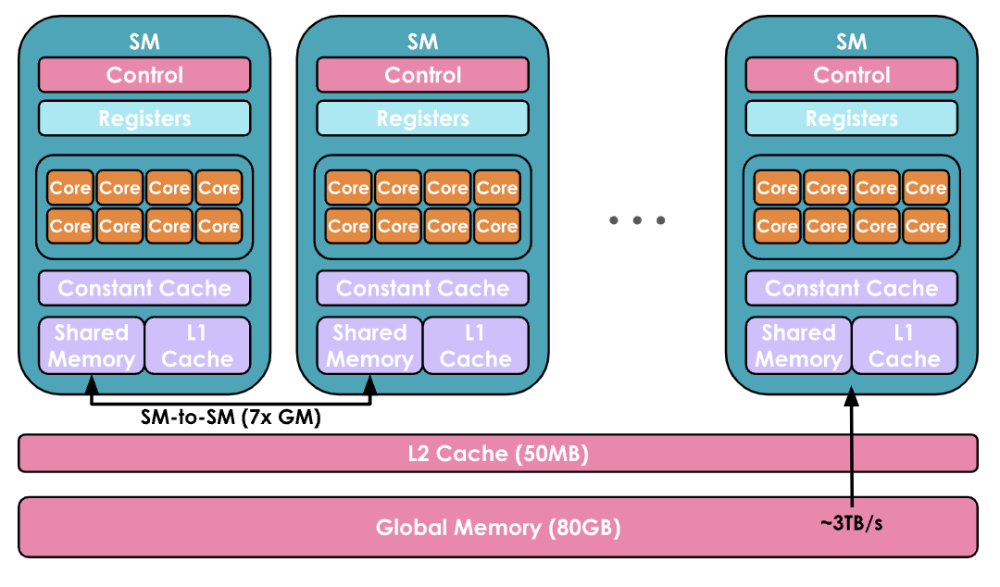
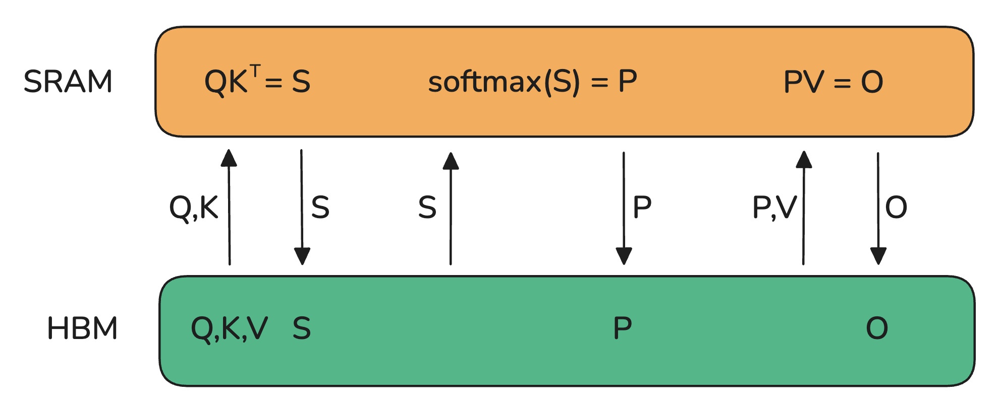
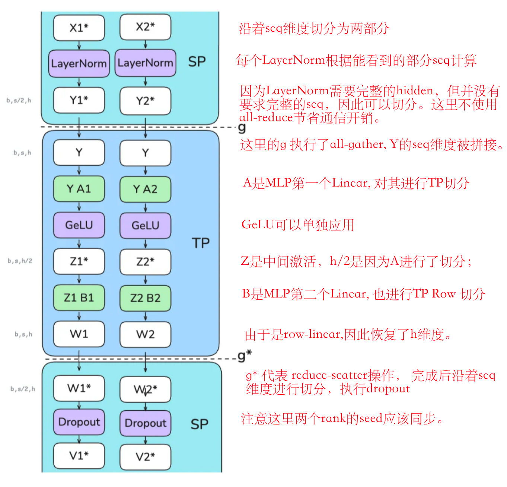
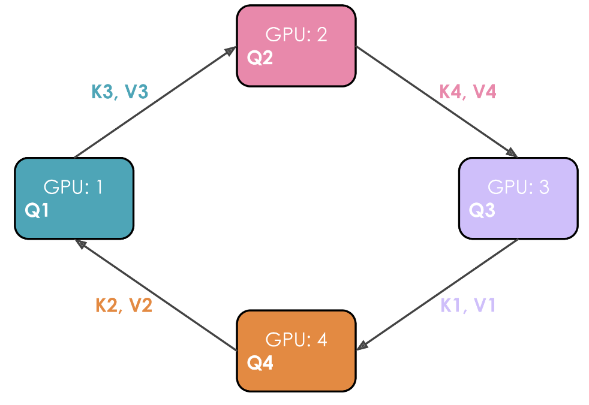
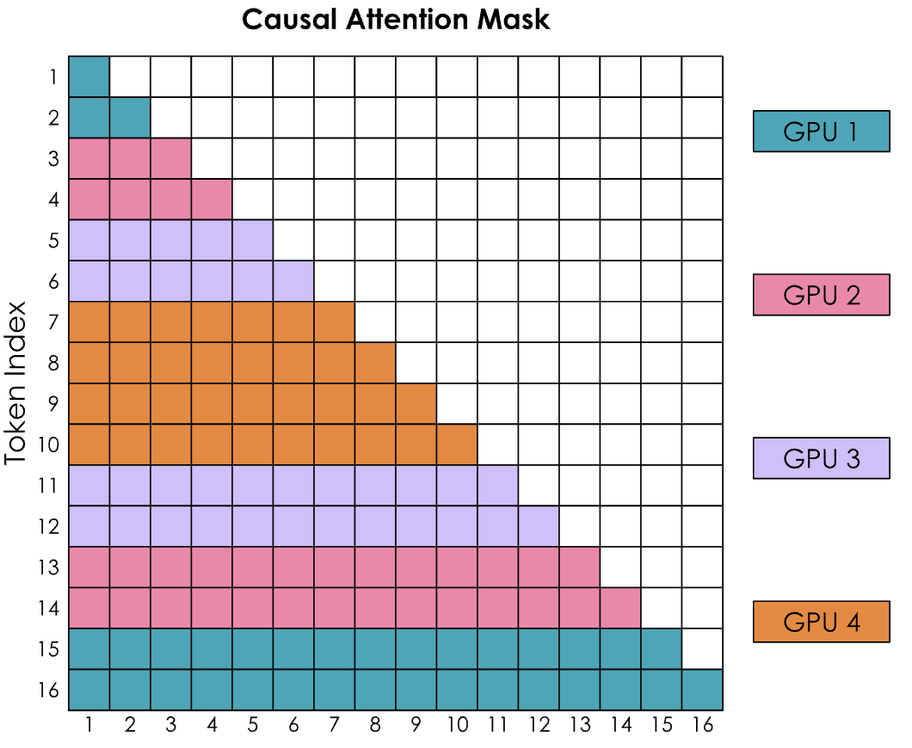
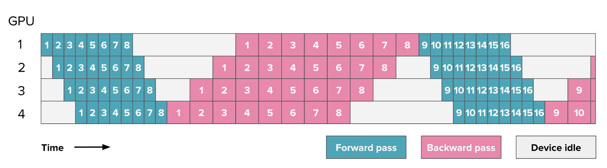
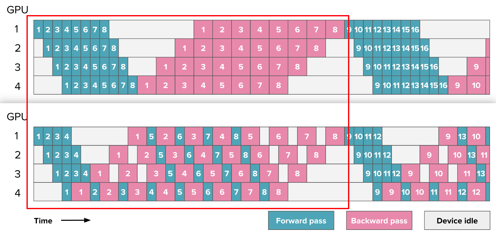
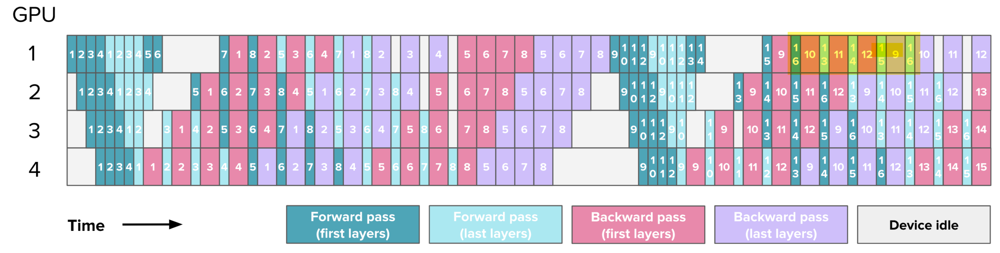
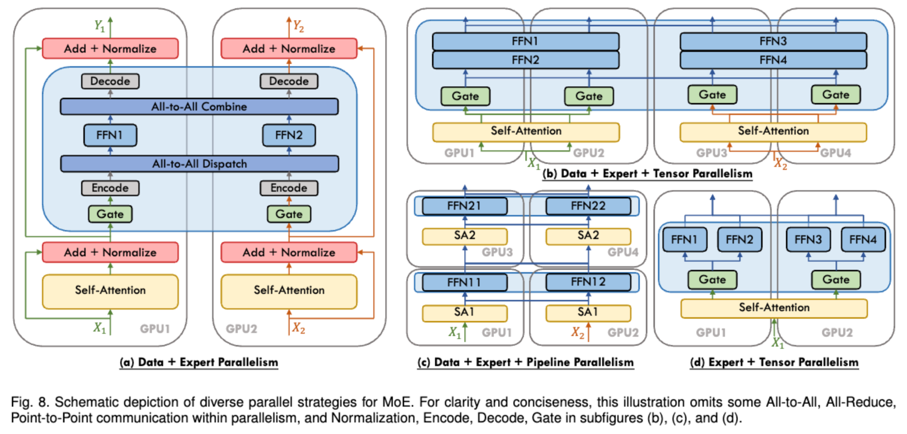
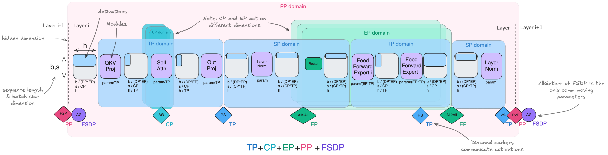

# 1 Phase 2-A VLM 模型工程认知学习文档

## 1.1 学习目标

本文定位为用户学习后经 AI 整理优化的个人学习笔记，用于保存机制、例子、推导与适用边界。笔记的完整度不代表个人掌握程度；阅读进度、诊断结果与当前下一步以对应学习记录和滚动检查点为准。

阶段需要建立一条可用于工程决策的训练扩展主线：先理解一次训练 step 如何消耗显存和计算资源，再学习单 GPU 上的优化手段；当单卡仍受容量或吞吐限制时，进入多 GPU 数据并行；当数据并行暴露完整副本和通信问题时，再选择后续的状态分片或计算切分方案。

训练扩展持续处理三个相互制约的问题：

1. **显存容量**：一次训练 step 的所有必要状态能否装入设备。
2. **计算效率**：GPU 是否在执行有效计算，还是在等待数据、同步或调度。
3. **通信开销**：多卡之间传输的数据量、频率和等待时间是否抵消并行收益。

常见优化都在这三者之间做交换。例如 activation recomputation 用计算换显存，data parallelism 用更多设备换吞吐，同时引入梯度通信。学习每种技术时都应回答：它直接改变了什么、代价是什么、什么条件下会失效、应该用什么 profile 证据验证。

## 1.2 OMS VLM 训练背景

本阶段沿用以下 VLM SFT 主链作为应用场景：

```text
授权数据与任务合同
→ 图像/视频预处理 + chat template
→ visual tokens + text tokens
→ labels 与 loss mask
→ forward 得到 logits/loss
→ backward 生成梯度
→ optimizer/scheduler 更新可训练参数
→ checkpoint + 固定评测合同
→ 与 zero-shot/few-shot 基线比较
```

常见 SFT 只让 assistant answer token 贡献 loss，prompt、padding 和无效位置使用 ignore index。训练配置还要明确 vision encoder、projector 和 language model 中哪些参数被冻结、使用 LoRA 或参与全量更新，并核对 optimizer 实际持有的参数。

训练链路成功运行只是执行证据。数据是否覆盖目标错误、loss 是否监督预期输出、独立验证数据是否稳定提升，仍由评测合同判断。

本文建立单卡显存、混合精度、activation 优化、gradient accumulation、DP/ZeRO、TP/SP、CP、PP、EP、多维配置、算子 IO 和 profiling 的认知。完整 SFT、多机训练、复杂 pipeline schedule 以及 CUDA/Triton kernel 实现不属于当前实践门禁。

对应学习记录：[[02_Projects/AI-Career-Transition/20_学习记录/P02A_VLM模型工程认知_学习记录]]。

## 1.3 GPU 基础桥接：从并行计算到数据移动

模型训练中的 FLOPs、显存和通信最终都落到硬件执行。当前先建立一个最小心智模型：GPU 用大量并发工作追求吞吐，通过线程切换覆盖等待；数据需要在不同层级之间移动，而算子能否复用已经搬近计算单元的数据，决定计算资源能否被充分利用。

这部分不是 CUDA kernel 开发教程，而是后续理解 mixed precision、tiling、fusion、FlashAttention 和 profiler 结果的前置桥梁。

### 1.3.1 Latency、throughput 与 bandwidth

- **Latency**：一个任务或一次操作从开始到完成所经历的时间。例如，一次 HBM load 发出后多久数据才可用。
- **Throughput**：系统单位时间完成的工作量。例如每秒处理的 tokens、samples 或 FLOPs。
- **Bandwidth**：单位时间能够传输的数据量。例如 HBM 每秒可搬运多少 bytes。

三者不能互相替代。增加并发请求可以让内存控制器持续工作，从而更接近峰值 bandwidth，并提高整体 throughput；单个请求从发出到返回的 latency 却未必降低。训练中“GPU 很忙”也不等于单个样本更快，它可能只是同时处理了更多工作。

### 1.3.2 CPU 与 GPU 的设计重点

CPU 和 GPU 都能并行执行，但典型设计取舍不同：

| 维度 | CPU 常见侧重 | GPU 常见侧重 |
|---|---|---|
| 核心 | 数量较少、单核能力强 | 大量相对简单的计算单元 |
| 控制流 | 强分支预测、乱序执行，擅长复杂控制 | 偏好大量结构相似、可同时推进的工作 |
| 存储 | 较大的多级 cache，优先降低单线程等待 | 高带宽设备内存与大量并发，优先维持吞吐 |
| 优化目标 | 常重视单任务 latency | 常重视总体 throughput |

这是设计倾向，不是绝对分类。CPU 也能通过 SIMD 和多核获得高吞吐，GPU 也有 cache、控制逻辑和低延迟任务；是否适合 GPU 仍取决于并行度、数据移动和算子规模。

### 1.3.3 Host、device 与 kernel

CUDA 程序同时包含 CPU 上的 host code 和 GPU 上的 device work。Host code 负责准备输入、分配 host/device memory、发起数据传输、配置并启动 kernel，以及在 CPU 需要读取结果或复用资源前建立必要同步。Kernel 是一次 GPU 并行工作的程序入口；同一段 kernel code 会由大量 threads 针对不同数据索引执行。

```text
host 准备数据
→ 分配 device memory
→ host-to-device copy
→ launch kernel(grid, block)
→ device 执行 threads
→ 必要的同步或事件依赖
→ device-to-host copy / 后续 device kernel
```

Kernel launch 和许多 device 操作对 host 可以是异步的：CPU 提交工作后可以继续执行，但同一 stream 内的依赖、跨 stream 协作和 host 读取结果仍需要正确的顺序或同步。频繁在 host 与 device 间往返、发起大量微小 kernels，可能让 launch 和同步开销占据明显比例。

CUDA C++ 源码通常先形成 PTX 这一虚拟指令集表示，再由工具链生成目标 GPU 架构执行的机器指令。Triton、CUDA 和框架生成 kernel 提供不同抽象层级与控制能力。

### 1.3.4 Grid、block 与 thread：程序如何表达并行

一次 kernel launch 产生一个 grid；grid 由多个 blocks 组成，每个 block 再包含多个 threads：

```text
grid
├─ block 0
│  ├─ thread 0
│  ├─ thread 1
│  └─ ...
├─ block 1
│  └─ ...
└─ ...
```

Thread 是 CUDA 编程模型中的最小逻辑执行实例，具有自己的 thread index、program-counter 语义、local variables 和逻辑上的私有 registers。以一维向量加法为例，thread 可以用全局索引选择一个元素：

$$
i=\mathrm{blockIdx.x}\times\mathrm{blockDim.x}+\mathrm{threadIdx.x}
$$

当 $i<n$ 时执行 $C_i=A_i+B_i$。边界判断使 grid size 不必恰好整除数组长度。

Block 是协作与调度边界。同一 block 内的 threads 可以访问该 block 分配的 shared memory。不同 blocks 不能直接访问彼此的 shared-memory allocation，也不能在普通 kernel 中假设 block 的执行先后顺序；需要跨 block 交换的数据通常经过 global memory 或拆分为多个 kernel 阶段，特殊 cooperative launch 另论。

### 1.3.5 Block、warp 与 SM：程序如何映射到硬件

Kernel 启动后，GPU 把 blocks 分配给 Streaming Multiprocessors（SM）。一个 block 一旦开始驻留在某个 SM 上，其 threads 不会再拆到其他 SM；一个 SM 可以同时驻留多个 blocks，前提是 threads、registers、shared memory 和其他资源配额允许。

NVIDIA GPU 不逐 thread 独立发射指令，而是把同一 block 内的连续 threads 自动组成通常为 32 threads 的 warps。SM 内的 warp scheduler 从 resident warps 中选择 ready warp 发射指令，具体计算由 CUDA cores、Tensor Cores、load/store units 等执行资源完成。因此：

```text
编程模型：grid → blocks → threads
硬件执行：GPU → SMs → resident blocks → warps → execution units
```

Thread 数可以远大于物理计算单元数，因为 blocks 会分批驻留，warps 也会随依赖是否满足而交替推进；“创建了多少 threads”不等于“同一时刻有多少计算同时发生”。

### 1.3.6 SIMD、SIMT 与控制流

SIMD（Single Instruction, Multiple Data）表示一条指令同时作用于多个数据元素。CUDA 面向程序员暴露的模型通常称为 SIMT（Single Instruction, Multiple Threads）：程序写成许多具有独立索引和状态的 threads，硬件再把 threads 成组调度。

SIMT 让每个 thread 可以拥有独立索引和控制流，但同一 warp 仍共享指令发射。当 warp 内 threads 因条件分支走向不同路径时，硬件通常需要分别执行各路径并屏蔽暂不参与的 lanes，形成 control divergence。分支本身不必然昂贵；代价取决于 warp 内路径是否分化、每条路径的工作量以及编译器和架构处理方式。

### 1.3.7 为什么大量线程能够隐藏等待

若一个 warp 发出 HBM load 后必须等待数据，相关指令暂时不能继续。只要同一 SM 上还有其他依赖已经满足的 ready warps，scheduler 就可以先发射它们的指令：

```text
warp A 发出 memory request → 等待
warp B ready → 执行
warp C ready → 执行
warp A 数据返回 → 继续执行
```

这种机制隐藏的是 latency 对计算流水线造成的空档，而不是消除 memory latency。它也不是“线程越多越快”：寄存器和 shared memory 占用会限制一个 SM 能同时驻留的 blocks/warps

Occupancy 描述理论上可驻留 warps 相对硬件上限的比例。足够 occupancy 有助于 latency hiding，但 occupancy 达到最大并不保证算子最快；寄存器复用、cache 行为、指令吞吐和数据依赖同样重要。

### 1.3.8 Memory hierarchy：数据离执行单元有多远

GPU 的存储层级可先按“越靠近计算单元，通常容量越小、访问越快”理解：

```text
每线程 registers
→ 每个 SM 的 shared memory / L1
→ GPU 共享 L2
→ global-memory address space，通常由 device HBM 承载
→ host memory 或远端设备
```



Registers 是 thread 私有、低延迟但数量有限的存储资源；单个 thread 使用过多 registers 会降低一个 SM 能同时驻留的 warps，极端情况下还可能发生 register spilling。Shared memory 和 L1 都位于 SM 附近，但职责不同：shared memory 由程序按 block 分配和显式协作访问，L1 cache 主要由硬件管理。L2 服务整个 GPU；global memory 是 CUDA 地址空间，离芯片执行单元较远的主要数据通常物理存放在 HBM。HBM 具有很高的总体 bandwidth，但单次访问 latency 仍显著高于片上存储。

实际 cache 结构、shared/L1 配置、容量和带宽依赖 GPU 架构。图中的 H100 容量和带宽只是具体示例，不能直接作为其他 GPU 的参数。

### 1.3.9 Locality、coalescing 与 control divergence

优化 memory access 的共同目标是减少高成本数据移动，并让一次搬运产生更多有效计算：

- **Temporal locality**：刚使用的数据很快再次使用，尽量留在 registers、shared memory 或 cache 中。
- **Spatial locality**：相邻地址的数据会被相邻时间或线程访问，使连续搬运更有效。
- **Coalesced access**：同一 warp 的 active threads 访问相邻且适当对齐的地址，使硬件用较少的 memory transactions 服务这些请求。

Coalescing 利用的是 warp 地址模式，并不保证所有请求总能合并成一次“大访问”；元素大小、地址对齐、访问跨度、active lanes 和具体架构都会影响事务数量。Cache hit 与 coalescing 也不是同一问题：前者回答数据是否已在更近层级，后者回答一次 warp 请求需要怎样的内存事务。

Control divergence 则作用于指令路径。若 warp 内 threads 执行不同分支，部分 lanes 会在另一条路径执行时闲置。优化时不应机械删除所有 `if`；边界检查可能不可避免，真正需要关注的是热路径中分支是否在 warp 内高度分化，以及重排数据或工作分配能否让相邻 threads 走相同路径。

### 1.3.10 从向量加法到 tiled matrix multiplication

向量加法 $C_i=A_i+B_i$ 对每个元素只做一次加法，却至少需要读取 $A_i$、读取 $B_i$ 并写回 $C_i$。若这些数据来自 HBM 且没有额外复用，计算量相对传输字节很少，通常更容易受 memory bandwidth 限制。增加更多 ALU 不会自动减少这些 bytes。

矩阵乘法：

$$
C_{ij}=\sum_k A_{ik}B_{kj}
$$

具有更高的数据复用潜力：同一个 $A_{ik}$ 会参与多个不同 $j$ 的输出，同一个 $B_{kj}$ 会参与多个不同 $i$ 的输出。朴素实现若每次乘加都重新从 HBM 取数，仍会浪费这一性质。

Tiled GEMM 沿 $M$、$N$、$K$ 维把矩阵拆成小块。以 shared-memory tiling 为例，一轮通常包含：

1. Block 内 threads 协作把 $A$ 的 $M\times K$ tile 和 $B$ 的 $K\times N$ tile 从 global memory 载入 shared memory。
2. 在开始消费 tile 前完成必要的 block-level synchronization。
3. 每个 thread 从 shared memory 或 registers 多次复用数据，累加自己负责的 $C$ 子块。
4. 在覆盖 shared-memory buffer 前再次保证上一轮读取已完成，然后推进下一个 $K$ tile。
5. 处理不能整除 tile size 的边界，并把最终 accumulator 写回 global memory。

Tiling 基本不改变矩阵乘法的数学 FLOPs，却减少重复 HBM loads，提高 Arithmetic Intensity。Tile 也不能无限增大：shared memory、registers、occupancy、bank conflict、访存对齐和矩阵 shape 共同限制最佳 tile。

因此，“矩阵乘法适合 GPU”不只因为可以创建很多线程，还因为规则并行、连续访问和数据复用能够共同提高计算单元利用率。矩阵过小、形状不友好、精度或 kernel 不匹配时，也可能无法达到高吞吐。

### 1.3.11 Arithmetic Intensity 与 Roofline

Arithmetic Intensity（AI）衡量每搬运一个 byte 完成多少浮点运算：

$$
AI=\frac{\mathrm{FLOPs}}{\mathrm{Bytes\ moved}}
$$

这里的 `Bytes moved` 必须说明观察的是哪一级存储，例如 HBM traffic；若把 register、cache 或主机传输混在一起，不同计算得到的 AI 无法直接比较。

Roofline 模型给出一个性能上界：

$$
P_{\mathrm{attainable}}
\le
\min\left(P_{\mathrm{peak}},\ BW_{\mathrm{peak}}\times AI\right)
$$

其中 $P_{\mathrm{peak}}$ 是峰值计算吞吐，$BW_{\mathrm{peak}}$ 是目标存储层级的峰值带宽。二者交点对应 ridge point：

$$
AI^*=\frac{P_{\mathrm{peak}}}{BW_{\mathrm{peak}}}
$$

- 当 $AI<AI^*$，Roofline 上界主要由 $BW_{\mathrm{peak}}\times AI$ 决定，运行更可能是 memory-bound；应优先减少 HBM traffic、改善 coalescing、增加复用或进行 fusion。
- 当 $AI>AI^*$，上界主要由 $P_{\mathrm{peak}}$ 决定，运行更可能是 compute-bound；更低精度、Tensor Core、并行计算与更高效指令实现可能更有价值。

Compute-bound 和 memory-bound 不是算子的永久标签。它们取决于输入 shape、dtype、kernel 实现、cache 命中、硬件和测量层级。Roofline 也是上界模型；launch overhead、同步、依赖、分支和通信会让实际性能低于这条上界。

### 1.3.12 FlashAttention：把执行与数据移动模型带回 Transformer

普通 attention 若把完整 score matrix $S=QK^T$ 和 probability matrix $P=\mathrm{softmax}(S)$ 物化到 HBM，会在 $Q/K/V$、$S$、$P$ 和输出 $O=PV$ 之间产生大量 HBM↔片上存储流量：



FlashAttention 按 Q/K/V tiles 计算，并用 online softmax 维护局部最大值、归一化因子和输出累加量，从而避免把完整 $S$ 和 $P$ 写入 HBM。它的关键收益不是减少 attention 的核心数学依赖，而是降低 HBM traffic 和中间矩阵物化；backward 还可以从保存的统计量和输入重算部分结果，在 FLOPs 与 memory IO 之间交换。

其他模型工程技术也可放回同一框架理解：mixed precision 同时改变计算吞吐和 tensor bytes；fusion 减少中间结果写回与再次读取；activation recomputation 主动增加 FLOPs 以减少长期保存的数据；TP、SP、CP 和 PP 把一部分本地数据移动转化为设备间通信，因此必须同时观察 kernel 与 collective。

## 1.4 GPU 基础易混机制与诊断例子

本章补充第 1.3 节的 GPU 基础与第 11 章的 profiling 方法，通过概念对比、数值例子和推导，解释资源限制如何影响性能。教学补充依据见 [[02_Projects/AI-Career-Transition/20_学习记录/P02A_VLM模型工程认知_学习记录#1.8 2026-09-09 GPU 基础对话诊断与教学补充]]；个人作答和完成状态保存在学习记录中。

### 1.4.1 资源容量、带宽、延迟与计算吞吐

| 概念 | 含义 | 需要区分的边界 |
|---|---|---|
| 容量 | 寄存器、shared memory 或设备显存能够容纳的数据量 | 容量不足不等于计算吞吐受限 |
| 带宽 | 单位时间能够传输的数据量 | 带宽高不代表单次访问延迟低 |
| 延迟 | 从请求发出到数据可用所需的时间 | 增加并发不一定缩短单次访问延迟 |
| 计算吞吐 | 单位时间完成的计算量 | 增加计算单元是否有效，取决于当前瓶颈 |

计算单元利用不足，需要结合访存情况判断原因。以下两种情况的优化方向不同。

**带宽已经饱和。** 向量加法 `C[i] = A[i] + B[i]` 每计算一个结果，都需要读取输入并写回输出。如果显存带宽已达到上限，而算法需要传输的字节数不变，增加计算单元无法突破这一带宽限制。此时应关注数据移动，而非单纯增加计算资源。

**带宽尚未饱和，但就绪 warp 不足。** 例如，SM 上只有少量驻留 warp，而且它们都在等待访存结果。此时计算资源仍有余量，却缺少可以立即执行的指令。增加能够驻留的独立 warp，可能让 GPU 在部分 warp 等待时执行其他工作。这种现象不足以证明调度器本身速度慢。

理解调度过程，需要区分三个概念：

1. **驻留（resident）**：warp 的执行状态与所需资源已经分配在 SM 上。
2. **就绪（ready）**：下一条指令的操作数、前序依赖和必要同步条件均已满足。
3. **发射（issue）**：调度器选中指令，并将其交给可用的执行资源。

当 warp A 等待数据时，调度器可以发射 warp B 的就绪指令。A 的访存延迟没有缩短，但等待期间的计算资源得到利用，这就是延迟隐藏。更多驻留 warp 提供了更多调度候选，却不保证存在足够的就绪指令，因此也不保证吞吐提高。

### 1.4.2 Tile 大小不等于 block 大小

Tile 大小描述一个 block 处理的数据块尺寸；block 大小描述线程数量。扩大 tile 时，可以增加线程数，也可以保持线程数不变，让每个线程处理更多元素。对于固定输出矩阵，如果每个 block 覆盖更大的输出区域，所需 block 总数通常会减少。

在 NVIDIA CUDA 中，一个 warp 包含 32 个线程。对于相同配置的 blocks，SM 上的驻留 warp 总数由两个因素决定：每个 block 的 warp 数，以及能够同时驻留的 block 数。

$$
W_{block}=\lceil T_{block}/32\rceil,\qquad
W_{resident}=B_{resident}\times W_{block}.
$$

假设一个 SM 有 64 KiB shared memory，其他资源均足够，线程数、warp 数和 block 数也未达到硬件上限：

| 配置 | 每个 block 的线程数 | 每个 block 的 warp 数 | 每个 block 占用 shared memory | SM 同时容纳的 block 数 | SM 上的总 warp 数 |
|---|---:|---:|---:|---:|---:|
| 小 tile | 256 | 8 | 16 KiB | 4 | 32 |
| 大 tile，线程数不变 | 256 | 8 | 32 KiB | 2 | 16 |
| 大 tile，线程数也增大 | 512 | 16 | 32 KiB | 2 | 32 |

第二种配置中，单个 block 的 shared memory 占用翻倍，但 warp 数不变，因此总驻留 warp 数减半。第三种配置同时增加线程数，使每个 block 包含 16 个 warp，两个 block 合计仍为 32 个 warp。这说明 tile 增大不必然减少驻留 warp 数。

该例只用于说明资源约束。实际驻留数量还受每线程寄存器用量、寄存器分配粒度和其他硬件上限影响。

较大的 tile 可能提高数据复用率，减少显存读取；也可能增加每个 block 的寄存器和 shared memory 占用，减少可同时驻留的 blocks。如果因此缺少就绪 warp，延迟隐藏能力就会下降，运行时间可能反而增加。

寄存器容量受限描述的是存储资源不足；compute-bound 描述的是计算吞吐成为瓶颈。两者不能等同。最终性能需要结合资源使用和运行测量判断。

### 1.4.3 Shared memory 的收益来自复用，同步保护读写阶段

矩阵乘法中的同一输入值会参与多次乘加。线程协作将 tile 载入 shared memory，再重复使用其中的数据，可以减少从设备显存重复读取的次数。Shared memory 的访问通常较快，但是否加速仍取决于实际复用程度；global memory 访问也可能命中缓存，不能假设每次都访问设备显存。

简单向量加法是一个反例：每个输入元素只使用一次。先写入 shared memory 再读取，并未减少必要的显存访问，却增加了中间存取，还可能引入同步开销。

多个线程协作使用同一 shared-memory buffer 时，需要保证两个阶段的先后顺序：

1. **加载完成后再计算**：一个线程完成自身写入时，其他线程可能尚未完成。同步确保线程读取的是完整 tile。
2. **读取完成后再覆盖**：一个线程完成计算时，其他线程可能仍在读取旧 tile。同步避免下一轮写入破坏尚未使用完的数据。

这两处同步分别保护“写入后读取”和“读取后覆盖”的依赖。使用 block 级同步时，所需参与线程必须正确到达同步点；将同步放在只有部分线程进入的分支中可能导致错误。具体实现也可以采用其他满足依赖要求的同步机制。

### 1.4.4 Coalescing 与缓存命中是两件事

**合并访存（coalescing）**关注同一 warp 的访问需要多少内存事务。线程访问连续且适当对齐的地址时，硬件通常可以用较少事务满足请求。**缓存命中**关注所需数据是否已在缓存中，决定请求能否由更近的存储层级服务。

合并访存不依赖 shared memory，也不要求缓存已有数据。以冷缓存为例，假设硬件按 32 字节对齐块搬运，每个 float 占 4 字节：

| 32 个线程的访问模式 | 所需数据块 | 搬运字节 | 有效字节 | 有效利用率 |
|---|---:|---:|---:|---:|
| 连续且适当对齐的 32 个 float | 4 | 128 | 128 | 100% |
| 每个 float 都位于不同数据块 | 32 | 1024 | 128 | 12.5% |

两种访问都需要 128 字节有效数据，但分散访问额外搬运了大量未使用字节。即使都没有缓存命中，连续访问仍然可能更高效。32 字节是本例的简化假设；实际事务数量还取决于架构、地址对齐、访问跨度和参与访问的线程。

矩阵乘法可以组合两种优化：加载 tile 时，通过 coalescing 减少无效搬运；计算时，通过 shared memory 复用数据，减少重复加载。前者提高单次搬运的有效利用率，后者减少再次搬运同一数据的需求。

### 1.4.5 Fusion 的收益与资源代价

考虑 `Y = X + bias` 和 `Z = ReLU(Y)`。使用两个独立 kernel 时，通常需要先将 Y 写回显存，再由第二个 kernel 读入。融合后，可以在片上直接使用 Y 计算 ReLU，最后写回 Z。

融合可省去中间结果 Y 的显存写回、再次读取和独立缓冲区，同时减少一次 kernel 启动。输入 X、bias 的必要读取和最终 Z 的写回仍然存在。如果其他算子或反向传播需要 Y，则必须保留必要状态，或通过正确的重计算方案恢复。

融合还可能延长中间值的存活时间，使每个线程同时占用更多寄存器；shared memory 是否增加取决于实现。若资源占用限制了驻留 warp 数，延迟隐藏能力可能下降。因此，需要通过结果正确性、资源占用和端到端耗时共同判断融合收益。

### 1.4.6 在线 softmax：统一归一化尺度，不保存完整概率矩阵

各块独立做 softmax 后，不能直接将输出相加。因为每块使用自己的分母，权重和都为 1，无法体现不同块在全局归一化中的相对权重。

对同一组分数统一减去常数，不改变 softmax 的数学结果。因此，局部最大值本身不是错误来源；关键是合并各块时，将它们转换到统一尺度。

例如，两个块分别只有一个分数 0 和 10，对应 V 值为 2 和 8。局部 softmax 的权重均为 1，输出直接相加得到 10。全局 softmax 则会给分数 10 更大的权重，正确输出接近 8：

$$
O=\frac{e^0\cdot2+e^{10}\cdot8}{e^0+e^{10}}\approx8.
$$

在线 softmax 按 K/V 块依次更新结果。对于每个 query 行，保留三个状态：

- m：已处理分数中的最大值。
- l：在当前最大值尺度下累加的指数项之和，即归一化分母。
- u：指数权重乘 V 后的累积向量，尚未除以分母。

处理第一个有效块后建立状态。合并新块 B 时，更新最大值，并计算旧状态的缩放因子：

$$
m'=\max(m,\max_{j\in B}s_j),\qquad \alpha=e^{m-m'},
$$

$$
l'=\alpha l+\sum_{j\in B}e^{s_j-m'},
$$

$$
u'=\alpha u+\sum_{j\in B}e^{s_j-m'}V_j.
$$

旧分母 l 和旧累积向量 u 都乘以 α，再加入新块贡献。原因是最大值从 m 变为 m′ 后，旧指数项需要统一重缩放：

$$
e^{s_j-m'}=e^{s_j-m}e^{m-m'}.
$$

处理完全部有效 K/V 块后，计算最终输出 O=u/l。这里的 u 始终是未归一化累积值，不能与已经归一化的部分输出混用。有 mask 时仅累加有效位置；整行均被 mask 的情况需要按实现约定单独处理。

该过程可以在单 GPU 上完成：计算当前块的分数，更新 m、l、u，再处理下一块。这里的状态更新不依赖跨设备通信。分块计算与片上累积避免了完整 N×N 分数矩阵和概率矩阵的显存写回，也无需保存并逐次更新旧块的全部概率。

对于标准稠密 attention，减少显存读写并未改变 Q–K 配对数量。固定 head 数和维度时，序列长度翻倍，主导计算量仍约为四倍。

在线状态更新会引入计算开销，但不能仅据此断言整个实现的总运算量必然增加。训练反向中的重计算则明确采用额外计算换取更少中间存储。分块算法保持数学等价，但浮点运算顺序变化可能带来舍入差异，因此不要求结果逐位一致。

### 1.4.7 显存容量、显存流量和时间分别测量

| 要验证的收益 | 所需观察 | 常见误判 |
|---|---|---|
| 中间存储减少 | 相同范围的峰值显存，用 MiB/GiB 记录 | 占用率下降就代表搬运字节减少 |
| 数据移动减少 | 对应 kernel 的显存读写流量或相关 profiler 证据 | 峰值容量下降就证明带宽瓶颈改善 |
| 算子加速 | 固定输入、精度、实现条件的算子耗时 | 算子快一倍，端到端就快一倍 |
| 实际任务收益 | 端到端延迟、吞吐以及结果正确性 | 单次未同步的 CPU 计时就是 GPU 执行时间 |

比较两个实现时，应固定输入形状、数据类型和推理模式，明确计时是否包含数据搬运等步骤。预热后重复测量，记录中位数与波动，并检查输出是否在允许误差内一致。

GPU 操作可以异步执行，CPU 提交工作结束不代表 GPU 已完成计算。计时应使用 CUDA events 或正确同步，确保测量范围包含目标 GPU 工作。显存统计还需区分张量实际分配量与分配器保留量；具体工具和调用方式在实验中确定。

例如，总推理耗时为 100 ms，其中 attention 占 10 ms。将 attention 耗时减半后，其余 90 ms 不变，总耗时为 95 ms，仅缩短 5%。局部加速的端到端收益，受该部分在总耗时中的占比限制。

其他算子、数据搬运、kernel 启动和同步都可能占据剩余时间。下一步优化应依据耗时分解和执行依赖，识别哪些步骤限制了整体完成时间；仅凭 GPU utilization 或算子名称无法定位瓶颈。

# 2 单 GPU 训练与优化

## 2.1 一个训练 step 的资源生命周期

一次训练 step 包含 forward、backward 和 optimizer step。显存中的主要内容为：

```text
模型参数 + 参数梯度 + optimizer states + activations
+ CUDA context / kernel workspace / 临时 buffer / allocator reserve
```

这些内容出现和释放的时间不同。模型参数长期存在；forward 逐层保存反向传播需要的 activation；backward 产生梯度，并随着计算推进释放不再使用的 activation；optimizer step 使用全部梯度更新参数，首次执行时通常还会创建 optimizer states。缓存分配器、临时张量和碎片使实际峰值高于静态张量估算。


图中第一步包含缓存准备和 optimizer state 初始化，后续 step 才接近稳定形态。实际测量需要经过 warmup，并同时记录峰值出现在哪个 phase、`allocated` 与 `reserved` 的差距，以及 forward、backward、optimizer 各自的时间。

## 2.2 参数量与模型状态显存

对于简单、稠密的 decoder-only Transformer，可以用下式估算参数数量级：

$$
N \approx h v + L\left(12h^2 + 13h\right) + 2h
$$

其中 $h$ 为 hidden size，$v$ 为 vocabulary size，$L$ 为 Transformer 层数。随着 hidden size 增大，$h^2$ 项逐渐主导参数规模。

VLM 的完整参数量还包括 vision encoder 和 projector；embedding 是否共享、GQA、MoE 等架构差异也会改变公式。因此工程预算先按实际模块统计参数，再按每类 tensor 的 dtype 计算字节数。

以下是常见模型状态预算起点，尚未包含 activation、临时 buffer 和 allocator reserve：

| 配置示例 | 参数 | 梯度 | Adam states | 额外副本 | 合计 |
|---|---:|---:|---:|---:|---:|
| FP32 参数与梯度、FP32 Adam | $4N$ | $4N$ | $8N$ | 0 | 约 $16N$ bytes |
| BF16 参数与梯度、FP32 master weights、FP32 Adam | $2N$ | $2N$ | $8N$ | $4N$ | 约 $16N$ bytes |
| 上述配置增加 FP32 gradient accumulation buffer | $2N$ | $2N$ | $8N$ | $8N$ | 约 $20N$ bytes |

以 $16N$ bytes 粗略估算，7B 参数的模型状态约需 112 GB；这还没有加入 activation 和运行时 buffer。这个例子说明，权重文件能装入 GPU 并不能推出全参数训练也能装入。

## 2.3 混合精度提升计算效率

混合精度让适合的 forward/backward 运算使用 BF16 或 FP16，同时为数值敏感的计算或状态保留更高精度。它通常带来三类收益：

- 低精度 Tensor Core 在受支持硬件上具有更高吞吐。
- tensor 字节数减少，降低 HBM 带宽压力并提高 cache 有效容量。
- forward 保存的部分 activation 变小，释放更多显存预算。

FP32 master weights 用于保留小幅 optimizer update，避免更新在低精度权重表示中被舍入；这一机制只适用于确实维护 master-weight 副本的训练布局。混合精度对模型状态显存的影响由具体布局决定，对 activation 和临时张量的节省通常更直接。

## 2.4 Activation 随输入扩大

在 简单 Transformer 和混合精度假设下，activation 显存可近似写为：

$$
m_{\mathrm{act}}
= L \cdot s \cdot b \cdot h
\left(34 + \frac{5 n_{\mathrm{heads}} s}{h}\right)
$$

其中 $s$ 为 sequence length，$b$ 为 micro-batch size，$n_{\mathrm{heads}}$ 为 attention head 数。该式包含以下关系：

- micro-batch size 增大时，activation 近似线性增加；
- sequence length 同时出现在一次项和 attention 相关二次项中；
- 层数和 hidden size 增大会扩大每层保存的中间状态。

VLM 的输入 shape 还由图像分辨率、patch 数、视频帧数和视觉 token 压缩方式决定，vision encoder 自身也会保存中间特征。输入合同因此需要同时记录文本长度和视觉 token 数。

FlashAttention 通过 tiling 在片上存储中处理局部 Q/K/V 块，并在 backward 按需重算部分量，减少 HBM 流量和 attention 中间量的物化。它优化给定 attention 的执行方式，核心 attention 计算量仍随序列长度二次增长。

## 2.5 Activation recomputation：用计算换显存

Activation recomputation，也称 gradient checkpointing，在 forward 只保存若干关键边界 activation，其余中间状态在 backward 时从最近的边界重新计算。

`full` 策略保留更少的中间状态，显存节省最大，同时接近额外执行一次 forward 的部分或全部计算。`selective` 策略保留计算昂贵的边界，优先重算占用 activation 较大且相对便宜的子图，在显存节省和 step time 之间取得平衡。

重计算增加硬件实际执行的 FLOPs，却可能减少 HBM 访问。
## 2.6 Gradient accumulation：用串行 micro-batch 换单次容量

Gradient accumulation 把一个 effective batch 拆成多个 micro-batch，依次执行 forward/backward，在一次 optimizer step 前累积梯度：

$$
\mathrm{global\ batch}
= \mathrm{micro\ batch}
\times \mathrm{grad\ accumulation\ steps}
\times \mathrm{data\ parallel\ world\ size}
$$

单卡阶段的 data-parallel world size 为 1。减小 micro-batch 可以直接降低单次 activation 峰值，而参数、梯度和 optimizer states 仍需完整保留。

固定大小 micro-batch 常通过将 loss 除以 accumulation steps 保持梯度尺度。对于变长序列或 SFT 样本，各 micro-batch 的有效监督 token 数可能不同，此时应根据目标函数按有效 token 正确归一化。optimizer step、gradient clipping、unscale 和 scaler update 都应在一个 effective batch 累积完成后执行。

Gradient accumulation 的各次 forward/backward 顺序执行，增加 kernel launch 和调度开销，也无法获得真正的多设备并行吞吐。当 micro-batch 已经很小、accumulation steps 持续增加时，单卡利用率和完成训练所需时间会成为新的限制。

## 2.7 单 GPU 优化地图及其边界

| 杠杆 | 直接改变 | 主要收益 | 代价或剩余限制 |
|---|---|---|---|
| micro-batch | 单次 activation | 降低峰值显存 | 过小会降低 GPU 利用率 |
| gradient accumulation | effective batch 的执行方式 | 在较小 micro-batch 下保持 global batch | 顺序执行，不减少模型状态 |
| checkpointing | activation 保存策略 | 显著降低 activation | backward 增加重计算 |
| BF16/FP16 | 部分计算与 tensor dtype | 提高吞吐、降低带宽和部分显存 | 受硬件、kernel 和稳定性约束 |
| FlashAttention | attention 的 IO 与中间量物化 | 降低 HBM 流量和 attention activation | 收益依赖 shape、版本和硬件 |
| LoRA | 可训练参数集合 | 减少梯度和 optimizer states | base weights 与 activation 仍存在 |
| QLoRA | base weights 存储精度 | 进一步降低 base-weight 显存 | 引入量化误差与 kernel/框架约束 |

单卡优化首先处理 activation、计算精度和可训练参数规模。以下两类情况会把问题推向多 GPU：

1. 完整训练状态在最小 micro-batch 和 recomputation 下仍无法放入单卡。
2. 单卡能够运行，但串行 accumulation 或有限算力使训练时间不可接受。

第二种情况首先引出数据并行：让多个 GPU 同时处理不同 micro-batch，以空间并行替代一部分串行 accumulation。


## 2.8 单卡训练易混机制与诊断例子

本节补充第 2.1～2.7 节中的资源分类与正确性条件。对应学习观察见 [[02_Projects/AI-Career-Transition/20_学习记录/P02A_VLM模型工程认知_学习记录#1.9 2026-09-10 单卡训练对话诊断与数据并行学习衔接]]。

### 2.8.1 Batch 增长不等于所有训练状态同时增长

固定模型和精度时，参数、参数梯度及常规 Adam 状态的形状不随 batch size 改变。Q/K/V、hidden states 等 activation 通常带有 batch 维，因此其大小会随 micro-batch 增长；反向中的 activation 梯度和部分临时张量也可能增长。

对线性层 Y=XW，令 X 为 [B,d_in]，W 为 [d_in,d_out]，上游梯度 G=dL/dY 为 [B,d_out]，则：

$$
\frac{\partial L}{\partial W}=X^\top G,\qquad
\frac{\partial L}{\partial X}=GW^\top.
$$

计算 dW 时，矩阵乘法沿 batch 维求和，结果仍为 [d_in,d_out]。因此需要区分参数梯度 dW 与 activation 梯度 dX；前者不因 batch 增大而产生一份永久保留的逐样本副本。若 loss 取平均，归一化因子包含在相应梯度中。

Batch 1 能运行、batch 4 OOM，说明存在随 batch 增长的峰值开销，但仅凭现象还不能确定具体占用来源。应查看 OOM 所在阶段及实际显存变化。

### 2.8.2 冻结参数不会自动切断反向路径

前向产生 activation，与将它保存到 backward，是两个不同问题。只有反向计算需要的中间结果，才需要保存或重建。以线性层为例，dW 需要 X，而 dX 只需要 G 与 W；非线性算子的输入梯度还可能依赖前向输入或输出。

在“可训练层 A → 冻结层 B → loss”中，即使不计算 B 的参数梯度，仍需计算 B 的输入梯度，才能继续求 A 的参数梯度。LoRA 因而不能简单地省去基础模型中的全部反向计算或 activation。

在“冻结编码器 → 可训练线性头 → loss”中，如果原始输入也不需要梯度，就不必为 backward 保留编码器内部状态。但编码器输出 H 是线性头的输入，计算线性头权重梯度仍需要它。通常保存 H 比重新执行整个编码器更经济；实际取舍取决于 H 的大小、可用显存和编码器前向耗时，不能只按编码器参数量判断。

### 2.8.3 Checkpointing 的节省范围与随机性要求

Checkpointing 在 forward 保存部分边界 activation，在 backward 从边界重建所需中间结果。它主要减少 activation 保存，对参数梯度和 Adam 状态没有直接节省作用。

FlashAttention 主要避免完整 attention 分数和概率矩阵的存储。即使已使用 FlashAttention，MLP、归一化及其他算子仍可能保留反向所需状态，所以 checkpointing 仍可能有效。具体保存输入、输出、统计量还是掩码，取决于算子实现。

若重计算区域包含 dropout，必须重现原前向的随机结果。新的 mask 会改变计算路径，使梯度可能不再对应原先产生 loss 的那次前向。恢复相应随机数状态是保证一致性的一种方式，不能仅将其解释为减少训练波动。

### 2.8.4 梯度累积必须匹配目标 loss 的归一化

梯度累积逐个 micro-batch 执行 forward/backward。每次 backward 后可释放不再需要的 activation，参数梯度则继续累加，因此降低的是单次 activation 与临时张量峰值，而非参数梯度的形状。

四个大小相同的 micro-batch，如果各自 loss 都按样本取均值，应各乘 1/4，使累积结果对应合并 batch 的平均 loss。对于 token 均值 loss，应按有效监督 token 数加权：

$$
L=\frac{\sum_i n_i L_i}{\sum_i n_i}.
$$

当两个 micro-batch 分别有 10 和 30 个有效 token 时，权重为 0.25 和 0.75。直接各乘 0.5 会使前者每个 token 的权重成为后者的三倍。

一个累积周期开始前调用 zero_grad，各 micro-batch 使用正确归一化的 loss 执行 backward，全部完成后再调用一次 optimizer.step。中途不能清空梯度或更新参数。该归一化讨论针对同一目标函数；随机性和 batch 相关运算仍可能使不同执行方式的数值结果不完全一致。

### 2.8.5 混合精度要按实际状态布局核算

使用 BF16 运算不意味着所有张量都是 BF16，也不意味着每份低精度 activation 都额外保存一份 FP32 副本。参数、梯度和优化器状态的 dtype 取决于训练布局；数值敏感的运算可能继续使用 FP32。

例如，原来仅保存 FP32 权重时是 4 bytes/参数；改为 BF16 权重并额外保存 FP32 master weights 后，两份权重合计为 6 bytes/参数。权重相关存储可能增加，但部分 activation 和临时张量变小，仍可能降低总峰值显存。

FP32 master weights 用于保留较小更新。若直接在 BF16 权重上更新，变化可能在舍入后消失。采用 master weights 时，优化器更新 FP32 副本，再转换为 BF16；通常每步都会转换，只是累计变化足够大时，BF16 表示才会改变。是否存在 master weights 必须以具体实现为准。

### 2.8.6 根据 OOM 阶段选择资源杠杆

| 现象或已确认来源 | 优先检查 | 对应方向及边界 |
|---|---|---|
| Batch 增大后 forward/backward OOM | Activation、输入梯度、workspace 的峰值 | 减小 micro-batch 配合累积，或使用 checkpointing；不减少参数状态 |
| 长序列 activation 主导 | Attention 与 MLP 等中间结果占比 | FlashAttention 与 checkpointing 的作用范围不同，可以组合 |
| 首次 Adam step OOM | 新建的一阶、二阶矩及临时更新开销 | 减小 batch 未必有效；允许改变训练方式时，LoRA 可减少参数梯度与 Adam 状态 |
| 完整训练副本单卡放不下 | 参数、梯度、优化器状态与运行空间 | 普通 DDP 不分片副本，增加卡数不能直接解决；状态分片及计算切分在后续章节讨论 |

这些现象是诊断线索，不替代实际测量。LoRA 仍需保存基础权重，也可能需要大量 activation；checkpointing 则不能直接消除模型状态占用。

# 3 多 GPU 优化：Data Parallelism

## 3.1 从串行 accumulation 到并行 micro-batch

标准 Data Parallel/DistributedDataParallel 在每个 data-parallel rank 上保留一份完整模型。各 rank 同时处理不同 micro-batch，独立完成 forward 和 backward，随后通过 all-reduce 对梯度求和或平均，使所有副本执行一致的 optimizer update。

从 global batch 角度看，gradient accumulation 在时间维度顺序处理 micro-batch，data parallelism 在设备维度同时处理 micro-batch。二者可以组合：每个 rank 先进行本地 accumulation，所有 rank 再在 optimizer step 前形成一致梯度。

DDP 的容量前提是每个 rank 能够容纳完整参数、梯度、optimizer states，以及最小 micro-batch 的 activation、临时 buffer 和通信 buffer。在这一前提成立时，增加 DP ranks 可以提高每个 step 同时处理的样本或 token 数。

## 3.2 梯度同步与计算重叠

朴素实现可以等整个 backward 完成后再同步全部梯度，此时 GPU 在通信阶段需要等待。更高效的做法是在 backward 过程中逐步启动通信：后层参数的梯度先产生，对应梯度准备完成后即可开始 all-reduce，同时 GPU 继续计算更早层的梯度。

这种 overlap 能隐藏的通信时间取决于两段时间是否匹配。如果剩余 backward 计算足够长，部分通信可以被覆盖；当网络较慢、消息过碎或最后一个 bucket 完成得太晚时，step 尾部仍会暴露通信等待。

## 3.3 Gradient bucketing

逐参数发起 all-reduce 会产生大量小消息和 collective 启动开销。Gradient bucketing 将多个参数的梯度放入连续 buffer，一个 bucket 内的梯度全部 ready 后再启动一次 collective。

bucket size 决定粒度：

- 小 bucket 更早 ready，有利于与 backward 重叠，但通信次数更多；
- 大 bucket 减少启动开销，却可能推迟首次通信，并占用更大的连续通信 buffer。

## 3.4 Gradient accumulation 与 `no_sync()`

当 DDP 与 gradient accumulation 同时使用时，前 $k-1$ 个 micro-batch 的梯度只需保留在本地，最后一个 micro-batch 完成 backward 时再进行跨 rank 同步。PyTorch DDP 可用 `no_sync()` 暂停前几次 backward 的梯度同步。

```text
前 k-1 个 micro-batch：local forward/backward + local gradient accumulation
第 k 个 micro-batch：local forward/backward + bucket-ready all-reduce
all buckets synchronized → optimizer step
```

## 3.5 Data Parallelism 的扩展边界

DP 通过并行样本提高吞吐，每个 rank 的模型状态显存基本保持不变。随着 GPU 数量增加，以下限制逐渐显现：

- 每卡仍复制完整参数、梯度和 optimizer states，单副本放不下的问题没有被解决；
- all-reduce 的数据量、collective latency 和跨节点带宽开始占据更多 step 时间；
- ring latency、网络拓扑和最慢 rank 使通信无法完全隐藏；
- global batch 过度增大还可能改变训练收敛行为，不能只为占满 GPU 无限扩大。

因此 DP 的有效扩展条件为：完整训练副本能够单卡容纳，目标 global batch 允许增加并行 rank，并且新增计算吞吐大于通信与同步成本。

## 3.6 Data Parallelism 易混机制与诊断例子

本节集中补充第 3.1～3.5 节的全局归一化、通信关键路径和扩展口径。对应学习观察见 [[02_Projects/AI-Career-Transition/20_学习记录/P02A_VLM模型工程认知_学习记录#1.10 2026-09-11 Data Parallelism 与 ZeRO/FSDP 对话诊断]]。

### 3.6.1 被隐藏的通信仍然发生

设某 bucket ready 后剩余 backward 计算为 $C$，该 bucket 的通信为 $M$。忽略资源争用和启动依赖时，串行为 $C+M$，理想重叠路径为 $\max(C,M)$；隐藏通信为 $\min(C,M)$，暴露通信为 $\max(0,M-C)$。被隐藏只表示通信不再增加关键路径时长，通信本身仍会占用互联和执行资源。

### 3.6.2 Bucket 总通信量不等于关键路径代价

不能只比较 collective 次数或通信总时长，还要比较暴露在 step 尾部的通信。例如多个小 bucket 总通信为 6 ms、其中 5 ms 被 backward 覆盖时，只暴露 1 ms；一个大 bucket 即使只通信 3 ms，如果必须等 backward 全部结束才 ready，仍会暴露完整 3 ms。若多个 bucket 都较晚 ready，还可能在同一通信流或链路上排队。

### 3.6.3 `no_sync()` 仍需保持正确归一化

若每 rank 累积 $k$ 个等大、等有效计数的 micro-batch，且每个 loss 已取局部均值，则每次 backward 前通常将 loss 除以 $k$，使本地累积梯度等价于合并后的均值。前 $k-1$ 次 backward 放在 `no_sync()` 中，最后一次正常 backward 会在 bucket ready 时同步“此前本地累积梯度 + 当前梯度”；所有 bucket 完成后才能 `optimizer.step()`。`zero_grad()` 应位于累积周期开始前，而不是每个 micro-batch 之间。                               

# 4 从 DP 到 ZeRO/FSDP：消除模型状态冗余

标准 DP 在每个 rank 上复制完整参数、梯度和 optimizer states。增加 DP ranks 可以并行处理更多数据，却不会降低每卡模型状态显存。ZeRO（Zero Redundancy Optimizer）沿 data-parallel 维度逐步分片这些重复状态，让每个 rank 只长期保存自己负责的部分，并在计算需要时通过 collective 恢复一致视图。

## 4.1 ZeRO 的显存递进

设模型参数量为 $\Psi$，data-parallel degree 为 $N_d$。在 Playbook 的混合精度示例中，BF16 参数和梯度各占 $2\Psi$ bytes，FP32 master weights 与 Adam states 合并记为 $k\Psi$ bytes。忽略 activation、临时张量、通信 buffer 和 allocator reserve 后，各 stage 的长期模型状态近似为：

| 方案 | 每 rank 保留的状态 | 近似显存 |
|---|---|---:|
| Baseline DP | 完整参数、完整梯度、完整 optimizer states | $2\Psi + 2\Psi + k\Psi$ |
| ZeRO-1 | 完整参数、完整梯度、分片 optimizer states | $2\Psi + 2\Psi + \frac{k\Psi}{N_d}$ |
| ZeRO-2 | 完整参数、分片梯度、分片 optimizer states | $2\Psi + \frac{2\Psi+k\Psi}{N_d}$ |
| ZeRO-3 | 分片参数、分片梯度、分片 optimizer states | $\frac{2\Psi+2\Psi+k\Psi}{N_d}$ |


这些公式表达的是分片对象和数量级。实际峰值还包含 activation、collective 临时 buffer、预取参数、尚未释放的旧分片和内存碎片，因此每卡显存不会随着 $N_d$ 无限趋近于零。

## 4.2 Reduce-scatter 与 all-gather

ZeRO 的训练数据流依赖两个 collective：

- **Reduce-scatter**：先对各 rank 的张量做 sum/average reduction，再把规约结果切成 $N_d$ 份，每个 rank 只接收自己负责的一份。
- **All-gather**：每个 rank 提供自己的 shard，并接收其他 rank 的 shard，最终在各 rank 上组成完整张量或当前计算需要的视图。

从通信语义和典型 ring 实现来看，All-Reduce 可分解为 Reduce-Scatter 和 All-Gather 两个阶段。ZeRO 不再总是执行完整 All-Reduce，而是根据模型状态的分片布局显式使用这两个 collective：梯度规约后通常停留在 Reduce-Scatter 得到的 shard 状态，参数在需要完整参与计算时再通过 All-Gather 临时恢复。

## 4.3 ZeRO-1：先分片 optimizer states

ZeRO-1 的稳定定义是 optimizer states 按参数范围分给不同 ranks，参数和梯度仍以完整形态参与 forward/backward。在 Playbook 描述的实现中，一个 step 按以下顺序进行：

```text
每个 rank 用完整 BF16 参数处理不同 micro-batch
→ backward 产生局部梯度
→ reduce-scatter 得到本 rank 负责的规约梯度 shard
→ 本 rank 使用对应 FP32 master weight 与 Adam states 更新参数 shard
→ all-gather 更新后的 BF16 参数 shard
→ 所有 ranks 获得一致的完整参数，进入下一次 forward
```


参数 all-gather 可以在某个参数 shard 更新完成后提前启动，与剩余 optimizer update 重叠；也可以按层预取下一次 forward 所需参数。通信能隐藏多少，取决于计算窗口、bucket 粒度、网络和实现调度。

## 4.4 ZeRO-2：继续分片梯度

ZeRO-2 在 optimizer-state 分片的基础上保留规约后的 gradient shard。backward 期间，梯度 bucket ready 后执行 reduce-scatter；每个 rank 留下与其 optimizer-state shard 对应的梯度，其余梯度可以释放。

相较 ZeRO-1，主要新增收益是把长期梯度显存从 $2\Psi$ 降到约 $2\Psi/N_d$。在 Playbook 的简化通信模型中，ZeRO-1/2 都可以用一次等价规模的 reduce-scatter 与一次参数 all-gather 完成同步，总通信量与普通 DP 的梯度 all-reduce 同阶。ZeRO-2 还会改变梯度 buffer、释放时机和框架调度，实际 step time 仍需测量。

## 4.5 ZeRO-3：参数也按层按需恢复

ZeRO-3 进一步让参数保持分片状态。forward 到达某层前，ranks all-gather 该层参数；计算完成后可以立即 reshard 并释放完整参数。backward 以相反顺序再次取得所需参数，产生的梯度通过 reduce-scatter 回到各 rank 的 shard。

```text
prefetch layer n+1 parameters
↘
all-gather layer n parameters → compute layer n → reshard/release
                                              ↘
                              reduce-scatter gradient shards
```

在“forward 后立即 reshard、backward 再次 gather”的简化模型中，参数通信约包含一次 forward all-gather、一次 backward all-gather 和一次 gradient reduce-scatter，可记为约 $3\Psi$；ZeRO-2 约为 $2\Psi$。`reshard_after_forward`、prefetch、持久化小参数、bucket 大小和框架实现都会改变 collective 次数、峰值和可重叠比例。

FSDP 与 ZeRO-3 共享 fully-sharded data-parallel 的核心思想。它们的参数表示、wrap 粒度、reshard 策略、mixed-precision policy 和 prefetch 行为由具体实现决定，工程配置应以所用框架的实际语义为准。

## 4.6 ZeRO 的边界如何引出 TP

ZeRO 主要减少跨 DP ranks 重复的参数、梯度和 optimizer states。每个 rank 处理不同 micro-batch，其 activation 由本地样本产生；ZeRO stages 本身不系统切分这些 activation。长序列、高分辨率图像或视频 token 仍可能让 activation 成为峰值主体。

ZeRO-3 还需要在算子执行前恢复当前层参数。更细的分片可以降低长期显存，同时增加 collective 频率、临时全参数峰值和调度复杂度。当问题进一步表现为“单层矩阵和中间 activation 也需要跨设备拆分”时，优化主线进入 Tensor Parallelism。

## 4.7 ZeRO/FSDP 易混机制与诊断例子

本节集中补充第 4.1～4.6 节的 Ring 通信量、ZeRO-2 参数生命周期和 ZeRO-3 显存/通信取舍。对应学习观察见 [[02_Projects/AI-Career-Transition/20_学习记录/P02A_VLM模型工程认知_学习记录#1.10 2026-09-11 Data Parallelism 与 ZeRO/FSDP 对话诊断]]。

### 4.7.1 Ring 的轮次不等于重复传输完整张量

设 collective 张量总大小为 $S$，rank 数为 $N$。典型 ring 将张量切成 $N$ 个约 $S/N$ 的 chunks；虽然 Reduce-Scatter 或 All-Gather 各需要 $N-1$ 轮，但每轮只传一个 chunk。按“每 rank 发送字节数”这一口径，单个 Reduce-Scatter 或 All-Gather 约为：

$$
\frac{N-1}{N}S
$$

每 rank 的接收量同阶；若统计发送与接收之和，需要再乘 2，使用公式时必须先说明口径。Ring All-Reduce 包含一次 Reduce-Scatter 和一次 All-Gather，所以每 rank 发送量约为 $2(N-1)S/N$，而不是因为有 $N-1$ 轮就传输 $(N-1)S$。

沿用相同发送量口径并忽略 overlap、bucket 和框架差异，ZeRO-2 的一次 gradient Reduce-Scatter 加一次 parameter All-Gather 约为 $2(N-1)\Psi/N$；ZeRO-3 若 forward 与 backward 各 All-Gather 一次参数，再 Reduce-Scatter 一次梯度，则约为 $3(N-1)\Psi/N$。全系统聚合流量、每 rank 关键路径字节数和链路实际流量不是同一个指标，不能混用。

### 4.7.2 ZeRO-2 分片更新后仍恢复完整参数副本

规约后的完整梯度不必重新 all-gather：每个 rank 已能用本地 gradient shard 和对应 optimizer-state shard 更新自己负责的 parameter shard，后续 forward 也不直接消费梯度。ZeRO-2 的参数仍长期以完整副本驻留在每个 rank，因此局部参数更新后必须 all-gather 各 rank 更新的 parameter shards，使所有完整副本重新一致。

### 4.7.3 Reshard 与 prefetch 都受峰值显存约束

`reshard_after_forward=true` 倾向于在 forward 后立即释放完整层参数，以额外的 backward all-gather 换取更低峰值；保留完整层参数直到对应 backward 则以显存换通信。Prefetch 可以在计算当前层时提前 all-gather 后续层，从关键路径隐藏部分通信，但会让当前层和未来层参数同时驻留。prefetch depth 受显存余量限制，不能无限增加；若下一层必须完整取得参数才能计算，而余量不足以容纳它，则无法实现完整预取。只有框架和算子支持更细粒度分块时，部分预取才可能减少后续等待。

# 5 Tensor Parallelism：切分算子本身

TP 让多个 ranks 对同一个样本、同一个算子执行不同数学分片。权重 shard 长期位于对应 rank，输入或局部输出按照布局通过 collective 组合。它减少每卡参数和部分中间 activation，同时把通信直接放入每层 forward/backward 的关键路径。

## 5.1 矩阵乘法的两种分块方式

采用数学记号 $Y=XW$，其中 $X\in\mathbb{R}^{B\times d_{in}}$，$W\in\mathbb{R}^{d_{in}\times d_{out}}$。PyTorch `Linear` 在存储中使用转置后的权重形状，但不改变以下分块关系。

沿输出维切分 $W=[W_1\ W_2\ \cdots\ W_p]$：

$$
XW = X[W_1\ W_2\ \cdots\ W_p]
= [XW_1\ XW_2\ \cdots\ XW_p]
$$

沿输入维切分 $X=[X_1\ X_2\ \cdots\ X_p]$，并将 $W$ 纵向分块：

$$
XW
= [X_1\ X_2\ \cdots\ X_p]
\begin{bmatrix}
W_1\\W_2\\\vdots\\W_p
\end{bmatrix}
= \sum_{i=1}^{p}X_iW_i
$$

前一种对应 column-parallel linear，后一种对应 row-parallel linear。

## 5.2 Column-parallel linear

Column parallel 沿 $W$ 的输出维分片。各 rank 接收相同的 $X$，计算局部输出 $Y_i=XW_i$。所有 $Y_i$ 在输出维拼接后得到完整 $Y$。

输入“相同”是一种布局条件：若上游已经让 $X$ 在 TP ranks 间保持一致，就不需要在当前层再次 broadcast。局部输出也可以继续保持 sharded；只有下游需要完整 $Y$ 时才执行 all-gather。

## 5.3 Row-parallel linear

Row parallel 沿输入维切分 $X$，并沿 $W$ 的对应输入维分片。各 rank 计算局部部分和 $Y_i=X_iW_i$，随后通过 all-reduce 得到：

$$
Y=\sum_{i=1}^{p}Y_i
$$

如果 $X$ 已由前一层以正确布局分片，本层无需重新 scatter。输出还要继续保持分片时，也可以采用兼容布局的 reduce-scatter；collective 的选择取决于相邻算子的输入输出合同。

## 5.4 Transformer MLP：Column 接 Row

Transformer MLP 通常先把 hidden dimension 扩大，再投影回原维度。第一层采用 column parallel 后，中间 activation 自然沿扩展维分片；第二层直接以 row parallel 消费这些 shards。两层之间无需恢复完整 activation，只在第二层局部结果完成后规约 block 输出。


```text
replicated X
→ column-parallel FC1
→ sharded activation + local nonlinearity
→ row-parallel FC2
→ all-reduce/reduce-scatter block output
```

Column→Row 的配对把通信集中在 block 边界；Row→Column 会更早需要恢复或重新分发 activation，通常产生更多通信。

## 5.5 Multi-head attention 的 TP 布局

Attention 中，Q/K/V projection 可以沿 heads 或输出维做 column parallel，每个 rank 计算一个或一组完整 attention heads；output projection 再使用 row parallel，并在输出处规约。


TP degree 需要与 head 布局兼容。普通 MHA 通常要求 heads 能被 TP degree 合理划分；GQA/MQA 的 KV heads 少于 query heads，较高 TP degree 可能需要复制 KV heads 或采用更复杂布局，并付出额外显存或通信成本。训练配置应明确 Q heads、KV heads、每 rank heads 和复制策略。

## 5.6 TP 的收益与扩展边界

TP 能同时分片权重、对应梯度/optimizer states 以及部分矩阵中间 activation，但 residual stream、LayerNorm、dropout 等状态可能仍在 ranks 间复制。Sequence Parallelism 可以继续切分部分原本复制的 activation。

与 ZeRO 的参数预取相比，TP collective 是算子数学结果的一部分。每个 Transformer block 都会遇到 all-reduce、all-gather 或 reduce-scatter，同步通信往往直接增加关键路径；分块 GEMM 和异步 collective 可以隐藏一部分时间，但无法假设完全重叠。

TP degree 越高，每卡矩阵计算越小，collective 相对成本越大。实践中通常先把 TP 放在 NVLink/NVSwitch 等高速节点内互联域，再用 DP、PP 或其他维度跨节点扩展。

TP 之后的主线继续由剩余瓶颈决定：

| 剩余问题 | 后续方向 | 主要新增代价 |
|---|---|---|
| residual/LayerNorm 等复制 activation 仍过大 | Sequence/Context Parallelism | sequence 布局、attention 通信和负载均衡 |
| 整个模型按层纵向仍无法容纳 | Pipeline Parallelism | pipeline bubble、micro-batch 调度和 stage 平衡 |
| 需要跨节点扩大吞吐 | 组合 DP/FSDP 与节点内 TP | 多维 process group、拓扑映射和通信竞争 |

## 5.7 ZeRO-3 与 TP：存储分片和算子分片

| 维度 | ZeRO-3 / FSDP | Tensor Parallelism |
|---|---|---|
| 并行语义 | 各 DP rank 处理不同 micro-batch | 各 TP rank 协作处理同一个样本、同一个算子 |
| 参数常驻状态 | 参数以 shard 形式常驻 | 参数以算子所需的权重 shard 形式常驻 |
| 算子执行前 | all-gather 当前层的完整参数 | 直接使用本地权重 shard，无需恢复完整权重 |
| 本地计算 | 在本地数据上执行完整层计算 | 执行矩阵乘法或 attention 的局部计算 |
| 结果组合 | 计算后重新分片参数，梯度通过 reduce-scatter 回到各 shard | 通过 all-gather、all-reduce 或 reduce-scatter 组合局部 activation 或结果 |
| Activation | ZeRO stages 本身不系统分片 activation | 可以分片部分算子中间 activation |
| 通信位置 | 围绕参数生命周期与梯度聚合 | 属于算子图中的数学依赖，通常进入关键路径 |
| 常见组合 | 沿数据并行维度切分模型状态 | 节点内使用 TP，再与 DP/FSDP 组合扩展 |

两者都让模型状态以 shard 形式常驻，但切入层次不同。ZeRO-3 保持数据并行的完整算子语义，在计算某层时临时恢复该层参数；TP 直接改写 Linear 和 Attention 的执行方式，各 rank 使用本地参数 shard 计算局部结果，再通过 collective 拼接或规约。因此，ZeRO-3 的通信围绕参数生命周期，TP 的通信属于算子本身的数学依赖。

# 6 Sequence Parallelism：补齐 TP 未切分的 activation

TP 主要切分 Linear 和 Attention 中适合按 hidden dimension 分块的矩阵计算。Transformer block 中的 residual、dropout 和 LayerNorm 等区域仍可能在 TP ranks 上保留形状为 $(b,s,h)$ 的复制 activation。这里的 Sequence Parallelism（SP）与 TP 配套使用：TP 区域沿 hidden dimension 分片，非 TP 区域沿 sequence dimension 分片，使原本复制的 activation 也能分摊到各 rank。

本节的 SP 不等于后文的 Context Parallelism。SP 主要优化 TP block 内部的 activation 布局；CP 则让 sequence shard 贯穿 Attention 和 MLP，用于处理超长上下文。

## 6.1 TP 区与 SP 区的布局转换

设 TP degree 为 $t_p$。在 SP 区域，每个 rank 保存约 $(b,s/t_p,h)$ 的 sequence shard，保留完整 hidden dimension，因此 LayerNorm 的均值和方差可以在本地沿 hidden dimension 计算，并不要求先恢复完整 sequence。

进入 column-parallel Linear 前，需要把 sequence shards all-gather 成各 rank 都可使用的完整输入；离开 row-parallel Linear 时，可以用 reduce-scatter 在完成局部结果规约的同时重新得到 sequence shards。反向传播使用对应的共轭通信：前向的 all-gather 对应反向的 reduce-scatter，前向的 reduce-scatter 对应反向的 all-gather。



```text
sequence-sharded residual / LayerNorm
→ all-gather sequence，进入 TP Linear/Attention
→ hidden-sharded 局部计算
→ reduce-scatter 规约结果并恢复 sequence shard
→ sequence-sharded residual / dropout / LayerNorm
```


## 6.2 显存收益、通信与边界

SP 让许多需要长期保存的 block activation 从约 $bsh$ 降到约：

$$
\frac{bsh}{t_p}
$$

这是稳态 shard 的数量级，不是无条件的瞬时峰值。SP 与 TP 区域转换时，all-gather 可能短暂形成更大的输入；通信 buffer、算子融合和释放时机也会影响实测 peak memory。

在经典 TP block 中，一次 all-reduce 可以按通信语义分解为 reduce-scatter 与 all-gather。SP 用分散在不同边界的 collective 替代完整 all-reduce，因此理论传输量可以同阶，但 collective 次数、启动延迟、buffer 峰值和可重叠窗口并不相同。TP+SP 仍高度依赖高速互联，通常优先限制在节点内。

SP 解决了 TP block 中部分复制 activation，却没有让 Attention 永久摆脱完整 sequence。序列继续增长时，Attention 的 Q/K/V 交互和层边界 activation 仍会成为瓶颈，由此引出 Context Parallelism。

# 7 Context Parallelism：让长序列跨设备展开

Context Parallelism（CP）沿 sequence dimension 把输入分给多个 ranks，并尽量让这种分片贯穿整个 Transformer。MLP、LayerNorm 和多数逐 token 操作可以直接处理本地 sequence shard；Attention 是关键例外，因为每个 query 仍需要访问其可见范围内的全局 K/V。

CP 降低每卡长序列 activation 和局部 attention 工作集，但没有消除全局 attention 的数学依赖。它把“单卡上存放完整上下文”的问题转换为“跨设备交换 K/V 并在线合并 softmax 统计量”的问题。

## 7.1 Ring Attention：轮转 K/V 并重叠计算

Ring Attention 中，每个 rank 保留本地 Q 和一块 K/V。每一轮先异步发送当前 K/V 给下一个 rank，同时用本地 Q 与当前 K/V block 计算部分 attention；收到上一 rank 的下一块 K/V 后继续下一轮。遍历所有 K/V blocks 后，通过在线 softmax 所需的局部最大值、归一化因子和加权和合并出正确结果。



```text
local Q 固定
→ 计算 local Q × current K/V
→ current K/V 发送给下一 rank
→ 接收上一 rank 的 K/V block
→ 更新 online softmax 统计量
→ 遍历全部 K/V blocks
```

这里的 ring 是逐块 point-to-point exchange，不应与 All-to-All collective 混为一谈。另一种实现可以先 all-gather 全部 K/V，再在本地计算；它减少分步调度，却需要临时保存完整 K/V。选择取决于 sequence length、显存、链路带宽、通信延迟和计算能否覆盖传输。

## 7.2 Causal Attention 的负载均衡

如果按连续 token 区间简单分片，causal mask 会让早期 query 看到较少 K/V、后期 query 看到较多 K/V，各 rank 的有效计算量和等待行为不均衡。Zig-zag Ring Attention 把早期与晚期 token 交错分给各 rank，使每个 rank 承担的有效 attention 区域更接近。



Zig-zag 改善的是负载分配，不会消除全局 K/V 通信。对于短序列，额外通信和调度可能大于分片收益。

# 8 Pipeline Parallelism：按模型深度切分层

当模型状态难以在一个高速互联节点内由 TP 或 FSDP 容纳时，可以把连续层划分为多个 pipeline stages。每个 stage 长期保存并计算一组完整层；forward 把 stage boundary activation 发送给下一 stage，backward 以相反方向传递 activation gradient。

PP 的跨 stage 通信发生在少数层边界，而 TP 几乎每层内部都需要 collective。因此 PP 更适合跨节点扩展，但代价是 stage 之间存在顺序依赖、负载不均和 pipeline bubble。

## 8.1 AFAB：用 micro-batch 填充流水线

AFAB（All-Forward-All-Backward）把 global batch 切成 $m$ 个 micro-batches，先调度全部 forward，再调度全部 backward。不同 stages 可以同时处理不同 micro-batches，从而比整批顺序通过所有 stages 更充分地利用设备。



在 $p$ 个耗时均衡的 stages、忽略通信和其他不对称的简化模型中，若单个 micro-batch 的 stage forward/backward 时间分别为 $t_f,t_b$，有效计算时间为 $m(t_f+t_b)$，填充和排空流水线带来的额外时间约为 $(p-1)(t_f+t_b)$，因此 bubble ratio 近似为：

$$
r_{\mathrm{bubble}} \approx \frac{p-1}{m}
$$

增加 $m$ 可以摊薄 bubble，但会受到目标 global batch、最小 micro-batch、调度开销和数值收敛合同限制。该公式不是任意 pipeline schedule 的通用性能定律。

AFAB 的主要显存问题是：每个 stage 必须保留多个已完成 forward、尚未 backward 的 micro-batch activation，在途数量可随 $m$ 增长。

## 8.2 1F1B：提前 backward 释放 activation

1F1B（One-Forward-One-Backward）经过 warmup 后，在稳态交替执行一个 forward 和一个 backward，使较早 micro-batch 的 activation 更早释放。



相对 AFAB，1F1B 将每个 stage 需要同时保留的在途 activation 从随 $m$ 增长压缩到近似为 $O(p)$。它主要优化 activation memory；在同一简化模型下，基本填充/排空气泡仍然存在。

1F1B 需要每个 stage 正确调度 send/recv、forward/backward 切换和梯度同步。stage 切分不均、embedding/loss head 额外负载、变长样本和通信延迟都会让最慢 stage 决定吞吐。

## 8.3 Interleaved stages 与进一步调度

Interleaved Pipeline Parallelism 让每个物理 rank 持有多个不连续的 model chunks，也称 virtual stages。不同 micro-batches 在这些 chunks 间交错流动，增加可调度工作并缩短部分 bubble；代价是更多 stage-boundary 通信、更复杂的依赖管理和更高实现成本。



Zero-Bubble、DualPipe 等调度进一步拆分 input-gradient 与 weight-gradient 计算，用可延后执行的工作填补空档。这些方案依赖具体算子耗时、双向数据流和精细调度，本阶段只需要理解其优化对象，不把实现设为完成门禁。

## 8.4 PP 与 ZeRO-3：层常驻和参数按需恢复

| 维度       | ZeRO-3 / FSDP               | Pipeline Parallelism                   |
| -------- | --------------------------- | -------------------------------------- |
| 常驻参数     | 每个 rank 保存许多层的参数 shards     | 每个 stage 保存少数完整层                       |
| 计算某层时    | all-gather 当前层参数后执行完整层      | 直接使用本 stage 的完整层参数                     |
| 主要跨设备传输  | 参数 shards 与 gradient shards | stage boundary activation 与其梯度         |
| 主要调度问题   | prefetch、reshard、bucket 与重叠 | micro-batch、bubble、stage 平衡与 send/recv |
| 更偏好的摊销条件 | 足够计算量覆盖参数通信                 | 足够多 micro-batches 填充流水线                |

二者都能降低单设备常驻模型状态，但通信对象和生命周期不同。ZeRO-1/2 只分片 optimizer states 或梯度，通常更容易与 PP 组合；ZeRO-3 与 PP 也能组合，但必须避免对每个 pipeline micro-batch 重复 gather/reshard 同一层参数，否则额外通信可能抵消容量收益。

# 9 Expert Parallelism：只让 token 访问选中的专家

MoE 用多个 expert FFN 替代稠密 FFN，并由 router 为每个 token 选择 top-$k$ experts。Expert Parallelism（EP）把不同 experts 放到不同 ranks：先根据路由结果把 token hidden states dispatch 到负责目标 expert 的 rank，执行本地 expert 计算，再把输出 combine 回原 token 顺序。



EP 的核心 collective 通常是 All-to-All 或等价的 token dispatch/combine。它不需要像 TP 一样拆分每个 expert 的矩阵乘法，但不能因此笼统称为更轻量：通信量取决于 token 数、hidden size、top-$k$ 和跨节点路由，性能还受 expert load imbalance、capacity limit、token drop/padding 与 router 稳定性影响。

EP 只分片 MoE experts。Attention、embedding、LayerNorm 和其他 dense 模块仍需由 DP、TP、PP、ZeRO 或其他维度处理。

# 10 多维并行与配置搜索

并行策略不是按“更高级”依次替换，而是沿不同轴解决不同瓶颈：

| 策略 | 主要分片轴 | 直接缓解 | 主要新增代价 |
|---|---|---|---|
| DP | batch | 吞吐与每 rank local batch | 完整模型副本、梯度同步、GBS 上限 |
| ZeRO/FSDP | DP ranks 上的模型状态 | 参数/梯度/optimizer state 冗余 | 参数与梯度 collective、临时物化 |
| TP + SP | hidden + block 内 sequence 布局 | 单层参数与部分 activation | 每层关键路径通信、模型特定布局 |
| CP | 全模型 sequence/context | 超长序列 activation 与 attention 工作集 | K/V 通信、mask 负载均衡 |
| PP | model depth | 每设备常驻层数 | bubble、stage 平衡、复杂调度 |
| EP | experts | MoE expert 参数 | token All-to-All、负载不均 |



“5D parallelism”通常指 DP、TP、CP、PP、EP 五个可组合的主要并行维度；SP 更准确地看作 TP 的配套 activation 布局优化，而 ZeRO 是沿 DP 维度消除模型状态冗余的 stages。

## 10.1 先容量，再 batch 合同，最后吞吐

配置搜索按以下顺序缩小空间：

1. **先让训练状态放得下**：固定模型、sequence/视觉 token、precision、recomputation 和最小可接受 micro-batch，判断瓶颈来自模型状态、activation、单层算子还是整个节点容量，再选择 ZeRO/FSDP、TP/SP、CP 或 PP；MoE 才考虑 EP。
2. **再满足目标 global batch**：使用 $GBS=MBS\times GAS\times DP$ 检查 DP degree 与 gradient accumulation steps。CP 切分单个长序列，不应不加说明地当成独立样本数乘入 GBS。
3. **最后优化吞吐**：在相同训练与质量合同下扫描少量候选，优先让高频 TP collective 留在高速节点内，再比较 DP/FSDP、PP、CP/EP 的跨节点映射、micro-batch、bucket、schedule 和重叠效果。

# 11 Profiling：为每一步优化建立证据

Profiling 贯穿单卡和多卡优化。最小实验合同包括：模型与数据身份、input shape、precision、可训练参数、软件版本、warmup、测量窗口和固定质量检查。

| 阶段 | 关键观测 | 要回答的问题 |
|---|---|---|
| 单 step 显存 | peak allocated/reserved、峰值 phase、参数/梯度/optimizer/activation | 谁决定 OOM，理论预算与实测差多少？ |
| 混合精度 | step time、吞吐、kernel dtype、loss、gradient norm | 低精度 kernel 是否生效，稳定性是否保持？ |
| recomputation | peak memory、step time、额外 FLOPs、HFU/MFU | 省下的显存是否值得重算成本？ |
| accumulation | micro/global batch、tokens/s、launch 间隙 | 较小 micro-batch 是否造成利用率下降？ |
| DDP | collective 时间、overlap、尾部等待、每卡吞吐 | 新增 GPU 的收益是否覆盖通信？ |
| bucketing | bucket ready 时间、消息数量、buffer、step tail | bucket 粒度是否兼顾启动开销和 overlap？ |
| ZeRO/FSDP | shard/完整参数峰值、all-gather、reduce-scatter、prefetch | 状态显存下降是否覆盖新增通信和临时峰值？ |
| TP | GEMM 时间、每层 collective、同步点、每卡 activation | 算子分片收益是否被关键路径通信抵消？ |
| SP/CP | sequence/hidden shard、K/V 通信、mask 负载、峰值 buffer | 长序列显存下降是否覆盖布局转换和 attention 通信？ |
| PP | stage time、bubble、在途 activation、send/recv | 最慢 stage、micro-batch 数和 schedule 如何限制吞吐？ |
| EP | 每 expert token 数、All-to-All、capacity/drop、router balance | 专家分片收益是否被路由通信和负载不均抵消？ |

统一诊断流程为：

```text
确认任务与输入合同
→ 确认 shape、dtype、可训练参数和 loss mask
→ 测量稳定 step 的显存、时间与吞吐
→ 定位数据、计算、IO、同步或通信瓶颈
→ 一次只改变一个主要杠杆
→ 用同一合同复测质量、吞吐和显存
```

GPU utilization 只是现象指标。最终结论应落到具体 kernel、memcpy、同步点、collective、idle gap 或数据等待，并以端到端 step time 和有效 tokens/s 判断收益。

# 12 OMS VLM 适配决策

OMS 场景首先确定任务输出与非目标、数据授权、zero/few-shot 或其他基线、错误分类、独立验证数据，以及训练和部署资源预算。只有基线已经证明存在稳定、可由数据适配改善的错误模式时，才打开最小 LoRA/QLoRA 分支。

VLM 模块选择需要明确：

| 模块 | 常见选择 | 主要取舍 |
|---|---|---|
| vision encoder | 冻结或局部解冻 | 冻结节省资源并降低小数据破坏风险；解冻提高视觉域适配能力，同时增加显存与过拟合风险 |
| projector | 训练或添加 adapter | 调整视觉特征进入语言空间的映射 |
| language model | 冻结、LoRA 或全量训练 | LoRA 适合资源受限的小规模适配；全量训练需要更高成本和遗忘风险控制 |

当前阶段交付为：单 GPU 训练资源图、优化手段及局限、DP 数据流和通信边界、ZeRO/FSDP 状态分片、TP/SP 算子与 activation 布局、CP 长上下文、PP 调度、EP 路由、多维配置决策、profiler 计划，以及不执行 SFT 或分布式的反例。它不要求实际完成 SFT、集群训练或 kernel 实现。

# 13 主动考核骨架

每单元按闭卷重建、边界辨析和迁移决策三层检查：

| 单元 | 闭卷主问题 | 边界题 | OMS 迁移题 |
|---|---|---|---|
| A0 GPU 基础 | 从 host launch 到 SM 执行，画出一次向量加法的数据与调度路径。 | grid/block/thread 与 block/warp/SM 分别描述什么？ | visual tokens 增长后应先怀疑计算还是数据移动？ |
| A 训练主链 | 从多模态样本到 optimizer step 发生什么？ | loss mask 与 attention mask 有何不同？ | 哪些 VLM 模块参与训练？ |
| B 单卡显存 | 一个 step 中各类显存何时出现？ | 权重能放下为什么仍可能 OOM？ | T4 OOM 应按什么顺序检查？ |
| C 单卡优化 | precision、recomputation、accumulation 各改变什么？ | 哪些状态仍未被减少？ | 哪种组合适合当前 shape 和资源？ |
| D Data Parallel | DP 如何并行 micro-batch 并形成一致梯度？ | overlap、bucketing、`no_sync()` 分别解决什么？ | 单卡能放下但速度慢时怎样验证 DP 收益？ |
| E ZeRO/FSDP | ZeRO-1/2/3 分别切分什么？ | reduce-scatter、all-gather 与 activation 的边界是什么？ | 模型状态 OOM 时应选哪个 stage 并测什么？ |
| F Tensor Parallel | Column/Row linear 如何组合出完整矩阵乘法？ | TP collective 为什么进入每层关键路径？ | VLM 的 MLP、MHA/GQA 如何选择 TP degree？ |
| G SP / CP | SP 与 CP 分别把 sequence shard 保持到哪里？ | all-gather KV 与 ring exchange 的取舍是什么？ | 长视频或长上下文 VLM 何时需要 CP？ |
| H Pipeline Parallel | AFAB、1F1B、interleaving 分别改变什么？ | 为什么 1F1B 省 activation 却不自动消除 bubble？ | 模型跨节点时如何决定 PP stages？ |
| I Expert Parallel | token 如何 dispatch 到 experts 并 combine？ | EP 为什么不等于低通信？ | 稠密 VLM 与 MoE VLM 的适用边界是什么？ |
| J 多维配置 | 如何按容量、GBS、吞吐三步选择组合？ | 为什么固定 GPU 数阈值不能直接迁移？ | 给定 OMS shape 与拓扑，应先测哪组配置？ |
| K 算子 IO | FlashAttention 如何减少 HBM 流量？ | IO、显存与 FLOPs 如何区分？ | 高分辨率 VLM 变慢怎样定位？ |
| L Profiling | 如何分解 step 时间和显存？ | utilization 为什么不足以定位根因？ | 如何设计只改变一个杠杆的 A/B profile？ |

## 13.1 完成门禁

- [ ] 区分 latency、throughput、bandwidth，并解释增加并发为何不等于降低单次访存 latency。
- [ ] 画出 CPU 发起向量加法、host/device copy、kernel launch、thread indexing、结果同步与回传过程。
- [ ] 画出 thread/block/grid 到 warp/SM 的执行关系，解释 ready warps 如何隐藏等待及 occupancy 的边界。
- [ ] 对比向量加法和矩阵乘法的数据复用，用 Arithmetic Intensity 与 Roofline 说明 tiling 可能加速的原因。
- [ ] 闭卷画出单卡 VLM SFT 主链并解释 label masking。
- [ ] 按时间顺序说明参数、activation、梯度和 optimizer states 的生命周期。
- [ ] 用参数量和 activation 公式建立显存数量级预算，并列出 VLM 的额外变量。
- [ ] 说明混合精度、recomputation、gradient accumulation、LoRA/QLoRA 和 FlashAttention 的收益与剩余限制。
- [ ] 画出 DDP forward/backward/all-reduce 数据流，解释 overlap、bucketing 和 `no_sync()`。
- [ ] 用分片对象和显存公式解释 ZeRO-1/2/3，并画出 reduce-scatter、局部更新和 all-gather 的 step 数据流。
- [ ] 从并行语义、参数获取、局部计算、activation 和通信位置五个维度对比 ZeRO-3 与 TP。
- [ ] 用矩阵分块推导 column/row parallel，并迁移到 Transformer MLP 与 MHA/GQA。
- [ ] 解释 TP+SP 的 sequence/hidden 布局转换，并区分 SP 与 CP。
- [ ] 画出 Ring Attention 的 K/V 轮转，解释 causal imbalance 与 Zig-zag 的作用。
- [ ] 用简化公式解释 PP bubble，并比较 AFAB、1F1B 与 interleaved stages。
- [ ] 说明 EP 的 token dispatch/combine、All-to-All 与负载均衡边界。
- [ ] 按“容量→global batch→吞吐”给出一套多维并行配置搜索计划。
- [ ] 为 OMS VLM 适配写 profiler/评测计划，并说明何时不执行 SFT 或分布式。
- [ ] 完成至少两道新情境迁移题，不依赖背诵框架名。

完成代表模型工程认知可用于决策，不代表 SFT、集群训练或 kernel 实现已经验证。

# 14 原文阅读路线

缺少硬件基础时，可先按“计算与访存、吞吐/延迟/带宽 → GPU 执行与存储模型 → 向量加法和简单矩阵乘法 → 合并访存与 tiling → 算子 IO 与 FlashAttention”的顺序建立具体过程，再回到本笔记的训练资源和并行章节。当前材料选择、个人进度和子阶段门禁见 [[02_Projects/AI-Career-Transition/20_学习记录/当前阶段学习检查点]]；以下保留模型工程各主题与原文的对照路线。

Ultra-Scale Playbook Part 1 沿本文前半段阅读：单 GPU 训练与显存、activation recomputation、gradient accumulation、data parallelism、ZeRO-1/2/3、tensor-parallel linear、MLP 和 attention。Part 2 继续阅读 TP+SP、CP/Ring Attention、PP schedules、EP 与多维组合；Part 3 只提取“容量→GBS→吞吐”的配置搜索方法，不背诵特定 H100 集群的参数量或 GPU 数阈值。每一节回答四个问题：原始瓶颈是什么、方案改变什么、代价是什么、用什么 profile 证明。

FlashAttention 原文重点重建 HBM→片上存储的 tiling、recomputation 和端到端边界。通读不作为门禁。

- [[04_Sources/模型工程/2026-08-20_Ultra-Scale-Playbook来源证据卡]]
- [[04_Sources/模型工程/2026-08-20_FlashAttention长序列优化来源证据卡]]
