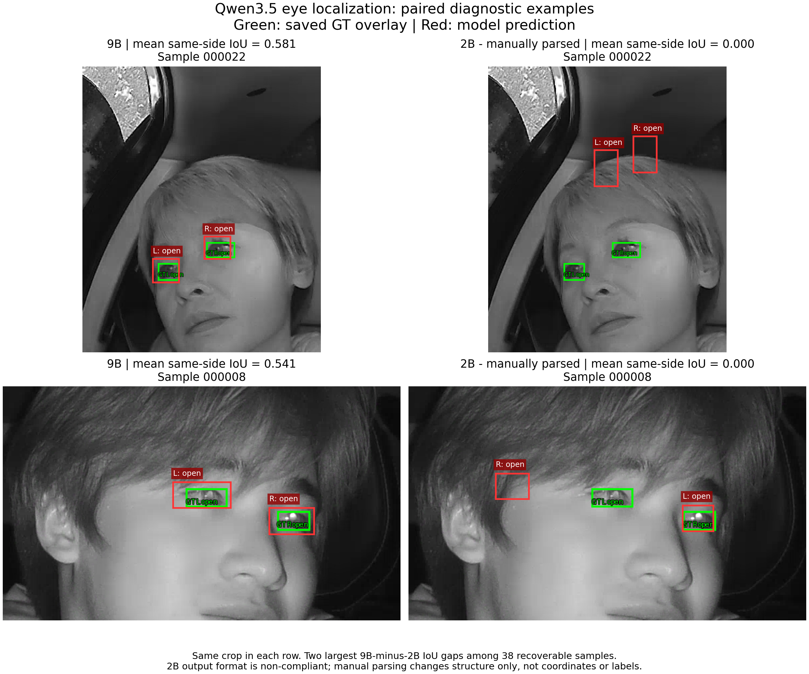

# 1 Qwen3.5-9B与2B睁闭眼开发集对照

本报告检验9B相对2B在当前整图眼睛定位与状态任务上的优势。**即使按人工规则恢复2B的不合规输出，9B在眼框定位上的优势仍然明显，差异并非仅来自JSON解析失败。** 在共同可比较的38张图上，9B的同侧平均IoU为0.289，2B为0.033；9B在36张图上IoU更高，2B在2张图上更高。

状态分类优势较小，且不是每一类都领先：共同38图中，忽略IoU门槛的状态准确率为9B 68.4%、2B 65.8%，closed召回则是2B更高。因此结论是“9B在本轮具有更可靠的接口输出和明显更好的定位”，而不是“9B所有能力都优于2B”或“已达到部署要求”。本报告独立保存，不更新其他入口、主记录或阶段状态。

## 1.1 对照条件与证据

两组运行均已完成40图推理。核对manifest、逐图GT及图像尺寸，样本和顺序完全一致；逐图JSON与results.jsonl一致。记录的配置除模型、GPU及输出路径外一致。

| 固定项 | 两组共同配置 |
|---|---|
| 样本 | 67、68批次各20张，共40图/80眼 |
| GT类别 | open 54眼、closed 13眼、narrow 10眼、occluded 3眼 |
| 抽样种子 | 20260921 |
| Prompt | 同一旧版Norm1000定位与四类状态模板，尚未采用后续优化prompt |
| 输入tokens | 每张两模型相同；范围2536–4792，均值4228 |
| Context / 输出上限 | 5600 / 256；两组均无hit_token_limit |
| 依赖 | PyTorch 2.10.0+cu128，Transformers 5.2.0 |
| 模型目录 | Qwen3.5-2B、Qwen3.5-9B；仅有目录标识，未冻结精确权重revision |
| GPU参数 | 2B为0，9B为1；不用于本报告的速度或资源比较 |

这是对已有输出的离线分析，未重新执行GPU推理，未改动原始结果或推理脚本。源文件路径、SHA256、两组配置及40图的原始输出/GT/预测保存于本报告的直接证据附件。保存配置中的coordinate_policy仍描述“absolute pixel/no automatic rescaling”，但逐图核对确认可解析预测实际按Norm1000还原；本报告以实际坐标和独立复算为依据，不照搬该过时描述。

## 1.2 2B人工解析规则及原始格式失败

**2B输出格式不合规，下文“2B人工解析”结果采用人工确认规则离线提取，不等于原始脚本评分。** 该处理仅用于把格式错误与视觉能力分开分析。

允许的结构处理：

1. 去除首尾Markdown代码围栏。两模型均为40/40带围栏，原解析器也允许剥离，因此9B的100%可解析不等于严格裸JSON合规。
2. 顶层是仅含一个对象的数组时，取出该对象；不处理多目标数组或重新选择驾驶员。
3. 将明确的二维框字段bbox_2d、bbox_视为bbox。要求4个合法Norm1000整数，xyxy非退化，state属于四类。
4. 按原图W/H进行x=W*x_norm/1000、y=H*y_norm/1000的单次还原；**不修改坐标、不调整标签、不交换左右、不依据GT修正结果**。
5. bbox_3d无法按这套规则恢复，2图保持invalid；不投影三维框或补造二维框。

2B中34图为顶层数组，其中32图还使用bbox_2d；4图虽为顶层对象，但使用bbox_3d或bbox_（各2图）。原脚本只有2/40可解析，人工规则共恢复38/40。所有格式故障均已有生成输出，且未被生成长度上限截断。

报告使用两种分母：完整40图用于保留不可恢复失败；共同38图用于排除2B两张不可恢复图对模型视觉对照的影响。38图包含原本可解析的2图，不是另选样本。

## 1.3 定位与端到端对照

定位采用**不交换左右的同侧IoU**，连续面积计算、不加1；定位召回是同侧IoU≥0.5的眼数/GT眼数。单眼端到端还要求state一致；双眼成功要求同图两眼同时满足。完整40图口径中invalid眼的IoU为0，定位与端到端计失败。

| 指标 | 2B人工解析：完整40图 | 9B：完整40图 | 2B人工解析：共同38图 | 9B：共同38图 |
|---|---:|---:|---:|---:|
| 可评分图数 | 38/40 | 40/40 | 38/38 | 38/38 |
| 同侧平均IoU | 0.0309 | 0.2880 | 0.0325 | 0.2885 |
| 同侧IoU≥0.5 | 1/80，1.25% | 10/80，12.50% | 1/76，1.32% | 10/76，13.16% |
| 单眼端到端成功 | 1/80，1.25% | 10/80，12.50% | 1/76，1.32% | 10/76，13.16% |
| 双眼同时成功 | 0/40 | 2/40，5.00% | 0/38 | 2/38，5.26% |
| 状态准确率，不设IoU门槛 | 50/80，62.50% | 56/80，70.00% | 50/76，65.79% | 52/76，68.42% |
| 四类macro-F1，不设IoU门槛 | 0.3263 | 0.4136 | 0.3347 | 0.4106 |

共同38图中，9B平均IoU约为2B的8.9倍，定位召回高11.84个百分点，单眼定位及端到端成功数均为10对1。成对比较：36图9B更好、2图2B更好，无平局。反例为000002（2B/9B两眼平均IoU 0.250/0.214）和000009（0.499/0.484），说明优势是本轮总体趋势，并非逐图支配。

原始未进行人工结构恢复时，2B的可解析率为5%、平均IoU和端到端成功率为0；人工恢复后仍明显落后，支持“9B优势不只来自更容易解析”。但9B完整40图只有12.5%的单眼端到端成功率，仍不满足高质量定位的要求。9B全部80个框面积大于GT，面积比中位数3.27倍，框偏大是主要误差之一。

## 1.4 睁闭眼与四类状态差异

以下按原输出的左右对应评价状态，不先用IoU筛选眼睛。2B完整40图不可恢复的4眼计invalid。该指标衡量模型给对应侧标签的准确性，不能替代“定位正确且状态正确”的端到端能力。

| GT类别 | GT眼数 | 2B人工解析正确数/召回 | 9B正确数/召回 |
|---|---:|---:|---:|
| open | 54 | 38/54，70.4% | 43/54，79.6% |
| closed | 13 | 12/13，92.3% | 11/13，84.6% |
| narrow | 10 | 0/10，0% | 2/10，20.0% |
| occluded | 3 | 0/3，0% | 0/3，0% |

2B仅输出open/closed，没有narrow或occluded；9B能够输出narrow，但其中8/10的GT narrow仍被判为closed。两模型均把3个occluded判为open。9B在open及narrow上更好，2B在closed上更好；共同38图的状态准确率仅相差2/76眼、2.63个百分点，不能描述为显著的睁闭状态分类全面优势。

9B原汇总中的“匹配后状态准确率100%”仅覆盖10个定位成功的open眼睛，不是全80眼或四类准确率。本报告同时报告不设IoU门槛的状态指标与端到端指标，避免该筛选偏差。

## 1.5 两组差异较大的2×2图像对照

每行是同一图片、同一裁剪，左列9B，右列2B人工解析。绿色为保存的GT框，红色为模型框；L/R表示image_left_eye/image_right_eye，不是解剖左右。背景来自对应2B失败样本的GT-only overlay，没有原始预测框；在相同背景上分别叠加两模型预测。裁剪仅用于展示，不改变任何评分坐标或模型输入。

选样规则是在38张可恢复图中，按“9B减2B的两眼平均同侧IoU差值”降序，取前2张。它们是解释定位优势的精选案例，整体结论来自完整38/40图统计，不来自这4个面板。

| 样本 | 9B两眼平均IoU | 2B人工解析两眼平均IoU | 主要差异 |
|---|---:|---:|---|
| 000022_8b663a8908 | 0.581 | 0 | 9B框落在眼部并与GT重叠；2B框明显偏向头发/额头区域。两者标签均为open，差异主要来自定位。 |
| 000008_1a4814c000 | 0.541 | 0 | 9B定位双眼；2B的image_left_eye框落在图像右眼附近，image_right_eye框又偏向另一侧且偏移，存在左右标识反转。人工解析未交换左右。 |

## 1.6 结论与边界

本次同图、同GT、同prompt对照支持：**9B具有更稳定的结构化输出和更好的整图眼睛定位，即使对2B做人工格式恢复，优势仍存在。** 因此本轮证据支持继续以9B为主要定位微调候选，2B可保留为后续小模型对照；这不是新的部署选型完成声明。

边界包括：

- 这是开发集抽样诊断，不是已冻结验证集上的正式baseline，也不证明泛化或统计显著性。
- 人工解析是事后诊断规则，不能把38/40写成2B原始接口合规率或自动评估成功率。
- 两组均使用旧GT按框中心排序口径；后续正式评估应使用约定的id=2/image_left_eye、id=1/image_right_eye，并保持数据排除规则。
- prompt约定Norm1000；人工解析遵循该尺度，不尝试以像素尺度、左右重排或GT修框优化2B成绩。
- 四类数据不均衡，occluded仅3眼；不能凭匹配后的100%或总体准确率宣称四类能力达标。
- 当前工件不记录完整模型revision、processor预算及全部解码设置，不声称仅参数规模是唯一因果变量；没有耗时/显存证据，不比较速度、成本或吞吐。
- 已有主实验记录的旧9B诊断为IoU约0.352、15/80匹配、5/40双眼成功；本次保存工件为0.288、10/80、2/40。运行身份差异尚未追溯，保留为独立报告，不替换或合并旧数字。

## 1.7 证据与复核

[逐样本人工解析及复算证据](assets/Qwen3.5-9B-vs-2B/2026-10-09/comparison_evidence.json)保存原始路径及源文件hash、两组config、全部40图的GT/原始输出/恢复规则/预测、完整与共同样本指标及图像选样依据。该JSON是本报告引用的可复核证据附件，不替代用户原始运行结果。

源目录为/mnt/d/qwen_models/download/s01-2B/eval_001和s01-9B/eval_001。复核已确认manifest一致、GT及图像尺寸一致、每个case与results.jsonl一致；9B原汇总指标与逐图独立复算一致，已存预测的Norm1000还原正确。2B38个恢复对象的框均满足二维Norm1000基本约束。未执行新的云端推理。

附件SHA256：

- comparison_evidence.json：1f8f38b97d331490173b00f56aa267025b4c3d1905d966fed877e471cd9ec5d0
- comparison_2x2.png：381b5d658d652862347a029d97947864c965fdfaef96893c7240d60e673eadf7
