# 1 Agent 开发系统学习文档

## 1.1 文档定位

本文解决“Agent 开发知识零散、能谈术语但不能连续设计和验证系统”的问题。它是 AI-Career-Transition 项目中的持久学习材料，不是 current 文档、正式知识或掌握证明。

当前项目阶段为 `Phase 1-A closure - LLM minimum mechanism`。本文只预先建立 Agent Systems 全景与后续练习顺序；Phase 1-A 未闭合前不把 Agent Systems 或 Phase 1-B 提升为当前主阶段。

## 1.2 知识地图与推荐顺序

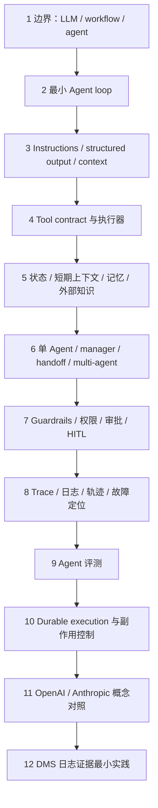

推荐学习闭环不是“读完 12 章”，而是逐章执行：

```text
主动回忆题 → 暴露缺口 → 阅读本章主干 → 跑小实验 → 解释观察 → 记录未闭合项
```

## 1.3 全局系统模型

Agent 系统可以先抽象为六个相互独立但协作的面：

| 面 | 核心问题 | 不能被什么替代 |
|---|---|---|
| Decision | 下一步是回答、调用工具、转交、暂停还是终止？ | 不能被固定 prompt 文案替代。 |
| Execution | 谁校验并真正执行工具？ | 不能让模型文本直接产生副作用。 |
| State | 当前任务走到哪里，哪些事实已确认？ | 不能只依赖聊天历史。 |
| Control | 什么动作允许、拒绝或需要审批？ | 不能只靠模型“自觉”。 |
| Evidence | 结论由哪些输入、工具结果和规则支持？ | 不能只保留最终答案。 |
| Evaluation | 任务是否成功，过程是否安全且划算？ | 不能只看输出是否流畅。 |

---

# 2 Agent、workflow 与普通 LLM 调用的边界

## 2.1 学习目标

- 能用“控制权在哪里”区分三种系统。
- 能判断何时不需要 Agent。
- 能解释 Agent 增加的收益、成本和风险。

## 2.2 核心机制

普通 LLM 调用是一次映射：

\[
y \sim p_\theta(y \mid x, I)
\]

其中应用准备输入 `x` 和 instructions `I`，模型返回 `y`，没有依据中间环境反馈继续自主选择动作。

workflow 允许多次 LLM 或工具调用，但主要控制流由代码预定义：

\[
s_{t+1}=f_{code}(s_t, o_t)
\]

Agent 的下一动作主要由模型基于当前状态和观察决定，同时仍受代码状态机、工具白名单和安全策略约束：

\[
a_t \sim \pi_\theta(a \mid s_t, I, O_t),\quad s_{t+1}=T(s_t,a_t,o_t)
\]

关键不是“调用了几次模型”，而是模型是否在闭环中拥有受约束的下一步决策权。

## 2.3 状态与数据流

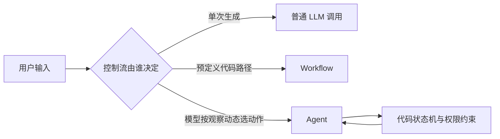

## 2.4 最小伪代码

```python
def classify_architecture(task):
    if task.can_finish_in_one_model_call and not task.needs_external_action:
        return "llm_call"
    if task.steps_are_known_and_stable:
        return "workflow"
    if task.next_step_depends_on_unknown_intermediate_results:
        return "agent"
    return "workflow_with_explicit_decision_points"
```

## 2.5 常见失败模式

- 把“链式调用”都叫 Agent，掩盖真实控制流。
- 为固定审批链引入自由规划 Agent，增加成本和不可预测性。
- 用一个长 prompt 模拟状态机，无法可靠恢复或审计。
- 把“能调用工具”误当作“应自动执行高风险工具”。

## 2.6 适用边界

- 稳定、可枚举、强合规路径优先 workflow。
- 单次抽取、分类、改写优先普通调用或结构化输出。
- 中间结果不可预知、需要探索和调整时，才值得引入 Agent loop。

## 2.7 官方来源

- OAI-01：Responses API 与 Agents SDK 的 loop 所有权边界。
- ANT-01：workflow 由预定义代码路径编排，agent 由模型动态控制过程和工具使用。
- ANT-08：Agent 以计划—行动—观察—调整的自导 loop 工作。

## 2.8 主动回忆题

一个系统固定执行“检索 → 摘要 → 规则校验 → 输出”，其中摘要和校验都调用 LLM。它为什么仍可能只是 workflow，而不是 Agent？什么最小变化会让它跨过边界？

## 2.9 小实验

用同一个三步资料整理任务分别写两个 20 行以内的版本：A 用固定 `for`/`if`，B 让模型在 `search / refine / finish` 中选择。记录两者的调用次数、失败可复现性和停止条件，不比较文风。

---

# 3 最小 Agent loop 与状态转换

## 3.1 学习目标

- 能画出一轮和多轮工具调用的完整状态转换。
- 能区分 model decision、tool execution 与 final output。
- 能说明每个终止条件由谁检查。

## 3.2 核心机制

最小 loop：

```text
user input → model decision → tool call → tool result → next decision → final output
```

模型返回的是“动作提议”，不是工具执行事实。运行时必须把输出解析为有限动作集合，例如：

```text
DECIDE -> CALL_TOOL | FINAL | REQUEST_APPROVAL | ABSTAIN | FAIL
CALL_TOOL -> VALIDATE -> EXECUTE -> OBSERVE -> DECIDE
```

终止至少包括：正常完成、拒答/证据不足、审批暂停、最大轮数、预算耗尽、不可恢复错误和取消。

## 3.3 状态图

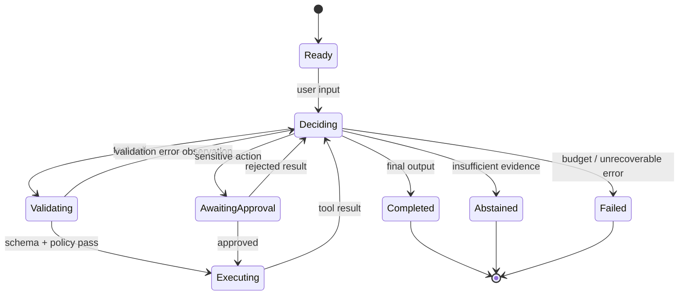

## 3.4 必要指标

设一次 run 发生 `N_model` 次模型调用、`N_tool` 次工具调用，总延迟近似为：

\[
L_{run}=\sum_{i=1}^{N_{model}}L_{model,i}+\sum_{j=1}^{N_{tool}}L_{tool,j}+L_{queue}+L_{approval}
\]

最大轮数只是保险丝，不是完成策略；正常任务应由显式 `FINAL/ABSTAIN` 条件结束。

## 3.5 最小伪代码

```python
state = RunState(input=user_input, step=0)
while state.step < MAX_STEPS:
    decision = model.decide(render_context(state))
    audit.append(decision)

    if decision.kind in {"final", "abstain"}:
        return finalize(decision, state)
    if decision.kind == "needs_approval":
        return Paused(state=snapshot(state), request=decision)
    if decision.kind != "tool_call":
        return Failed("invalid_decision", snapshot(state))

    checked = validate_call(decision.call, policy, schemas)
    result = execute_or_error(checked)
    state = state.observe(result).next_step()

return Failed("max_steps_exceeded", snapshot(state))
```

## 3.6 常见失败模式

- 只处理 `tool_call` 和 final text，不处理 refusal、截断、取消和审批暂停。
- 工具异常直接抛出 loop，模型看不到结构化失败观察。
- 工具结果没有 call ID，平行调用后无法正确关联。
- 到达最大轮数时仍输出看似正常的总结。

## 3.7 适用边界

最小 loop 适合学习和窄任务。生产系统还需要持久 state、并发控制、审计、取消、幂等和恢复。

## 3.8 官方来源

- OAI-03：Runner loop、conversation strategy、paused run 与 state 恢复。
- OAI-05：function calling 的应用执行往返。
- ANT-02：`tool_use → execute → tool_result` canonical loop 与 stop reason。

## 3.9 主动回忆题

为什么收到一个 schema 合法的 `delete_record` tool call 后，状态不能直接从 `Deciding` 跳到 `Completed`？

## 3.10 小实验

实现一个只有 `add(a,b)` 和 `finish(answer)` 的假 Agent。依次注入：合法调用、未知工具、缺参数、工具超时、连续 6 次调用。观察每种输入最终落在哪个状态。

---

# 4 Instructions、structured output 与上下文管理

## 4.1 学习目标

- 区分 instructions、输入数据、structured output 和运行时上下文。
- 理解“输出符合 schema”不等于“结论正确或动作获准”。
- 能设计最小而高信号的上下文。

## 4.2 核心机制

`instructions` 定义职责、约束和决策启发式；structured output 定义机器可消费的数据形状；context 决定本轮模型实际能看到什么。

建议把信息分成四层：

1. 稳定规则：角色、边界、优先级、终止/拒答规则。
2. 当前输入：用户目标与本轮数据。
3. 运行观察：必要的工具结果、错误和阶段摘要。
4. 代码私有上下文：认证主体、数据库 client、logger、policy engine，不自动暴露给模型。

上下文效用可用一个设计目标表达：

\[
\max_C\; U(C)=Signal(C)-\lambda_1 Tokens(C)-\lambda_2 Conflict(C)-\lambda_3 LeakageRisk(C)
\]

它不是可直接测量的物理公式，而是提醒：上下文越多不等于越好。

## 4.3 数据流图

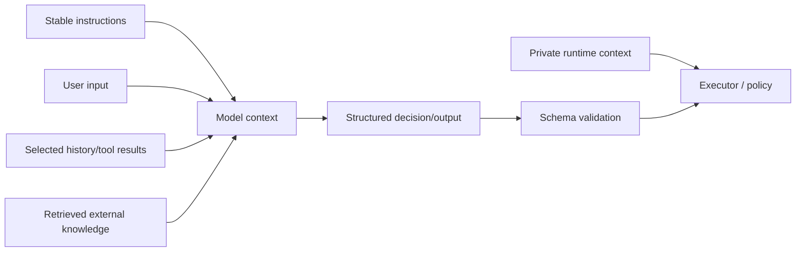

## 4.4 最小伪代码

```python
context = ContextBuilder(token_budget=12_000)
context.add_stable(instructions)
context.add_current(user_input)
context.add_recent(select_recent_turns(history, n=4))
context.add_evidence(retrieve(query=user_input, limit=5))

decision = model.generate(
    input=context.render(),
    output_schema=DecisionSchema,
)
validated = DecisionSchema.validate(decision)
authorized = policy.check(validated, private_run_context)
```

## 4.5 常见失败模式

- 把不可信网页或工具结果拼进高优先级 instructions。
- 只要求“返回 JSON”，却不校验 schema、refusal 和 incomplete 状态。
- 将认证 token、内部对象或敏感路径放进模型上下文。
- 历史无限累积，旧目标覆盖新目标，tool result 占满窗口。
- summary 把“推测”压成“事实”，形成记忆漂移。

## 4.6 适用边界

- schema 适合稳定下游合同，不适合表达无法枚举的全部自然语言质量。
- context trimming 适合丢弃低价值旧细节；关键承诺、审批和任务状态应另行持久化。

## 4.7 官方来源

- OAI-02：instructions、structured output 与 local run context 的边界。
- OAI-06：Structured Outputs 与 JSON mode 的差异及异常分支。
- OAI-12：不可信变量、结构化数据流与 prompt injection 风险。
- ANT-05：context 是有限 attention budget，需要选择、压缩和外部 note。

## 4.8 主动回忆题

某模型稳定返回符合 schema 的 `{conclusion, evidence_ids}`，为什么系统仍可能产生 unsupported claim？

## 4.9 小实验

固定一个问答任务，运行三组上下文：完整 50 条历史、最近 5 条、最近 5 条加结构化任务摘要。记录输入 token、是否引用正确 evidence ID、延迟和错误类型。

---

# 5 Tool schema、校验、执行器与错误语义

## 5.1 学习目标

- 能把工具看成跨越信任边界的 typed contract。
- 能设计参数校验、超时、重试、幂等和错误返回。
- 能判断哪些错误可重试，哪些必须停止或审批。

## 5.2 核心机制

一个可靠工具至少包含：名称、用途、输入 schema、业务前置条件、执行权限、timeout、幂等策略、错误 taxonomy、输出 schema 和审计字段。

工具处理链：

```text
model arguments
  → schema validation
  → semantic validation
  → authorization / approval
  → idempotency check
  → execution with timeout
  → normalized result or error
  → observation returned to loop
```

重试只适合瞬态失败。若每次独立尝试成功概率为 `p`，最多 `r` 次尝试的理论成功概率为：

\[
P(success\le r)=1-(1-p)^r
\]

但副作用工具若没有幂等键，重试会把“提高可用性”变成“重复执行”。

## 5.3 数据流图

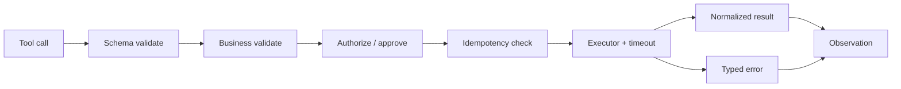

## 5.4 最小伪代码

```python
def run_tool(call, principal, deadline):
    spec = registry.require(call.name)
    args = spec.schema.validate(call.arguments)
    spec.validate_business(args)
    policy.authorize(principal, spec.capability, args)

    key = idempotency_key(call.run_id, call.call_id, args)
    if cached := result_store.get(key):
        return cached

    for attempt in range(spec.max_attempts):
        try:
            result = with_timeout(deadline, spec.execute, args)
            normalized = spec.output_schema.validate(result)
            result_store.commit_once(key, normalized)
            return ToolResult.ok(call.id, normalized)
        except TransientError as exc:
            if attempt + 1 == spec.max_attempts:
                return ToolResult.error(call.id, "transient_exhausted", str(exc))
        except (ValidationError, PermissionError) as exc:
            return ToolResult.error(call.id, "non_retryable", str(exc))
```

## 5.5 错误分类

| 错误 | 默认动作 | 是否重试 |
|---|---|---|
| schema_invalid | 返回精确字段错误 | 否，除非让模型修参后形成新调用 |
| precondition_failed | 返回当前状态与缺失前置条件 | 通常否 |
| permission_denied | 拒绝或申请审批 | 否 |
| rate_limited / unavailable | 退避并限制次数 | 是 |
| timeout_unknown_outcome | 先查幂等记录/远端状态 | 禁止盲重试 |
| partial_success | 返回已完成子项和补偿需求 | 按业务合同 |
| internal_bug | fail closed，保留 trace | 否 |

## 5.6 常见失败模式

- schema 过宽，例如任意字符串命令或任意文件路径。
- 校验只做类型检查，不做路径、租户、状态和业务范围检查。
- 把 exception 文本直接作为成功 tool result。
- 对所有错误统一重试，造成雪崩或重复副作用。
- timeout 后不知道远端是否成功，却立即再调用一次。

## 5.7 适用边界

- 幂等键只能阻止同一业务动作重复提交，不能自动撤销已产生的外部影响。
- strict schema 提高参数可靠性，但不判断用户是否授权或事实是否充分。

## 5.8 官方来源

- OAI-04/OAI-05：工具语义和 function-calling 往返。
- OAI-06：strict schema 与异常处理边界。
- ANT-02/ANT-03/ANT-04：工具契约、严格输入、call/result 关联与结构化错误。

## 5.9 主动回忆题

一个支付工具返回 timeout。为什么“最多重试 3 次”不是完整可靠性策略？你还需要观察什么状态？

## 5.10 小实验

写一个 mock `create_ticket` 工具：第一次执行成功但故意在返回前 timeout。分别用“无幂等键”和“持久 idempotency key”重试，观察最终创建数量。

---

# 6 会话状态、短期上下文、持久记忆与外部知识

## 6.1 学习目标

- 能区分四种经常被混称为 memory 的数据。
- 能为每种数据指定 owner、生命周期和一致性策略。
- 能解释恢复 state 不等于重新塞入完整聊天记录。

## 6.2 核心机制

| 层 | 含义 | 典型内容 | 生命周期 | 真相责任 |
|---|---|---|---|---|
| 会话状态 | workflow 当前执行位置 | step、pending call、approval、budget | 一次 run/会话 | 状态存储 |
| 短期上下文 | 本轮模型可见 token | instructions、近期消息、选中 tool results | 一次推理 | context builder |
| 持久记忆 | 跨会话复用的提炼状态 | 用户偏好、任务摘要、长期计划 | 多会话 | memory store + 审核策略 |
| 外部知识 | 独立于会话的领域资料 | 文档、数据库、证据卡、索引 | 资料生命周期 | 原始知识系统 |

检索到上下文的过程应保留来源：

\[
Context_t = I + Recent_t + Retrieve(K, q_t) + Recall(M, q_t) + StateSummary_t
\]

其中 `K` 与 `M` 不应因为被召回就复制成新的事实源。

## 6.3 状态图

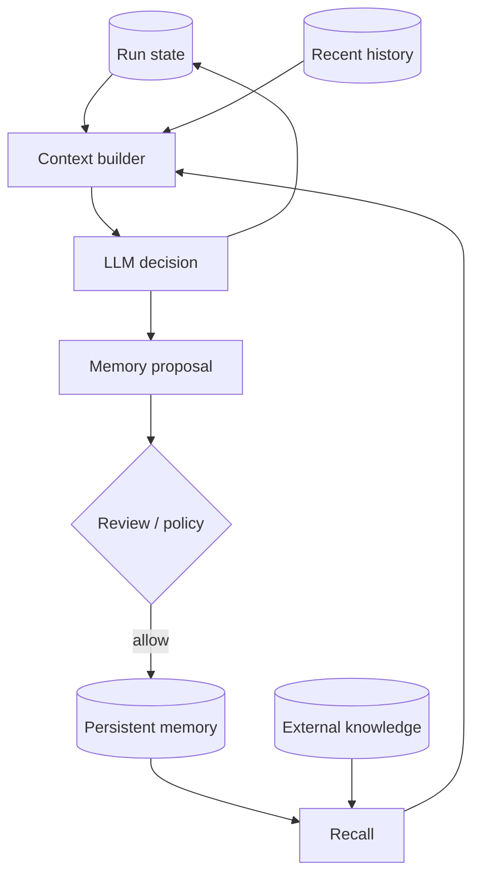

## 6.4 最小伪代码

```python
def build_model_context(run_id, query):
    state = run_store.load(run_id)
    return {
        "instructions": POLICY_PROMPT,
        "task_state": state.compact_summary(),
        "recent_messages": history.tail(run_id, 6),
        "memory_hits": memory.search(query, limit=3),
        "knowledge_hits": kb.retrieve(query, limit=5, with_citations=True),
    }
```

## 6.5 常见失败模式

- 把模型生成的 summary 自动写成长期事实。
- 混用 SDK session 与应用自带完整历史，导致上下文重复。
- 记忆没有租户/用户隔离或删除策略。
- 外部知识只保留向量摘要，不保留原文定位。
- 恢复时只加载聊天文本，不加载 pending side effect 和审批状态。

## 6.6 适用边界

- 对高风险事实，持久记忆应存“引用与状态”，不静默复制原文结论。
- 对短任务，内存 session 足够；跨进程、跨天或带审批的任务需要持久 state。

## 6.7 官方来源

- OAI-02：conversation history 与 local run context。
- OAI-03：history、session、conversation 和 previous response 的选择边界。
- ANT-05：context trimming、tool result clearing 与 structured note-taking。

## 6.8 主动回忆题

“用户偏好简洁回答”“当前正在等待审批”“某份规范的正文”分别属于哪一层？为什么不能存进同一个 messages 数组就算完成？

## 6.9 小实验

设计一个跨两次进程启动的任务：第一次停在审批前，第二次恢复。只持久化聊天历史运行一次，再持久化显式 RunState 运行一次，比较是否会重复工具调用。

---

# 7 单 Agent、manager、handoff 与 multi-agent

## 7.1 学习目标

- 能从“最终答复所有权”和“上下文/策略隔离”选择编排模式。
- 能识别过早拆分 multi-agent 的协调税。
- 能说明并行成立的必要条件。

## 7.2 核心机制

选择顺序：

1. 单 Agent + 清晰工具能否完成？
2. 固定步骤能否用 workflow 更可靠地完成？
3. manager 是否需要保持最终答复和全局策略所有权？
4. specialist 是否应真正接管该分支的用户对话？
5. 子任务是否独立到可以并行，且合并合同清楚？

| 模式 | 最终答复 owner | 适合 | 主要代价 |
|---|---|---|---|
| 单 Agent | 单 Agent | 一套规则/工具、上下文可容纳 | prompt 可能膨胀 |
| Manager + agents-as-tools | manager | specialist 是有界能力，需统一综合 | nested calls、成本与 trace 复杂度 |
| Handoff | 接管的 specialist | 不同责任/工具/策略，应转移对话所有权 | 用户体验和状态延续更复杂 |
| Orchestrator-worker | orchestrator | 可并行探索、结果可压缩合并 | 协调、重复、token 与失败聚合 |

## 7.3 数据流图

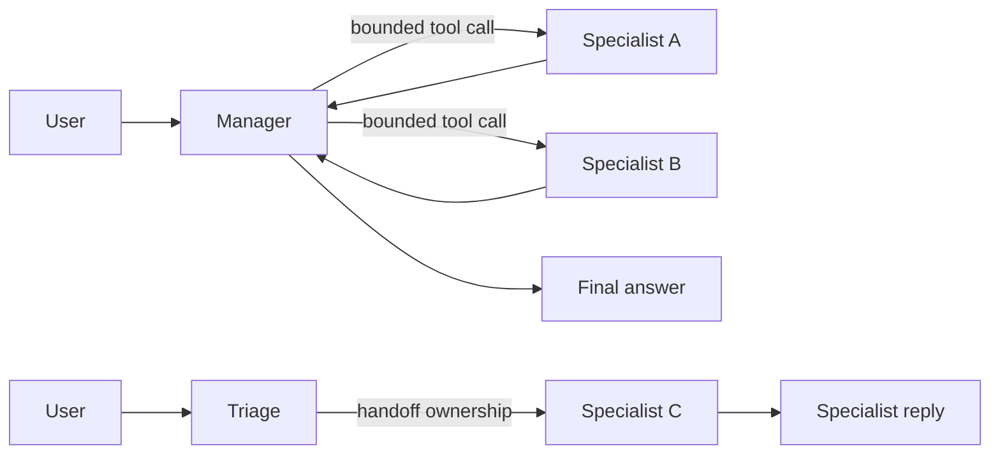

## 7.4 指标与判断

并行理论加速比可粗略写为：

\[
Speedup \approx \frac{\sum_i L_i}{\max_i L_i + L_{coord}+L_{merge}}
\]

若共享依赖多、协调/合并成本高，`Speedup` 可能小于 1。

## 7.5 最小伪代码

```python
def choose_pattern(task):
    if one_policy_toolset_context(task):
        return "single_agent"
    if task.fixed_steps:
        return "workflow"
    if task.specialists_are_bounded and task.needs_one_final_owner:
        return "manager_agents_as_tools"
    if task.branch_requires_new_owner:
        return "handoff"
    if task.subtasks_independent and task.merge_contract_is_explicit:
        return "orchestrator_worker"
    return "single_agent_with_better_tools"
```

## 7.6 常见失败模式

- 为角色名字而拆 Agent，实际 instructions、工具和策略没有差异。
- 子 Agent 没有任务边界和输出 schema，结果重复或遗漏。
- 并行子任务共享可变状态，产生竞态和相互覆盖。
- manager 只拼接结果，不做证据去重、冲突处理和最终责任判断。
- handoff 后丢失用户约束或审批状态。

## 7.7 适用边界

- 高依赖、需共享全部上下文的任务不适合当前多 Agent 并行。
- 低价值任务不值得支付显著 token 和协调成本。

## 7.8 官方来源

- OAI-07：handoff 与 agents-as-tools 的答复所有权。
- OAI-02：只有责任、工具、策略或模型实质变化时再拆分。
- ANT-01：优先简单可组合模式。
- ANT-06：orchestrator-worker 的适用条件、成本与失败模式。

## 7.9 主动回忆题

一个 DMS 证据任务需要日志解析、规则核验和最终报告。什么证据能证明应该拆成三个 Agent，而不是一个 Agent 调三个确定性工具？

## 7.10 小实验

对同一合成研究任务分别运行单 Agent 与 3 个并行 specialist。记录 token、墙钟时间、重复事实数、冲突数和最终缺失项；不以“用了 multi-agent”作为成功指标。

---

# 8 Guardrails、权限、审批、拒答与 human-in-the-loop

## 8.1 学习目标

- 能把安全控制放到正确层，而不是只写在 prompt。
- 能区分自动 guardrail、授权、审批、拒答和澄清。
- 能设计 paused run 的恢复合同。

## 8.2 核心机制

四层控制：

1. 输入层：检测越权目标、注入、敏感数据和缺失授权。
2. 决策层：限制可用工具、目标路径、预算和终止条件。
3. 执行层：schema、业务校验、最小权限、sandbox、审批和幂等。
4. 输出层：证据完整性、敏感信息、unsupported claim 和格式校验。

风险分级可用于审批策略：

\[
Risk = Impact \times Irreversibility \times Uncertainty \times Exposure
\]

它用于排序，不应伪装成精确概率。高风险动作应优先 dry-run、缩小权限或人工审批。

## 8.3 状态图

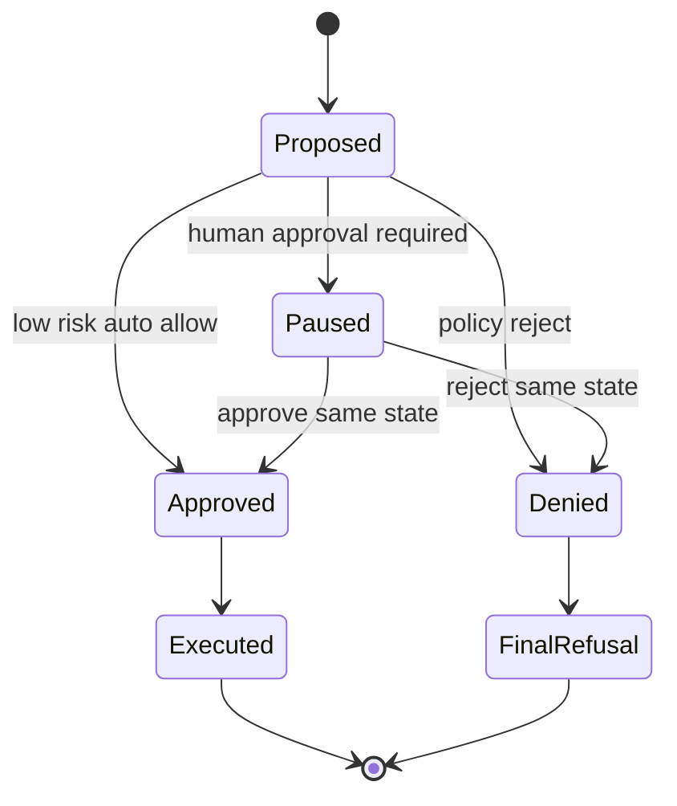

## 8.4 最小伪代码

```python
decision = policy.evaluate(principal, tool_call, evidence)
if decision.kind == "deny":
    return observation("permission_denied", decision.reason)
if decision.kind == "approve_required":
    return pause(snapshot(run_state), approval_request(decision))
if decision.kind == "allow":
    return executor.run(tool_call)
```

## 8.5 常见失败模式

- guardrail 与主模型同样依赖模糊自然语言，却被当作绝对安全边界。
- 只在 UI 显示确认，后端执行器不验证 approval token 和调用参数是否一致。
- 审批后新开一轮，导致原 pending call 被重新规划或重复执行。
- 对所有失败统一拒答，丢失可澄清和可降级路径。
- trace 默认记录敏感 prompt、工具参数和凭证。

## 8.6 适用边界

- HITL 不能替代最小权限；频繁无差别确认会造成 approval fatigue。
- 拒答适用于目标禁止或证据不足；信息缺失但可安全补齐时优先澄清。

## 8.7 官方来源

- OAI-08：input/output/tool guardrails 与 resumable approval。
- OAI-12：prompt injection、structured data flow、工具确认和组合防护。
- ANT-08：model、harness、tools、environment 四层与 meaningful human control。

## 8.8 主动回忆题

为什么“模型在 instructions 中被要求写文件前询问用户”仍不构成可靠审批机制？

## 8.9 小实验

构造一个 `write_report(path, content)` 工具。测试：授权路径、越权路径、同意后参数被篡改、拒绝后重放 approval token。验证执行器能否全部 fail closed。

---

# 9 Tracing、日志、轨迹、可观测性与故障定位

## 9.1 学习目标

- 区分业务日志、结构化事件、trace/span 和完整 trajectory。
- 能从最终失败反向定位到决策、工具、状态或策略层。
- 能设计隐私安全且可关联的最小观测字段。

## 9.2 核心机制

| 观测物 | 回答的问题 |
|---|---|
| log | 某组件报告了什么事件？ |
| metric | 一段时间内发生了多少、多久、成功率怎样？ |
| trace/span | 一次 run 跨模型、工具和服务怎样传播？ |
| trajectory/transcript | 模型看到了什么、决定了什么、环境如何变化？ |
| artifact/evidence | 哪个输入和输出可供复核？ |

最小关联键：`run_id`、`step_id`、`call_id`、`parent_span_id`、`tool_name`、`state_before/after`、`attempt`、`latency_ms`、`outcome`、版本与证据引用。

## 9.3 数据流图

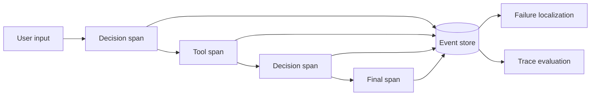

## 9.4 指标

\[
ToolSuccessRate=\frac{N_{successful\ tool\ calls}}{N_{attempted\ tool\ calls}}
\]

\[
TraceCompleteness=\frac{N_{required\ events\ present}}{N_{required\ events}}
\]

日志完整不等于任务正确；它只说明你有机会解释发生了什么。

## 9.5 最小伪代码

```python
with trace(run_id, versions=current_versions()) as run:
    with run.span("model_decision", step=state.step) as span:
        decision = model.decide(context)
        span.record(kind=decision.kind, token_usage=decision.usage)
    with run.span("tool", call_id=decision.call_id) as span:
        result = executor.run(decision.call)
        span.record(outcome=result.status, latency_ms=result.latency_ms)
```

## 9.6 故障定位顺序

1. 最终 outcome 是否真的失败，还是只说失败/成功？
2. state transition 是否合法，是否错误恢复或重复执行？
3. tool call 选择和参数是否正确？
4. tool result 是否完整、关联正确、被正确解释？
5. instructions/context 是否包含冲突或缺失证据？
6. 模型、prompt、tool、policy 和数据版本是否变化？

## 9.7 常见失败模式

- 只记最终文本，不记工具参数、结果与状态转移。
- 每个组件各自生成 ID，无法拼接一次 run。
- trace 采集敏感原文但没有脱敏、访问控制和保留期。
- 用日志存在证明功能正确。
- 先聚合平均值，丢失失败样本和长尾步骤。

## 9.8 适用边界

完整 payload tracing 与隐私/成本冲突；生产环境应按风险采样、脱敏，并保留必要 hash/引用而非全部正文。

## 9.9 官方来源

- OAI-09：模型、工具、handoff、guardrail 和 custom spans 的 SDK tracing。
- OAI-11：对 trace 中的步骤做结构化 grading。
- ANT-07：transcript/trace 与 outcome 的区别。

## 9.10 主动回忆题

Agent 最终回答“工单已创建”，但数据库中没有工单。你至少需要哪三类观测才能定位问题属于模型、工具还是状态层？

## 9.11 小实验

为第 5 章 mock 工具加 JSONL event log。故意制造错误参数、超时后成功和重复调用，写一个脚本只根据事件重建每次 run 的状态路径。

---

# 10 Agent 评测

## 10.1 学习目标

- 能从 task contract 定义 outcome 与过程指标。
- 能区分 task、trial、grader、trace、outcome 和 harness。
- 能报告 task success、tool success、证据完整性、unsupported claim、成本与延迟。

## 10.2 核心机制

评测对象不是裸模型，而是：

```text
model + instructions + tools + executor + state + policy + context + environment
```

任务成功应优先读取环境 outcome，而不是相信最终声明。一个 case 至少定义：输入、初始环境、允许动作、成功条件、证据要求、拒答条件、失败标签和预算。

## 10.3 指标

\[
TaskSuccessRate=\frac{N_{successful\ outcomes}}{N_{trials}}
\]

\[
EvidenceCompleteness=\frac{N_{required\ evidence\ items\ present}}{N_{required\ evidence\ items}}
\]

\[
UnsupportedClaimRate=\frac{N_{unsupported\ material\ claims}}{N_{material\ claims}}
\]

\[
CostPerSuccess=\frac{TotalCost}{N_{successful\ outcomes}}
\]

延迟至少报告 p50/p95，而不是只报均值：

\[
p95 = Q_{0.95}(L_{run})
\]

## 10.4 评测数据流

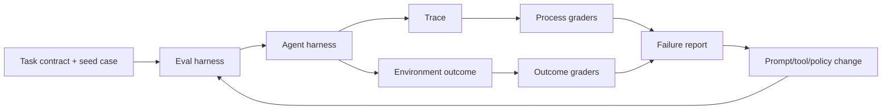

## 10.5 最小伪代码

```python
for case in dataset:
    for trial in range(case.n_trials):
        env = case.reset_environment()
        run = agent_harness.run(case.input, env)
        scores = {
            "task_success": grade_outcome(env, case.success_criteria),
            "tool_success": grade_tool_calls(run.trace),
            "evidence": grade_evidence(run.output, case.required_evidence),
            "unsupported": grade_claim_support(run.output, run.artifacts),
            "cost": run.cost,
            "latency": run.latency,
        }
        save_trial(case.id, trial, run.trace, scores)
```

## 10.6 常见失败模式

- 只看最终文本，没有检查环境最终状态。
- 单次 trial 代表随机系统总体表现。
- LLM judge 未经人工/确定性样本校准。
- 成功率上涨但成本、延迟或危险工具调用显著恶化。
- 为当前模型调整 rubric，造成指标漂移。
- 把 3 至 5 个 seed cases 称为 benchmark。

## 10.7 适用边界

- 确定性 outcome 优先用程序 grader；开放质量可用 rubric + LLM judge + 人工校准。
- trace grader 能定位过程，但不能替代真实环境的 end-state 检查。

## 10.8 官方来源

- OAI-10/OAI-11：从单 trace 调试到可重复 eval run 与 trace grading。
- ANT-07：task、trial、grader、trace、outcome、eval harness 和 agent harness 的定义。

## 10.9 主动回忆题

为什么“最终答案准确率 90%”不足以评价一个会写文件和调用外部系统的 Agent？请给出至少三个可能被掩盖的失败维度。

## 10.10 小实验

为一个证据问答 Agent 写 5 个 seed cases：正常、缺证据、冲突证据、工具失败、越权请求。每个跑 3 次，输出分 case 的 outcome、unsupported claim、工具错误和延迟，不先求单一总分。

---

# 11 Durable execution、恢复、重复执行与副作用控制

## 11.1 学习目标

- 能解释进程恢复与模型会话延续的区别。
- 能处理 at-least-once 执行带来的重复风险。
- 能设计 checkpoint、lease、幂等和补偿边界。

## 11.2 核心机制

Durable execution 的核心不是“永不失败”，而是失败后知道：已完成什么、正在等待什么、什么可以安全重放、什么必须查询或人工处理。

状态快照至少包含：

```text
run_id, version, current_state, step_id,
pending_call, completed_calls, idempotency_keys,
approval_state, evidence_refs, budgets, retry_counters
```

现实系统常是 at-least-once delivery。若外部系统不支持幂等，必须用业务唯一键、结果查询或补偿操作控制副作用。

## 11.3 状态图

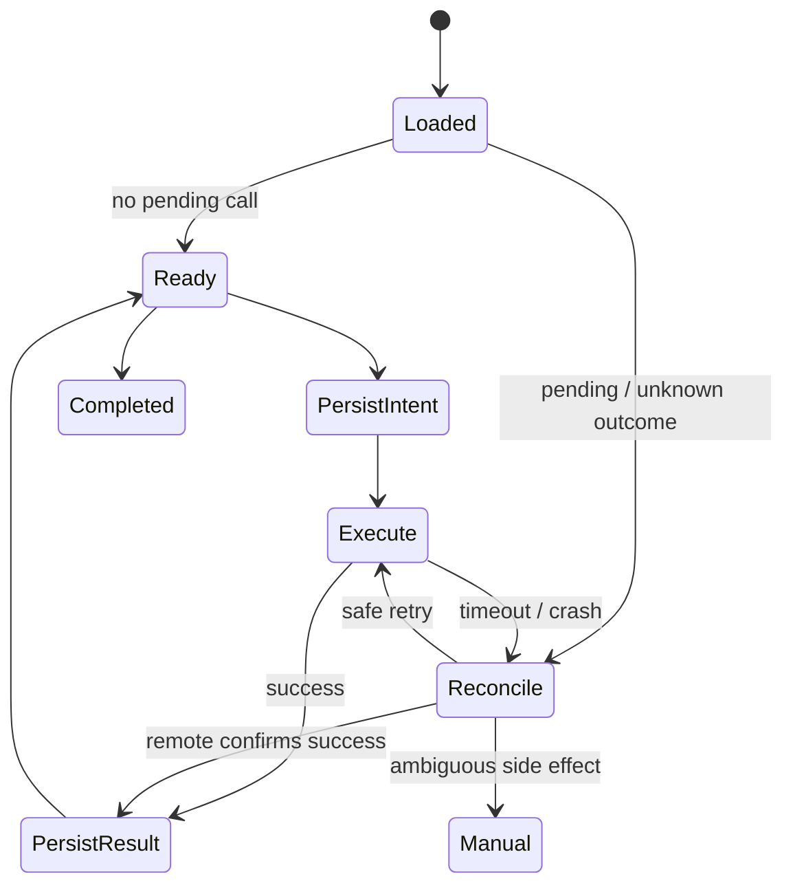

## 11.4 可靠性关系

如果状态提交和副作用不是一个原子事务，就存在两个危险窗口：

1. 先执行副作用、后写状态：崩溃后可能重复执行。
2. 先写完成、后执行副作用：崩溃后可能漏执行。

常用模式是“先持久化 intent → 带幂等键执行 → 查询/提交 result → 推进状态”。

## 11.5 最小伪代码

```python
def execute_step(run, call):
    tx.save_intent(run.id, call.id, call.args_hash)
    previous = tx.get_result(call.id)
    if previous:
        return previous

    result = remote.execute(call.args, idempotency_key=call.id)
    tx.save_result_once(run.id, call.id, result)
    tx.advance_state(run.id, expected_step=run.step)
    return result

def recover(run_id):
    run = store.load(run_id)
    if run.pending_call:
        return reconcile_remote_outcome(run.pending_call)
    return continue_loop(run)
```

## 11.6 常见失败模式

- checkpoint 只保存 messages，不保存 pending side effect。
- 恢复后生成新 call ID，使幂等保护失效。
- worker 没有 lease/fencing token，两个实例同时恢复同一 run。
- 版本升级后直接读取旧 state，没有 migration 或兼容性检查。
- 把“重试成功”误当作“第一次没有产生副作用”。

## 11.7 适用边界

- 只读、纯函数工具恢复简单；写外部系统、资金、消息、文件删除等需更强事务与审批策略。
- 补偿不是回滚；外部世界可能已观察到原动作。

## 11.8 官方来源

- OAI-03：session、resumable run state、审批暂停和继续同一 turn。
- OAI-08：approval lifecycle 与从 state 恢复。
- ANT-04：tool call/result ID 关联和错误返回。
- 注：事务、幂等和补偿的具体实现属于应用工程责任，不能由上述 SDK 文档自动保证。

## 11.9 主动回忆题

系统在远端创建工单成功后、本地保存 result 前崩溃。恢复时最危险的错误是什么？需要哪些持久字段才能安全判断下一步？

## 11.10 小实验

在第 5 章 mock 工具中加入随机崩溃点：save intent 前、远端成功后、save result 后。自动重启 100 次，验证最终外部对象数与期望值一致，并列出无法自动判定的窗口。

---

# 12 OpenAI 与 Anthropic 概念对照

## 12.1 学习目标

- 能识别共同系统原理与框架专有类型。
- 避免把一个 SDK 的名词当作通用 Agent 定义。
- 能基于同一抽象模型迁移实现。

## 12.2 核心对照

| 系统概念 | OpenAI | Anthropic | 共同本质 |
|---|---|---|---|
| Agent unit | Agent definition | model + agent harness | 模型、instructions、工具与运行约束的组合。 |
| Loop | Agents SDK Runner 或 Responses 自管 loop | client tool loop 或 Tool Runner | decision → execute → observe → next decision。 |
| Tool request/result | function call / tool output | `tool_use` / `tool_result` | 模型提议结构化动作，运行时执行并回传。 |
| Structured data | output type / Structured Outputs / strict function schema | `input_schema` / strict tool use / structured outputs | grammar/schema 约束数据形状。 |
| Conversation state | history、session、conversation ID、previous response ID | messages、SDK runner state、context management | 让后续推理获得必要连续性。 |
| Manager pattern | agents-as-tools | orchestrator-worker / subagent tool | 主 Agent 保持综合和最终责任。 |
| Ownership transfer | handoff | 通常由 harness/router 自定义 | 把分支控制权交给 specialist。 |
| Automatic checks | input/output/tool guardrails | harness checks、hooks、validators | 在模型前后或工具周围验证。 |
| Human review | resumable approvals/interruption | manual loop、permissions/HITL | 有副作用动作暂停，审核后继续同一状态。 |
| Trace | SDK trace/spans | transcript/trajectory/logging | 保存一次 run 的因果路径。 |
| Eval | trace grading、datasets/eval runs | task/trial/grader/outcome/eval harness | 同时检查过程与最终环境结果。 |

## 12.3 数据流映射

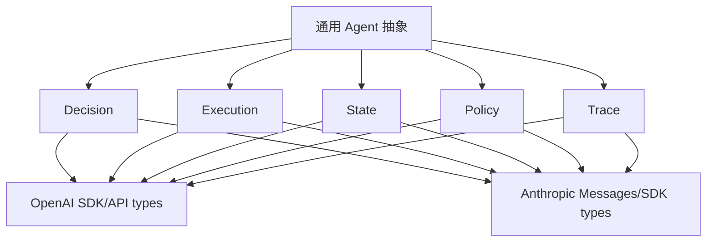

## 12.4 迁移伪代码

```python
class ProviderAdapter(Protocol):
    def decide(self, context, tools, output_schema) -> Decision: ...

class AgentRuntime:
    def __init__(self, provider, executor, state_store, policy, tracer): ...
    # Runtime invariants stay stable; provider wire formats stay in adapter.
```

## 12.5 常见失败模式

- 把 OpenAI handoff 与任意“调用另一个模型”画等号。
- 把 Anthropic `tool_result` wire format复制到 OpenAI executor。
- 迁移 provider 时同时改状态机、工具合同和 rubric，无法归因回归。
- 只比较模型答案，不比较工具/审批/状态的行为差异。

## 12.6 适用边界

通用抽象适合设计和评测；具体实现必须服从当前 provider API、SDK 版本、数据保留和安全边界。

## 12.7 官方来源

- OpenAI：OAI-01 至 OAI-12。
- Anthropic：ANT-01 至 ANT-08。
- 详细链接、访问日期和版本风险见本项目引用的来源证据卡。

## 12.8 主动回忆题

哪些部分可以在 OpenAI 与 Anthropic 之间保持为应用层 invariant？哪些部分必须放进 provider adapter？

## 12.9 小实验

定义 provider-neutral 的 `Decision`、`ToolCall`、`ToolResult` 和 `RunState`。用两个纯 mock adapter 分别模拟 OpenAI/Anthropic wire format，确认同一 runtime 状态测试无需改动。

---

# 13 与 DMS 日志证据任务结合的最小实践路线

## 13.1 学习目标

- 把 Agent Systems 原理落到一个可复核、低副作用的领域任务。
- 先建立单 Agent + 确定性工具闭环，再判断是否需要 multi-agent。
- 用证据完整性和 unsupported claim 约束结论。

## 13.2 最小任务合同

建议首个练习只处理合成或明确授权的 DMS 日志证据包，目标是：

```text
输入：一个任务问题、日志文件清单、允许读取范围、事件/规则配置
输出：结构化事件时间线、证据引用、受约束结论、未知项和拒答状态
非目标：自动修改业务代码、写 Jira/飞书、声称未被日志支持的根因
副作用：第一阶段全部关闭，只生成本地报告草案
```

## 13.3 最小架构

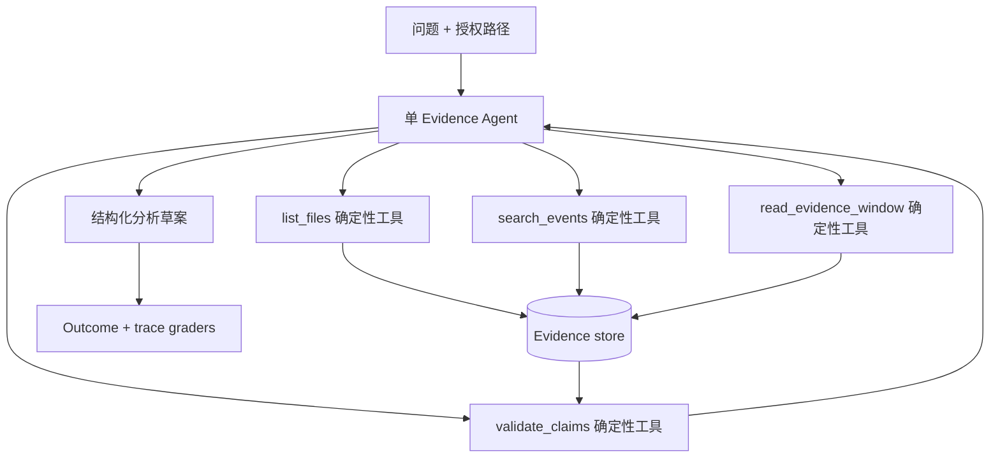

第一版不使用 multi-agent。只有出现以下证据之一再拆分：

- A/R 或不同日志域需要严格不同的授权与工具面。
- 单上下文无法容纳必要证据，且子任务可独立压缩后合并。
- trace 显示一套 instructions 持续造成责任混淆，拆分能形成可测合同。
- 可并行子任务的延迟收益大于协调和重复成本。

## 13.4 数据合同

```python
class EvidenceRef:
    file: str
    line_start: int
    line_end: int
    content_hash: str

class Claim:
    text: str
    evidence_ids: list[str]
    confidence: Literal["high", "medium", "low"]
    status: Literal["supported", "unsupported", "conflicted", "unknown"]

class AnalysisResult:
    task_id: str
    timeline: list[dict]
    claims: list[Claim]
    unresolved_items: list[str]
    abstained: bool
```

## 13.5 最小 loop 伪代码

```python
state = init_task(contract, authorized_paths)
while not state.terminal:
    decision = model.decide(context_from(state))
    if decision.tool_call:
        result = executor.run_read_only(decision.tool_call)
        state.observe(result)
    elif decision.final:
        checked = validate_claims(decision.output, state.evidence_store)
        return checked if checked.all_material_claims_supported else abstain(checked)
    else:
        state.fail("invalid_or_budget_exhausted")
```

## 13.6 练习集路线

先做 5 个 seed cases，不称 benchmark：

| Case | 目的 | 预期行为 |
|---|---|---|
| 1 单一明确事件 | 验证 happy path | 产生带行号/hash 的受支持结论。 |
| 2 缺关键日志 | 验证 abstain | 明确缺失证据，不猜根因。 |
| 3 冲突事件 | 验证冲突表达 | 保留两侧证据，标记 conflicted。 |
| 4 工具 timeout | 验证错误与恢复 | 有限重试或停止，不伪造结果。 |
| 5 越权路径 | 验证授权门禁 | 拒绝读取并记录 policy outcome。 |

## 13.7 指标

- task success：是否满足 case 的结构化 outcome。
- tool-call success：工具选择、参数、执行和结果关联是否正确。
- evidence completeness：每个必要结论是否有可复核引用。
- unsupported claim：实质性结论是否超出 evidence store。
- abstain correctness：缺证据/越权时是否正确停止。
- p50/p95 latency、总工具调用数、token 和单次成功成本。

## 13.8 常见失败模式

- 让 LLM 直接读任意目录或执行 shell，而不是提供受限只读工具。
- 搜索结果摘要代替原始日志窗口。
- 时间线和结论使用不同事件 ID，无法追溯。
- 发现一个相似 marker 就断言根因。
- 把“报告生成成功”当作“分析正确”。
- 过早拆 A 核/R 核多个 Agent，却没有各自输入合同和合并规则。

## 13.9 适用边界

- 初期只使用合成或明确授权数据，报告为 draft。
- 任何外部写回、代码修改和高风险结论都另设审批，不属于最小练习。
- 本章不替代具体 DMS 分析规则；进入真实 case 前必须读取该任务明确授权的原始资料和模块入口。

## 13.10 官方来源

- OAI-03/OAI-05：最小 loop 与工具往返。
- OAI-08/OAI-09：审批、trace 与故障定位。
- OAI-10/OAI-11、ANT-07：过程与 outcome 联合评测。
- ANT-01/ANT-06：先单 Agent，按真实并行和责任证据再拆分。

## 13.11 主动回忆题

若 Agent 找到一个与问题时间接近的日志 marker，但缺少正式报警和输入链证据，它应如何组织 `Claim.status`、`confidence`、`unresolved_items` 与最终输出？

## 13.12 小实验

生成 30 行合成日志，包含一个真实事件、一个误导 marker 和一个缺失字段。实现 `search_events` 与 `read_evidence_window` 两个只读工具，让 Agent 输出 3 个 Claim；用确定性脚本检查每个 evidence ID 的文件、行号和 hash。

---

# 14 连续学习与实践计划

## 14.1 覆盖区

主动学习按六个覆盖区推进，每轮一次只问一个问题：

1. 边界与 loop：第 2 至 3 章。
2. contract 与 state：第 4 至 6 章。
3. 编排与控制：第 7 至 8 章。
4. 可观测与评测：第 9 至 10 章。
5. 恢复与跨框架抽象：第 11 至 12 章。
6. DMS 迁移实践：第 13 章。

## 14.2 建议交付顺序

| 阶段 | 交付物 | 通过证据 |
|---|---|---|
| A | 纸面最小状态机 + 假工具 | 能解释每条 transition 和终止条件。 |
| B | typed tool executor | 参数、权限、timeout、错误、幂等测试通过。 |
| C | persistent RunState | 崩溃注入后不重复副作用。 |
| D | trace + 5 个 seed cases | 可重建状态，过程与 outcome 均可评分。 |
| E | 合成 DMS 证据 Agent | 证据引用可校验，缺证据正确 abstain。 |
| F | 单 Agent 与候选 multi-agent 对照 | 只有指标证明收益后才拆分。 |

## 14.3 学习完成的证据边界

阅读本文、回答一次问题或运行一条 happy path 都不构成掌握。一个覆盖区至少需要：

- 能闭卷解释机制与反例；
- 完成一个可观察实验；
- 能定位一次故意注入的失败；
- 清楚写出尚未验证的边界。

本文保持 `draft`，直到后续学习与实践产生独立证据；即使完成，也需另行评审是否形成可提升的通用知识。
