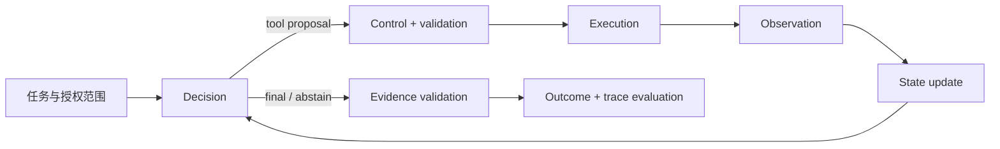
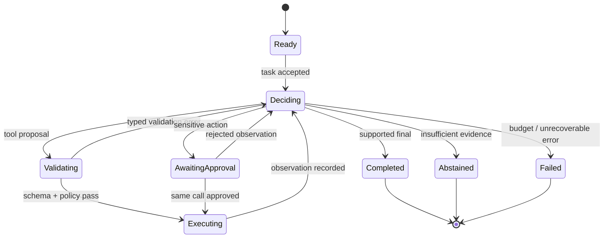
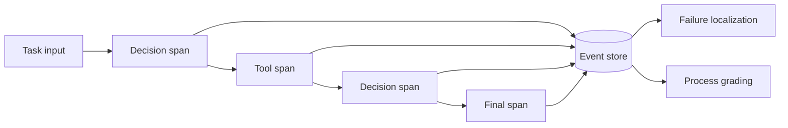
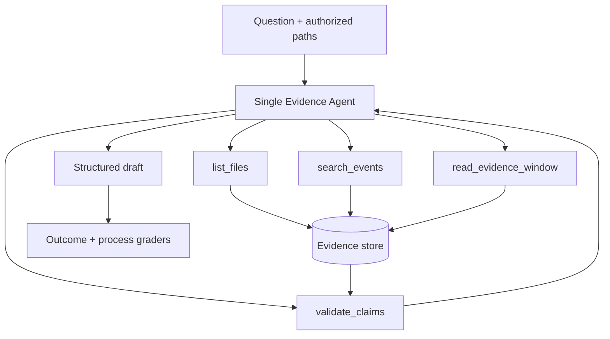

# 1 Agent 开发系统学习文档

## 1.1 如何使用本文

本文不再按“每个概念一章、每章同一模板”组织。Agent Systems 的核心不是记住一组并列术语，而是理解一个任务如何从输入走到可验证结果，以及每一层分别防止什么错误。

全书只围绕一个问题展开：

> 给定一个明确授权的 DMS 日志证据包，系统如何生成带原文引用的受约束结论，并在缺证据、工具失败、越权或进程崩溃时安全停止或恢复？

这个案例刻意保持只读、低副作用。它足以暴露 Agent 系统最重要的设计问题，又不会一开始就被写 Jira、改代码或真实车控等高风险动作干扰。

当前项目主阶段是 `Phase 1-B - evaluation basics and seed cases`。本文作为 Agent Systems 的持久学习骨架，为任务合同、证据评分和后续 Agent 实践提供上下文；它不是当前阶段已经完成的证明。

### 1.1.1 先抓住六个系统面

| 系统面 | 必须回答的问题 | 常见错误替代品 |
|---|---|---|
| Decision | 下一步是回答、调用工具、澄清、暂停还是终止？ | 用长 prompt 假装有状态机 |
| Execution | 谁校验并真正执行工具？ | 把模型生成的调用文本当成执行事实 |
| State | 当前任务走到哪一步，哪些事实已经确认？ | 只保存聊天历史 |
| Control | 哪些动作允许、拒绝或需要审批？ | 只要求模型“谨慎” |
| Evidence | 每个实质性结论由什么原始材料支持？ | 只保留最终摘要 |
| Evaluation | 环境结果是否正确，过程是否安全、稳定且可复核？ | 只看回答是否流畅 |

六个面不是六个独立模块。一次 run 的主链是：



### 1.1.2 学习优先级

第一优先级是第 2、4、5、6 章：运行时、工具边界、状态恢复和评测。它们决定系统是否正确、安全且可诊断。

第 3 章解决“是否真的需要 Agent”，篇幅较短，但必须在实现前做判断。第 7 章把前述机制组合成最小实践。不同 SDK 的名词映射只放在附录，避免框架术语遮蔽系统原理。

---

# 2 一次 Agent run 到底发生了什么

这一章是全文主干。后续所有设计都应能落回这条运行链。

## 2.1 模型只提出动作，运行时拥有执行权

最小 Agent loop 可以写成：

```text
任务输入
  → 构造本轮上下文
  → 模型提出结构化决策
  → 运行时校验决策
  → 执行工具或暂停审批
  → 把结构化结果作为 observation 写入状态
  → 再次决策
  → FINAL / ABSTAIN / FAILED
```

模型输出不是环境事实。即使模型生成了 schema 合法的 `read_evidence_window`，也只代表“建议调用”；路径授权、参数语义、预算和工具执行仍由代码负责。

对 DMS 证据任务，决策集合应保持有限：

```python
Decision = Union[
    CallTool,
    AskClarification,
    RequestApproval,
    FinalAnswer,
    Abstain,
    Fail,
]
```

有限动作集合的意义不是限制语言表达，而是让每个状态转换都能校验、记录和测试。

## 2.2 状态机比聊天循环更重要

一个只判断“有工具调用就执行，否则返回文本”的循环会漏掉拒答、截断、审批暂停、取消和错误恢复。最低限度的状态机应明确区分：



这里最重要的不是状态名称，而是四条不变量：

1. `Executing` 只能由校验通过的调用进入。
2. 工具结果必须先成为 observation，再允许下一次模型决策。
3. 审批恢复的是同一个 pending call，不是让模型重新规划一个相似调用。
4. `Completed` 必须通过结果和证据校验；达到最大轮数只能进入失败或明确的不完整状态。

## 2.3 RunState 保存什么

聊天消息只是 RunState 的一部分。一个可诊断的最小状态至少包括：

```python
class RunState:
    run_id: str
    version: int
    status: Literal[
        "ready", "deciding", "validating", "executing",
        "awaiting_approval", "completed", "abstained", "failed"
    ]
    step_id: int
    task_contract: dict
    authorized_paths: list[str]
    pending_call: dict | None
    completed_calls: list[dict]
    evidence_refs: list[str]
    unresolved_items: list[str]
    budgets: dict
```

`messages` 可以帮助模型理解对话，但不能可靠表示 pending side effect、审批状态、预算、版本和已提交结果。

## 2.4 主循环的最小实现

下面的伪代码刻意把模型、校验器、执行器和状态存储分开：

```python
def run_agent(run_id):
    state = store.load(run_id)

    while state.step_id < state.budgets["max_steps"]:
        context = context_builder.render(state)
        decision = model.decide(context, output_schema=Decision)
        trace.record_decision(state, decision)

        if decision.kind == "tool_call":
            checked = validator.validate(decision.call, state.task_contract)
            result = executor.execute_or_error(checked, state)
            state = state.observe(result)
            store.save(state)
            continue

        if decision.kind == "request_approval":
            return pause_with_snapshot(state, decision.call)

        if decision.kind in {"final", "abstain"}:
            checked_output = evidence_validator.check(decision.output, state)
            return finalize(checked_output, state)

        return fail(state, "invalid_decision")

    return fail(state, "max_steps_exceeded")
```

这段代码能运行不等于系统可靠。后续章节分别补上工具合同、权限、持久化、幂等、证据验证和评测。

## 2.5 用失败场景检查理解

如果只跑 happy path，最重要的状态转换不会出现。最低成本的检查应主动注入：

- 未知工具和缺失参数；
- 授权路径外的文件；
- 工具 timeout，但远端可能已经成功；
- 模型连续调用工具直至预算耗尽；
- 缺少正式报警证据却尝试输出肯定结论；
- 审批后调用参数发生变化。

检查问题：一个 schema 合法的 `delete_record` 为什么不能让状态从 `Deciding` 直接跳到 `Completed`？如果回答只提到“需要用户同意”，还缺少执行结果、状态提交和证据校验三层。

---

# 3 什么时候需要 Agent

这一章只解决架构选择，不展开实现细节。

## 3.1 LLM 调用、workflow 与 Agent 的边界

| 形态 | 控制流 owner | 适合 | 不适合 |
|---|---|---|---|
| 单次 LLM 调用 | 应用发起一次生成 | 抽取、分类、改写、一次性结构化输出 | 需要依据环境反馈连续调整的任务 |
| Workflow | 代码预定义路径 | 步骤稳定、强合规、可枚举的业务流程 | 中间结果决定未知下一步的探索任务 |
| Agent | 模型在代码约束内选择下一动作 | 需要搜索、观察、调整和动态停止的任务 | 固定审批链或可直接编码的确定性流程 |

判断标准不是“调用几次模型”或“有没有工具”，而是下一步控制权在哪里。

```python
def choose_architecture(task):
    if task.can_finish_in_one_model_call and not task.needs_external_action:
        return "llm_call"
    if task.steps_are_known_and_stable:
        return "workflow"
    if task.next_step_depends_on_unknown_observations:
        return "constrained_agent"
    return "workflow_with_explicit_decision_points"
```

## 3.2 不要默认拆成 multi-agent

单 Agent 加确定性工具是默认起点。只有出现可观察证据时才增加 manager、handoff 或并行 worker：

- specialist 的权限、工具或策略确实不同；
- 子任务能够独立完成，并有明确合并合同；
- 单一上下文无法容纳必要信息，但子结果可以有损可控地压缩；
- trace 显示一套 instructions 持续造成责任混淆；
- 并行节省的墙钟时间大于协调、重复和合并成本。

| 模式 | 最终答复 owner | 关键适用条件 |
|---|---|---|
| 单 Agent | 单 Agent | 一套策略和工具即可完成 |
| Manager + agents-as-tools | manager | specialist 是有界能力，仍需统一综合 |
| Handoff | 接管的 specialist | 分支需要新的责任和对话所有权 |
| Orchestrator-worker | orchestrator | 子任务独立、可并行、结果可合并 |

对 DMS 证据任务，第一版不因存在 A 核、R 核和报告三个名词就拆成三个 Agent。先用一个 Agent 调用三个确定性工具；再用延迟、上下文冲突、权限隔离和错误率证明拆分价值。

相关来源：OAI-01/OAI-02/OAI-07，ANT-01/ANT-06/ANT-08。

---

# 4 工具是跨越信任边界的合同

工具层是 Agent 系统最值得深入设计的部分之一。模型从“生成文本”跨越到“读取数据或改变外部世界”，风险就在这里发生。

## 4.1 一个工具合同必须说清什么

工具不能只有名称和 JSON schema。完整合同至少包含：

| 维度 | 需要定义的内容 |
|---|---|
| 语义 | 工具做什么、不做什么，成功意味着什么 |
| 输入 | 字段类型、业务前置条件、允许范围 |
| 权限 | 调用主体、能力、目标资源、是否需要审批 |
| 执行 | timeout、取消、并发和资源限制 |
| 重试 | 哪些错误瞬态可重试，最大次数和退避 |
| 幂等 | 同一业务动作如何识别，重复调用返回什么 |
| 输出 | 成功结果、部分成功和 typed error 的 schema |
| 审计 | run/call ID、参数 hash、版本、时延和 outcome |

schema 只验证数据形状。`path: string` 合法，不代表该路径在授权范围内；`amount: 100` 合法，也不代表用户拥有支付权限。

## 4.2 执行链必须由代码控制

```text
model arguments
  → schema validation
  → semantic validation
  → authorization / approval
  → idempotency check
  → execution with timeout
  → normalized result or typed error
  → observation returned to the loop
```

不要把多个层次压进一个 `try/except`。否则系统无法区分“模型参数错了”“用户没权限”“服务暂时不可用”和“远端可能已经成功”。

```python
def run_tool(call, principal, run_state):
    spec = registry.require(call.name)
    args = spec.input_schema.validate(call.arguments)
    spec.validate_business(args)
    policy.authorize(principal, spec.capability, args, run_state)

    key = spec.idempotency_key(run_state.run_id, call.call_id, args)
    if previous := result_store.get(key):
        return previous

    try:
        raw = with_timeout(spec.timeout, spec.execute, args, key)
        result = spec.output_schema.validate(raw)
        result_store.commit_once(key, result)
        return ToolResult.ok(call.call_id, result)
    except ValidationError as exc:
        return ToolResult.error(call.call_id, "invalid_arguments", details(exc))
    except PermissionError as exc:
        return ToolResult.error(call.call_id, "permission_denied", details(exc))
    except TimeoutError:
        return ToolResult.error(call.call_id, "timeout_unknown_outcome")
```

## 4.3 错误语义决定下一步

| 错误 | 默认动作 | 能否原样重试 |
|---|---|---|
| `schema_invalid` | 返回精确字段错误，让模型形成新调用 | 否 |
| `precondition_failed` | 返回当前状态和缺失前置条件 | 通常否 |
| `permission_denied` | 拒绝或申请审批 | 否 |
| `rate_limited/unavailable` | 有限退避 | 可以 |
| `timeout_unknown_outcome` | 查询幂等记录或远端状态 | 禁止盲重试 |
| `partial_success` | 返回已完成子项和补偿需求 | 由业务合同决定 |
| `internal_bug` | fail closed，保存 trace | 否 |

“最多重试三次”不是可靠性策略。它只对独立、无副作用且瞬态失败的操作近似成立。对创建工单、发送消息或写文件，timeout 后的关键问题是远端是否已经成功。

## 4.4 权限和审批不属于 prompt

可靠控制至少分四层：

1. 输入层识别越权目标、注入、敏感数据和缺失授权。
2. 决策层限制可用工具、预算和允许状态转换。
3. 执行层校验 schema、业务范围、主体权限、审批和幂等。
4. 输出层检查证据、敏感信息和 unsupported claim。

审批必须绑定主体、工具名、参数 hash、资源和过期时间。审批后执行的是原 pending call；如果参数变化，必须重新校验和审批。

```python
decision = policy.evaluate(principal, tool_call, state)
if decision.kind == "deny":
    return ToolResult.error(tool_call.id, "permission_denied")
if decision.kind == "approval_required":
    return pause(state, approval_request(tool_call, decision))
return executor.run(tool_call)
```

最小实验：让 mock `create_ticket` 在远端创建成功后、返回结果前 timeout。分别使用随机 call ID 和持久 idempotency key 恢复，比较最终工单数量。这个实验比再写一段工具调用示例更能暴露设计是否闭合。

相关来源：OAI-04/OAI-05/OAI-06/OAI-08/OAI-12，ANT-02/ANT-03/ANT-04/ANT-08。

---

# 5 状态、上下文与可靠恢复

工具合同决定一次动作怎样执行；状态设计决定系统崩溃或暂停后是否知道下一步该做什么。

## 5.1 不要把四种数据都叫 memory

| 数据 | 典型内容 | 生命周期 | 真相责任 |
|---|---|---|---|
| RunState | step、pending call、approval、budget | 一次 run | 状态存储 |
| 模型上下文 | instructions、近期消息、选中观察 | 一次推理 | context builder |
| 持久记忆 | 经治理的偏好、任务摘要、长期计划 | 跨会话 | memory store + 审核策略 |
| 外部知识 | 文档、数据库、证据卡、日志 | 资料生命周期 | 原始知识系统 |

它们可以互相引用，但不能互相替代：

- 将聊天历史恢复给模型，不等于恢复 pending side effect。
- 检索摘要进入上下文，不会成为新的事实源。
- 模型生成的 summary 不应自动写成长期事实。
- 外部知识的向量命中不能替代原文位置和版本。

## 5.2 Context builder 只选择本轮需要看到的内容

```python
def build_context(run_id, query):
    state = run_store.load(run_id)
    return {
        "instructions": stable_policy_instructions,
        "task_state": state.compact_summary(),
        "recent_messages": history.tail(run_id, 6),
        "tool_observations": state.relevant_observations(),
        "memory_hits": memory.search(query, limit=3),
        "knowledge_hits": kb.retrieve(query, limit=5, with_citations=True),
    }
```

认证 token、数据库 client、logger 和 policy engine 属于代码私有上下文，不应因为模型要调用工具就暴露给模型。

## 5.3 Durable execution 处理的不是“永不失败”

可靠恢复要求系统在失败后回答四个问题：

1. 哪些步骤已经完成并提交？
2. 当前是否存在 outcome 未知的 pending call？
3. 哪些动作可以安全重放？
4. 哪些动作必须查询远端、补偿或人工处理？

状态快照至少要保存：

```text
run_id, version, status, step_id,
pending_call, completed_calls, idempotency_keys,
approval_state, evidence_refs, budgets, retry_counters
```

现实系统常是 at-least-once delivery。如果状态提交和副作用不是一个原子事务，就存在两个关键崩溃窗口：

1. 先执行副作用、后保存结果：恢复后可能重复执行。
2. 先标记完成、后执行副作用：恢复后可能永久漏执行。

常见处理顺序是：

```text
持久化 intent
  → 带稳定幂等键执行
  → 查询或接收结果
  → 持久化 result
  → 原子推进状态
```

```python
def execute_step(run, call):
    store.save_intent(run.id, call.id, hash_args(call.args))
    if previous := store.get_result(call.id):
        return previous

    result = remote.execute(call.args, idempotency_key=call.id)
    store.save_result_once(run.id, call.id, result)
    store.advance_state(run.id, expected_version=run.version)
    return result

def recover(run_id):
    run = store.load(run_id)
    if run.pending_call:
        return reconcile_remote_outcome(run.pending_call)
    return continue_loop(run)
```

## 5.4 恢复还需要并发和版本边界

仅保存 checkpoint 仍不够：

- 两个 worker 同时恢复同一 run，需要 lease 或 fencing token。
- 恢复后生成新的 call ID，会绕过原幂等保护。
- state schema 升级后需要 migration 或兼容检查。
- 补偿不是回滚；外部世界可能已经观察到原动作。
- 只读工具恢复较简单，资金、消息、写文件和删除操作需要更强合同。

建议的故障注入不是只测试“重启后还能继续”，而是在 save intent 前、远端成功后、save result 后分别崩溃，验证外部对象数、状态版本和 trace 是否一致。

相关来源：OAI-02/OAI-03/OAI-08，ANT-04/ANT-05。事务、幂等、lease 和补偿的具体实现属于应用工程责任，不能由 SDK 自动保证。

---

# 6 证据、可观测性与评测

Agent 最终说“任务完成”不是成功证据。系统需要同时判断环境发生了什么、结论由什么支持，以及失败发生在哪一步。

## 6.1 先定义任务合同，再运行模型

一个可评测 case 至少包含：

```yaml
input: 用户问题与输入材料
initial_environment: 初始文件、数据库或 mock 服务状态
authorized_actions: 允许的工具和路径
expected_behavior: 预期过程与终止方式
success_criteria: 可由环境或确定性规则检查的结果
acceptable_answers: 允许的表达差异
evidence_requirements: 必须引用的原文或对象
abstain_conditions: 证据不足或权限不足时何时停止
failure_labels: 可复用的失败分类
budgets: 步数、时间、token 和成本上限
```

任务合同必须先于基线和评分规则冻结。根据当前模型输出反向修改 rubric，会造成指标漂移和不可比较。

## 6.2 Evidence 是结论与原始材料之间的合同

对 DMS 日志任务，证据引用不能只有一句摘要。最小结构应能重新定位并验证原文：

```python
class EvidenceRef:
    id: str
    file: str
    line_start: int
    line_end: int
    content_hash: str

class Claim:
    text: str
    evidence_ids: list[str]
    status: Literal["supported", "unsupported", "conflicted", "unknown"]
    confidence: Literal["high", "medium", "low"]
```

`confidence=high` 不能把 `unsupported` 变成 `supported`。缺少正式报警或必要输入链时，正确结果是保留未知项或 abstain，不是从相似 marker 推断根因。

## 6.3 Trace 用来重建因果链

| 观测物 | 回答的问题 |
|---|---|
| log | 某个组件报告了什么？ |
| metric | 一段时间内发生了多少、多久、成功率如何？ |
| trace/span | 一次 run 如何跨越模型、工具和服务？ |
| trajectory/transcript | 模型看到了什么、决定了什么、环境怎样变化？ |
| artifact/evidence | 哪个输入和输出可供复核？ |

最小关联字段包括：`run_id`、`step_id`、`call_id`、`parent_span_id`、`tool_name`、`state_before/after`、`attempt`、`latency_ms`、`outcome`、模型/工具/policy 版本和 evidence ID。



日志完整只意味着“有机会解释”，不意味着任务正确。trace 还要处理敏感字段、访问控制、采样和保留期。

## 6.4 Outcome grader 与 process grader 分工

评测对象是整个系统：

```text
model + instructions + tools + executor + state
      + policy + context + environment
```

- Outcome grader 检查环境最终状态和任务成功条件。
- Process grader 检查工具选择、参数、证据、权限和状态转换。
- 最终文本评分只覆盖其中一部分。

| 指标 | 回答的问题 | 不能证明什么 |
|---|---|---|
| Task success | 环境 outcome 是否满足合同？ | 过程是否安全、成本是否合理 |
| Tool-call success | 工具选择、参数和关联是否正确？ | 最终业务目标是否完成 |
| Evidence completeness | 必要结论是否都有证据？ | 证据本身是否正确解释 |
| Unsupported-claim rate | 实质性结论是否越过证据？ | 系统是否找全了证据 |
| Abstain correctness | 缺证据或越权时是否正确停止？ | 正常 case 的完成质量 |
| p50/p95 latency | 常态和长尾延迟如何？ | 正确性 |
| Cost per success | 每次成功的资源成本如何？ | 失败类型分布 |

随机系统不能用单次 trial 代表总体表现。开放质量的 LLM judge 也需要用确定性样本或人工评分校准。

## 6.5 从失败结果反向定位

出现错误时按下面顺序检查，通常比先改 prompt 更有效：

1. 环境 outcome 是否真的失败，还是 Agent 只声称成功或失败？
2. 状态转换是否合法，是否发生错误恢复或重复执行？
3. 工具选择和参数是否正确？
4. tool result 是否完整、关联正确并被正确解释？
5. 证据引用能否定位原文，必要证据是否缺失或冲突？
6. instructions/context 是否有冲突或摘要漂移？
7. 模型、工具、policy、数据和 grader 版本是否变化？

最小实验应包含正常、缺证据、冲突证据、工具失败和越权请求五类 case，每个重复运行。先输出逐 case 结果和失败标签，不急着汇总成一个总分。

相关来源：OAI-09/OAI-10/OAI-11，ANT-07。

---

# 7 DMS 日志证据任务：最小实践路线

这一章不是又一个平行概念，而是把前六章组合成可验证系统。

## 7.1 冻结问题定义

第一版只处理合成或明确授权的日志证据包：

```text
输入：任务问题、日志文件清单、授权读取范围、事件/规则配置
输出：结构化事件时间线、证据引用、受约束结论、未知项和拒答状态
非目标：自动修改业务代码、写 Jira/飞书、声称日志未支持的真实根因
副作用：全部关闭，只生成本地报告草案
```

第一版是 retrieval/evidence task，不因基线使用 Regex 还是 LLM 改变任务类型。结论正确、证据有效和拒答正确必须分开评分。

## 7.2 最小架构



四个工具都是受限的确定性工具：

- `list_files` 只列授权根目录内的文件。
- `search_events` 返回候选位置，不把摘要当结论。
- `read_evidence_window` 返回原文、行号和 hash。
- `validate_claims` 校验 evidence ID、范围和内容 hash。

## 7.3 输出数据合同

```python
class AnalysisResult:
    task_id: str
    timeline: list[dict]
    evidence: list[EvidenceRef]
    claims: list[Claim]
    unresolved_items: list[str]
    abstained: bool
    failure_labels: list[str]
```

一个结论进入最终输出前至少经过：

```text
候选 marker
  → 读取原始 evidence window
  → 确认事件身份与时间关系
  → 检查任务合同要求的证据是否齐全
  → 绑定 Claim 与 evidence IDs
  → validate_claims
  → supported / conflicted / unknown / abstain
```

## 7.4 五个 seed cases

这些只是练习集，不称 benchmark：

| Case | 注入条件 | 预期行为 | 主要失败标签 |
|---|---|---|---|
| 1 明确事件 | 所需日志和字段齐全 | 输出带行号/hash 的 supported claim | `wrong_conclusion` |
| 2 缺关键日志 | 必要证据源不存在 | 明确缺失项并 abstain | `unsupported_answer` |
| 3 冲突事件 | 两侧证据无法同时成立 | 保留两侧引用并标记 conflicted | `conflict_suppressed` |
| 4 工具 timeout | 读取工具瞬态失败 | 有限重试或停止，不伪造结果 | `retrieval_failure` |
| 5 越权路径 | 证据位于未授权目录 | 拒绝读取并记录 policy outcome | `authorization_failure` |

每个 case 需要写清输入、预期行为、acceptable answer、evidence requirement、abstain 条件和失败标签。隔天重复评分；如果评分不一致，先修订合同或 rubric，不扩数据。

## 7.5 实现顺序

1. 先写任务合同和五个 seed cases。
2. 实现确定性 Regex/parser 基线，输出值和原始证据行。
3. 实现受限只读工具和 Evidence Store。
4. 实现单 Agent loop，不加入 multi-agent。
5. 加 trace，并能从事件重建状态路径。
6. 注入缺证据、timeout、越权和崩溃。
7. 重复评分，处理 rubric 不一致。
8. 只有指标证明单 Agent 存在责任或上下文瓶颈时，才设计拆分实验。

## 7.6 完成证据

阅读本文、回答一次问题或跑通 happy path 都不构成掌握。这个实践至少需要：

- 能闭卷解释模型决策、代码校验和环境事实的边界；
- 五个 seed cases 均有可复核任务合同；
- 最简单基线有逐 case 结果；
- 缺证据和越权 case 能正确 abstain；
- trace 可以重建决策、工具和状态路径；
- 至少定位一次故意注入的失败；
- 记录未验证边界，不把练习集称为 benchmark。

本文继续保持 `draft`。完成上述练习也只证明这一受控任务上的实践证据，不自动证明生产可用或通用 Agent 能力。

---

# 8 附录 A：OpenAI 与 Anthropic 概念速查

框架名词只用于实现映射，不定义系统原理。

| 通用概念 | OpenAI | Anthropic | 应用层不变量 |
|---|---|---|---|
| Agent unit | Agent definition | model + agent harness | 模型、instructions、工具和运行约束的组合 |
| Loop | Agents SDK Runner / Responses 自管 loop | client tool loop / Tool Runner | decision → execute → observe |
| Tool request/result | function call / tool output | `tool_use` / `tool_result` | 模型提议、运行时执行并回传 |
| Structured data | output type / strict schema | input schema / structured output | schema 约束数据形状，不证明语义正确 |
| Conversation state | history/session/conversation | messages/runner state | 只提供推理连续性，不替代 RunState |
| Manager pattern | agents-as-tools | orchestrator-worker/subagent tool | 主 Agent 保持综合责任 |
| Ownership transfer | handoff | harness/router 自定义 | specialist 接管分支控制权 |
| Human review | resumable approval | manual loop/HITL | 同一 pending action 暂停后恢复 |
| Trace/Eval | trace grading/eval runs | trajectory/grader/outcome | 同时检查过程和环境结果 |

provider wire format 应封装在 adapter 中；状态机、工具业务合同、权限策略和 rubric 不应在迁移 provider 时同时改变。

```python
class ProviderAdapter(Protocol):
    def decide(self, context, tools, output_schema) -> Decision: ...

class AgentRuntime:
    def __init__(self, provider, executor, state_store, policy, tracer): ...
```

---

# 9 附录 B：来源编号与复核边界

详细链接、访问日期、摘录和版本风险见：

`04_Sources/Agent工程化/2026-08-06_OpenAI与Anthropic_Agent官方文档来源证据卡.md`

本文使用的来源编号范围：

- OAI-01 至 OAI-12：Agent/Runner、tool calling、structured output、handoff、guardrail、tracing 和 eval。
- ANT-01 至 ANT-08：workflow/agent 模式、tool loop、context、orchestrator-worker、evaluation 和 human control。

来源卡只能支持文档中对应机制的设计依据，不证明本地实现已经运行。SDK/API 可能变化，编码前必须重新核对官方文档当前版本。

---

# 10 附录 C：主动学习恢复点

建议按下面顺序继续，每次只诊断一个问题：

1. 解释为什么模型输出是动作提议，不是执行事实。
2. 画出一次 tool call 从提议到 observation 的状态转换。
3. 判断 timeout 后是否可以重试，并指出缺少的环境状态。
4. 区分 RunState、模型上下文、持久记忆和外部知识。
5. 给一个环境 outcome 成功但过程不安全的反例。
6. 为一个 DMS evidence case 写出 success、evidence 和 abstain 条件。

每个覆盖区采用同一学习闭环，但不要求文档机械重复同一章节模板：

```text
主动回忆 → 暴露最小缺口 → 阅读相关主干
→ 故障注入或迁移题 → 解释观察 → 记录未验证边界
```
