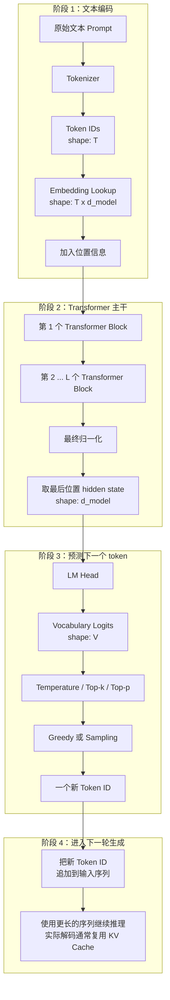
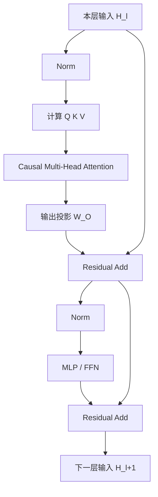
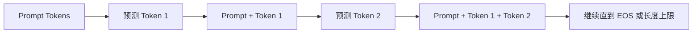
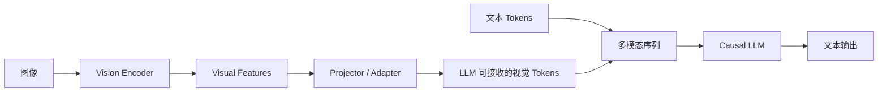

# 1 LLM 最小推理机制系统学习文档

## 1.1 学习目标与当前重点

学完本文后，应能不依赖资料解释下面这条完整链路：

```text
文本
→ token IDs
→ token 表示
→ 多层 causal Transformer
→ 最后位置的最终 hidden state
→ LM Head
→ vocabulary logits
→ decoding
→ 一个新 token
→ 追加到序列并继续生成
```

当前诊断已经表明，整体链路已有初步轮廓，下面几处需要重点补齐：

1. tokenizer 输出的是 token ID，不是 embedding。
2. Q、K、V 在每一层都由该层输入 hidden states 重新计算，不是始终由原始 embedding 计算。
3. causal attention 为什么禁止看到右侧 token，以及它与 next-token training 的关系。
4. attention 输出、Transformer block 输出和最终 hidden state 不是同一个层级的概念。
5. LM Head 的 logits 已经与词表 token 一一对应，不需要再做最近邻搜索。
6. temperature、top-k、top-p 和最终采样分别控制什么。
7. KV cache 保存的是什么，以及它为什么能降低逐 token 解码的重复计算。

本文会完整讲主线，但在这些位置展开更多转换细节。

## 1.2 全局数据流


实际逐 token 解码通常会利用 KV cache，只增量计算新位置，而不是完整重算全部历史 token。

符号约定：

| 符号 | 含义 |
|---|---|
| $T$ | 当前序列的 token 数量 |
| $V$ | 词表大小 vocabulary size |
| $d_{model}$ | 每个 token 的 hidden state 维度 |
| $L$ | Transformer block 数量 |
| $n_h$ | attention head 数量 |
| $d_h$ | 单个 head 的维度，通常 $d_{model}=n_h d_h$ |

## 1.3 第一步：文本到 token ID

### 1.3.1 Tokenizer 做什么

Tokenizer 把字符串切成模型词表中已经定义好的 token，并把每个 token 映射为整数 ID。

为便于解释，假设：

```text
原始文本：我喜欢学习
token 序列：[我] [喜欢] [学习]
token IDs：[41, 928, 3072]
```

真实 tokenizer 可能把一个汉字、多个汉字、标点、空格或字节片段切成不同 token。重要的是：

```text
Tokenizer 输出：离散整数 ID
Tokenizer 不输出：连续向量 embedding
```

因此第一步的张量通常是：

$$
\mathbf{t}=[t_1,t_2,\ldots,t_T]\in\mathbb{N}^{T}
$$

### 1.3.2 Token ID 为什么不能直接进入 attention

整数 ID 只是词表索引。ID 3072 并不表示它在语义上比 ID 41 大，也不能直接拿来做有意义的点积。

模型维护一个可训练的 embedding table：

$$
E\in\mathbb{R}^{V\times d_{model}}
$$

每个 token ID 用作行索引：

$$
x_i=E[t_i]\in\mathbb{R}^{d_{model}}
$$

整个序列经过 lookup 后得到：

$$
X_{token}\in\mathbb{R}^{T\times d_{model}}
$$

这一步是查表，不是把 ID 当作数值与某个矩阵直接相乘。

## 1.4 第二步：加入位置信息

如果只有 token embedding，模型无法仅凭表示区分“我喜欢你”和“你喜欢我”的顺序。模型还需要位置信息。

常见实现分成两类：

1. 加法式位置编码：把 position embedding 加到 token embedding。

$$
H^{(0)}=X_{token}+X_{position}
$$

2. RoPE 一类旋转位置编码：不直接加到 $H^{(0)}$，而是在每层 attention 中对 Q、K 做与位置相关的旋转。

因此不能把所有 LLM 都简化成“token embedding 加 position embedding”。共同目标是让 attention 能感知 token 的绝对或相对位置。

## 1.5 第三步：一个 Transformer block 内发生什么

下面使用常见的 pre-norm decoder block 表示主干。具体模型可能使用 LayerNorm 或 RMSNorm，也可能采用不同 MLP 激活函数。



可写成：

$$
A^{(l)}=H^{(l)}+\operatorname{MHA}(\operatorname{Norm}(H^{(l)}))
$$

$$
H^{(l+1)}=A^{(l)}+\operatorname{MLP}(\operatorname{Norm}(A^{(l)}))
$$

这里要特别区分：

- attention 输出只是 block 内的一部分。
- attention 后面还有输出投影、残差、归一化和 MLP。
- 只有经过全部 $L$ 个 block 后，才得到最终层 hidden states。

## 1.6 第四步：每一层如何计算 Q、K、V

设第 $l$ 层 attention 的输入为：

$$
X^{(l)}\in\mathbb{R}^{T\times d_{model}}
$$

这一层有自己的参数矩阵：

$$
W_Q^{(l)},W_K^{(l)},W_V^{(l)}
$$

于是：

$$
Q^{(l)}=X^{(l)}W_Q^{(l)}
$$

$$
K^{(l)}=X^{(l)}W_K^{(l)}
$$

$$
V^{(l)}=X^{(l)}W_V^{(l)}
$$

关键点不是记住三个公式，而是理解“每层重新计算”：

```text
第 1 层：由初始 token 表示计算 Q1/K1/V1
第 2 层：由第 1 层输出的 hidden states 计算 Q2/K2/V2
第 3 层：由第 2 层输出的 hidden states 计算 Q3/K3/V3
...
```

> 每一层中，最后位置的当前 hidden state 都会生成该层自己的 query；所有可见位置的当前 hidden states 都会生成该层自己的 keys 和 values。

### 1.6.1 多头拆分

Q、K、V 会被拆成多个 head。单个 head 中：

$$
Q_h,K_h,V_h\in\mathbb{R}^{T\times d_h}
$$

不同 head 可以学习不同的关系模式，但不应把每个 head 机械解释为固定的人类语义模块。

## 1.7 第五步：scaled dot-product attention

对一个 head，attention score 为：

$$
S=\frac{QK^\top}{\sqrt{d_h}}+M_{causal}
$$

其中：

- $QK^\top$ 给出每个 query 位置对每个 key 位置的匹配分数。
- $\sqrt{d_h}$ 缩放点积，避免维度较大时分数过大，使 softmax 过早饱和。
- $M_{causal}$ 屏蔽未来位置。

随后按每个 query 所在行做 softmax：

$$
P=\operatorname{softmax}(S)
$$

最后对 values 加权求和：

$$
O=PV
$$

因此，attention 的直接输出 $O$ 是“按相关性聚合后的上下文表示”，不是 token ID，也不是词表 logits。

## 1.8 第六步：causal mask 为什么存在

### 1.8.1 Mask 的形状

对于四个 token，causal mask 可以表示为：

$$
M_{causal}=
\begin{bmatrix}
0 & -\infty & -\infty & -\infty\\
0 & 0 & -\infty & -\infty\\
0 & 0 & 0 & -\infty\\
0 & 0 & 0 & 0
\end{bmatrix}
$$

softmax 后，$-\infty$ 对应位置的权重变成 0。于是：

| 当前位置 | 可以读取的位置 |
|---|---|
| `[我]` | `[我]` |
| `[喜欢]` | `[我][喜欢]` |
| `[学习]` | `[我][喜欢][学习]` |
| `[AI]` | `[我][喜欢][学习][AI]` |

### 1.8.2 为什么不能看右侧

decoder-only LLM 的训练目标是根据已有前缀预测下一个 token。假设训练文本为：

```text
[我] [喜欢] [学习] [AI]
```

各位置的监督关系是：

| 当前位置可见的前缀 | 目标 token |
|---|---|
| `[我]` | `[喜欢]` |
| `[我][喜欢]` | `[学习]` |
| `[我][喜欢][学习]` | `[AI]` |

如果 `[喜欢]` 位置可以直接读取右侧的 `[学习]`，训练时就提前看到了答案。模型学到的将不是“根据过去预测未来”，而是利用数据泄漏复制未来信息。推理时未来 token 尚不存在，这种能力也无法使用。

causal mask 因而保证训练和生成具有相同的信息边界：

$$
p(t_1,t_2,\ldots,t_T)=\prod_{i=1}^{T}p(t_i\mid t_{<i})
$$

### 1.8.3 为什么训练可以并行

虽然位置 $i$ 看不到 $i+1$ 之后的 token，但训练时整个序列已经存在于张量中。GPU 可以同时计算所有位置的 Q/K/V 和 attention，只靠 mask 阻止信息从右向左泄漏。

这意味着：

- 训练：多个位置的 next-token loss 可以并行计算。
- 生成：未来 token 尚未产生，只能一个 token 接一个 token 地循环。

## 1.9 第七步：从最终 hidden state 到词表 logits

经过 $L$ 个 Transformer blocks 后：

$$
H^{(L)}\in\mathbb{R}^{T\times d_{model}}
$$

若当前要预测 prompt 后的第一个新 token，取最后一个输入位置的最终表示：

$$
z=\operatorname{Norm}(H^{(L)}_T)\in\mathbb{R}^{d_{model}}
$$

LM Head 通常是从 hidden dimension 到 vocabulary dimension 的线性投影：

$$
\operatorname{logits}=zW_U+b
$$

其中：

$$
W_U\in\mathbb{R}^{d_{model}\times V}
$$

所以：

$$
\operatorname{logits}\in\mathbb{R}^{V}
$$

词表中的每个 token 都直接对应 logits 向量中的一个固定下标：

```text
token IDs: [0,    1,    2,   ..., V-1]
logits:    [1.2, -0.3, 2.7, ..., 0.8]
```

模型不需要在 embedding 表里再执行一次“寻找最相似向量”。某些模型会让 LM Head 权重与输入 embedding table 共享，但这是一种参数共享方式，不会改变“logit 下标与 token ID 一一对应”的输出语义。

## 1.10 第八步：temperature、top-k、top-p 与采样

### 1.10.1 Temperature

先用 temperature 缩放 logits，再转成概率：

$$
p_i=\frac{\exp(l_i/\tau)}{\sum_j\exp(l_j/\tau)}
$$

其中 $\tau$ 是 temperature：

- $\tau<1$：分布更尖锐，高分 token 更容易被选中。
- $\tau>1$：分布更平坦，低分 token 获得更多机会。
- temperature 改变随机性，不保证事实正确性。

### 1.10.2 Greedy、top-k 与 top-p

| 方法 | 做什么 | 最终生成几个 token |
|---|---|---|
| Greedy / top-1 | 直接选择最高分 token | 1 个 |
| top-k | 只保留分数最高的 $k$ 个候选，再从中采样 | 1 个 |
| top-p | 保留累计概率达到阈值 $p$ 的最小候选集合，再采样 | 1 个 |

top-k 的 $k$ 不是“一次输出 $k$ 个 token”。自回归解码的当前一步仍然只选择一个 token。

典型顺序是：

```text
logits
→ temperature scaling
→ top-k / top-p filtering
→ renormalize probabilities
→ greedy 或 sampling
→ 一个 token ID
```

## 1.11 第九步：为什么不需要句尾伪 token

模型在训练时已经学会“当前位置预测下一个位置”。因此输入：

```text
[我][喜欢][学习]
```

最后一个真实位置 `[学习]` 的最终 hidden state 就用来预测紧随其后的 token。无需在结尾放一个空白占位符。

容易混淆的特殊 token：

| token | 作用 | 是否是句尾待填写的伪 token |
|---|---|---|
| `[BOS]` | 标记序列开始，部分模型使用 | 否 |
| `[EOS]` | 标记序列结束 | 否 |
| `[MASK]` | BERT 类 masked language model 的填空标记 | 是显式遮盖位置，但不是 decoder-only LLM 的常规生成方式 |

生成一个新 token 后，将它追加到序列末尾，再预测下一个：



## 1.12 第十步：prefill、decode 与 KV cache

### 1.12.1 没有 cache 时

每生成一个新 token，如果都把整个增长后的序列重新通过所有 Transformer layers，会反复计算旧 token 的 K/V，浪费大量计算。

### 1.12.2 KV cache 保存什么

在 causal attention 中，旧 token 在某一层产生的 K/V 不会因为右侧新增 token 而改变。因此可以保存：

```text
每一层
  × 每一个 attention head
  × 所有已经处理过的位置
  × 该位置的 K 和 V
```

概念形状可写成：

$$
K_{cache}^{(l)},V_{cache}^{(l)}\in\mathbb{R}^{n_h\times T\times d_h}
$$

注意：

- cache 是逐层保存的，不是全模型只有一份 K/V。
- K/V 来自该层当时的 hidden states。
- 新 token 到来时，仍需计算它在每一层的新 Q/K/V。

### 1.12.3 Prefill 与 decode

```text
Prefill：一次处理完整 prompt，建立每层的 KV cache。
Decode：每次只输入最新 token，计算它的新 Q/K/V；Q 读取历史 cache 与当前 K/V。
```

第 $t$ 步 decode 时，单层 attention 可以理解为：

$$
q_t=h_tW_Q
$$

$$
k_t=h_tW_K,\quad v_t=h_tW_V
$$

$$
K_{1:t}=[K_{cache};k_t],\quad V_{1:t}=[V_{cache};v_t]
$$

$$
o_t=\operatorname{softmax}\left(\frac{q_tK_{1:t}^{\top}}{\sqrt{d_h}}\right)V_{1:t}
$$

KV cache 减少了旧 token 的重复投影和旧 query 的重复计算，但 attention 仍需让新 query 读取不断增长的历史 keys/values，因此长上下文仍会增加显存和计算开销。

## 1.13 训练目标如何塑造生成行为

假设 token 序列为：

$$
[t_1,t_2,t_3,t_4]
$$

训练输入和监督标签可以看作错开一位：

```text
输入： [t1, t2, t3]
标签： [t2, t3, t4]
```

每个位置产生一组 vocabulary logits，并与该位置的目标 token 计算 cross-entropy：

$$
\mathcal{L}=-\sum_i\log p(t_{i+1}\mid t_{\le i})
$$

这解释了三个关键现象：

1. 模型的基础能力是条件概率建模，不是从数据库中取出一个完整答案。
2. 生成时必须把刚生成的 token 追加回上下文，才能继续预测。
3. 模型输出“很可能的后续文本”不等于输出“经过外部证据验证的事实”。

## 1.14 常见误解与纠正

| 容易产生的理解 | 更准确的理解 |
|---|---|
| tokenizer 直接产生 embedding | tokenizer 产生 token IDs，embedding table 再把 ID 映射为向量 |
| 句尾需要一个 dummy token 才能预测 | 最后一个真实位置的 hidden state 直接预测下一个 token |
| 最后 token 只生成一次 query | 每一层都由该层 hidden state 重新生成 Q/K/V |
| 所有层都使用原始 prompt embeddings 计算 K/V | 后续层使用上一层输出的 hidden states |
| attention 输出就是 next token | attention 输出上下文表示，之后还要经过 block、LM Head 和 decoding |
| logits 需要与词表 embedding 做最近邻搜索 | 每个 logit 下标已经直接对应一个词表 token |
| temperature 决定候选 token 数量 | temperature 改变分布尖锐度，top-k/top-p 才过滤候选集合 |
| top-k 会一次生成 k 个 token | 每一步仍只选一个 token |
| temperature 低意味着答案更正确 | 只意味着输出更集中、更少随机，不保证有证据或事实正确 |
| KV cache 是一份全局 K/V | 每一层、每个 head 都有随序列增长的 K/V cache |

## 1.15 从 LLM 到 VLM：哪些部分保持不变

VLM 通常在 LLM 前增加视觉输入链路：



视觉 encoder 和 projector 改变了输入表示的来源，但 decoder-only LLM 的主干仍然是：

```text
多模态 token 表示
→ 多层 causal Transformer
→ 最后位置 hidden state
→ LM Head
→ logits
→ decoding
```

因此，在进入 VLM benchmark 之前，先闭合本文的 LLM 主线是必要前置。

## 1.16 闭卷检查与实践顺序

不要用“看懂本文”作为掌握证据。按下面顺序检查：

### 1.16.1 第一关：完整数据流

闭卷画出：

```text
text → token IDs → embeddings → blocks → last hidden → LM Head → logits → decoding
```

要求说明每一步的输入、输出和 shape。

### 1.16.2 第二关：逐层 Q/K/V

回答：为什么第 2 层不能继续直接使用原始 token embeddings 计算 Q/K/V？

### 1.16.3 第三关：causal mask

手写四个 token 的 causal mask，并解释为什么训练能并行、生成却必须逐 token 进行。

### 1.16.4 第四关：decoding

给定一组 logits，分别解释降低 temperature、设置 top-k 和设置 top-p 会改变什么。必须明确每一步最终只生成一个 token。

### 1.16.5 第五关：KV cache

画出 prefill 与第二个 decode step，说明旧 K/V、新 Q/K/V 和 cache 更新发生在哪里。

### 1.16.6 完成边界

只有满足以下条件，才把“LLM 最小推理机制”从碎片理解提升为可用理解：

- 能闭卷讲完整数据流，不跳过 tokenizer、embedding、LM Head 或 decoding。
- 能解释每层重新计算 Q/K/V，而不是只背 attention 公式。
- 能用信息泄漏解释 causal mask，而不是只说“不能看未来”。
- 能区分 logits、概率、候选过滤和最终 token 选择。
- 能解释 KV cache 节省了什么、没有节省什么。
- 能把上述机制迁移到 VLM 的语言生成主干。

## 1.17 后续补充边界

本文暂不深入以下内容，待最小推理闭环通过诊断后再展开：

- tokenizer 训练算法与 byte fallback 细节。
- Grouped Query Attention、Multi-Query Attention 和 FlashAttention。
- RoPE scaling、长上下文外推和位置插值。
- MoE、speculative decoding、量化和并行推理。
- 预训练数据工程、SFT、RLHF/DPO 等训练阶段。
- VLM projector、视觉 token 压缩和视频采样的实现对比。

这些内容重要，但当前不应阻塞最小机制闭环。

## 1.18 第一阶段主动学习进度（2026-07-21）

### 1.18.1 阶段结论

本轮采用主动回忆、苏格拉底追问、费曼复述和迁移题完成口头机制诊断。当前将“LLM 最小推理机制”记录为：

```text
可用理解（working）
```

该结论仅表示在本轮对话提示范围内能够解释主干机制并完成相邻场景迁移，不代表已经完成闭卷独立重画、代码实现、测试、性能测量或工程故障定位，因此不提升为“已独立验证”或“完全掌握”。

### 1.18.2 已通过的诊断点

- 能解释 causal mask 通过阻断未来 token 的 attention 权重防止答案泄漏，并区分“训练可并行”与“生成逐 token”。
- 能说明训练输入与监督标签错开一位；当前位置可以读取自身输入，但监督目标是下一个 token。
- 能闭环说明 `token IDs → embeddings → Transformer blocks → 最后位置 hidden state → LM Head → logits → decoding → 新 token`。
- 能说明 Q/K/V 在每一层由该层输入 hidden states 重新计算，后续层不直接复用原始 embeddings。
- 能区分 attention 输出、完整 block 输出、最终 hidden state、vocabulary logits 和 softmax 概率。
- 能区分 temperature、top-k、top-p 与最终 greedy/sampling，并解释 temperature 对 top-k 集合和 top-p 候选数量的不同影响。
- 能区分 prefill 与 decode，说明 KV cache 保存历史 K/V 而不保存历史 Q 的原因。
- 能用位置敏感性解释：无位置信息时，attention 无法区分可见前缀内部的排列顺序。
- 能迁移到 VLM：视觉 encoder 与 projector 改变输入 embedding 的来源，后续 causal LLM 生成主干基本保持不变。

### 1.18.3 已纠正但仍需在实践中复核的边界

- 完整序列训练通常并不使用推理解码意义上的 KV cache；训练或 prefill 会并行计算多个位置，增量 decode 才只计算新位置的 Q/K/V。
- logits 是未归一化词表分数，不是“伪概率”；softmax 后才得到概率分布。
- Transformer block 内 norm、residual 与 attention/MLP 的具体先后顺序依模型架构而异，不能把一种实现顺序泛化为全部模型。

### 1.18.4 下一阶段

下一阶段转入 LLM 训练机制，按以下顺序继续主动学习：

```text
训练样本与 shifted labels
→ vocabulary logits
→ cross-entropy loss
→ 梯度与反向传播
→ optimizer 参数更新
→ train / eval 行为边界
```

第一道诊断问题是：模型如何根据目标 token 的概率得到“本次预测错了多少”的标量信号，并把该信号传回 embedding、attention、MLP 与 LM Head 参数。

## 1.19 Phase 1-A closure 主动学习进度（2026-08-06）

### 1.19.1 本轮达到 working 的理论主题

1. **Encoder / decoder 架构边界**
   - 能区分双向 encoder、因果 decoder 和 encoder-decoder；纠正了“encoder 本身适合翻译”的混淆。
   - 能说明翻译时 encoder 双向读取完整源句，decoder 的 self-attention 只看目标前缀，cross-attention 使用 decoder query 与全部 encoder hidden states 投影得到的 K/V。
   - 能用训练/推理一致性和答案泄漏解释 decoder-only 自回归生成的因果约束。

2. **Transformer block 组成与职责**
   - 能说明 multi-head attention 通过各 head 独立的 `W_Q/W_K/W_V` 在不同子空间形成 attention 分布，并由 `W_O` 混合；若各 head 投影相同，则功能上冗余。
   - 能说明 residual 同时保留恒等信息路径和梯度路径，使子层学习增量修正。
   - 能说明 LayerNorm 对单个 token 的特征维做尺度稳定，不在 token 或 batch 之间统计。
   - 能说明 FFN 对每个 token 独立执行“升维线性层 → 非线性激活 → 降维线性层”；若移除非线性，两层可合并为单一仿射变换。
   - 本轮尚未单独诊断位置编码，因此不能把整个 Transformer block 覆盖区标记为闭合。

3. **证据、拒答与不确定性边界**
   - 能区分结论客观真值与当前证据支持状态；即使结论碰巧为真，当前证据集中无依据时仍标记 `unsupported_claim`。
   - 能区分 `unsupported_claim`、`fabricated_evidence`、`contradicted_by_evidence`，不依赖含义漂移的笼统“幻觉”标签。
   - 缺失证据可在授权内补取时继续检索；证据源不可用时应 abstain、报告限制，并请求授权、替代证据或终止决定。

### 1.19.2 Scaled dot-product attention 诊断边界

已能闭卷说明：

- `Q:[B,H,Tq,D]` 与 `K:[B,H,Tk,D]` 产生 scores `[B,H,Tq,Tk]`。
- causal mask 在 softmax 前把不可见位置加为负无穷，softmax 沿 `Tk` 维归一化。
- scores 与 `V:[B,H,Tk,Dv]` 相乘后输出 `[B,H,Tq,Dv]`。
- 当 Q/K 分量近似独立、零均值、单位方差时，点积方差约为 `D`；除以 `sqrt(D)` 后约回到 1，降低 softmax 提前饱和与非最大位置梯度趋零的风险。

用户明确决定不重复实现成熟 attention 算子。因此证据状态记录为：

```text
数学机制与 shape：working
独立实现与参考测试：waived_by_scope
```

`waived_by_scope` 不等于“已独立实现并测试”，后续只有真实实现或故障定位证据才能提升该项。

### 1.19.3 当前下一步

进入固定 logits、固定随机种子的采样参数受控实验，依次观察 temperature、top-p、最大输出长度和上下文变化；随后完成有证据/无证据对照实验、最小文本到文本推理链复核，并在 Phase 1-A closure 前补做位置编码边界诊断。

## 1.20 Phase 1-A 关闭记录（2026-08-06）

### 1.20.1 关闭决定

用户根据 Agent 开发与 AI Infra 的职业目标，确认 Phase 1-A 在调整后的课程范围内完成，并转入 Phase 1-B“评测基本功与练习集”。该决定关闭当前学习主线，不把未执行的实现或运行提升为验证证据。

### 1.20.2 最终证据状态

```text
encoder/decoder、Transformer block 主干、证据边界：working
scaled dot-product attention 数学机制与 shape：working
temperature、top-p、停止条件与上下文影响机制：working
位置编码作用、causal mask 隐式顺序与 RoPE 相对位置：working
自回归生成、teacher forcing 与文本生成伪代码：working
有证据/无证据回答边界：working

独立实现 scaled dot-product attention：waived_by_scope
真实采样参数抽样实验：waived_by_scope
手写完整 GPT、tokenizer 与 generation：waived_by_scope
真实 tokenizer → generation → decode 文本闭环：not_verified
真实模型有/无证据对照运行：not_verified
```

`working` 只表示主动诊断中的可用理解；`waived_by_scope` 表示用户基于学习收益主动移出课程门禁；`not_verified` 表示没有运行证据。三者不得互相替代。

### 1.20.3 后续恢复边界

- Phase 1-B 不重复考察已达到 working 的 LLM 机制，除非评测设计暴露相关缺口。
- Phase 1-B 可以调用成熟模型、tokenizer 与生成接口，不要求手写完整 GPT。
- 若后续任务需要排查 attention、tokenizer 或 generation 的实现故障，必须重新补充相应运行证据，不能引用本次课程关闭决定作为实现证明。
