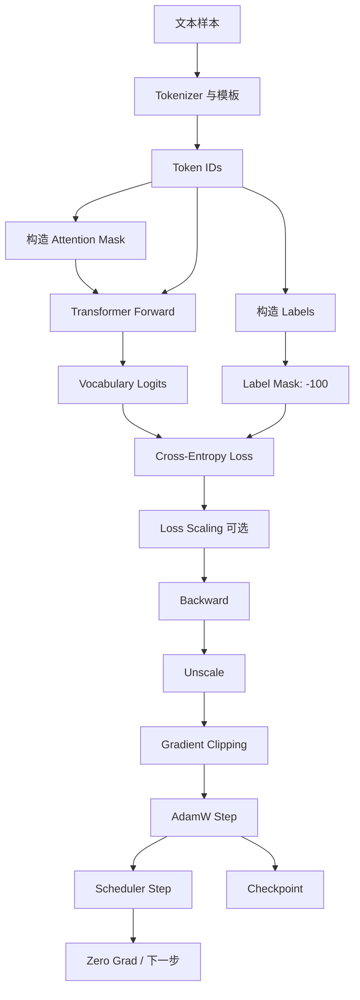
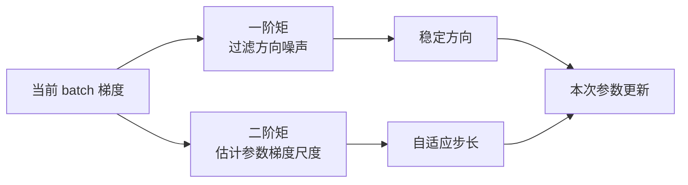

# 1 LLM 训练机制系统学习文档

## 1.1 学习目标与当前重点

本文用于闭合下面这条训练主线：

```text
文本样本
→ token IDs / labels / masks
→ Transformer forward
→ vocabulary logits
→ cross-entropy loss
→ backward
→ gradient processing
→ AdamW update
→ scheduler
→ checkpoint / evaluation
```

主动评测表明，cross-entropy、基础梯度流、SFT masking、gradient clipping、混合精度和 checkpoint 主干已经达到可用理解。2026-08-04 已进一步完成 TinyCausalLM 单 batch 过拟合、确定性 eval 和 CPU 内存 checkpoint 轨迹恢复；本阶段重点已经从“补齐概念”转为“记录实践边界并切换到评测基本功”。

本阶段曾重点修正：

1. Adam 的一阶矩不是“速度”的物理量，二阶矩也不是“加速度”。
2. 二阶矩的目的不是做更高阶拟合，而是估计每个参数近期梯度的典型尺度。
3. AdamW 的 weight decay 与把 L2 项混入 Adam 梯度不是同一件事。
4. 单次 finite loss、非零梯度和参数变化不能替代单 batch 过拟合与恢复轨迹验证。

## 1.2 全局训练数据流



每一步控制不同对象：

| 环节 | 控制对象 | 不负责什么 |
|---|---|---|
| causal mask | 未来信息是否可见 | 不决定是否计算 loss |
| attention mask | PAD 等无效输入是否可见 | 不决定监督目标 |
| label mask | 哪些位置计算 loss | 不阻止 token 作为上下文 |
| optimizer | 如何使用梯度更新参数 | 不生成梯度 |
| scheduler | 学习率随 step 如何变化 | 不裁剪异常梯度 |

## 1.3 训练样本、shifted labels 与三类 mask

### 1.3.1 Next-token 监督

给定 token 序列：

```text
[t1][t2][t3][t4]
```

监督关系是：

```text
输入前缀 [t1]        → 目标 [t2]
输入前缀 [t1][t2]    → 目标 [t3]
输入前缀 [t1][t2][t3]→ 目标 [t4]
```

许多 causal LM API 接收与 input IDs 同长度的 labels，并在模型内部完成 logits 与 labels 的错位。不能在不了解 API 的情况下重复 shift。

### 1.3.2 SFT 的 prompt 与 answer

若样本为：

```text
[System][User][Assistant Answer][EOS][PAD]
```

只监督 Assistant 时：

| 区域 | attention mask | label | 原因 |
|---|---:|---|---|
| System | 1 | -100 | 是有效上下文，不直接监督预测 |
| User | 1 | -100 | 是有效上下文，不直接监督预测 |
| Assistant | 1 | token ID | 作为回答目标计算 loss |
| EOS | 1 | EOS ID | 学习何时停止 |
| PAD | 0 | -100 | 既不是有效上下文，也不应计算 loss |

Prompt 的 label 虽为 `-100`，并不意味着 prompt 与训练无关。Answer loss 仍会沿着：

```text
Answer hidden state
→ attention
→ prompt K/V 与 hidden states
→ embeddings 和共享 Transformer 参数
```

反向传播，因此模型能学习如何利用 prompt。

## 1.4 Logits、cross-entropy 与梯度方向

最后 hidden state 经 LM Head 得到词表 logits：

$$
z = W_{lm}h+b
$$

softmax 给出概率：

$$
q_i=\frac{e^{z_i}}{\sum_j e^{z_j}}
$$

对 one-hot 正确 token $y$，单位置 loss 为：

$$
L=-\log q_y
$$

因此：

```text
正确 token 概率趋近 1 → loss 趋近 0
正确 token 概率趋近 0 → loss 急剧增大
```

softmax 与 cross-entropy 合并后的 logit 梯度为：

$$
\frac{\partial L}{\partial z_i}=q_i-y_i
$$

这意味着：

- 正确 token 的梯度为负，梯度下降会提高它的 logit。
- 错误 token 的梯度为正，梯度下降会降低它的 logit。
- 错误概率越高，被压低的力度越大。

## 1.5 从 LM Head 返回 Transformer

设上游 logit 梯度为 $g=\partial L/\partial z$：

$$
\frac{\partial L}{\partial W_{lm}}=gh^\top
$$

$$
\frac{\partial L}{\partial h}=W_{lm}^\top g
$$

第一条更新 LM Head，第二条把误差信号送回最后一个 Transformer block。

Residual 加法在反向传播中把梯度分成两路：

```text
上游梯度
├→ 直接沿 identity residual 返回
└→ 穿过 attention 或 MLP 分支返回
```

恒等路径的局部导数为 1，所以复杂分支梯度较小时，仍有直接通道把梯度传向更早层。

## 1.6 梯度累积与 token 加权

### 1.6.1 为什么需要梯度累积

显存不足时，可用多个 micro-batch 模拟更大的 batch：

```text
zero_grad
→ micro-batch 1 backward
→ micro-batch 2 backward
→ ...
→ optimizer.step
```

PyTorch 默认把梯度累加到 `.grad`。若累积 $K$ 个等权 micro-batch，常把每次 loss 除以 $K$，使最终梯度接近大 batch 的平均梯度。

### 1.6.2 不等长序列不能简单平均 micro-batch loss

LLM batch 的有效 token 数可能不同。正确的总体 token 平均是：

$$
L=\frac{\sum_b \sum_{t\in valid_b}L_{b,t}}{\sum_b N_b}
$$

若每个 micro-batch 先独立取平均，再对 micro-batch 做算术平均，100-token batch 与 700-token batch 会得到相同权重，结果不再是全体 token 的真实平均。

实践中应累计有效 token loss 总和，并按总有效 token 数归一化，或按每个 micro-batch 的有效 token 比例缩放。`F.cross_entropy` 默认 `reduction="mean"`，且 `ignore_index=-100` 时只对未忽略的有效 label 取平均；因此，分别对不等长 micro-batch 求 mean 再等权平均，会错误地放大短序列 token 的权重。

显存受限时，可逐个释放计算图：

```text
optimizer.zero_grad()
→ 每个 micro-batch 计算 reduction="sum" 的 loss
→ 每个 micro-batch 立即 backward，累积 sum 梯度
→ 全部梯度除以累积窗口的 total_valid_tokens
→ gradient clipping
→ optimizer.step()
```

归一化必须发生在 clipping 之前。sum 梯度随 token 数增大只是聚合尺度变化，不等于梯度爆炸；若先 clipping 再除以 token 数，将不能与一个大 batch 的 mean-loss 梯度保持一致。

## 1.7 Adam：先看它要解决的两个训练问题

理解 Adam 不应从背诵一阶矩、二阶矩公式开始，而应先看普通 mini-batch 梯度暴露的两个问题。

### 1.7.1 问题一：单个 batch 给出的梯度方向不稳定

每个 batch 只是总体数据分布的一次采样。不同 batch 中的 token、序列长度和语义不同，同一参数得到的梯度可能不断变化：

```text
step 1：+0.8
step 2：-0.6
step 3：+0.9
step 4：-0.5
```

如果优化器完全跟随当前梯度，参数就会左右摆动。某个异常 batch 还可能突然改变更新方向。

Adam 的第一项处理是：记录近期有符号梯度的移动平均，也就是一阶矩。

```text
近期梯度持续同向
→ 移动平均保留并强化该方向

近期梯度正负反复
→ 正负在移动平均中抵消
→ 不把某一次抖动误判成可靠方向
```

因此，一阶矩回答的是：

> 综合最近多个 batch 后，哪个更新方向比较稳定？

它与 momentum 的思想一致，但不是物理意义上的“速度”。

### 1.7.2 问题二：不同参数的梯度尺度差异很大

模型中的参数并不处在相同的梯度尺度上。例如：

```text
参数 A 的近期梯度：0.001、0.002、0.001
参数 B 的近期梯度：3.0、4.0、2.5
```

若二者共用一个原始学习率：

- 学习率适合 B 时，A 的更新可能小到几乎没有效果。
- 学习率适合 A 时，B 又可能更新过猛而震荡。

Adam 的第二项处理是：记录每个参数近期梯度平方的移动平均，也就是二阶矩。平方会去掉方向，只留下梯度的典型幅度。

```text
某参数近期梯度通常很大
→ 二阶矩大
→ 自适应分母大
→ 该参数的实际步长被压小

某参数近期梯度通常较小
→ 二阶矩小
→ 自适应分母小
→ 该参数获得相对更大的步长
```

因此，二阶矩回答的是：

> 这个参数近期的梯度通常有多大，当前更新应该缩小还是相对放大？

它不是“加速度”，也不是更高阶的趋势拟合，而是逐参数的梯度尺度归一化。

### 1.7.3 两个问题如何合并

可以先用下面这张机制图理解 Adam：



一阶矩和二阶矩必须配合：

| 梯度现象 | 一阶矩看到什么 | 二阶矩看到什么 | 更新结果 |
|---|---|---|---|
| 小幅但持续同向 | 方向稳定 | 尺度较小 | 允许持续更新 |
| 大幅且正负振荡 | 方向互相抵消 | 尺度很大 | 强烈抑制振荡 |
| 偶发异常大梯度 | 历史方向不会立刻翻转 | 尺度暂时升高 | 降低异常 step 的影响 |
| 长期大且同向 | 方向稳定 | 尺度也大 | 保留方向，但控制步长 |

最重要的直觉是：

```text
一阶矩：这个方向是否稳定？
二阶矩：这个参数的梯度尺度有多大？
Adam：使用稳定方向，并按每个参数自己的尺度决定实际步长。
```

### 1.7.4 公式只作为机制压缩

上述机制可以压缩为：

$$
m_t=\beta_1m_{t-1}+(1-\beta_1)g_t,\qquad
v_t=\beta_2v_{t-1}+(1-\beta_2)g_t^2
$$

$$
\theta_t=\theta_{t-1}-\eta\frac{\hat m_t}{\sqrt{\hat v_t}+\epsilon}
$$

- $\hat m_t$：经过初期偏差修正的稳定方向。
- $\sqrt{\hat v_t}$：该参数近期梯度的典型尺度。
- $\eta$：全局学习率，仍然决定总体更新强度。
- $\epsilon$：避免分母为零并改善数值稳定性。

初期偏差修正只是因为 $m$、$v$ 从零开始，训练早期历史样本还不够多；它不是 Adam 的主要学习直觉。

## 1.8 为什么 LLM 训练通常使用 AdamW

### 1.8.1 Adam 为什么适合 LLM 的优化问题

LLM 同时包含 embedding、attention、MLP 和 normalization 等大量参数。不同层、不同参数矩阵乃至同一矩阵中的不同参数，都可能具有不同的梯度尺度。mini-batch 中 token 和语义组合的变化还会带来明显的方向噪声。

这恰好对应 Adam 处理的两个问题：

```text
训练数据与 batch 变化
→ 梯度方向带噪声
→ 一阶矩进行方向平滑

不同层、不同参数的梯度尺度不同
→ 单一原始步长难以兼顾
→ 二阶矩提供逐参数尺度适配
```

因此，Adam 往往能在大规模 Transformer 训练早期提供较稳定、容易调参的优化过程。它并不是唯一能训练 LLM 的优化器，但已经形成了成熟的学习率、warmup、梯度裁剪和分布式训练配套经验。

### 1.8.2 为什么不直接使用 Adam，而使用 AdamW

LLM 参数量大、表达能力强，仅仅降低训练 loss 不够，还需要限制参数无约束增长并改善泛化。常用手段之一是 weight decay，即在训练过程中持续收缩部分权重。

问题在于：如果像传统 L2 正则那样，把 $\lambda\theta$ 直接加到梯度中，那么这部分“权重收缩信号”也会进入 Adam 的一阶矩和二阶矩。

```text
任务梯度 + L2 梯度
→ 一起进入 Adam 的方向平滑和尺度归一化
→ 不同参数受到的实际收缩强度被自适应机制改变
```

这时，weight decay 不再是含义清晰的统一权重收缩，而是和 Adam 的逐参数学习率耦合在一起。

AdamW 的核心改动不是更换 Adam 的方向与尺度机制，而是把两个动作解耦：

```text
动作一：Adam 根据任务梯度决定往哪里走、走多远
动作二：weight decay 独立收缩需要正则化的权重
```

概念上可写为：

$$
\theta\leftarrow
\theta-\eta\frac{\hat m}{\sqrt{\hat v}+\epsilon}
-\eta\lambda\theta
$$

于是：

- Adam 专门解决梯度方向不稳定和参数梯度尺度差异。
- Weight decay 专门约束权重规模。
- 两者可以相对独立地调节，超参数含义更清楚。

### 1.8.3 AdamW 成为 LLM 常用默认方案的原因

AdamW 在 LLM 中常用，不是因为“W 版本更先进”这一条抽象结论，而是因为它组合了四个工程优势：

1. **方向稳定**：一阶矩缓冲不同 mini-batch 带来的方向噪声。
2. **尺度适配**：二阶矩适配不同层和不同参数的梯度尺度。
3. **正则化解耦**：weight decay 不再污染 Adam 的方向和尺度统计。
4. **训练配方成熟**：它与 warmup、学习率衰减、gradient clipping、混合精度和分布式训练已经形成大量成熟实践。

不过，AdamW 不是所有 LLM、所有规模和所有训练阶段的理论最优解。选择它通常意味着：

> 在训练稳定性、调参成本、已有工程经验和泛化控制之间，采用一个可靠的默认方案。

实践中通常只对线性层和 embedding 等矩阵权重施加 decay，而对 bias、LayerNorm/RMSNorm 的 scale 等一维参数关闭 decay。具体分组需要核对实际模型和训练框架。

## 1.9 Warmup、scheduler 与 gradient clipping

### 1.9.1 Warmup

训练初期模型激活和 Adam 状态尚未稳定。Warmup 从较小学习率逐渐升到目标值，降低早期不可逆大步更新的风险。

### 1.9.2 后期衰减

训练后期接近较优区域时，降低学习率可以减少更新噪声，在局部做更细调整。

### 1.9.3 Gradient clipping

标准顺序：

```text
backward
→ unscale（混合精度时）
→ 按有效 token 总数归一化（使用 sum loss 累积时）
→ gradient clipping
→ optimizer.step
```

全局 norm clipping 在总范数超过阈值时，用同一比例缩小全部梯度，从而保留各维度相对比例和整体方向。低于阈值时不做处理。

Warmup 控制所有 step 的全局步长；clipping 只处理当前 step 的异常大梯度，两者不能互相替代。

## 1.10 混合精度、loss scaling 与 FP32 master weights

### 1.10.1 为什么小梯度会消失

FP16 的数值范围与有效精度有限。微小梯度可能下溢为 0；微小参数更新也可能因舍入而无法改变 FP16 参数。

### 1.10.2 Loss scaling

```text
loss × scale
→ backward 得到放大的梯度
→ 检查 inf / NaN
→ unscale 恢复真实梯度
→ clipping
→ optimizer.step
```

若在 unscale 前 clipping，正常梯度会因人为放大而被误判为梯度爆炸。混合精度与变长 micro-batch 累积组合时，完整顺序是：

```text
scaled sum loss backward
→ unscale，移除 AMP scale
→ 除以 total_valid_tokens，恢复 token mean 梯度
→ clipping
→ optimizer.step
```

### 1.10.3 FP32 master weights

优化器在 FP32 master weights 上累计微小更新，forward 时再以 FP16/BF16 参与高吞吐矩阵计算。这样连续的小更新不会每次都因低精度舍入而丢失。

Adam 的 $m$、$v$ 等 optimizer states 也通常保留 FP32，以避免历史统计失真。

## 1.11 Train、eval、no_grad 与参数更新

```text
model.train()
```

切换 dropout、BatchNorm 等模块到训练行为，不负责打开或关闭 autograd。

```text
model.eval()
```

切换模块到评测行为，但仍然可以构建梯度图。

```text
torch.no_grad()
```

关闭求导记录，节省显存与计算，但不自动关闭 dropout。

```text
loss.backward()
```

计算并累积梯度，不修改参数。

```text
optimizer.step()
```

真正使用 `.grad` 更新参数。

单步训练函数与训练管理应分层：

- `train_step(model, optimizer, batch)` 执行一次 `zero_grad → forward → loss → backward → grad norm → optimizer.step`，并返回 loss、有效 token 数、梯度范数和参数变化等标量；它会修改 model、optimizer、grad buffer 与 RNG，因此不是无状态函数。
- 外层训练循环负责 `global_step`、scheduler、日志频率、停止条件、评估和 checkpoint，不应依赖全局 model/optimizer 变量。
- 独立评估函数不接收 optimizer；它记录原模式，切换到 `model.eval()` 与 `torch.no_grad()`，使用更新后的参数重新 forward，计算 eval loss 和有效 token accuracy，最后恢复原 train/eval 状态。
- `train_step` 中的 logits 产生于 `optimizer.step` 之前且受 train-mode dropout 影响，不能用来证明更新后的模型已达到过拟合门槛。

## 1.12 Checkpoint 为什么不只保存模型权重

精确恢复同一次训练通常需要：

| 状态 | 缺失后的不连续 |
|---|---|
| model weights | 模型本身回退或丢失 |
| optimizer state | Adam 的 $m$、$v$ 和 step 计数重置 |
| scheduler state | 学习率阶段跳变或重复 warmup |
| global step | 日志、评测、保存和累积周期错位 |
| loss scaler | 混合精度缩放重新探索，可能 overflow 或效率下降 |
| RNG state | 下一次 dropout、采样或随机数据操作偏离原训练轨迹 |
| DataLoader/Sampler state | 样本顺序或数据位置发生跳变 |

“从预训练权重开始新的微调”可以重新初始化这些状态，因为它开启的是新优化过程；“机器故障后继续同一次训练”则需要完整状态以延续原优化轨迹。

`global_step` 通常记录实际执行 `optimizer.step()` 的参数更新次数，而不是 forward/backward 次数或 micro-batch 数。RNG state 也不是“相同随机种子”的同义词：seed 只定义随机序列起点，RNG state 记录当前伪随机序列的位置与内部状态。Dropout ratio 是模型配置，具体 dropout mask 由 RNG state 决定。

恢复时应先重建 model、optimizer 与 scheduler 并加载各自 state，再恢复 global step，最后在下一次 dropout、采样或 shuffle 发生前恢复 CPU/CUDA RNG state。若先恢复 RNG 再创建模型，随机初始化会推进随机序列；虽然初始化参数会被 model state 覆盖，下一次随机操作仍会偏离中断前轨迹。

严格恢复验证应从同一初始状态分叉并比较：

```text
路径 A：连续训练 step 1 → step 2
路径 B：训练 step 1 → 保存 → 重建并恢复 → step 2
```

第二步结束后应比较 loss、model parameters、optimizer state、scheduler state、global step 与 RNG state；只比较恢复元数据而不比较模型参数，不能证明最终更新轨迹一致。

## 1.13 一个可靠的训练 step 顺序

```text
1. 读取 token IDs、labels、attention mask
2. autocast 下 forward 得到 logits
3. 由 logits 与有效 labels 计算 loss
4. scaled loss backward
5. unscale gradients
6. 使用 sum loss 累积时，按累积窗口的有效 token 总数归一化
7. 检查 finite，执行 global norm clipping
8. optimizer.step
9. 更新 loss scaler
10. scheduler.step（按所用 scheduler 语义）
11. zero_grad，开始下一累积窗口
12. 按 global step 触发日志、评测与 checkpoint
```

框架可能把部分步骤封装在 Trainer 中，但机制顺序不应被封装名掩盖。

## 1.14 最小训练实践验证

### 1.14.1 为什么先过拟合一个 batch

若模型不能拟合单个固定 batch，通常不是泛化问题，而是训练设置、标签、优化、容量或数值稳定性存在问题。

单次 finite loss、有限非零梯度和参数变化只能证明训练更新链路工作，不能证明模型已经学会样本。单 batch 过拟合的成功门槛应在参数更新后重新评估：

```text
model.eval() + torch.no_grad()
→ 使用更新后的参数重新 forward
→ eval loss 低于预设阈值
→ 所有有效监督 token 的 accuracy == 100%
```

只满足 accuracy 仍不够：argmax 全部正确时，正确 token 可能只比其他类别高一点，概率分布仍然分散，CE loss 仍可能较高。只满足某一步 train loss 阈值也不够：train-mode dropout 会产生随机波动，且该 logits 来自参数更新前。

优先检查：

```text
1. shifted labels、attention mask、-100 是否正确
2. 有效监督 token 数是否大于 0
3. loss 是否 finite
4. 参数是否 requires_grad 且已加入 optimizer.param_groups
5. backward 后梯度是否存在、有限且非零
6. optimizer.step 后参数是否发生变化
7. learning rate、scheduler、clipping 是否合理
8. 最后再检查模型容量与样本可学习性
```

### 1.14.2 最小实验记录项

- 固定随机种子与单个 batch。
- 记录 token IDs、labels、有效 token 数和被忽略位置数。
- 记录初始 loss、每若干 step 的 loss、梯度范数和有效学习率。
- 选择一个参数，验证 `optimizer.step` 前后是否改变。
- 达到 train loss 阈值后切换到确定性 eval，记录 eval loss、正确 token 数、有效 token 数和 token accuracy。
- 对比正确与错误 label mask 的训练曲线。
- 保存模型、optimizer、scheduler、step 和 scaler 后执行一次恢复验证。

### 1.14.3 实践完成记录

截至 2026-08-04，实践位于 `/home/jichao/test/llm_practice.py`：

```text
已完成代码审查
→ input_ids / attention / labels shape 对齐
→ next-token label shift
→ 有效监督 token 与忽略位置统计
→ PAD 输入与 label=-100 一致性检查

已完成单步运行
→ 一层 nn.Module TinyCausalLM
→ causal mask + padding mask
→ logits[:, :-1, :] 对齐 labels[:, 1:]
→ shifted cross-entropy + backward
→ finite nonzero gradient norm
→ AdamW step 后 LM Head 参数变化

已完成外层训练与评估
→ 对同一个 batch 重复执行 train_step
→ 更新后 model.eval() + no_grad() 重新 forward
→ eval loss 使用有效 label 的 mean 口径
→ eval loss 阈值 + 3/3 有效 token accuracy 联合判定

已完成 CPU 内存 checkpoint 轨迹恢复
→ 第 K 步深拷贝 model / optimizer / CPU RNG
→ 原分支继续 M 步并记录逐步 metrics
→ 新建 model / optimizer，加载状态后在下一次 forward 前恢复 RNG
→ 恢复分支继续 M 步
→ 比较 loss、gradient norm、LM Head delta 和全部最终参数
```

已能解释：原始位置 3 的 ASSISTANT hidden state 产生位置 3 的 logits，而 shift 后它与原始位置 4 的 label `A` 配对；ASSISTANT 自身的 label 为 `-100`，只表示不要求前一位置直接预测该模板 token。

2026-08-01 使用 `/home/jichao/miniconda3/envs/openmmlab/bin/python` 运行单步训练，得到：

```text
loss: 2.095466136932373
grad_norm: 6.997917486628188
lm_head_delta: 0.00010000145994126797
```

2026-08-04 用户在 `openmmlab` 环境运行单 batch 过拟合路径，报告：

```text
overfit:(loss:0.0916125476360321),(accuray:1.0)
```

当前样本 shift 后有 3 个有效监督 token，因此 `accuracy=1.0` 对应 `3/3`；eval loss 低于预设阈值 `0.1`。评估函数在 `model.eval()` 与 `torch.no_grad()` 下使用更新后的参数重新 forward，并在 loss 前检查有效 token 数量。

同日用户运行 `recover_trajectory()`，报告四项差值：

```text
max_loss_diff = 0
max_grad_norm_diff = 0
max_lm_head_delta_diff = 0
max_param_abs_diff = 0
```

本轮静态代码审查确认：checkpoint 对 model、optimizer 和 CPU RNG 做了独立快照；恢复时先重建并加载 model/optimizer，再在下一次带 dropout 的 forward 前恢复 RNG；原分支第 `K+M` 步参数经过 clone，恢复分支在相同的 M 步后与其比较。

证据边界：

- 已审查用户提交的 tensor 构造与 shift 代码。
- 已观察到单步 finite loss、有限非零梯度与参数变化；后续用户运行结果达到确定性 eval loss 阈值与 `3/3` accuracy。
- 用户报告的轨迹恢复四项差值均为 0，静态审查确认比较对象、参数 clone 和 RNG 恢复时点能够支撑该结果。
- 本轮未由代理独立复跑；未保留逐 step loss 曲线，恢复实验使用内存 checkpoint，且当前代码未把 `global_step` 写入 checkpoint。
- scheduler、GradScaler、CUDA RNG、DataLoader/Sampler 状态、磁盘序列化、错误 label mask 对照和变长 micro-batch 等价性仍属于工程加固或扩展实验，不阻塞本轮最小学习主线关闭。
- 因此本阶段可标记为“最小训练实践已完成（用户运行 + 静态审查）”，但不得外推为生产训练闭环或独立 recoverability verification。

## 1.15 常见误解与纠正

| 误解 | 更准确的理解 |
|---|---|
| Adam 二阶矩是平均加速度 | 二阶矩是梯度平方的移动平均，表示典型梯度尺度 |
| 统计阶数越高拟合越好 | Adam 的矩不是多项式拟合阶数 |
| prompt label 为 -100 就不参与训练 | prompt 不直接产生 loss，但可通过 answer attention 路径接收梯度 |
| attention mask 和 label mask 相同 | 前者控制可见输入，后者控制监督位置 |
| backward 会修改参数 | backward 只产生梯度，optimizer.step 才更新参数 |
| clipping 防止梯度过小 | clipping 主要限制异常大梯度，不修复梯度消失 |
| eval 等于 no_grad | eval 改模块行为，no_grad 改 autograd 记录 |
| checkpoint 只需模型权重 | 精确恢复还需 optimizer、scheduler、step 和 scaler |
| global step 等于 micro-batch 数 | global step 通常记录实际 optimizer 参数更新次数 |
| dropout ratio 足以恢复随机轨迹 | ratio 只是配置，下一张 mask 由 RNG state 决定 |
| sum 梯度应先 clipping 再除 token 数 | 应先恢复 token mean 梯度，再判断是否需要 clipping |
| 单次非零梯度和参数变化等于过拟合 | 它们只证明更新链路工作，过拟合还需更新后的确定性 eval 证据 |

## 1.16 闭卷检查与完成边界

### 1.16.1 Adam/AdamW 检查

不用公式解释：

1. 一阶矩与二阶矩各记录什么。
2. 为什么大而振荡的梯度可能被抑制。
3. AdamW 为什么把 weight decay 从自适应梯度中解耦。

### 1.16.2 训练主链检查

闭卷复述：

```text
tokens / labels / masks
→ forward / logits / loss
→ scale / backward / unscale / clip
→ AdamW / scheduler / zero_grad
→ checkpoint / eval
```

### 1.16.3 实践完成边界

只有在最小训练实验中观察到 loss 下降、梯度有效、参数真实更新，并完成一次 checkpoint 恢复验证后，才把本阶段从“系统学习材料已生成”提升为“实践验证完成”。

当前状态：上述学习范围内的完成边界已经满足。Adam/AdamW、训练主链、有效 token 加权、AMP 缩放顺序、global step、RNG 与 checkpoint 主干已通过主动学习检查；TinyCausalLM 已取得单步梯度/参数变化、单 batch 确定性 eval 门禁和 CPU 内存 checkpoint 轨迹恢复证据。下一阶段转入评测基本功与练习集，不继续以局部训练加固阻塞主线。
