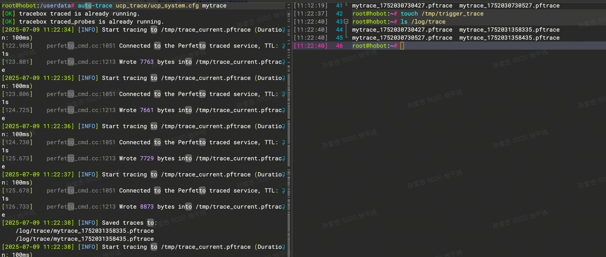
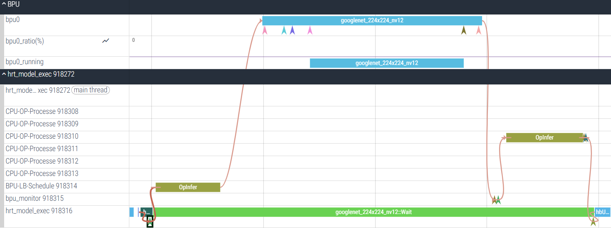
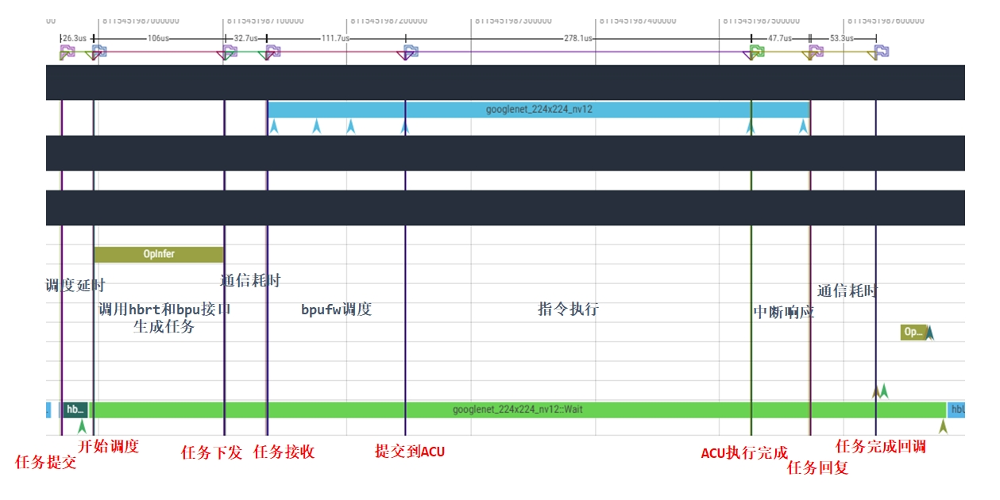
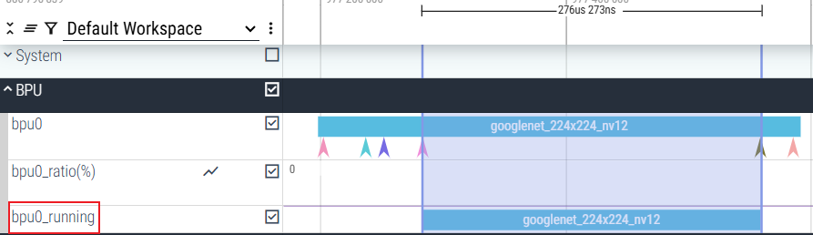
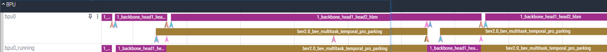

# 参考配置文件（<text color="red">需要根据实际需求对应修改</text>）
<view type="1">

  <file token="Abcnb8zsMoeMF0xnKbHcoTiqn3d" name="trace.zip"/>

</view>

x86 版本
<view type="1">

  <file token="KjvIblcu8okuKqxDgy1cyWpRnzh" name="ucp_traceprocessor"/>

</view>

aarch64 版本
<view type="1">

  <file token="BinxbzoPaodjhDxRFiacqUfxnCe" name="ucp_traceprocessor_aarch64"/>

</view>

# 方式一：使用自定义脚本抓取
使用方法：
<callout emoji="exclamation" background-color="light-orange" border-color="light-orange">
终端一：
step1: `source trace_background.sh`
step2:  修改 enable_trace.sh 的路径为**正确路径** `source enable_trace.sh`
</callout>

<callout emoji="bulb" background-color="light-orange" border-color="light-orange">
终端二：
step3：<text color="red">**另起终端**</text>，修改set_env.sh 为**正确路径** `source set_env.sh`
step4: 启动应用
</callout>

<callout emoji="zap" background-color="light-orange" border-color="light-orange">
为了能够抓取完整的数据，需要确保需要抓取的应用执行结束前，`perfetto`进程未退出
</callout>

<callout emoji="bulb" background-color="light-orange" border-color="light-orange">
step5: ucp_traceprocessor --bpu-running  -i ucp.fprace -o ucp.fprace.process
</callout>

# 方式二：使用命令抓取
## 运行 Perfetto 后台进程（<text color="red">在所有UCP进程启动前执行</text>）
```bash
#开启BPU驱动动态trace功能,只需执行一次(330及之后的BSP版本才能加)
#echo 1 > /sys/devices/system/bpu/bpu0/trace

# 启动 trace 服务。
# 只需要启动一次，如果已经启动，则不需要再次启动。
tracebox traced --background

# 运行数据捕获服务。
# 只需要启动一次，如果已经启动，则不需要再次启动。
tracebox traced_probes --background --reset-ftrace
```

<callout emoji="zap" background-color="light-orange" border-color="light-orange">
为了能够抓取完整的数据，需要确保执行结束前，`perfetto`进程未退出，即终端B任务先结束。
</callout>

## 触发数据抓取（<text color="red">BSP330版本之前需在所有UCP进程启动前执行</text>）
```bash {wrap}
# -c：指定perfetto 配置文件。
# -o：指定输出trace数据文件路径。
tracebox perfetto --txt -c ucp_system.cfg -o ucp.pftrace
```

ucp_system.cfg（<text color="red">只抓UCP和BPU trace用这个配置即可</text>）
```bash {wrap}
# Sampling duration: 30s
duration_ms: 30000

# Writes the userspace buffer into the file every 2.5 seconds.
file_write_period_ms: 2500

# buffer 0
buffers {
  # buffer size
  size_kb: 65535
  # DISCARD: no new sampling data will be stored when the storage is full.
  # RING_BUFFER: old sampling data will be discarded and new data will be stored when the storage is full.
  fill_policy: RING_BUFFER
}

# buffer 1
buffers {
  size_kb: 131072
  fill_policy: RING_BUFFER
}

data_sources {
  config {
    name: "linux.ftrace"
    target_buffer: 1
    ftrace_config {
      # These parameters affect only the kernel trace buffer size and how
      # frequently it gets moved into the userspace buffer defined above.
      # The max event rate is : 32M/0.2s = 160M/s
      buffer_size_kb: 32768
      drain_period_ms: 300
      # Whether to compress ftrace event data
      compact_sched: {
        enabled: true
      }
      ftrace_events: "sched/sched_process_exec"
      ftrace_events: "sched/sched_process_exit"
      ftrace_events: "sched/sched_process_fork"
      ftrace_events: "sched/sched_process_free"
      ftrace_events: "sched/sched_process_hang"
      ftrace_events: "sched/sched_process_wait"
      ftrace_events: "sched/sched_switch"
      ftrace_events: "sched/sched_wakeup_new"
      ftrace_events: "sched/sched_wakeup"
      ftrace_events: "sched/sched_waking"
      ftrace_events: "task/task_newtask"
      ftrace_events: "task/task_rename"
    }
  }
}

# UCP data source
data_sources: {
    config {
        name: "track_event"
        target_buffer: 1
        track_event_config {
           enabled_categories: "dnn"
        }
    }
}

#bpu data source
data_sources: {
    config {
        name: "linux.sys_stats"
        sys_stats_config {
            bputrace_period_ms: 500
        }
    }
}

```

## 另起一个终端，配置 UCP 环境变量并启动应用
```bash {wrap}
# 指定 ucp perfetto 配置路径。
export HB_UCP_PERFETTO_CONFIG_PATH=ucp_system.json

# 开启 UCP perfetto 功能。
export HB_UCP_ENABLE_PERFETTO=true

# 启动应用（以hrt_model_exec为例）
./hrt_model_exec perf                      \
    --model_file resnet50_224x224_nv12.hbm \
    --frame_count 1000                     \
    --thread_num 8
```

ucp_system.json
```json {wrap}
{
  "backend": "system"
}
```

## 处理 trace 文件支持 perfettp UI 可视化
```python
./ucp_traceprocessor --bpu-running -i ucp.pftrace -o ucp_new.pftrace
```

# **偶发推理问题如何trace**
**问题描述**：长稳测试时，偶发某问题，复现概率很低，希望在出现该问题前后，能抓到现场的trace info，应该如何进行？
## **方式一：使用 trace_box 设置采样间隔为0（存在缺陷，不建议使用）**
<callout emoji="exclamation" background-color="light-orange" border-color="light-orange">
当前 perfetto 只支持 trace 文件追加，不支持覆盖，太大的文件无法进行可视化
</callout>

1. 对于不知何时触发问题的长稳测试场景，需要开启环境变量HB_UCP_ENABLE_PERFETTO，执行perfetto命令，将duration_ms设置为0进行**持续抓取**trace。
1. 通过设置ucp_system.cfg中 buffers的fill_policy: RING_BUFFER，实现新数据对旧数据的buffer覆盖。
1. ucp_system.cfg配置信息如下所示，**注意**，buffer的大小，需要根据用户实际场景先验证下，根据实际情况调整。
```python
# Sampling duration: 单位是ms，0表示持续抓取
duration_ms: 0

write_into_file: true    # 按照设定的周期，将buffer写入到文件
# Writes the userspace buffer into the file every 2.5 seconds.
file_write_period_ms: 2500    # 控制buffer写文件，不是覆盖，相当于控制落盘，这个参数一般不需要特别指定

# buffer 0
buffers {
  size_kb: 65536    # 如果出现数据丢失，则设置更大一些
  fill_policy: RING_BUFFER
}

# buffer 1
buffers {
  size_kb: 131072    # 如果出现数据丢失，则设置更大一些
  fill_policy: RING_BUFFER
}

# UCP data source
data_sources: {
    config {
        name: "track_event"
        target_buffer: 0
        track_event_config {
           enabled_categories: "dnn"
        }
    }
}
```

## 方式二：使用 auto_trace 工具
<view type="1">

  <file token="YCqgbLAeKoKYPRxnKNMcD3tUnfD" name="auto-trace"/>

</view>

```plaintext
auto-trace ucp_trace/ucp_system.cfg

# 触发落盘
touch /tmp/trigger_trace
```

- auto-trace 会自动起 tracebox traced 和 tracebox traced_probes
- 落盘的时间间隔根据 cfg 里的 duration_ms 决定
- 没有落盘信号就会循环覆盖到 /tmp/trace_current.pftrace 目录
- 可以一直保持落盘信号就可以保证按时间分块保存文件


<callout emoji="bulb" background-color="light-orange" border-color="light-orange">
 如果需要抓火焰图需要手动启动 tracebox traced_perf &
</callout>

# **BPU Trace文件解读**
使用官方的 [<text underline="true">Perfetto UI</text>](https://ui.perfetto.dev/) 打开ucp_traceprocessor处理后的ucp_new.pftrace，展示从UCP模型推理任务的创建，提交，调度执行，直至任务完成执行并最终释放的完整流程。


bpu_trace和ucp_trace进行了关联。


<quote-container>
bpu trace和ucp trace可能因为时间同步的影响，导致任务下发时间晚于bpu任务接收的时间，不影响问题分析，若纠结，可将该问题反馈给UCP/BSP同学进行分析。
</quote-container>

其中，UCP trace的关键事件点，本文不再介绍，下面关注**BPU Trace** 中的关键事件点。
## 关键事件点介绍

<lark-table rows="7" cols="3" column-widths="238,140,285">

  <lark-tr>
    <lark-td>
      **事件**
    </lark-td>
    <lark-td>
      **运行上下文**
    </lark-td>
    <lark-td>
      **简介**
    </lark-td>
  </lark-tr>
  <lark-tr>
    <lark-td>
      hb_bpu_task_get
    </lark-td>
    <lark-td>
      TMU中断响应
    </lark-td>
    <lark-td>
      获取bpu任务并放入pending队列
    </lark-td>
  </lark-tr>
  <lark-tr>
    <lark-td>
      hbfw_task_get
    </lark-td>
    <lark-td>
      调度线程
    </lark-td>
    <lark-td>
      从pending队列获取任务处理
    </lark-td>
  </lark-tr>
  <lark-tr>
    <lark-td>
      hbfw_parse_end
    </lark-td>
    <lark-td>
      调度线程
    </lark-td>
    <lark-td>
      任务解析完成
    </lark-td>
  </lark-tr>
  <lark-tr>
    <lark-td>
      bpu_acu_job_cfg_and_update
    </lark-td>
    <lark-td>
      调度线程
    </lark-td>
    <lark-td>
      acu job配置和更新
    </lark-td>
  </lark-tr>
  <lark-tr>
    <lark-td>
      bpu_acu_job_done_int
    </lark-td>
    <lark-td>
      ACU中断响应
    </lark-td>
    <lark-td>
      acu job执行完成
    </lark-td>
  </lark-tr>
  <lark-tr>
    <lark-td>
      hb_bpu_task_put
    </lark-td>
    <lark-td>
      调度线程
    </lark-td>
    <lark-td>
      任务回复，会触发TMU中断通知A核
    </lark-td>
  </lark-tr>
</lark-table>



图中对应的6个“箭头”表示上面的关键事件点，bpu_acu_job_cfg_and_update与bpu_acu_job_done_int之间是BPU指令执行时间，一套完整的智驾pipeline编排，会尽可能让bpu0_running排满。

## 进阶内容
在多个模型一起提交运行时，可能在BPU trace中看到如下情形：J6E/M只有一个bpu核，且是串行执行任务，为什么在BPU0那一行会出现两个任务并行的现象呢？


**答**：BPU trace时没有区分RISC-V和ACU，ACU执行的时候，RISC-V可以并行跑（<text bgcolor="light-green">ACU与RSIV均可以控制BPU中的计算部件</text>），所以出现上述现象。实际指令执行依旧是串行的，可以看bpu0_running这一行。
## SQL 参考
```sql
SELECT
  ts,
  dur / 1e6 AS dur_ms,
  name,
  a1.int_value AS uid,
  a2.int_value AS task_id
FROM slice
LEFT JOIN args a1
  ON slice.arg_set_id = a1.arg_set_id
  AND a1.key = 'debug.uid'
LEFT JOIN args a2
  ON slice.arg_set_id = a2.arg_set_id
  AND a2.key = 'debug.task_id'
WHERE category = 'bpu'
  AND dur > 100000000;   -- >100ms
```
