# 1 认识OE
## 1.1 软硬件架构
体现模块部署链路涉及的 IP
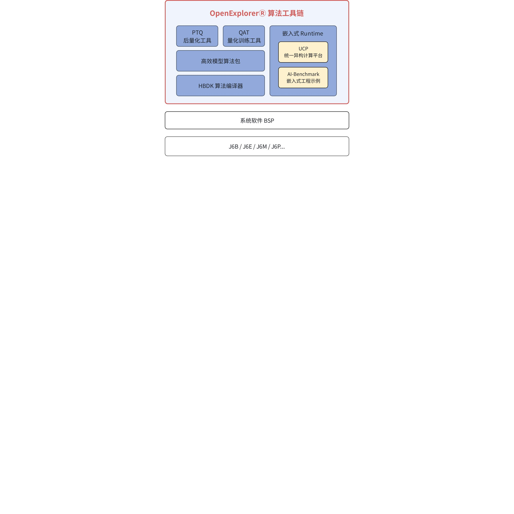

图1.2  OE结构图

## 1.2 OE交付物
可用于量产的 OE-3.0.31 版本交付物如下：
<sheet token="Q7NPs7mROhIvQgtHaOVcI4Y9nfd_YHoEZa"/>


## 1.3 OE目录结构说明
```python
horizon_j6_open_explorer_v3.0.31-py310_20240705/
├── package                    // 包含发布物运行的一些基础库和组件
│   ├── board
│   │   ├── hrt_model_exec    // 板端模型执行文件，支持获取模型信息、性能评测、单帧推理
│   │   └── install.sh        // hrt_model_exec板端安装脚本，支持配置开发板IP地址
│   └── host
│       ├── ai_toolchain       // 包含x86环境工具链各whl安装包
│       ├── install.sh         // x86环境本地一键安装脚本
│       └── resolve.sh         // 下载交叉编译工具、torch等依赖的脚本
├── README-CN
├── README-EN
├── resolve_all.sh              // 下载OE包内所有依赖项的脚本
├── run_docker.sh               // 挂载OE包并启动Docker容器的脚本
└── samples
    ├── ai_toolchain
    │   ├── horizon_model_convert_sample    // 模型PTQ链路转换示例
    │   ├── horizon_model_train_sample      // 模型QAT链路转换示例
    │   └── model_zoo
    ├── model_zoo
    └── ucp_tutorial          // 统一计算平台(UCP)示例
        ├── deps_aarch64      // aarch64依赖库
        ├── deps_x86          // x86仿真依赖库
        ├── dnn               // 模型推理示例
        ├── hpl               // 高性能计算库算子示例
        ├── tools             // 工具目录，包含hrt_model_exec、hrt_ucp_monitor、trace工具
        └── vp                // 视觉处理算子示例
```

更多说明请见用户手册<text bgcolor="light-green">《产品简介-认识Open Explorer-发布物内容》</text>

## 1.4 子模块说明
地平线 OpenExplorer 算法工具链主要包含为以下几个子模块，大家在 `package/host/ai_toolchain` 目录下也能找到对应的 whl 包。
<sheet token="Q7NPs7mROhIvQgtHaOVcI4Y9nfd_ywyELg"/>


# 2 J6模型部署流程
## 2.1 OE环境搭建
OE 的使用环境包括 x86 开发机和板端运行环境，其中：
- x86 环境主要用于：模型训练、模型检查、模型编译、精度验证、仿真回灌，以及应用工程的交叉编译；
- aarch64 板端运行环境则主要用于：模型推理、性能验证、应用部署等。
---

<grid cols="2">
  <column width="53">
    OE 环境搭建方式请见用户手册《环境部署》。J6 当前版本 PTQ 和 QAT 链路对于 x86 开发机的环境要求如下：
    <sheet token="Q7NPs7mROhIvQgtHaOVcI4Y9nfd_W31mLr"/>

  </column>
  <column width="46">
    基于 UCP 开发应用，完成交叉编译、部署，使用环境及工具要求参考如下：
    <sheet token="Q7NPs7mROhIvQgtHaOVcI4Y9nfd_wwFWVi"/>


  </column>
</grid>


## 2.2 模型转换部署基础流程图
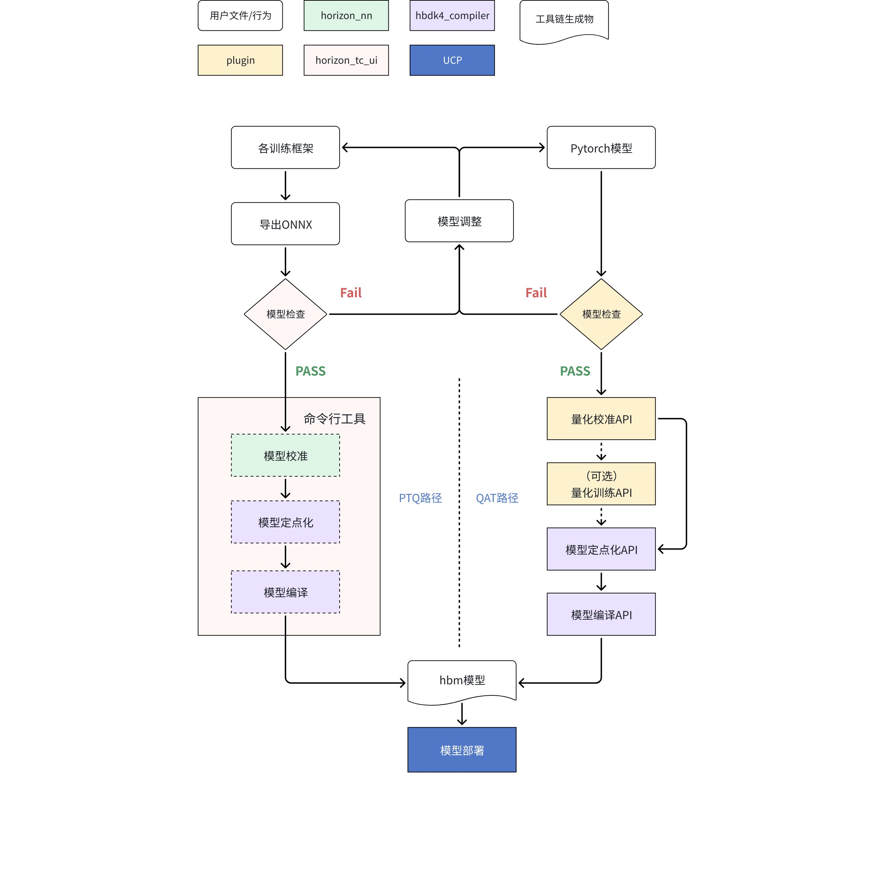

其中：
1. **PTQ 路径模型检查**：使用 horizon-tc-ui 封装的 <text color="red">`hb_compile`</text> 工具；文档目录为<text bgcolor="light-green">《训练后量化(PTQ)-PTQ转换工具-hb_compile工具-模型验证》</text>
1. **QAT 路径模型检查**：使用 plugin 和 hbdk4_compiler 提供的 API 完成模型 prepare、export、convert 流程验证；文档目录可参考<text bgcolor="light-green">《量化感知训练(QAT)-API参考-QAT-quantization.prepare》</text>和<text bgcolor="light-green">《进阶内容-HBDK Tool API Reference》</text>
1. **PTQ 路径模型转换**：仍然使用 horizon-tc-ui 封装的 <text color="red">`hb_compile`</text> 工具；文档目录为<text bgcolor="light-green">《训练后量化(PTQ)-PTQ转换工具-hb_compile工具-模型量化编译》</text>，该工具会自动调用 horizon-nn 完成模型的解析、onnx 图优化、校准、查表算子（通常为非线性激活）定点化；以及调用 hbdk4_compiler 完成整个模型的定点化以及编译，直接产出可上板部署的 hbm 模型
1. **QAT 路径模型转换**：使用 horizon_plugin_pytorch 的 API 接口完成模型的校准和 QAT 量化（如若校准后的精度已满足部署要求，则可直接跳过 QAT 训练阶段），再使用 hbdk4_compiler 的 API 接口完成伪量化模型的定点化和编译，得到可用于部署的 hbm 模型，其中：
  1. horizon_plugin_pytorch 的 API 接口文档可参考用户手册<text bgcolor="light-green">《量化感知训练(QAT)-API参考》</text>
  1. hbdk4_compiler 的 API 接口文档可参考用户手册<text bgcolor="light-green">《进阶内容-HBDK Tool API Reference》</text>
1. **模型部署**：使用 UCP 相关的 C++ 接口实现，可参考用户手册<text bgcolor="light-green">《统一计算平台(UCP)-模型推理开发》</text>

## 2.3 模型检查
### 2.3.1 PTQ
为了确保模型能正确部署在 J6 平台上，我们建议在模型训练前优先进行模型结构检查，排查模型中是否存在 J6 不支持的算子或结构。模型检查的主要步骤如下：
1. 请先将各深度学习框架下的模型导出为 <text color="red">`opset10～19`</text> 的 ONNX 模型
1. 在 x86 开发机使用 <text color="red">`hb_compile`</text> 命令行工具快速完成模型检查，参考命令如下：
```bash
hb_compile --march nash-e --model ***.onnx
```

<quote-container>
如果部署平台为 J6M，则配置架构参数（march）为 <text color="red">`nash-m`</text>
</quote-container>

### 2.3.2 QAT
<text bgcolor="light-yellow">走 prepare + export + convert 流程验证，有专门章节介绍</text>
### 2.3.3 算子支持范围&约束
对于检查失败或不符合预期（例如有算子未能 BPU 加速）的模型，可以根据对应的报错日志修改模型，包括：替换 J6 暂不支持的算子，修改因超出 BPU 支持约束而跑在 CPU 上的算子参数等。J6 当前版本的算子约束列表请见参考用户手册<text bgcolor="light-green">《附录-工具链算子支持约束列表》</text>。

## 2.4 性能验证
在模型正式训练前，我们还建议对模型性能（FPS/Latency）进行摸底，以确定该模型是否能满足应用部署的帧率要求，是否还需要对模型结构进行优化，以及需要优化的程度。
性能验证的主要步骤如下：
1. **模型编译**：在 x86 开发机使用 <text color="red">`hb_compile`</text> 工具的快速性能评测模式（fast-perf）编译模型，参考命令如下：
```bash
hb_compile --fast-perf --march nash-e --model *.onnx
```

1. **静态性能预估**：编译生成物中的 `html/json` 文件即为模型的静态性能预估，文件中会包含编译器对于模型 FPS、Latency、带宽占用、逐层算子信息的相关数据，以便用户在板端实测前就能大致了解模型的性能情况。
1. **动态性能预估**：将 hbm 模型拷贝至 J6 开发板，并使用 <text color="red">`hrt_model_exec`</text> 工具快速评测模型性能，参考命令如下，工具详细使用说明可参考用户手册<text bgcolor="light-green">《统一计算平台(UCP)-模型推理开发-模型推理工具介绍-hrt_model_exec工具介绍》</text>
```bash
hrt_model_exec perf --model_file *.hbm --frame_count 1000 --thread_num 8    # 评测FPS
hrt_model_exec perf --model_file *.hbm --frame_count 1000 --thread_num 1    # 评测Latency
```

主要参数说明：
<quote-container>
- frame_count：模型执行次数，默认值为 200；
- thread_num：线程数，可配置范围 [1, 8]，默认值为 1。
</quote-container>

关于单线程和多线程的说明：
<quote-container>
- 当 thread_num=1 时，工具按照单线程串行逻辑运行，此时统计得到的 latency 可以认为是单帧处理的平均执行时间，包括：框架调度的开销（一般可忽略不计）+ BPU 执行时间 + CPU 执行时间（如果有量化/反量化等CPU算子）；您还可以在执行命令中增加 <text color="red">`--profile_path`</text> 参数来指定日志生成路径，其中会分别统计 op 耗时和调度耗时。
- 当 thread_num=8 时，工具会启动 8 线程运行，此时 CPU 和 BPU 的开销会并发掉，BPU 的时间片会被尽量占满，所以会有更高的吞吐量，即 FPS。但因为 BPU 本身是一个独占的硬件，同一时间只能跑一个任务，所以此时 latency 耗时的增大，主要来源于任务下发后的等待时间（即 BPU 正在执行其他任务）。
- 板端 BPU 占用率可使用 <text color="red">`hrt_ucp_monitor`</text> 工具进行查看，工具使用说明可参考用户手册<text bgcolor="light-green">《统一计算平台(UCP)-UCP性能分析工具-hrt_ucp_monitor工具介绍》</text>。
</quote-container>


## 2.5 模型训练
地平线工具链目前不会入侵客户模型的浮点训练阶段，完全由用户自行控制。

## 2.6 模型量化编译
J6 工具链提供 PTQ（Post-Training Quantization，训练后量化）和 QAT 两种量化方式，整体使用方式和 J5 一致。内部执行的流程图如下所示：
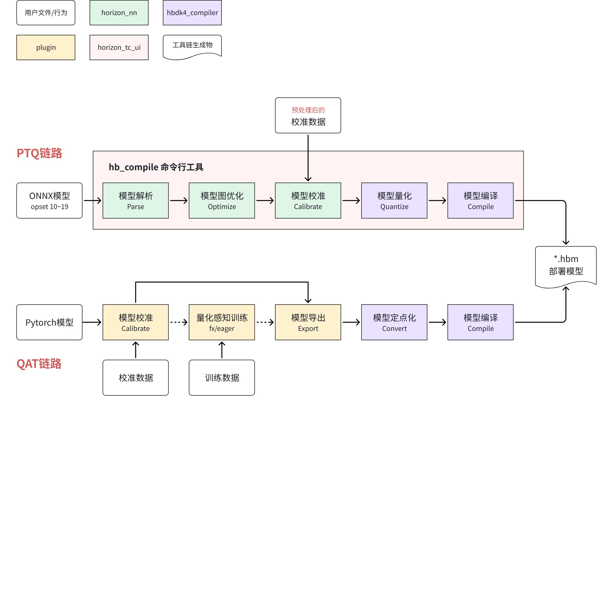


### 2.6.1 PTQ量化链路
PTQ 量化方式不涉及模型训练或 finetuning 过程，仅依赖部分校准数据（通常约100张）的前向推理结果，并基于数学统计的方式得到浮点至定点换算的量化阈值。因此，PTQ 量化方式的使用门槛和成本都较低，建议优先尝试。如果模型经多次调优（可使用 [PTQ精度debug工具](http://j6.doc.oe.hobot.cc/guide/ptq/ptq_tool/accuracy_debug.html)）后仍无法满足精度要求，可再尝试 QAT 量化方式。
#### 2.6.1.1 PTQ转换流程&产出物
地平线 PTQ 链路的模型转换同样使用 [hb_compile](http://j6.doc.oe.hobot.cc/guide/ptq/ptq_tool/hb_compile/convert.html#%E4%BD%BF%E7%94%A8%E6%96%B9%E6%B3%95) 工具，通过 yaml 文件配置好相关参数后，即可一行命令完成模型解析+图优化+校准+量化+编译的全部流程，详细说明可参考 [<text underline="true">转换内部过程解读</text>](http://j6.doc.oe.hobot.cc/3.0.13/guide/ptq/ptq_usage/quantize_compile.html#conversion_interpretation)。
```bash {wrap}
hb_compile -c xxx.yaml
```

PTQ 流程的产出物如下图所示，详细说明可参考 [转换产出物解读](http://j6.doc.oe.hobot.cc/3.0.13/guide/ptq/ptq_usage/quantize_compile.html#conversion_output)。
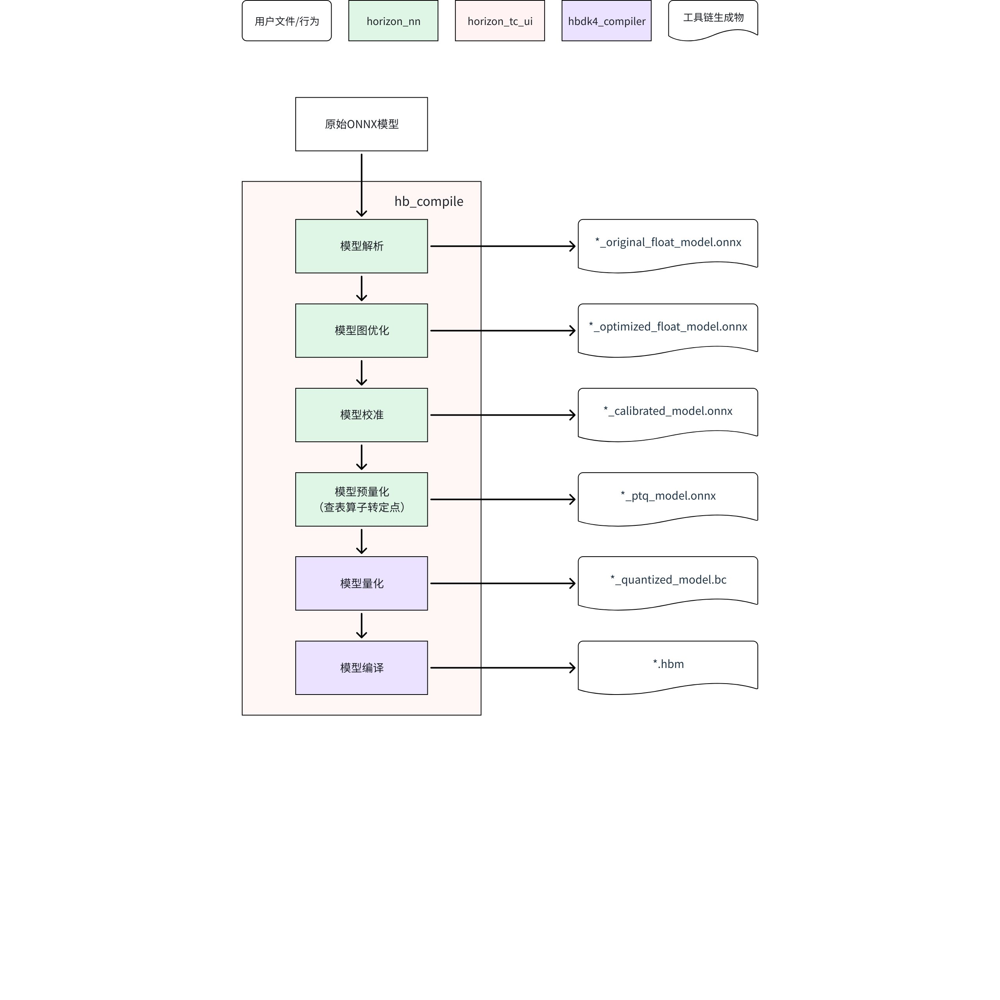

此外，J6 工具链还优化了模型算子融合、执行后端、量化后余弦相似度等信息的显示，会打印在控制台，并以 csv 的形式保存在 yaml 文件中配置的 `working_dir` 路径下，具体可见 [转换结果解读](http://j6.doc.oe.hobot.cc/guide/ptq/ptq_usage/quantize_compile.html#%E8%BD%AC%E6%8D%A2%E7%BB%93%E6%9E%9C%E8%A7%A3%E8%AF%BB)。
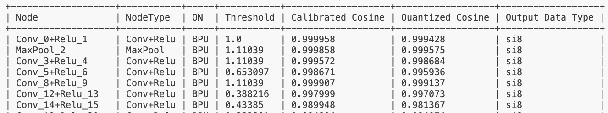

上图为某模型的终端打印，其中：
- ***Node、NodeType***：为算子名称和类型，也体现了 optimize 阶段数学等价的算子融合策略
- ***ON***：为算子执行后端，包括 BPU、CPU、JIT（CPU 生成 BPU 指令再由 BPU 执行计算）
- ***Threshold***：为算子的量化阈值
- ***Calibrated Cosine***：为 *_calibrated_model.onnx 和 *_optimized_float_model.onnx 的余弦相似度
- ***Quantized Cosine***：为 *_quantized_model.bc 和 *_optimized_float_model.onnx  的余弦相似度
- ***Output Data Type***：为算子输出类型，包括 ['si8', 'si16', 'si32', 'si64', 'ui8', 'ui16', 'ui32', 'ui64', 'f32']

#### 2.6.1.2 YAML配置
Yaml 文件的配置方式可参考 [配置文件模板](http://j6.doc.oe.hobot.cc/3.0.13/guide/ptq/ptq_tool/hb_compile/convert.html#full_yaml)。您可以使用 [hb_config_generator](http://j6.doc.oe.hobot.cc/3.0.13/guide/ptq/ptq_tool/hb_config_generator.html) 工具生成一份基础 Yaml 文件进行修改，也可以基于之前 2.4 节 fast-perf 模式生成的隐藏文件 `.fast_perf/xxx_config.yaml` 进行修改（如果您执行过的话）。

#### 2.6.1.3 校准数据
<callout emoji="bulb" background-color="light-orange" border-color="light-orange">
**请注意**：
J6 工具链 PTQ 链路的校准数据和原始 onnx 模型的推理数据保持完全一致，因此需要用户自行完成数据的预处理，即 `(x-mean)/std` 的数据归一化，这和 J5 是不一样的。
</callout>


#### 2.6.1.4 校准策略
J6 当前版本支持和 J5 一样的校准策略，包括：[`default`](http://j6.doc.oe.hobot.cc/3.0.13/guide/ptq/ptq_faq_troubleshooting/ptq_faq.html#%E5%A6%82%E4%BD%95%E7%90%86%E8%A7%A3%E5%9C%B0%E5%B9%B3%E7%BA%BF%E7%9A%84default%E6%A0%A1%E5%87%86%E6%96%B9%E5%BC%8F)、[`mix`](http://j6.doc.oe.hobot.cc/3.0.13/guide/ptq/ptq_faq_troubleshooting/ptq_faq.html#%E5%A6%82%E4%BD%95%E7%90%86%E8%A7%A3%E5%9C%B0%E5%B9%B3%E7%BA%BF%E7%9A%84mix%E6%A0%A1%E5%87%86%E6%96%B9%E5%BC%8F)、`max`、`kl`。
此外，还支持通过：
- `node_info` 参数配置指定 op 的输入输出数据类型为 int16 以及强制指定算子在 CPU 或 BPU 上运行
- `optimization` 参数配置一些通用的精度设置，例如设置模以 int8/int16 格式低精度输出、偏差校正等
- 新增参数 `quant_config`
更多参数说明可参考 [配置文件具体参数信息](http://j6.doc.oe.hobot.cc/3.0.13/guide/ptq/ptq_tool/hb_compile/convert.html#config_parameter)。

#### 2.6.1.5 模型可视化
1. onnx 模型可以使用开源工具 [netron](https://github.com/lutzroeder/netron?tab=readme-ov-file#install)；
2. *.bc 和 *.hbm 则支持使用 [<text bgcolor="light-yellow">hb_model_info</text>](http://j6.doc.oe.hobot.cc/3.0.13/guide/ptq/ptq_tool/hb_model_info.html)<text bgcolor="light-yellow"> </text>工具：
```bash
 hb_model_info *.bc/*.hbm -v
```

<quote-container>
- 您可以在 Docker 容器的启动命令中增加 <text bgcolor="light-green">`--network=host`</text>，即可启动 webserver 便捷查看模型结构；
- 隐藏文件夹 `.hb_model_info` 也会保存对应的可视化模型，以便后续再通过 netron 工具查看。
</quote-container>

对于定点模型中的 CPU 算子：
- *.bc 的可视化模型可以检索 `hbtl_call` 关键字；
- *.hbm 因为已经是 BPU 指令集，因此无算子概念，但可以通过可视化快速查看模型 BPU、CPU 的组成情况。


#### 2.6.1.6 模型推理/部署
1. onnx 和 bc 模型均支持 x86 环境使用 [HBRuntime推理库](http://j6.doc.oe.hobot.cc/guide/ptq/ptq_tool/hbruntime.html) 进行推理；
2. hbm 为板端部署模型，支持使用 DNN/UCP 提供的接口进行推理：[<text bgcolor="light-yellow">模型推理API</text>](http://j6.doc.oe.hobot.cc/guide/ucp/runtime/bpu_sdk_api/bpu_sdk_api_overview.html)；
3. *_quantized_model.bc 为 x86 环境部署的定点模型，其定点部分与 hbm 模型可保持二进制一致，浮点部分会存在 x86 和芯片上 ARM 架构本身的差异，但对模型精度几乎无影响。因此，*_quantized_model.bc 可用于 x86 环境下的仿真回灌，**且支持 GPU 推理加速(速度没有明显优化)**；
4. *_quantized_model.bc 后续版本还将支持和 hbm 一样的 DNN/UCP 接口推理，以支持应用工程从 x86 仿真环境到板端部署环境的丝滑迁移。
5. ~~支持多个 hbm 模型打包，使用方法参考如下：~~
  ```python
  from hbdk4.compiler import hbm_pack
  hbm_pack(["model1.hbm", "model2.hbm", "model3.hbm"], "packed.hbm")
  ```


### 2.6.2 QAT量化链路
地平线的 QAT 链路为 PyTorch 框架 + Horizon_Plugin 的使用方式，其基本使用流程如下：
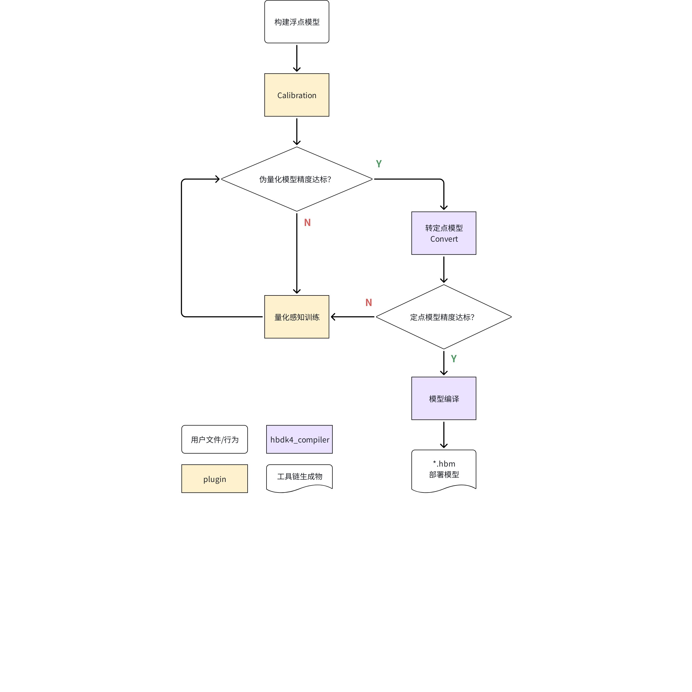

地平线的量化感知训练支持 Fx 和 Eager 、JIT几种模式。和 PyTorch 官方一样，<text bgcolor="light-green">地平线也推荐优先使用 JIT 量化模式</text>
基础示例可参考 OE 开发包 `samples/ai_toolchain/horizon_model_train_sample/plugin_basic` 路径的 `fx_mode.py` 和 `eager_mode.py`，对应用户手册章节为 <text bgcolor="light-red">快速入门</text>。
本节将以 `fx_mode.py`  为例，进行基础使用和特性介绍。

#### 2.6.2.1 浮点模型准备
地平线的 QAT 链路不会入侵客户模型的浮点训练阶段，完全由用户自行控制。仅需对训练好的浮点模型做一些必要的改造即可，以支持量化相关的操作。
该示例浮点模型使用了 torchvision 中的 MobileNetV2，仅在模型前、后插入 `QunantStub`、`DequanStub` （**改造后仍可无缝加载模型参数**），相关代码如下：
```python {wrap}
from torch.quantization import DeQuantStub
from horizon_plugin_pytorch.quantization import (QuantStub, ...)
from torchvision.models.mobilenetv2 import MobileNetV2

class FxQATReadyMobileNetV2(MobileNetV2):
    def __init__(self, ...):
        super().__init__(...)
        self.quant = QuantStub(scale=1/128)
        self.dequant = DeQuantStub()

    def forward(self, x: Tensor) -> Tensor:
        x = self.quant(x)
        x = super().forward(x)
        x = self.dequant(x)
        return x
```

其中，需要注意的是：
- `QuantStub` 和 `DequantStub` 必须注册为模型的子模块，否则将无法正确处理它们的量化状态；
- 多个输入仅在 scale 相同时可以共享 `QuantStub`，否则每个输入需要单独定义 `QuantStub`；
- 若板端部署模型的输入数据是 nv12/gray，则 `QuantStub` 的 `scale` 参数应手动设置为 `1/128`；
- 若需要手动固定 sclae 值，则必须使用 `horizon_plugin_pytorch.quantization.QuantStub`，不能使用 `torch.quantization.QuantStub`。
<callout emoji="bulb" background-color="light-orange" border-color="light-orange">
**注意：**
模型训练使用的数据类型，建议对齐板端部署时常用的 centered_yuv444 格式，否则请在模型输入上插入对应的颜色空间转换节点（可能会引入定点计算产生的少量精度损失）
</callout>


#### 2.6.2.2 Calibration
对于改造完的浮点模型，**建议优先进行 Calibration 校准**，此过程通过在模型中插入 Observer 的方式，在 forward 过程中统计各处的数据分布情况，从而计算出合理的量化参数：
- 如果校准后的精度已满足要求，即可跳过费时费成本的量化感知训练，直接进行模型的编译和部署；
- 如果校准后的精度仍不满足要求，也可节约后续量化感知训练的时间，并对最终训练精度的提升有利。
更多 Calibration 的说明可参考 [Calibration 指南](http://j6.doc.oe.hobot.cc/3.0.13/guide/plugin/user_guide/calibration.html)。

Calibration 与 QAT 的整体流程如下图所示：
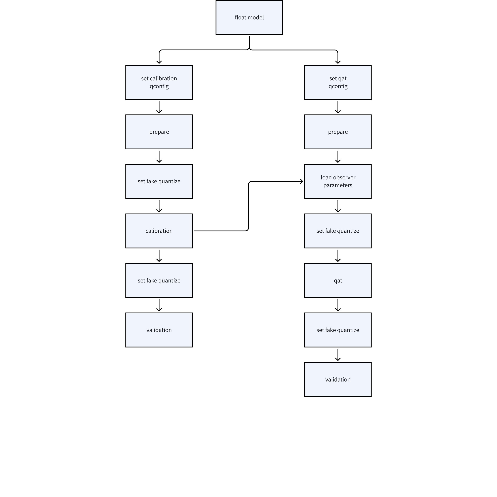

其中，`fx_mode.py` 中与 Clibration 阶段相关的代码包括：
```python
from horizon_plugin_pytorch.march import March, set_march
from horizon_plugin_pytorch.quantization import get_default_qconfig, prepare_qat_fx

def get_model_fx(stage, model_path, device, march=March.NASH_E) -> nn.Module:
    ...
    set_march(march)    # 模型转化前必须设置好部署的硬件平台架构，J6E 为 March.NASH_E

    qat_calib_model = prepare(
        # 输出模型会共享输入模型的 attributes，为了不影响浮点模型的后续使用，进行 deepcopy
        copy.deepcopy(float_model),
        {
            "": get_default_qconfig(),
            "module_name": {
                # 当模型输出层为 Conv/Linear 时，可以配置为 int32 高精度输出：
                # default_calib_8bit_weight_32bit_out_fake_quant_qconfig
                "classifier": get_default_qconfig(activation_fake_quant=None),
            },
        },
    ).to(device)    # prepare_qat_fx 接口不保证输出模型的 device 和输入模型完全一致
```

<text color="purple">**【流程1+2】**</text>set_calibration_qconfig  +  prepare
`prepare_qat_fx` 会为模型插入 Observer 节点，以统计各处数据的数值分布特征，并支持通过 `qconfig` 配置模型的量化方式：
- 相比于自定义 qconfig，我们更推荐使用地平线根据处理器限制和特性预定义好的 qconfig 变量；
- `get_default_qconfig` 可以为 weight、activation 设置不同的 observer，其中 weight_observer 推荐使用默认的 <text color="red">`min_max`</text>，activation_observer 则推荐使用 <text color="red">`mse`</text>。更多说明可参考 [qconfig 详解](http://j6.doc.oe.hobot.cc/3.0.13/guide/plugin/user_guide/qconfig.html)；
- 当前版本 calibration 可选 observer 包括：`min_max`、`percentile`、`mse`、`kl`、`mix`。 详细说明可参考 [常用算法介绍](http://j6.doc.oe.hobot.cc/3.0.13/guide/plugin/user_guide/calibration.html#%E5%B8%B8%E7%94%A8%E7%AE%97%E6%B3%95%E4%BB%8B%E7%BB%8D)。

<text color="purple">**【流程3】**</text>set fake quantize
`fake quantize` 一共有三种状态：`QAT` 、 `CALIBRATION` 、 `VALIDATION`，需要在对应的阶段进行配置。
对应代码在 `fx_mode.py` 同路径下的 `common.py`：
```python
from horizon_plugin_pytorch.quantization import set_fake_quantize

def calibrate(calib_model, ...):
    # 准备校准数据集
    train_data_loader, eval_data_loader = prepare_data_loaders(
        data_path, calib_batch_size, eval_batch_size
    )

    # 执行 Calibration 过程（不需要 backward）
    calib_model.eval()    # 注意：校准模型需要处于 eval 状态以使 Bn 的行为符合要求
    set_fake_quantize(calib_model, FakeQuantState.CALIBRATION)    # 配置伪量化状态为 CALIBRATION
    with torch.no_grad():
        ...

    # 测试校准后的伪量化模型精度
    # 注意：validation 前需要再次指定 eval，因为 CALIBRATION 会将模型修改为 training 模式
    calib_model.eval()
    set_fake_quantize(calib_model, FakeQuantState.VALIDATION)
    top1, top5 = evaluate(...)

    # 保存 Calibration 模型参数
    torch.save(
        calib_model.state_dict(),
        os.path.join(model_path, "calib-checkpoint.ckpt"),
    )

    return calib_model
```

<text color="purple">**【流程4】**</text>calibration
把准备好的校准数据喂给模型，模型会在 forward 过程中由 observer 观测相关统计量。

<text color="purple">**【流程5】**</text>set fake quantize
再次将模型状态设置为 eval，并设置 `fake quantize` 状态为 `VALIDATION`。

<text color="purple">**【流程6】**</text>validation
验证 calibration 效果。如果效果满意，则可以直接将模型转为定点或在此基础上进行量化感知训练，不满意则调整 calibration qconfig 中的参数继续 calibration，更多调参技巧可参考 [此处](http://j6.doc.oe.hobot.cc/3.0.13/guide/plugin/user_guide/calibration.html#%E8%B0%83%E5%8F%82%E6%8A%80%E5%B7%A7)。

#### 2.6.2.3 量化感知训练
量化感知训练是通过在模型中插入伪量化节点的方式，来感知训练过程中量化带来的影响，从而对模型参数进行微调，以提升量化后的精度。关于伪量化算子的更多信息可见 [此处](http://j6.doc.oe.hobot.cc/3.0.13/guide/plugin/user_guide/qat_guide.html#%E4%BC%AA%E9%87%8F%E5%8C%96%E7%AE%97%E5%AD%90)。
量化感知训练和传统的模型训练无异，但考虑用户可能难以全局了解部署平台的相关限制，地平线的 QAT Plugin 工具提供了自动插入伪量化算子的方法，以降低用户的使用门槛。

`fx_mode.py` 中的相关代码包括：
```python
from horizon_plugin_pytorch.quantization import get_default_qconfig, prepare_qat_fx

def get_model_fx(...):
    qat_calib_model = prepare(
        float_model,
        {
            "": get_default_qconfig(),
            "module_name": {
                "classifier": get_default_qconfig(activation_fake_quant=None),
            },
        },
    ).to(device)

    if stage == "qat":
        calib_state_dict = torch.load(calib_ckpt_path, map_location=device)
        qat_calib_model.load_state_dict(calib_state_dict)
        return qat_calib_model
```

和传统浮点模型训练相比，QAT 仅多了 2 个步骤：
- `prepare`：示例代码中 QAT 和 Calibration 共用了同一套配置；
- `load_state_dict` 加载 Calibration 模型参数，以获得一个比较好的初始化。

在 `common.py` 中，QAT 和浮点训练也共享了同一套训练流程，可见 `train` 函数：
```python
from horizon_plugin_pytorch.quantization import set_fake_quantize

def train(...):
    for nepoch in range(epoch_num):
        model.train()
        if stage == "qat":
            set_fake_quantize(model, FakeQuantState.QAT)
            train_one_epoch(...)

        model.eval()
        if stage == "qat":
            set_fake_quantize(model, FakeQuantState.VALIDATION)

        top1, top5 = evaluate(...)
        if top1.avg > best_acc:
            best_acc = top1.avg
            torch.save(model.state_dict(), ...）

    return model

def main(...):
    def qat_optim_config(model: nn.Module):
        # QAT training is targeted at fine tuning model params to match the
        # numerical quantization, so the learning rate should not be too large.
        optimizer = torch.optim.SGD(model.parameters(), lr=0.0001, weight_decay=2e-4)
        return optimizer, None

    default_epoch_num = {"float": 30, "qat": 3}
```

其中：
- QAT 模型训练阶段，需要将模型配置为 `train` 状态，并设置 `fake quantize` 状态为 `QAT`；
- QAT 模型精度验证时，则需要将模型配置为 `eval` 状态，并设置 `fake quantize` 状态为 `VALIDATION`；
- QAT 作为一个 filetune 过程，一般需要设定较小的学习率，且训练 epoch 数通常为浮点训练的 1/10 左右。
<callout emoji="bulb" background-color="light-orange" border-color="light-orange">
由于部署平台的底层限制，QAT 模型无法完全代表最终上板精度，请务必监控转定点后的 quantized 模型精度，确保其精度正常，否则可能出现模型上板掉点问题。
</callout>


#### 2.6.2.4 模型导出&编译&可视化
当伪量化模型经 Calibration (+ QAT) 精度达标后，便可将其转为定点模型。一般认为定点模型的结果和编译后模型的结果是完全一致的。所以请以定点模型的精度为准，若定点精度不达标，则需要继续进行量化感知训练。其中：
- 模型导出可使用 [`export`](http://j6.doc.oe.hobot.cc/guide/plugin/plugin_api_reference/export/horizon_plugin_pytorch_quantization_hbdk4_export.html) 和 [`convert`](http://j6.doc.oe.hobot.cc/guide/advanced_content/hbdk_tool.html#insert_image_convertmode-str--nv12) 接口
- 模型编译可使用 [`compile`](http://j6.doc.oe.hobot.cc/guide/advanced_content/hbdk_tool.html#hbdk4compilerapiscompilemmodule-path-str-march-marchbase--str-opt-int--2-jobs-int--4-max_time_per_fc-float--00-debug-bool--false-hbdk3_compatible_mode-bool--true-progress_bar-bool--false-advice-float--00-balance-int--100) 接口
- 模型保存至本地可使用 [`save`](http://j6.doc.oe.hobot.cc/guide/advanced_content/hbdk_tool.html#hbdk4compilerapissavemmodule-path-str) 接口
- 模型可视化可使用 [`visualize`](http://j6.doc.oe.hobot.cc/guide/advanced_content/hbdk_tool.html#hbdk4compilerapisvisualizemmodule-onnx_file-str--none--none) 接口
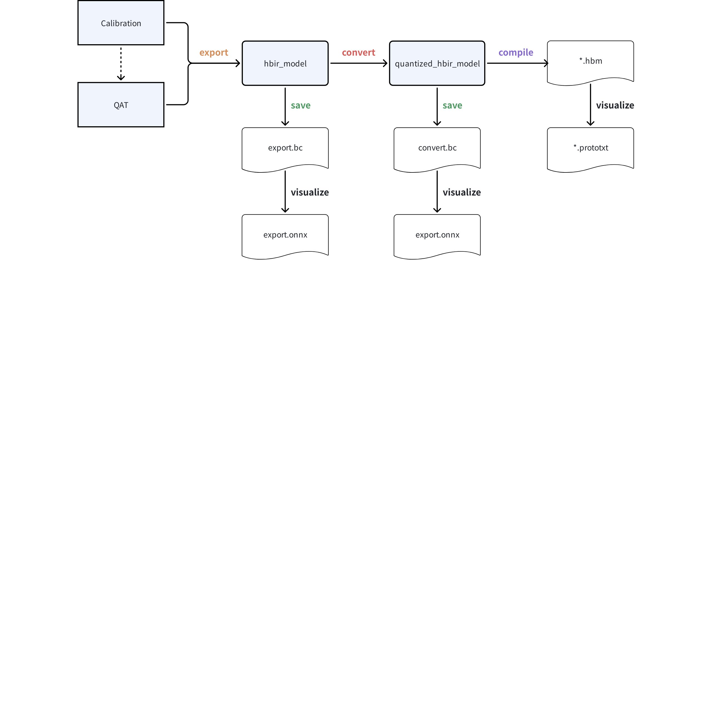


#### 2.6.2.5 模型推理/部署
相比于 J5 工具链，J6 工具链已将模型定点化的操作迁移至编译器内统一实现，因此无论模型通过 PTQ 还是 QAT 的方式量化，其定点化后的模型都是相同的 hbir 表达，因此其推理接口也是相同的。
您可以和 2.6.1.5 节一样，在 x86 环境使用 [HBRuntime推理库](http://j6.doc.oe.hobot.cc/guide/ptq/ptq_tool/hbruntime.html) 推理基于 save 接口保存的 *.bc 模型；也可以参考 `fx_mode.py` 中的方式直接在训练环境中推理。
~~QAT 链路编译得到的 hbm 模型也同样支持打包，使用方法参考如下：~~
```python
from hbdk4.compiler import hbm_pack
hbm_pack(["model1.hbm", "model2.hbm", "model3.hbm"], "packed.hbm")
```


## 2.7 性能/精度调优
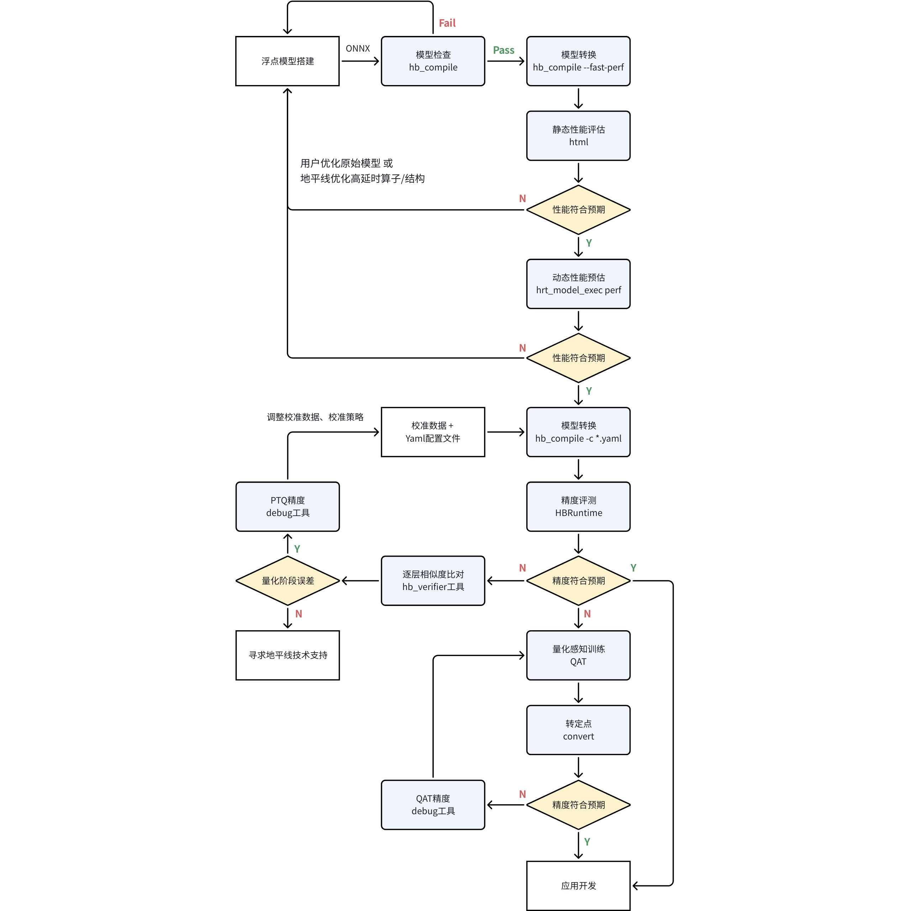

整体流程可以参考上图，您可能希望参考的材料整理如下：
1. **性能调优：**
  1. 静态性能评估的说明请见 [此处](http://j6.doc.oe.hobot.cc/guide/faststart/ptq_quickstart.html#%E9%9D%99%E6%80%81%E6%80%A7%E8%83%BD%E8%AF%84%E4%BC%B0)
    1. 如果您只有 hbm 模型，也可以使用 `hbm_perf` 接口重新获取静态性能评估文件（html、json 格式）：
    ```python
    from hbdk4.compiler import hbm_perf
    hbm_perf("model.hbm")
    ```

  1. 动态性能评估的说明请见 [此处](http://j6.doc.oe.hobot.cc/guide/faststart/ptq_quickstart.html#%E5%8A%A8%E6%80%81%E6%80%A7%E8%83%BD%E8%AF%84%E4%BC%B0)
1. **PTQ 精度调优：**
  1. Yaml 配置文件模板请见 [此处](http://j6.doc.oe.hobot.cc/guide/ptq/ptq_tool/hb_compile/convert.html#full_yaml)，具体参数信息请见 [此处](http://j6.doc.oe.hobot.cc/guide/ptq/ptq_tool/hb_compile/convert.html#config_parameter)
  1. 模型逐层算子输出余弦相似度对比工具：[hb_verifier工具](http://j6.doc.oe.hobot.cc/guide/ptq/ptq_tool/hb_verifier.html)
  1. PTQ 精度 debug 工具的说明请见 [此处](http://j6.doc.oe.hobot.cc/guide/ptq/ptq_tool/accuracy_debug.html)，基于该工具成功调优的 case 可以先参考 J5 的几篇社区文章：
    1. [精度问题分析_mnasnet_1.0_96](https://developer.horizon.cc/forumDetail/146176821770229925)
    1. [精度问题分析_repvgg_b2_deploy](https://developer.horizon.cc/forumDetail/146176821770229922)
    1. [精度问题分析_MobileVit_s](https://developer.horizon.cc/forumDetail/146176821770229921)
1. **QAT 精度调优：**
  1. QAT 精度 debug 工具的说明请见 [此处](http://j6.doc.oe.hobot.cc/guide/plugin/user_guide/quant_analysis.html)
  1. QAT 量化精度调优指南请见 [此处](http://j6.doc.oe.hobot.cc/guide/plugin/user_guide/precision_tuning.html)
  1. QAT 常见使用误区请见 [此处](http://j6.doc.oe.hobot.cc/guide/plugin/user_guide/errors.html)
1. **参考算法：**
  1. 针对智驾多个典型场景，地平线提供了以下源码交付的参考算法，其中部分为 J5 迁移，部分为 J6 新增，具体可见 [此处](http://j6.doc.oe.hobot.cc/guide/advanced_content/hat/model_zoo.html)
## 2.8 应用部署
### 2.8.1 UCP简介
J6 工具链在应用部署端新引入了统一计算平台（Unify Compute Platform，以下简称 **UCP**）。UCP 面向应用层，属于嵌入式应用开发（runtime）范畴，提供** 视觉处理（Vision Process**，以下简称 VP**）、模型推理（Neural Network**，以下简称 NN**）、高性能计算库（High Performance Library**，以下简称 HPL**）、**<text bgcolor="gray">**自定义算子插件开发（待实现）**</text>等四大主要功能：
UCP 还定义了一套统一的异构编程接口，支持对 SoC 上各后端硬件资源的调用，包括 BPU、DSP、ISP、GDC、STITCH、JPU、VPU、PYRAMID 等，以完成 SoC 上任务的统一调度。

UCP 的架构图如下所示：
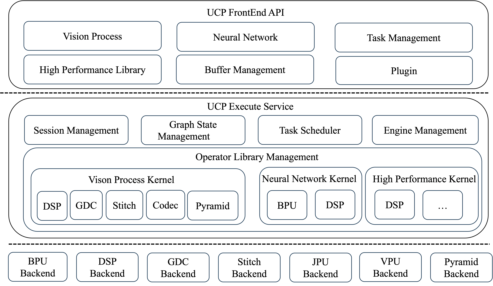

其中，各 Backend 说明可见下表：
<sheet token="Q7NPs7mROhIvQgtHaOVcI4Y9nfd_SlZnsy"/>


UCP 为应用开发部署带来了以下主要特性：
1. **模型推理**：UCP 支持神经网络模型的加载、卸载和推理。在部署时，模型会作为异构计算图，UCP 支持整个计算图的推导、优化，以及高效的调度执行。并且 UCP 前向兼容 J3/J5 使用的 DNN 推理库
1. **单算子调用**：UCP 提供计算机视觉相关的算子以及高性能的数学算子。其中：
  1. 视觉处理算子库（VP）包含常用的图像、视频处理算法的优化实现，主要作用于模型的前后处理；
  1. 高性能计算库（HPL）包含常见数学计算的高性能优化实现。UCP 支持将耗时的前后处理放在特定的后端硬件中执行，从而达到释放 CPU 计算资源，提升应用整体性能的目的。
1. **内存管理**：UCP 提供了一套统一的内存管理接口，负责内存的分配、释放、刷新，可以实现不同后端硬件之间数据的零拷贝传递，满足数据在不同硬件之间的流转。
1. **任务管理**：UCP 为模型推理、视觉处理、高性能计算等单算子的任务调用提供统一的任务管理机制，并且支持：
  1. 三种执行方式：同步执行、异步执行、注册回调函数执行；
  1. 通过 API 创建相应的 UCP 任务（如 VP 单算子任务），并提交到 UCP 调度器；
  1. 设置任务部署的硬件后端；如果不设置，则会由 UCP 任务调度器自动选择，调度器会根据硬件负载、算子预估执行耗时，以及相应的调度策略，完成 SoC 中所有 UCP 任务的统一调度，<text bgcolor="gray">同时也支持任务的优先级调度和任务抢占（当前版本暂不支持）</text>。
1. **SoC资源统一调度**：在 UCP 推出前，用户使用 GDC、STITCH 等硬件需要调用系统软件接口，使用 BPU 推理又需要调用工具链接口，存在接口使用习惯、文档风格不一致等问题，且分散的计算库无法高效地利用计算资源。而 UCP 作为地平线统一的异构编程接口，能使用一套接口完成所有需求开发，使用者不会受到硬件差异带来的困扰，部署难度降低，且后端硬件共同维护在 UCP 中，得以高效利用 SoC 的计算资源。
1. **支持X86仿真**：UCP 支持的各 Backend 仿真方式如下：
  1. BPU、DSP：采用指令级仿真；
  1. STITCH、PYRAMID：采用仿真库；
  1. GDC、JPU、VPU：采用 CModel 可执行文件仿真，
其 CModel 文件存放于`samples/ucp_tutorial/deps_x86/ucp/bin`：
    <sheet token="Q7NPs7mROhIvQgtHaOVcI4Y9nfd_8GbBxf"/>


### 2.8.2 视觉处理（VP）
#### 2.8.2.1 VP示例
VP 模块主要用于模型的前后处理，其基础示例可参考 `samples/ucp_tutorial/vp`，使用方式可参考 [此处](http://j6.doc.oe.hobot.cc/guide/ucp/vp/vp2_Quick_Start.html#%E7%A4%BA%E4%BE%8B%E5%8C%85%E4%BD%BF%E7%94%A8)。
VP 示例包的目录结构如下：
```python
vp
├── code
│   ├── 01_basic_processing            // 基础图像处理示例
│   ├── 02_transformation              // 图像变换示例
│   ├── 03_feature_extraction          // 图像特征提取示例
│   ├── 04_optical_flow                // 光流处理示例
│   ├── 05_avm                         // 环视图像拼接示例
│   ├── build_aarch64.sh
│   ├── build.sh
│   ├── build_x86.sh
│   └── CMakeLists.txt
└── vp_samples
    ├── data
    ├── script                          // aarch64示例脚本目录
    └── script_x86                      // x86仿真示例脚本目录
```

其中，各示例的说明和对应的执行后端可见下表：
<sheet token="Q7NPs7mROhIvQgtHaOVcI4Y9nfd_ok95Q6"/>

以下示例展示了如何使用 VP 封装的 [`hbVPRotate`](http://j6.doc.oe.hobot.cc/guide/ucp/vp/vp7_reference/vp7_function_interface/hbvprotate.html) 算子将图片旋转 90 度（执行后端为 DSP）：
```cpp
#include <cstring>

#include "img_util.h"
#include "log_util.h"
#include "opencv2/opencv.hpp"
#include "hobot/vp/hb_vp_rotate.h"

// 读取输入图片
std::string src_img = "../../data/images/input.jpg";
cv::Mat src_mat = cv::imread(src_img.c_str(), cv::IMREAD_GRAYSCALE);
LOGE_AND_RETURN_IF(src_mat.empty(), HB_UCP_INVALID_ARGUMENT,
                   "Read image {} failed", src_img.c_str());
LOGI("Read image {} success", src_img);

const int32_t src_width = src_mat.cols;
const int32_t src_height = src_mat.rows;
const int32_t src_stride = src_width;
const int32_t dst_width = src_height;
const int32_t dst_height = src_width;
const int32_t dst_stride = dst_width;

// 初始化输入输出内存，并将图片填充到输入内存中
hbUCPSysMem src_mem, dst_mem;
hbUCPMallocCached(&src_mem, src_stride * src_height, 0);
hbUCPMallocCached(&dst_mem, dst_stride * dst_height, 0);
memcpy(src_mem.virAddr, src_mat.data, src_stride * src_height);
hbUCPMemFlush(&src_mem, HB_SYS_MEM_CACHE_CLEAN);

// 填充输入图片信息
hbVPImage src{HB_VP_IMAGE_FORMAT_Y,
              HB_VP_IMAGE_TYPE_U8C1,
              src_width,
              src_height,
              src_stride,
              src_mem.virAddr,
              src_mem.phyAddr,
              0,
              0,
              0};

// 填充输出图片信息
hbVPImage dst{HB_VP_IMAGE_FORMAT_Y,
              HB_VP_IMAGE_TYPE_U8C1,
              dst_width,
              dst_height,
              dst_stride,
              dst_mem.virAddr,
              dst_mem.phyAddr,
              0,
              0,
              0};

// 填充算子参数
int8_t rotate_code = HB_VP_ROTATE_90_CLOCKWISE;    // 顺时针旋转90度

// 通过VP提供的算子接口创建任务，任务句柄支持设置为nullptr，使用同步模式执行此任务
hbUCPTaskHandle_t rotate_task{nullptr}; // UCP任务句柄
hbVPRotate(&rotate_task/*任务句柄*/,
           &dst/*输出图片*/,
           &src/*输入图片*/,
           rotate_code/*算子参数*/);

// 设置调度参数调整任务优先级、选择执行终端等
hbUCPSchedParam sched_param;
HB_UCP_INITIALIZE_SCHED_PARAM(&sched_param);
sched_param.backend = HB_UCP_DSP_CORE_0; /*指定执行设备ID*/

// 提交任务，sche_param 支持设置为nullptr，使用默认调度参数
hbUCPSubmitTask(rotate_task, &sched_param);/

// 等待任务完成，设置超时参数，值为0时表示一直等待
hbUCPWaitTaskDone(rotate_task, 500);

// 释放任务句柄
hbUCPReleaseTask(rotate_task);

// 释放内存资源
hbUCPFree(&src_mem);
hbUCPFree(&dst_mem);
```

您可能会参考的其他资料包括：
1. [VP API 概览](http://j6.doc.oe.hobot.cc/guide/ucp/vp/vp7_reference/vp7_Overview.html)
1. [如何理解BPU内存Cache？](http://j6.doc.oe.hobot.cc/guide/ucp/ucp_api_reference/ucp_faq.html#%E5%A6%82%E4%BD%95%E7%90%86%E8%A7%A3bpu%E5%86%85%E5%AD%98cache)（对应 `hbUCPMallocCached` 接口的使用）
1. [设置 VP 和 DSP 日志等级的环境变量](http://j6.doc.oe.hobot.cc/guide/ucp/vp/vp7_reference/vp7_environment_variable.html)

#### 2.8.2.2 VP算子性能
每个 VP 算子的效果、原理、API 接口说明和使用方式，请见 [VP算子总览](http://j6.doc.oe.hobot.cc/guide/ucp/vp/vp5_op/vp5_Overview.html)，性能指标请见 [此处](http://j6.doc.oe.hobot.cc/guide/ucp/vp/vp4_Performance.html)。


### 2.8.3 模型推理（NN）
在 J6 平台上，您既可以使用 UCP，也可以使用 DNN（J3/J5 的模型推理库）的 API 完成 hbm 模型的部署运行，整体流程是相同的，都包括：模型加载、输入数据准备、输出数据准备、模型推理、结果解析几个步骤。
和 DNN 一样，UCP 也支持以下功能：
1. **模型打包加载**：支持将多个模型打包成一个 hbm 文件并进行加载；
1. **Batch 模型推理**：支持多 batch 推理加速
1. **Resizer 模型推理**：
  1. [<text bgcolor="light-red">hbDNNRoiInferV2</text>](http://j6.doc.oe.hobot.cc/guide/ucp/runtime/bpu_sdk_api/api_interface/model_inference.html#hbdnnroiinferv2)<text bgcolor="light-red"> 接口将在后续版本移除</text>
1. **多模型任务批量处理**：即所有模型任务全部执行完再获得输出，可减少中断响应开销，多用于小模型，可以在调用 [hbDNNInferV2](http://j6.doc.oe.hobot.cc/guide/ucp/runtime/bpu_sdk_api/api_interface/model_inference.html#hbdnninferv2) 接口时，配置 `*taskHandle` 非空，并且指向之前已经创建但未提交的任务来实现该功能；
1. **featuremap 输入输出自动补充/去除 padding**；
1. **支持动态 stride**：请见 2.8.3.2 节
1. <text bgcolor="gray">**三级优先级抢占**</text><text bgcolor="gray">：支持通过 </text>[<text bgcolor="gray">hbUCPTaskPriority</text>](http://j6.doc.oe.hobot.cc/guide/ucp/ucp_api_reference/ucp_api_data_structure/hbucptaskpriority.html)<text bgcolor="gray"> 配置任务优先级，取值范围 [0, 255]，其中 [0, 253] 为普通优先级，254 可抢占普通优先级，255 为最高优先级，可进一步抢占 254 优先级；同时，在相同优先级下，还支持通过 </text>[<text bgcolor="gray">hbUCPSchedParam</text>](http://j6.doc.oe.hobot.cc/guide/ucp/ucp_api_reference/ucp_api_data_structure/hbucpschedparam.html)<text bgcolor="gray"> 中的 </text><text bgcolor="gray">`customId`</text><text bgcolor="gray"> 成员变量配置自定义优先级，例如时间戳、frame id等；</text>
1. <text bgcolor="gray">**跨进程调度（Service Mode）**</text><text bgcolor="gray">：当前版本暂未支持，暂定计划 930 版本交付；</text>
1. <text bgcolor="gray">**BPU 加速量化/反量化**</text><text bgcolor="gray">：已支持。</text>

#### 2.8.3.1 示例解析
以 `samples/ucp_tutorial/dnn/basic_samples/code/00_quick_start` 路径下的基础示例为例，说明 DNN 和 UCP 接口的使用方式，整体包含 5 个主要步骤：
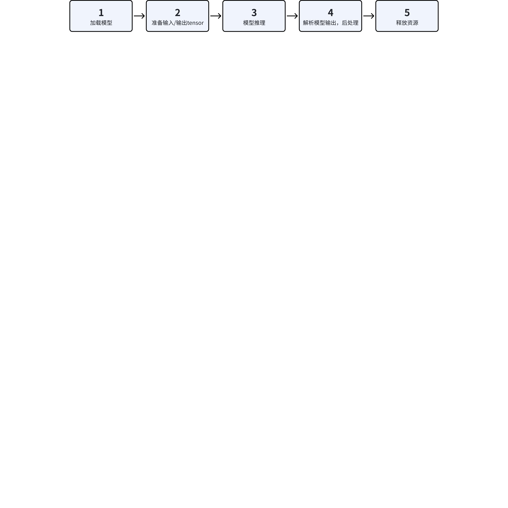

```cpp
int main(int argc, char **argv) {
  ...    // 解析命令行参数
  hbDNNPackedHandle_t packed_dnn_handle;
  hbDNNHandle_t dnn_handle;
  const char **model_name_list;
  auto modelFileName = FLAGS_model_file.c_str();
  int model_count = 0;

  // Step1: get model handle
  {
    hbDNNInitializeFromFiles(&packed_dnn_handle, &modelFileName, 1);
    hbDNNGetModelNameList(&model_name_list, &model_count, packed_dnn_handle);
    hbDNNGetModelHandle(&dnn_handle, packed_dnn_handle, model_name_list[0]);
  }

  std::vector<hbDNNTensor> input_tensors;
  std::vector<hbDNNTensor> output_tensors;
  int input_count = 0;
  int output_count = 0;

  // Step2: prepare input and output tensor
  {
    hbDNNGetInputCount(&input_count, dnn_handle)；
    hbDNNGetOutputCount(&output_count, dnn_handle)；
    input_tensors.resize(input_count);
    output_tensors.resize(output_count);
    prepare_tensor(input_tensors.data(), output_tensors.data(), dnn_handle);
  }
  // set input data to input tensor
  read_image_2_tensor_as_nv12(FLAGS_image_file, input_tensors.data())；
  hbUCPTaskHandle_t task_handle{nullptr};
  hbDNNTensor *output = output_tensors.data();

  // Step3: run inference
  {
    // make sure memory data is flushed to DDR before inference
    for (int i = 0; i < input_count; i++) {
      hbUCPMemFlush(&input_tensors[i].sysMem[0], HB_SYS_MEM_CACHE_CLEAN);
    }
    // generate task handle
    hbDNNInferV2(&task_handle, output, input_tensors.data(), dnn_handle);
    // submit task
    hbUCPSchedParam ctrl_param;
    HB_UCP_INITIALIZE_SCHED_PARAM(&ctrl_param);
    ctrl_param.backend = HB_UCP_BPU_CORE_ANY;
    hbUCPSubmitTask(task_handle, &ctrl_param);
    // wait task done
    hbUCPWaitTaskDone(task_handle, 0);
  }

  // Step4: do postprocess with output data
  std::vector<Classification> top_k_cls;
  {
    // make sure CPU read data from DDR before using output tensor data
    for (int i = 0; i < output_count; i++) {
      hbUCPMemFlush(&output_tensors[i].sysMem[0], HB_SYS_MEM_CACHE_INVALIDATE);
    }

    get_topk_result(output, top_k_cls, FLAGS_top_k);
    for (int i = 0; i < FLAGS_top_k; i++) {
      LOGI("TOP {} result id: {}", i, top_k_cls[i].id);
    }
  }

  // Step6: release resources
  {
    // release task handle
    hbUCPReleaseTask(task_handle);
    // free input mem
    for (int i = 0; i < input_count; i++) {
      hbUCPFree(&(input_tensors[i].sysMem[0]));
    }
    // free output mem
    for (int i = 0; i < output_count; i++) {
      hbUCPFree(&(output_tensors[i].sysMem[0]));
    }
    // release model
    hbDNNRelease(packed_dnn_handle);
  }

  return 0;
}
```


#### 2.8.3.2 动态Stride说明
[【J6】Pyramid/Resizer输入部署说明-v1.0](https://horizonrobotics.feishu.cn/wiki/LpgcwHGRAiXmRdkyXsrcjIn5nvd)

### 2.8.4 高性能计算库（HPL）
#### 2.8.4.1 HPL示例
HPL 模块主要用于模型的前后处理，其基础示例可参考 `samples/ucp_tutorial/hpl`，使用方式可参考 [此处](http://j6.doc.oe.hobot.cc/guide/ucp/hpl/hpl2_quick_start.html)。
HPL 示例包的目录结构如下：
```python
hpl/
├── README.md
├── code
│   ├── 01_fft_ifft_transform         // fft ifft转换示例
│   ├── CMakeLists.txt
│   ├── build.sh
│   ├── build_aarch64.sh
│   ├── build_x86.sh
│   └── util                          // 公共代码目录
└── hpl_samples
    ├── data
    ├── script                        // aarch64示例脚本目录
    │   ├── 01_fft_ifft_transform
    │   └── dsp_deploy.sh            // 部署板上的dsp运行环境脚本
    └── script_x86                    // x86仿真示例脚本目录
        └── 01_fft_ifft_transform
```

当前版本仅提供快速傅立叶变换和快速傅立叶逆变换算子，且执行 backend 均为 DSP。
<sheet token="Q7NPs7mROhIvQgtHaOVcI4Y9nfd_Jz67Gf"/>


#### 2.8.4.2 HPL算子性能
每个 HPL 算子的效果、原理、API 接口说明和使用方式，请见 [HPL算子总览](http://j6.doc.oe.hobot.cc/guide/ucp/hpl/hpl5_op/overview.html)，性能指标请见 [此处](http://j6.doc.oe.hobot.cc/guide/ucp/hpl/hpl4_performance.html)。

## 2.9 回灌仿真
在模型转换产出物中，quantized.bc（调用编译器[`convert`](http://j6.doc.oe.hobot.cc/guide/advanced_content/hbdk_tool.html#insert_image_convertmode-str--nv12)接口定点化后的模型）和 hbm（调用编译器[`compile`](http://j6.doc.oe.hobot.cc/guide/advanced_content/hbdk_tool.html#hbdk4compilerapiscompilemmodule-path-str-march-marchbase--str-opt-int--2-jobs-int--4-max_time_per_fc-float--00-debug-bool--false-hbdk3_compatible_mode-bool--true-progress_bar-bool--false-advice-float--00-balance-int--100) 接口编译后的模型）均为定点模型，两者的定点部分（BPU）二进制比特一致，浮点部分（CPU）则会存在 x86 和 aarch64 架构本身存在的差异。
当前版本，quantized.bc 和 hbm 均支持 x86 环境推理，说明如下：
<sheet token="Q7NPs7mROhIvQgtHaOVcI4Y9nfd_jQFoku"/>

由于 hbm 模型在 x86 端为指令仿真，推理速度非常慢，因此后续版本地平线将主推 quantized.bc 模型用于回灌仿真场景，并将逐步支持 quantized.bc 的以下重点特性：
1. GPU 推理加速；
1. C++ 推理接口，即复用 hbm 推理相同的 DNN/UCP 接口，以便和实车代码间的统一和丝滑迁移。


