# 工程部署流程
<quote-container>
介绍在J6平台上进行工程化部署（重点是模型/BPU相关的部署部分）涉及的环节和硬件
</quote-container>

## 部署流程
<quote-container>
一张流程图说明算法方案的部署
</quote-container>

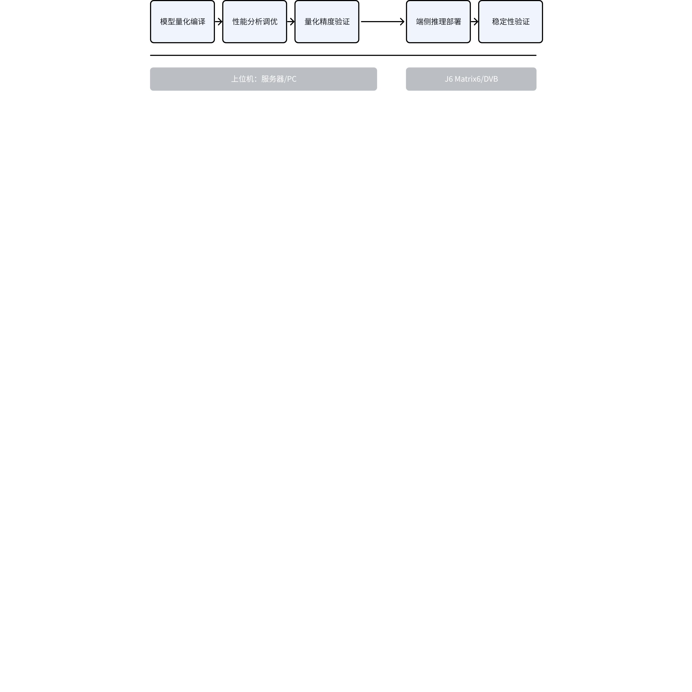

## 关键问题
<quote-container>
部署重点关注的方向、难点
</quote-container>

基于地平线征程芯片进行算法方案部署需要关注几个关键问题：算法模型的编译与调优、端侧部署的加速优化、合理的调度设计、计算资源的有效使用。
算法模型的编译与调优，聚焦在业务算法如何高效的转换编译成可以在征程芯片上部署的模型，在满足业务需求的量化精度的条件下，达到最好的推理速度，从而满足智驾场景的严苛要求。该部分的实践与指导材料中有详细的讲解。
端侧部署的加速优化，重点关注在征程芯片上利用芯片上的各种硬件加速器件实现算法的高效部署，例如J6上集成了金字塔Pyramid、GDC、Stitch、DSP、VPU等加速器件，合理使用可以有效提升整体业务方案的运行效率。
合理的调度设计，是基于芯片的硬件能力，特别是针对神经网络推理加速的BPU器件，根据核心数量、优先级抢占机制等等基础能力，合理的设计多任务的编排和调度，充分利用计算资源。
计算资源的有效使用，整个业务程序在芯片上部署运行涉及到内存资源、带宽资源、CPU资源、BPU资源、DSP资源等等各类资源，要避免某一单项资源成为瓶颈而影响整个业务的运行效率，对不同任务的计算资源分配要合理设计，并进行有效的监测。
# 部署加速硬件
<quote-container>
介绍Jx上的关键硬件器件，如何加速工程部署中的各环节，最佳使用建议
</quote-container>

J6 SOC面向智能驾驶场景而设计，除了集成的实现高效神经网络推理加速的纳什(Nash)架构的BPU单元外，还集成了用于视频图像处理加速的各类器件，充分使用这些硬件可以加速业务程序在J6上的运行效率。
下图以J6E/M的SOC 架构为例进行介绍
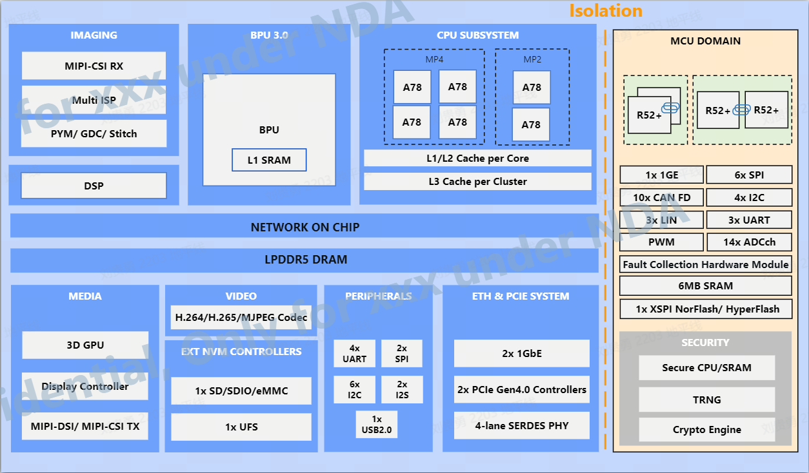


## 加速硬件
<quote-container>
描述Jx上的用于模型部署的加速器件
</quote-container>

ISP (Image Signal Processor), 是一种专门用于图像信号处理的引擎。 ISP的功能包括对原始图像进行各类算法处理、图像特性统计、色彩空间转换、多路通道分时复用控制等，最终输出更清晰、更准确、高质量的图像。
图像金字塔（Pyramid），对输入的图像按照金字塔图层的方式处理，并输出到DDR，可实现对图像多尺度的缩放、裁剪，输出的图像数据可直接用于BPU上模型推理。
GDC, 可将输入的图像进行视角变换、畸变校正和指定角度（0,90,180,270）旋转。例如对鱼眼相机图像的畸变矫正。
STITCH, 可对输入的图像进行裁剪、拼接。例如用于AVM的环视图像拼接。
vDSP (Vision DSP), J6 SOC 集成的是Cadence Vision Q8 DSP，单核XXGFLOPS算力， 可用于计算密集型的前后处理场景，例如Lidar的点云处理。

## 加速场景
<quote-container>
描述哪些场景用哪个器件进行加速有最好的收益
</quote-container>

以一个多视角BEV模型(Input 6x3x520x980)部署为例说明图像前处理加速。
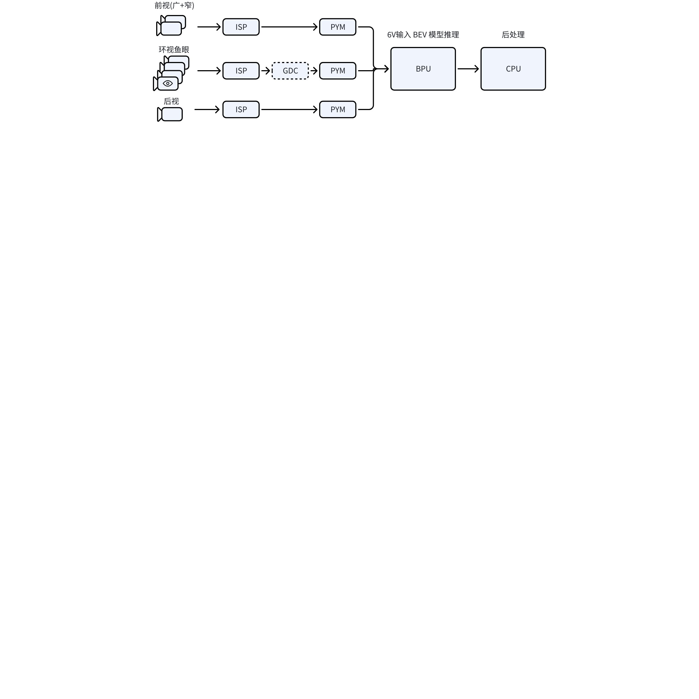

Camera接入后图像数据要根据所要部署的模型的要求进行处理，例如前视从8M输入裁剪到520x980模型输入尺寸，可以使用金字塔模块进行缩放和裁剪；提高方案在不同传感器上的泛化能力，对于环视鱼眼通过GDC进行去畸变矫正后，使用金字塔进行缩放裁剪。在硬件架构层面通过共享内存支持数据的零拷贝，性能得到保证。
ISP/GDC/PYM/BPU等器件的使用可基于系统软件封装的API进行调用，也可以基于算法工具链封装的UCP(Unify Compute Platform)框架进行开发。

以点云模型(Pointpillars)为例说明vDSP的加速场景
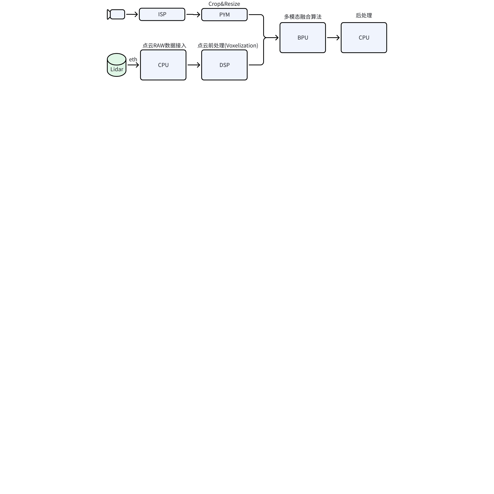

在算法工具链交付包中参考算法Pointpillars/CenterPoint提供了使用DSP进行点云前处理的参考实现，相比CPU实现性能有提升。
# 业务调度设计
<quote-container>
重点介绍部署前开展业务pipeline的设计原则和方法，调度可使用的手段，工具链提供的能力
</quote-container>

智驾业务开发是一个复杂的多任务系统，对任务运行的耗时和确定性要求很高，在端侧进行业务开发和部署时要根据业务的性能指标要求、芯片的功能特性特、基础软件库能力进行合理的评估和业务设计，实现最优的业务Pipeline性能和资源的最佳配置。
本文聚焦在业务中感知/预测/规划等神经网络部署的任务调度设计，可以从几个阶段和方面进行评估和实现：
1）模型性能评测。评测获取所有要部署模型的实际推理耗时，用于评估整个业务pipeline所需的算力，以及如何进行pipeline的编排。
2）Pipeline编排。在多任务系统中根据不同任务的重要程度和执行时间，科学的进行任务的编排可以更好的保证业务系统运行时的稳定性。
3）抢占与任务拆分。保证业务系统中重要任务能获得足够计算资源，合理使用优先级和抢占功能；对于多BPU核平台，可以考虑任务的拆分，在不同核上进行并行。
## 模型评测
<quote-container>
介绍调度设计前所需的数据，如何评测获取
</quote-container>

部署前需要确定业务所需的模型列表，完成所有模型的编译和基本的性能优化（全部是BPU算子），统计每个模型的关键数据

<lark-table rows="5" cols="4" header-row="true" column-widths="124,159,202,245">

  <lark-tr>
    <lark-td>
      数据
    </lark-td>
    <lark-td>
      说明
    </lark-td>
    <lark-td>
      来源
    </lark-td>
    <lark-td>
      示例
    </lark-td>
  </lark-tr>
  <lark-tr>
    <lark-td>
      静态Latency
    </lark-td>
    <lark-td>
      在没有开发板时评估模型的推理延时，用于预估pipeline整体耗时
    </lark-td>
    <lark-td>
      J5: 编译后生成的性能评估报告(.html)
      J6: 调用<text bgcolor="yellow">hbdk.perf()</text>生成评估报告(.html)
    </lark-td>
    <lark-td>
      ######### Summary:
      ######### FPS (1 core): 41.9
      ######### FPS (2 cores): 83.8
      ######### latency: 23.86 ms
    </lark-td>
  </lark-tr>
  <lark-tr>
    <lark-td>
      实测Latency
    </lark-td>
    <lark-td>
      实际SOC上的推理耗时，用于计算pipeline整体耗时
    </lark-td>
    <lark-td>
      在芯片上使用性能评测工具(hrt_model_exec perf)评测获取
    </lark-td>
    <lark-td>
      **hrt_model_exec perf --model_file test.hbm --frame_count 1000 --thread_num 1**
    </lark-td>
  </lark-tr>
  <lark-tr>
    <lark-td>
      DDR带宽占用
    </lark-td>
    <lark-td>
      模型单次推理所需的DDR占用(load+store)
    </lark-td>
    <lark-td>
      J5: 编译后生成的性能评估报告(.html)
      J6: 调用<text bgcolor="yellow">hbdk.perf()</text>生成的评估报告(.html)
    </lark-td>
    <lark-td>
      ######### DDR (loaded + stored) bytes per frame: 169,213,952
    </lark-td>
  </lark-tr>
  <lark-tr>
    <lark-td>
      峰值带宽占用
    </lark-td>
    <lark-td>
      分析模型推理过程中带宽占用的峰值
    </lark-td>
    <lark-td>
      J5: 编译后生成的性能评估报告(.html)
      J6: 调用<text bgcolor="yellow">hbdk.perf()</text>生成评估报告(.html)
    </lark-td>
    <lark-td>
      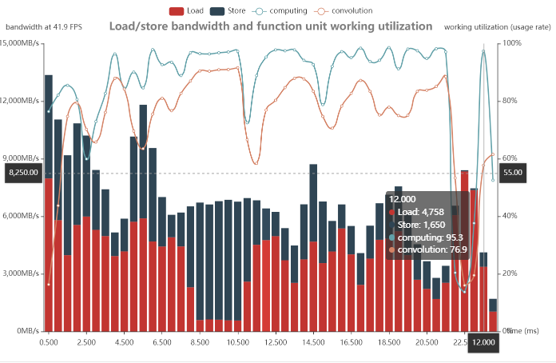
    </lark-td>
  </lark-tr>
</lark-table>

<text bgcolor="yellow">性能实测</text>
## Pipeline设计
<quote-container>
介绍按业务设计帧率和模型数据进行pipeline设计，注意事项
</quote-container>

多任务业务系统在部署中要充分考虑不同任务的执行时间、依赖、时序、并发、资源占用等因素，在部署前先通过静态评估和编排实现Pipeline的设计，在运行时监测实际的运行时序和资源状态进行优化调整。
Pipeline静态评估主要考虑各任务的延时、设计帧率、可用算力几个因素，提前识别部署的可行性。以下表为例进行说明

<lark-table rows="7" cols="5" column-widths="153,146,130,153,153">

  <lark-tr>
    <lark-td colspan="5">
      **智驾方案A 静态评估示例表**
    </lark-td>
  </lark-tr>
  <lark-tr>
    <lark-td>
      **模型**
    </lark-td>
    <lark-td>
      **单帧延时(ms)**
    </lark-td>
    <lark-td>
      **设计帧率***
    </lark-td>
    <lark-td>
      **单周期*耗时(ms)**
    </lark-td>
    <lark-td>
      **累计耗时(ms)**
    </lark-td>
  </lark-tr>
  <lark-tr>
    <lark-td>
      BEV_OD
    </lark-td>
    <lark-td>
      15
    </lark-td>
    <lark-td>
      10
    </lark-td>
    <lark-td>
      150
    </lark-td>
    <lark-td rowspan="5">
      500

    </lark-td>
  </lark-tr>
  <lark-tr>
    <lark-td>
      BEV_lane
    </lark-td>
    <lark-td>
      5
    </lark-td>
    <lark-td>
      10
    </lark-td>
    <lark-td>
      50
    </lark-td>
  </lark-tr>
  <lark-tr>
    <lark-td>
      Mono3D
    </lark-td>
    <lark-td>
      5
    </lark-td>
    <lark-td>
      30
    </lark-td>
    <lark-td>
      150
    </lark-td>
  </lark-tr>
  <lark-tr>
    <lark-td>
      红绿灯
    </lark-td>
    <lark-td>
      2.5
    </lark-td>
    <lark-td>
      30
    </lark-td>
    <lark-td>
      75
    </lark-td>
  </lark-tr>
  <lark-tr>
    <lark-td>
      预测
    </lark-td>
    <lark-td>
      2.5
    </lark-td>
    <lark-td>
      30
    </lark-td>
    <lark-td>
      75
    </lark-td>
  </lark-tr>
</lark-table>

<quote-container>
设计帧率： 该模型按业务要求在1秒内需要执行的次数
单周期：1秒的周期内
</quote-container>

示例中所有部署模型在设计帧率下累计耗时达到500ms，在一个单BPU核系统上(例如J6E)部署可以部署（量产标准中，BPU负载要求在85%以内，累计耗时不能超过850ms）；在一个双BPU核系统上，因为模型可以分别部署在不同的核上，理论上最优并行耗时为 500/2 = 250ms（实际要考虑不同任务的依赖关系，不一定能达到最优耗时），整个Pipeline性能能够满足要求。
总体耗时评估后，还需要考虑不同任务的时序依赖关系，建议以850ms为安全周期编排出任务关系，确认任务可以在一个时间周期内完成。
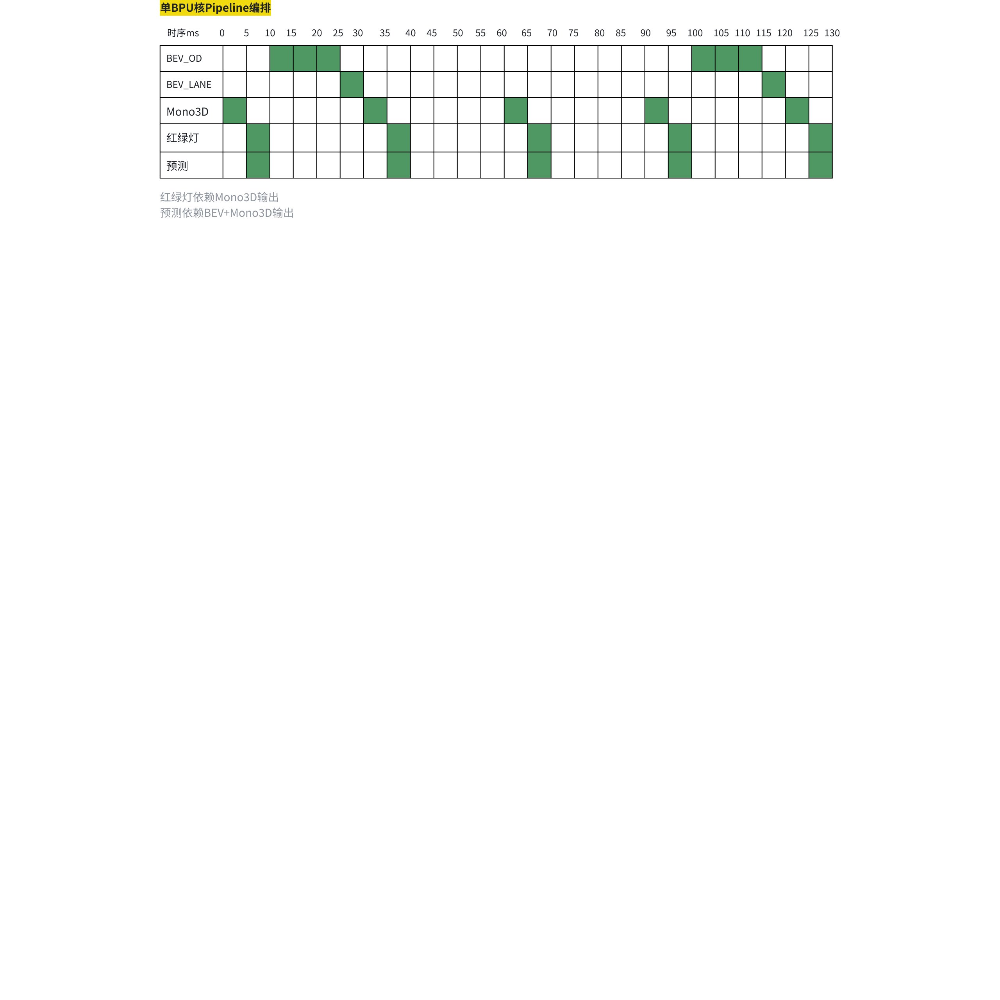

在上面的编排示例中，考虑前视Mono3D模型帧率要求高，因此设计为第一个运行的模型，预测任务第一次推理无BEV的输出要素，从第二帧开始接入BEV+Mono的全要素。
## 单核与多核
<quote-container>
介绍多核和单核的不同设计思路和建议
</quote-container>

根据所使用的芯片不同，BPU核的数量也不同，J5有2颗BPU核，J6E/M有1颗BPU核，J6P有4颗BPU核。虽然不同芯片BPU核的算力不同，在模型推理时都是以独占的方式运行。在业务部署时，多个任务（模型推理）在任务编排时要仔细考虑BPU核的数量。

<text bgcolor="yellow">如何指定BPU核</text>
## 优先级与抢占
<quote-container>
介绍优先级策略，抢占策略满足不同的业务设计
</quote-container>

实际业务部署中，有些任务很重要，例如前视模型、预测模型等，有些任务优先级并不高，例如图像质量、标定模型等，在资源有限的情况下，要保证重要的任务能够高优被处理。在征程芯片上BPU模型推理提供了优先级调度和任务抢占功能。
**优先级调度**
推理库支持0～255级任务优先级配置，在运行时可以动态的进行配置，实现高优任务可以提前在排队中的低优任务之前执行。优先级仅影响应用层BPU任务队列中的任务顺序，对已经下发到系统内核层的FC(function call）不产生影响。
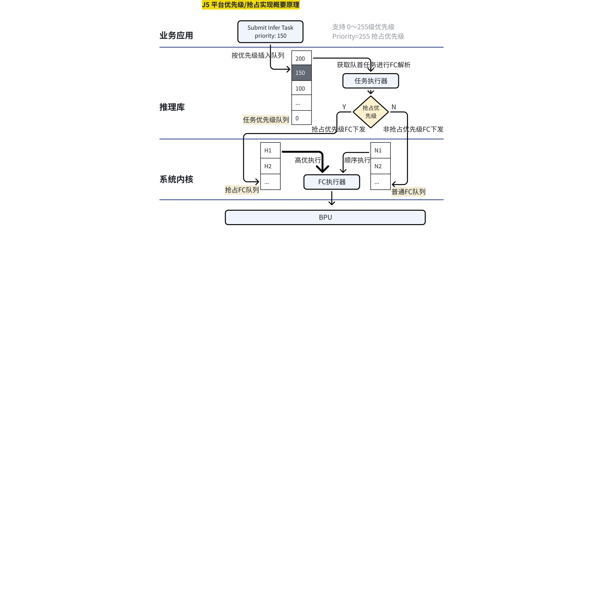


<text bgcolor="yellow">CustomID</text>
更多关于优先级设置可以查看《[多模型优先级调度](https://auto-developer.horizon.cc/developerForum?fullPath=/home/community/bbsdetail?bid=498796952584814592)》《[多模型批量推理](https://developer.horizon.cc/forumDetail/174216099150358530)》

**任务抢占**
基于优先级的设计基础上，BPU模型推理支持抢占。当抢占优先级任务拆解成FC下发到系统内核的抢占FC队列中，并且BPU上运行的是一个普通任务，则会发生抢占。需要使用抢占功能，首先需要确定能够被抢占的模型任务。
<reference-synced source-block-id="WBd8d2XPPsHN4KbJAcqcFkX4n7d" source-document-id="WabKd55jloqMVSxeMfCcvbGcnAc">

</reference-synced>

# 关键资源监测
<quote-container>
工程开发调试中如何检测关键的资源的使用情况
</quote-container>

在整个业务应用部署调试过程中，需要检测一些关键资源的使用情况，一方面查看业务应用按设计的帧率运行时系统的各类资源的占用情况是否足够，另一方面用于在运行过程中出现异常情况（例如帧率下降、丢帧等）时排查是否是某一资源成为瓶颈导致。对于算法方案的部署重点要关注CPU/BPU/内存/带宽几个关键资源的占用率。CPU的占用情况可以使用top命令进行监测，与linux系统中查看手段一样，不做赘述。
## BPU资源
BPU占用率以每个核为独立单元进行统计，使用系统软件集成的BPU占用率查看工具 hrut_bpuprofile可以持续监测BPU的运行状态
```powershell
 hrut_bpuprofile -h
    BPU PROFILE HELP INFORMATION
    >>> -b/--bpu         [BPU CORE,0--bpu0,1--bpu1,2--ALL BPU] (required)
    >>> -p/--power       [POWER OFF/ON,0--OFF,1--ON]
    >>> -c/--clock       [CLOCK OFF/ON,0--OFF,1--ON]
    >>> -e/--enabletime  [GET FC TIME/ON,0--OFF,1--ON]
    >>> -t/--time        [GET FC TIME,NO ARGUMENT]
    >>> -f/--frq         [SET BPU FREQUENCY,ARGUMENT:N]
    >>> -r/--ratio       [BPU RATIO,N--N TIMES,0--FOREVER]
```

J5双核BPU占用率的监测状态如图
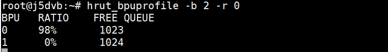

## Memory资源

## 带宽占用
带宽占用可以拆分成三类来源，不同来源的占用有不同的分析和优化方式。
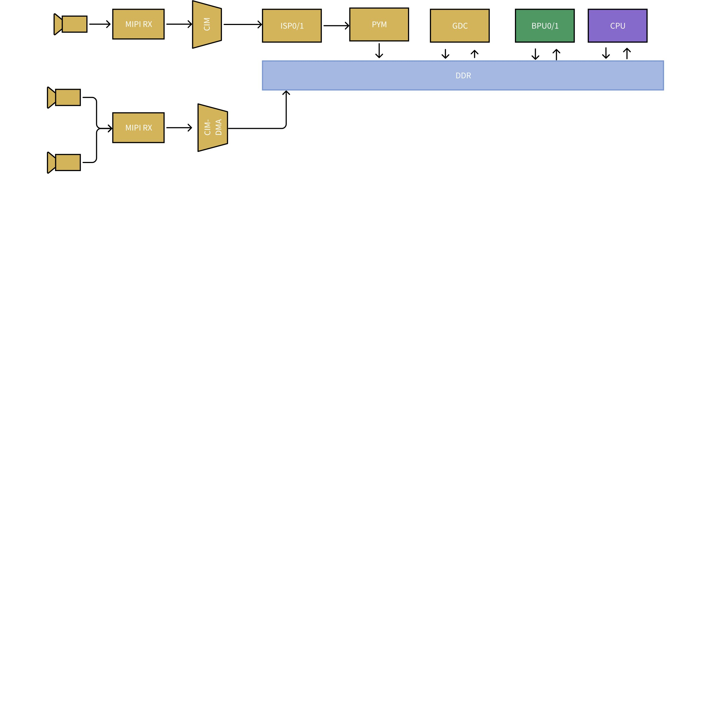

**VIO 视频通路带宽占用**
视频通路有大量DDR读写的场景，从MIPI接入Camera后，一种是online的数据流接入，一种是Offline的接入。Online模式，在金字塔处理完原始图像后，将写入DDR; Offline模型，CIM-DMA将Camera数据写入DDR，调用ISP/PYM/GDC进行处理时都会发生DDR读写操作。

**BPU 算法模型带宽占用**
BPU对带宽的占用主要在三个阶段，模型加载、推理计算、输出写回。
模型加载要读取载入整个模型文件；推理过程要从DDR中读取模型输入数据，过程中超出SDRAM的数据要写回DDR，再次计算时要从DDR再读入SRAM；模型推理结束要将输出数据写回DDR。
J5上编译器给模型分配的读/写的带宽上限是9GB，所以一个模型理论的带宽峰值不会超过9*2 GB/s

**CPU 应用程序带宽占用**
CPU应用主要是业务逻辑的实现，完成从各类传感器采集的数据进行处理、算法模型推理调度，感知结果的处理等等

使用地平线提供的带宽监测工具hrut_ddr 可以以一定的频率抓取DDR实时的数据，通过对数据进行统计分析得到整体带宽的平均占用和峰值占用，以及各个模块的带宽占用。
```bash
Usage: hrut_ddr [OPTION]...
Show and calculate memory throughput through AIX bus in each period.

Mandatory arguments to long options are mandatory for short options too.
   -t, --type     The type of monitoring range.    Supported
                  values for type are(case-insensitive)
                  when multiple type specified, Enclose in quotation marks
                  e.g. -t "mcu cpu"
                  If the types exceeds 1, a RoundRobin method is used.
                       For accuracy, set as less types as possible
                  e.g. In the first period the mcu data is read, second
                      period the cpu data is read.
                  The elapsed time get averaged, and each type result in
                      one round put into one table
                     all  vdo  cam  cpe0  cpe1  cpelite  gpu  vdsp
                   peri  his  sram  bpu  mcu  top  cpu  secland

                  cpu        only monitor the throughput of CPU master range
                  bpu        only monitor the throughput of BPU master range
                  cam        only monitor the throughput of Camera master range
                  all        monitor the throughput of all range types (default)
                  rr_all     RoundRobin between all range types
   -p, --period   The sample period for monitored range. (unit: us, default: 1000,
                                                           range:[1000, 2000000])
   -d, --device   The char device of DDR Perf Monitor. [0~5] 0: ddrsys0 mon0, 2 ddrsys1_mon0
                    all (default)
   -n, --number   The sampling period times for monitored range before copying to userspace.
                    (0~400] default: 100
                  !!!When in roundrobin mode, this is forcely set to 1
   -N, --over_all Over_all read times. i.e. Approximately how much tables you get in
                   commands line
   -f, --filename the csv output filename
   -r, --raw      Output raw data, hexadecimal format, without conversion. Decimal by default
   -c, --csv      Output csv format data
   -D, --dissh    Disable shell output

Example:
hrut_ddr -t all -p 1000 -d 0
hrut_ddr -t all -p 1000 -r
hrut_ddr -t all -p 1000
hrut_ddr -t cpu -p 1000
```

以200ms采样频率的命令是：
_> <text bgcolor="gray">**hrut_ddr -t all **</text><text bgcolor="yellow">**-r**</text><text bgcolor="gray">** -p 200000 > /userdata/app/morning/ddrlog.txt**</text>

<text color="blue">*PS. BW带宽数据的单位是 MB/s. latency 的单位是 DDR clock. stall 的单位是 DDR clock.*</text>

# DDR带宽优化
<quote-container>
如何静态查看模型带宽、动态模型带宽，如何判断带宽瓶颈，以及如何分析带宽和解决
</quote-container>

## 5.1 典型带宽问题
<quote-container>
介绍常见的带宽问题，VIO/BPU
</quote-container>

典型的两类因带宽资源不足导致的现象：
**视频通路出现丢帧**。因为带宽被其他模块占用，导致视频通路处理Camera数据时，不能及时的写入DDR，发生丢弃，最终导致整个pipeline出现降帧。在量产中发生的case是，金字塔因带宽资源出现drop frame现象。
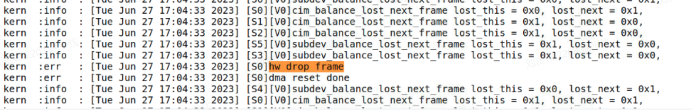


**应用程序运行时间变长**。在多任务并发运行时，因为相互抢占DDR资源，导致读写时间变长，应用程序的实际执行时间相比独立运行时要更长，导致整个方案部署后pipeline延时超出目标值。

当发生这些现象时，需要对带宽占用情况进行分析，重点考察多任务并行时，系统的实际均值带宽占用和峰值带宽占用两个指标。当发现带宽占用指标过高时，需要进一步拆解是哪些模块占用了过高的带宽，定位到模块后再针对性的分析和解决。

## 5.2 视频通路优化
### **前视8M用online mode接入**
主前视采用onine mode接入后，数据直接从MIPI->CIM->ISP->PYM， 不经过DDR，能够减少带宽的占用。
如果一个MIPI接入多个Camare，后续配置online mode, 此时因为是多路复用，数据在ISP模块仍然是分时处理，会有写入ISP DDR内存中，然后在读入处理的过程，会增加带宽占用

### **Pyramid关闭不必要的输出**
PYM 支持多个图层的输出（原图、高斯、双线性、crop/resize)，关闭无需要的输出层，减少写入DDR的数据，减少带宽占用

### **减少GDC的使用**
使用GDC模块必然增加对处理数据的read/write，增加了带宽占用。前视广角和周视(<120度)建议不做GDC去畸变处理，减少带宽占用。实际根据对模型精度的影响进行判断

### **CIM抽帧处理**
如果整个pipeline的帧率要求小于Camara的帧率，可以考虑在CIM阶段进行抽帧处理，在相对较源头的地方减少后续流程的处理数据量，减少带宽影响。
CIM抽帧可以通过CIM config 配置文件实现，配置项： skip_frame, input_fps, output_fps
<callout emoji="bulb" background-color="orange" border-color="light-blue">
更多视频通路的优化策略请联系 系统软件/视频通路的专业同学
</callout>

## 5.3 BPU带宽优化
<quote-container>
算法模型的带宽分析，峰值、均值带宽，常见问题优化
</quote-container>

### **使用 balance 参数**
--balance 是编译器参数，可以控制模型编译在latency和ddr占用之间的平衡。
选项需要跟一个 0-100 间的整数参数，表示优化目标中对于延迟的偏好，参数为 100 时的效果即与指定 --fast 相同，参数为 0 时与指定 --ddr 效果相同。当需要在理想延迟与访存带宽间权衡时可以使用该选项。
**业务线的经验是推荐使用 2**，以一个 narrow 窄角的模型为例：
--fast:  {FPS=1314, DDR=1969712}
--balance 0:  {FPS=1309, DDR=1232432}, DDR减少37%
--balance 1:  {FPS=1301, DDR=1232432}, DDR减少37%
--balance 2:  {FPS=1303, DDR=1232432}, DDR减少37%

<text color="blue">*PS. J5工具链 --balance 配置后，编译优化等级强制为 -O3*</text>
<callout emoji="bulb" background-color="orange" border-color="light-blue">
实际要做不同配置参数的实验对比，选择最好效果的 balance 配置
</callout>


### **单摄模型加 batch**
主要考虑**小模型**，计算不存在瓶颈，测试的 batch 数包括 1, 2, 5, 6, 10，以一个分类 resizer 模型为例（latency没有除以batch，DDR除了batch）：
batch1: {latency=0.27ms, DDR=1.44M}
batch2: {latency=0.29ms, DDR=0.74M}, DDR减少49%
batch5: {latency=0.37ms, DDR=0.35M}, DDR减少76%
batch6: {latency=0.41ms, DDR=0.36M}, DDR减少75%
batch10: {latency=0.48ms, DDR=0.23M}, DDR减少84%
<callout emoji="bulb" background-color="orange" border-color="light-blue">
理论上对weight大的模型更友好, 因为减少了weight的加载次数。
上batch后要关注对峰值带宽的影响，因为batch featuremap loading 增加了
</callout>


### **减少模型抢占调用**
优先级255 的抢占任务因为需要 store/load 被抢占任务的上下文和相关参数，所以会有带宽开销，可以尽量降低这种任务的调用频率
<callout emoji="bulb" background-color="orange" border-color="light-blue">
J5上推理任务抢占切换导致整个SRAM的刷新。建议少用，通过严格的任务编排保证高优任务的有效执行
</callout>


### 优先使用Pyramid模型
Resizer模型的IO动作，相比Pyamid 有额外的ROI 抠图的store/load开销，相对增加带宽占用
<diagram type="1"/>

<diagram type="1"/>

<callout emoji="bulb" background-color="orange" border-color="light-blue">
建议针对量产方案的模组，使用Pyramid 将图像输入处理到模型所需的尺寸，不使用resizer模型。
</callout>


### batch拆分
案例分析：
模型有7路 1x512x1024x3的图像输入，模型内部concat成7batch后backbone提取特征，此处因为7个batch的读写需要很高的带宽，造成了带宽峰值。
**将batch mode 拆分，每路图像单独提特征，牺牲很少延时性能极大降低峰值带宽**
<grid cols="2">
  <column width="50">
    **batch mode**
    峰值带宽：11500MB/S
    latency: 73.67 ms
    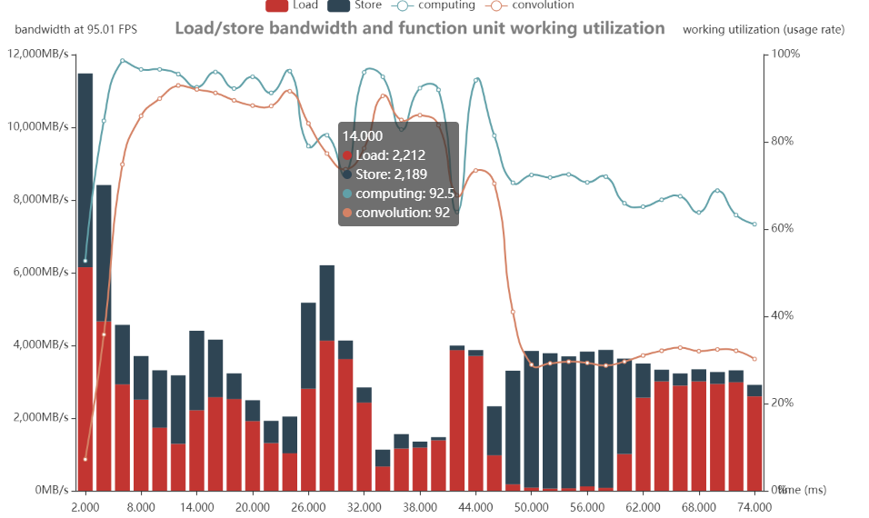


  </column>
  <column width="50">
    **split mode**
    峰值带宽：5887MB/S  <text bgcolor="green">下降48%</text>
    latency: 76.51 ms  增加3ms
    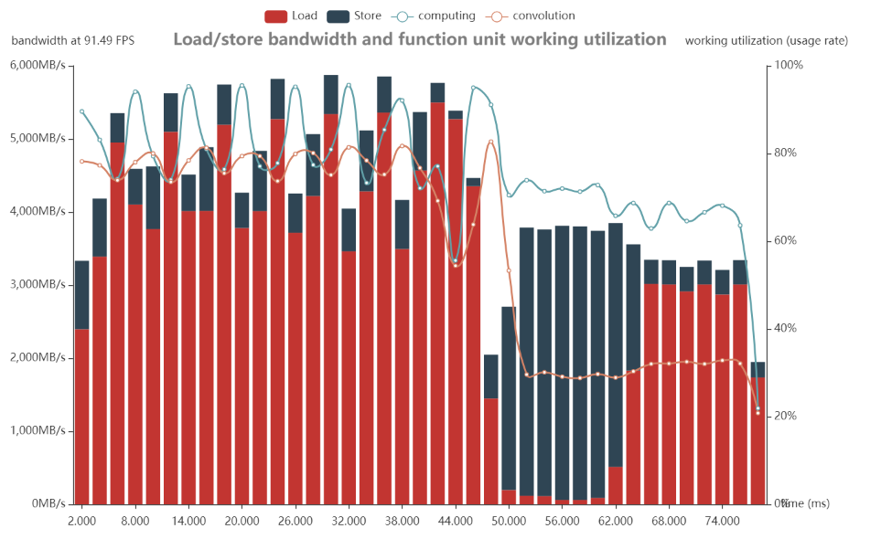


  </column>
</grid>

<callout emoji="bulb" background-color="orange" border-color="light-blue">
例如：对于BEV多路输入的特征提取的场景，如果存在峰值带宽问题，可以重点考虑该方案
</callout>


### 减少模型输入输出大小
减少模型的输入尺寸，达到减少在模型推理时对featuremap的loading cost ，也会减少中间层输出的大小，减少SRAM cache不下的可能性；减少模型输出的大小（例如分割模型尾部加armmax），减少输出写入DDR的数据量，减少带宽的瞬时占用
<callout emoji="bulb" background-color="orange" border-color="light-blue">
减少模型输入对模型精度可能造成影响，根据实际情况判断
</callout>


### 优化模型block设计
通过分析静态 perf 指标，判断模型中间层的对数据 load/store 的瓶颈，在模型设计上减少相应层的输出大小。例如：
- 地平线 VarGNet 模型的 block 间会采用小 channel 降低 shape 大小，block 间提升 channel
- 不使用 kernel 过大的 conv，例如 kernel ≥ 9
- 不使用过长的 shortcut
<callout emoji="bulb" background-color="orange" border-color="light-blue">
通过模型结构调整优化带宽占用，本质是提高计算访存比
</callout>

# 调试调优工具
<quote-container>
介绍工程化（板上）部署可用的工具，trace工具/profettor的能力和使用
</quote-container>

## 性能调试工具
<quote-container>
exec，perf， dump， verifier系列工具，酌情只列工具和基本用途，详细介绍引导到手册
</quote-container>


## 推理trace工具
<quote-container>
perfetto， 隆重推出，介绍能力为主，使用细节引导到手册
</quote-container>

[BPU trace 抓取教程](https://horizonrobotics.feishu.cn/wiki/XU1wwTvK1iBMnlk9u5JcY5cAnCe)
# 统一异构框架(UCP)
<quote-container>
介绍UCP的功能、优势
</quote-container>

## UCP框架介绍
<quote-container>
整体框架说明，优势阐述，与libdnn的抉择。API细节引导到手册
</quote-container>

### UCP的定义
UCP全称Unify Compute Platform，指统一计算平台，是面向应用层的统一异构编程框架，属于嵌入式应用开发（runtime）范畴，提供视觉处理、模型推理功能，以及高性能计算库和自定义算子插件开发方案。UCP定义了一套异构编程接口，以调用SoC上的后端硬件资源，包括BPU、DSP、ISP、GDC、STITCH、JPU、VPU、PYRAMID等，以完成SoC上任务的统一调度。
### **UCP的功能**
1. 模型推理：UCP支持神经网络模型的加载、卸载和推理。在部署时，模型会作为异构计算图，UCP支持整个计算图的推导、优化，以及高效的调度执行。UCP也支持DSL编程模式，用户可以使用DSL提供得算子库进行组装，最后编译成模型文件提供给UCP加载并调度执行。
1. 单算子调用：UCP提供计算机视觉相关的算子以及提供高性能的数学算子。视觉处理算子库包含常用的图像、视频处理算法的优化实现，主要作用于模型的前后处理。高性能计算库包含常见数学计算的高性能优化实现。UCP支持将耗时的前后处理放在特定的后端硬件中执行，从而达到释放CPU计算资源，提升应用整体性能的目的。
1. <text bgcolor="yellow">自定义算子</text>：UCP开放了可编程芯片DSP的自定义算子开发功能，可以将用户实现的算子接入UCP统一调度执行。
1. 内存管理：提供了一套统一的内存管理接口，负责内存的分配、释放、刷新，，可以实现不同后端硬件之间数据的零拷贝传递，满足数据在不同硬件之间的流转，同时支持PAC卡场景下Host/Device模式的内存管理。
1. 任务管理：在UCP中，模型推理，视觉处理，高性能计算等单算子调用任务都会使用统一的一套任务管理机制，支持同步执行、异步执行和回调函数设置等能力。用户可通过API创建相应的UCP任务（如VP算子任务），并提交到UCP调度器。在提交任务时可设置任务部署的硬件后端，如果不设置，则由UCP任务调度器自动选择，调度器会根据硬件负载，算子预估执行耗时，以及相应的调度策略，完成SoC中所有UCP任务的统一调度，同时也支持任务的优先级调度和任务抢占。
1. 在UCP推出前，用户使用GDC、STITCH等硬件需要调用系统软件接口，使用BPU推理又需要调用工具链接口，存在接口使用习惯、文档风格不一致的问题，且分散的计算库无法高效地利用计算资源，而UCP作为地平线统一的异构编程接口，能使用一套接口完成所有需求开发，使用者不会受到硬件差异带来的困扰，部署难度降低，且后端硬件共同维护在UCP中，得以高效利用SoC的计算资源。
### UCP和libdnn的关系
libdnn用于在J3、J5平台做应用开发，如模型的板端部署等。J6平台从libdnn升级到了UCP，UCP在绝大部分功能上都可以向前兼容libdnn，UCP除了模型推理外，还包含了对各个后端硬件的调用，如单算子调用，视频通路处理等内容，功能更加全面，可帮助用户更好地进行J6平台的应用开发。
## **后端硬件介绍**
<sheet token="P0sFszwGHhlW7Wttq0Ic2aiXn3d_Rfou0q"/>

## 使用场景
<quote-container>
端上部署屏蔽后端、X86仿真
</quote-container>

1. 模型推理及前后处理，包括x86仿真和板端运行，且模型推理结果在定点部分完全一致
1. 视频通路处理，支持online和offline模式，sensor接入后可使用UCP调用后端硬件完成视频通路的处理
## 性能开销
<quote-container>
UCP框架的性能开销（是否有数据）
</quote-container>


# 实践案例
1. 量化/反量化，
1. VPU去padding
1. lidar前处理dsp化