## 0.1 UCP简介
统一计算平台（Unify Compute Platform，以下简称 UCP）定义了一套统一的异构编程接口， 提供应用程序接口（Application Programming Interface，以下简称API）实现对芯片（System on Chip，以下简称SOC）上所有资源的调用。 UCP将SOC上的功能硬件抽象出来并进行封装，对外提供基于功能的API，用于创建相应的UCP任务（如VP算子任务），并支持设置硬件Backend提交至UCP调度器， UCP可基于硬件资源，完成SOC上任务的统一调度。 具体提供了以下几个功能： 视觉处理(Vision Process)、神经网络模型推理（Neural Network）、高性能计算库（High Performance Library）、自定义算子插件开发等。
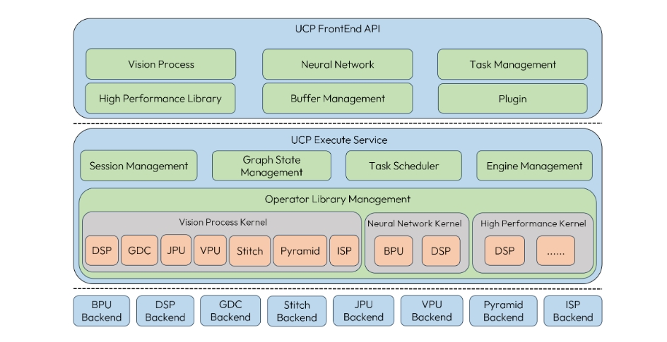

UCP应用场景:
- 单算子调用：可直接使用UCP中的视觉算子、高性能处理算子。
- 算子插件开发使用：可进行自定义算子的开发。
- 深度学习模型推理：可完成深度学习模型的推理任务，UCP内部完成模型的解析及硬件部署。
UCP的优势:
- 高度抽象：对于单算子的功能，不会受到硬件差异带来的困扰，可通过指定backend选择需要执行的硬件，降低硬件部署难度。
- 集成度高：作为地平线统一的异构编程接口，一套接口完成所有需求开发。

## 0.2 UCP使用介绍
### 0.2.1 API功能模块
#### 0.2.1.1 模型推理
##### 0.2.1.1.1 快速上手
此示例仅代表通用模型推理接口调用流程，更多的接口以及使用说明请参考对外OE文档。
```cpp
// 1. load and select model.
{
    hbDNNInitializeFromFiles(&packed_dnn_handle, &modelFileName, 1);
    hbDNNGetModelNameList(&model_name_list, &model_count, packed_dnn_handle);
    hbDNNGetModelHandle(&dnn_handle, packed_dnn_handle, model_name_list[0]);
}

// 2. prepare input and output tensors
std::vector<hbDNNTensor> input_tensors;
std::vector<hbDNNTensor> output_tensors;
int input_count = 0;
int output_count = 0;
{
    hbDNNGetInputCount(&input_count, dnn_handle);
    hbDNNGetOutputCount(&output_count, dnn_handle);
    input_tensors.resize(input_count);
    output_tensors.resize(output_count);
    prepare_tensor(input_tensors.data(), output_tensors.data(), dnn_handle);
    // hbDNNGetInputTensorProperties(&input[i].properties, dnn_handle, i)
    // hbDNNGetOutputTensorProperties(&output[i].properties, dnn_handle, i)
    // hbUCPMallocCached(&output[i].sysMem, output_memSize, 0)
}

// 3. fill data into input tensors.
{
    read_data_2_tensor(input_data, input_tensors);
    // sync cache to ensure correctness.
    for (int i = 0; i < input_count; i++) {
      hbUCPMemFlush(&input_tensors[i].sysMem, HB_SYS_MEM_CACHE_CLEAN);
    }
}

// 4. create ucp task and execute inference.
{
    // create ucp task
    hbDNNInferV2(&task_handle, output_tensors.data(), input_tensors.data(), dnn_handle)

    // submit ucp task
    hbUCPSchedParam sched_param;
    HB_UCP_INITIALIZE_SCHED_PARAM(&sched_param);
    sched_param.backend = HB_UCP_BPU_CORE_ANY;
    sched_param.priority = 30;
    hbUCPSubmitTask(task_handle, &sched_param);

    // block wait task done.
    hbUCPWaitTaskDone(task_handle, 0);
}

// 5. sync cache and decode output tensors.
{
    // sync data
    for (int i = 0; i < output_count; i++) {
      hbUCPMemFlush(&output_tensors[i].sysMem, HB_SYS_MEM_CACHE_INVALIDATE);
      // HB_SYS_MEM_CACHE_CLEAN
    }
    // decode result. ....
}
// release task handler
hbUCPReleaseTask(task_handle);

// 6. release resources.
{
// release input and output memories.
for (int i = 0; i < input_count; i++) {
  hbUCPFree(&(input_tensors[i].sysMem));
}
for (int i = 0; i < output_count; i++) {
  hbUCPFree(&(output_tensors[i].sysMem));
}
// release model.
hbDNNRelease(packed_dnn_handle);
}
```

##### 0.2.1.1.2 典型场景
###### 0.2.1.1.2.1 Crop场景
1. 场景描述
对于NV12输入的模型，一张图片会对应两个输入，分别存储Y和UV数据，其模型信息如下：
- Y: validShape = (1,224,224,1), stride = (-1,-1, 1,1)
- UV: validShape = (1,112,112,2), stride = (-1,-1,2,1)
该模型的输入图片大小为224x224，假设有一张h x w = 376 x 384(其中w方向存在大小为8的padding数据，nv12图像输入的stride需要32对齐)的图片，您会怎么样准备模型输入呢？
- 将图片放缩作为模型的输入，但损失了放缩的时间。
- 将图片进行裁剪，只取关心的部分作为模型的输入，但损失了裁剪时间
<callout emoji="gift" background-color="light-orange" border-color="light-orange">
为了减少数据前处理的时间，我们可以使用UCP提供的Crop场景进行解决。由于模型stride为动态的，意味着您可以调整stride的大小去控制实际输入的数据，以达到对图片进行裁剪作为模型输入的目的。
</callout>

1. 功能使用
如下图所示，假设我们要从(64,50)的像素点开始裁剪出一张224x224的图片，应该如何修改stride值以达到Crop的效果呢？
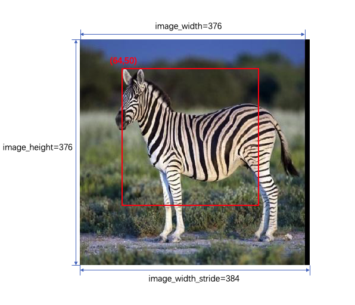


假设针对于原始图片，Y和UV的validShape、stride以及指针如下：
- Y: validShape = (1,376,384,1), stride = (384 * 376, 384, 1,1)，内存指针为`y_data`
- UV: validShape = (1,188,192,2), stride = (384 * 188, 384,2,1)，内存指针为`uv_data`

模型输入张量准备：
<callout emoji="cake" background-color="light-orange" border-color="light-orange">
数据准备的过程中仅改变了stride的大小以达到Crop效果，没有额外的拷贝操作
</callout>

- Y
  - Crop起始点[h, w] = [50, 64]，则对应数据的地址偏移为 `y_offset` = `50 * 384 + 64 * 1`，内存指针应设置为`y_data` + `y_offset`
  - 作为模型的输入设置validShape=(1,224,224,1), stride = (224 * 384,384, 1,1)
  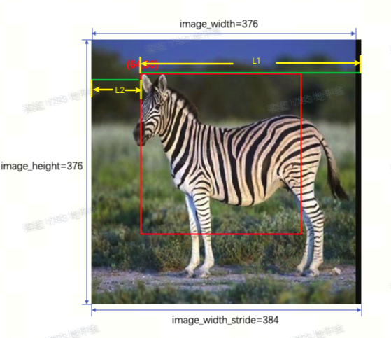

<callout emoji="books" background-color="light-orange" border-color="light-orange">
为什么设置stride[0]=224 * 384，stride[1]=384呢？
1. stride[1]代表第1个维度上，坐标每增加1所需跨越的字节数，在这个例子中第1个维度代表图片的H维度。在上图中H每增加1，实际数据的指针应该跨越的字节数为L1 + L2 = 384，故stride[1]=384。
1. stride[0]代表第0个维度上，坐标每增加1所需跨越的字节数，在这个例子中，第0个维度代表到下一张图片所应跨越的字节数，可认为是该有效图片的大小valid_h * stride[1] = 224 * 384
设置好之后内部会从`y_data` + `y_offset`开始对该行224字节有效数据进行处理，跨越stride[1]处理下一行数据，达到了Crop的效果。
</callout>

- UV
  - 由于UV的尺寸为Y的一半，因此裁剪起始点[0,25,32,0]，则对应数据的地址偏移为 `uv_offset` = `25 * 384 + 32 * 2`，内存指针应设置为`uv_data` + `uv_offset`
  - 作为模型的输入设置validShape=(1,112,112, 2), stride = (112 * 384,384, 2,1)

1. 限制条件
- 图像：要求图像分辨率较大，至少要大于模型的输入，`w_stride`需要32字节对齐。
- 模型：要求模型的输入validShape为固定的，stride为动态的，这样能通过控制stride的大小对图像进行裁剪。
- 裁剪位置：由于裁剪是对图像内存进行偏移，而对于输入内存的首地址要求 `32` 对齐，因此对偏移的大小有限制。

###### 0.2.1.1.2.2 MultiModelBatch场景
1. 场景描述
假设有N个小模型任务，每个模型的运行时间`T = Ti + Tf`，`Ti `代表模型实际使用BPU的时间，`Tf`代表框架耗时(假设时间固定)。如果模型任务串行运行，则总花费时间为`T_total=∑Ti + N * Tf`，由于是小模型，`∑Ti`耗时较小，框架耗时`N * Tf`占比相对较大。
<callout emoji="chestnut" background-color="light-orange" border-color="light-orange">
为减少框架耗时占比，UCP提供了小模型任务批量处理的功能，减小框架调度时间的占比。
所有小模型任务作为一个整体任务提交，则总花费时间`T_total=∑Ti + Tf`，大幅度减小了框架调度时间的占比
</callout>

2. 功能使用
`hbDNNInferV2`接口存在两个功能：
- `*taskHandle=nullptr`时，内部创建任务，填充`*taskHandle`。
- `*taskHandle!=nullptr`时，内部添加任务，即MultiModelBatch功能。
接口使用流程如下，多次调用`hbDNNInferV2`接口添加任务即可。
```cpp


// loop add infer sub-task.
hbUCPTaskHandle_t task_handle{nullptr};
for(size_t task_id{0U}; task_id < inputs.size(); task_id++){
    hbDNNInferV2(&task_handle, outputs[task_id].data(), inputs[task_id].data(), model_handles[i]);
}

// submit task.
hbUCPSchedParam sche_param;
HB_UCP_INITIALIZE_SCHED_PARAM(&sche_param);
sche_param.backend = HB_UCP_BPU_CORE_ANY;
hbUCPSubmitTask(task_handle, &sche_param);

// only wait task done once.
hbUCPWaitTaskDone(task_handle, 0);


```

###### 0.2.1.1.2.3 特殊推理模式(确定性调度的时候使用)
UCP拥有自己的调度能力，会根据您设置的任务参数对任务进行优先级调度，并且在不同的Backend中有不同的策略，比如BPU任务在UCP有一层缓冲队列，每次调度会选择优先级高的BPU任务下发至系统软件队列，保证高优先级的任务优先获取BPU的使用权。但是UCP的调度只能关注当前时刻已下发的模型任务，采取的是局部贪心的策略，可能达不到用户期望的最优解。
而应用侧具备全局视角，可通过确定性调度获取最优的调度结果，这种情况下ucp的调度策略可能会对上层确定性调度造成负面影响，因此提供了环境变量来移除ucp调度线程：
```cpp
export HB_UCP_CUSTOM_SCHEDULE_CONFIG=1
```

设置之后您调用`hbUCPSubmitTask`之后不会经过UCP调度线程，下发动作完全复用用户线程，直接将BPU任务下发至系统软件队列，可以根据应用场景进行确定性调度，为每个任务编排下发时间。
<callout emoji="umbrella_on_ground" background-color="light-orange" border-color="light-orange">
使用限制：
1. 支持的模型必须为纯BPU节点或者先cpu节点后bpu节点的结构。
1. 使能后，ucp支持的优先级调度和负载均衡功能均不再起作用，完全由用户自己掌控
</callout>

#### 0.2.1.2 视觉处理/高性能算子
UCP分别提供了视觉处理和高性能算子两大方向的多种算子接口，可支持诸如Remap，Jpeg，H264/265，FFT/IFFT等功能，这些算子底层是基于地平线SOC上不同的硬件IP进行封装，并提供统一的调用接口，方便用户使用。
##### 0.2.1.2.1 快速上手
这里以Canny算子为例介绍接口调用流程，Canny算子是一种边缘检测器，用于检测图像中的大范围边缘。
```cpp
// prepare input data.
hbUCPSysMem src_mem;
hbUCPMallocCached(&src_mem, src_stride * src_height, 0);
/*
  memcpy gray image
*/
hbVPImage src{HB_VP_IMAGE_FORMAT_RGB,
            HB_VP_IMAGE_TYPE_U8C3,
            src_width,
            src_height,
            src_stride,
            src_mem.virAddr,
            src_mem.phyAddr,
            0,
            0,
            0};

// prepare ouput data
hbUCPSysMem dst_mem;
hbUCPMallocCached(&dst_mem, dst_width * dst_height, 0);

hbVPImage dst{HB_VP_IMAGE_FORMAT_Y,
            HB_VP_IMAGE_TYPE_U8C1,
            dst_width,
            dst_height,
            dst_stride,
            dst_mem.virAddr,
            dst_mem.phyAddr,
            0,
            0,
            0};

// set canny parameters.
hbVPCannyParam canny_param;
canny_param.threshold1 = 100;
canny_param.threshold2 = 400;
canny_param.kernelSize = 3;
canny_param.norm = 1;
canny_param.overlap = 64;
canny_param.borderType = 1;

// submit task.
hbUCPTaskHandle_t task_handle{nullptr};
auto ret = hbVPCanny(&task_handle, &dst, &src, &canny_param);
hbUCPSchedParam sched_param;
HB_UCP_INITIALIZE_SCHED_PARAM(&sched_param);
ret = hbUCPSubmitTask(task_handle, &sched_param);
ASSERT_EQ(ret, 0) << "hbUCPSubmitTask failed, error code: " << ret;
ret = hbUCPWaitTaskDone(task_handle, 0);
ASSERT_EQ(ret, 0) << "hbUCPWaitTaskDone failed, error code: " << ret;
ret = hbUCPReleaseTask(task_handle);
```


#### 0.2.1.3 DSP自定义开发
Soc对外开放了可编程硬件DSP使用，从而进一步完成多样化算子的需求。
##### 0.2.1.3.1 快速上手
DSP的开发主要分为三个步骤：
1. 使用Cadence提供的工具及资料完成算子开发；
```cpp
int test_custom_op(void *input, void *output, void *tm) {
  // custom impl
  return 0;
}
```

1. DSP侧通过UCP提供的API注册算子，编译带自定义算子的镜像；
```cpp
// register operator in dsp image.
hb_dsp_register_fn(cmd, test_custom_op, latency)
```

1. ARM侧通过UCP提供的算子调用接口，完成开发板上的部署使用；
```cpp
// map 64-bit addr to dsp-accessible 32-bit addr
hbUCPSysMem in;
hbUCPMalloc(&in, in_size, 0)
hbDSPAddrMap(&in, &in)

hbUCPSysMem out;
hbUCPMalloc(&out, out_size, 0)
hbDSPAddrMap(&out, &out)

// call user-defined dsp operator
hbUCPTaskHandle_t taskHandle{nullptr};
hbDSPRpcV2(&taskHandle, &in, &out, cmd)

hbUCPSchedParam ctrl_param;
HB_UCP_INITIALIZE_SCHED_PARAM(&ctrl_param);
ctrl_param.backend = HB_UCP_DSP_CORE_ANY;
hbUCPSubmitTask(task_handle, &ctrl_param);

// wait task done.
hbUCPWaitTaskDone(task_handle, 0);
```

### 0.2.2 缓存同步
ucp的内存管理接口提供了`hbUCPMallocCached` 和 `hbUCPMalloc` 来分配DDR读写内存，这种内存都是物理地址连续，可被bpu/dsp等ip访问使用的，其中 `hbUCPMallocCached`表示分配cacheable属性的内存，并配套了 `hbUCPMemFlush` 函数来对Cache进行刷新。 Cache机制是由计算平台的内存架构来决定的，可参考如下图所示。CPU与主存之间存在的Cache会缓存数据，而BPU/DSP/JPU/VPU(Video Processing Unit)/PYRAMID/STITCH/GDC等其他后端硬件与主存之间则没有cache。此时若错误使用Cache将会直接影响最终数据读写的准确性和效率。
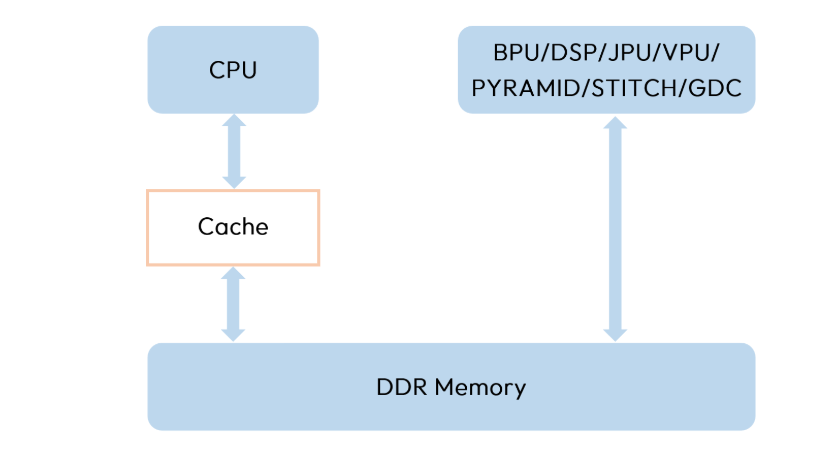

- 当CPU写完数据后，需要主动将Cache中的数据flush到memory中，否则其他硬件访问同一块内存空间时可能会读取到之前的旧数据。
- 而当其他后端硬件写完数据后，CPU在访问之前也需要主动将Cache中的数据invalidate掉，否则CPU可能会优先读取到之前缓存在cache中的旧数据。
- 在模型连续推理过程中，需要cpu读的，比如模型输出，建议申请带cacheable的内存，以加速CPU反复读写的效率，而不需要读的，只写的，比如模型输入，可以申请非cacheable的内存。
### 0.2.3 工作模式
UCP支持两种工作模式：直连模式和中继模式。系统默认运行在直连模式下，可单独启动service进程，并且通过对用户进程配置环境变量切换模式，中继模式下可支持多进程任务的统一调度，无论是直连模式还是中继模式，UCP对外接口的调用方式保持一致，不会对应用编程逻辑产生影响。
1. 用户可先基于默认的直连模式完成应用侧的开发和调试；
1. 当存在多个用户进程一起调用ucp接口下发任务时，并且对进程间的多个任务有较高的优先级排序的要求时，可切换到中继模式使用
<callout emoji="exclamation" background-color="light-orange" border-color="light-orange">
中继模式虽然可支持用户统一调度多进程间任务，但是也存在一些缺陷，包括
1. 需要做进程间通信和内存共享，整体的cpu负载更高；
1. 模型任务底层资源的竞争都发送于service进程内，相较于直连模式多个独立进程的竞争强度更高，任务的耗时可能受到影响；
因此需要用户根据实际场景需求灵活选择这两种模式，以权衡系统在性能和灵活性等方面的要求。
</callout>

### 0.2.4 仿真说明
UCP提供了完备的仿真能力，接口代码均可以在仿真环境中等效使用。 用户可以在x86环境中进行代码开发和调试，开发过程中获得可即时反馈，并在早期发现和解决问题，从而提高开发效率和代码质量，以确保代码能够无缝迁移到SoC硬件上运行。
<callout emoji="pushpin" background-color="light-orange" border-color="light-orange">
UCP支持的各Backend仿真方式如下：
- BPU和DSP硬件采用指令级仿真。
- GDC、JPU 和 VPU（Video Processing Unit）硬件采用CModel可执行文件仿真。
  - GDC硬件使用的CModel可执行文件是 `gdc_cmodel` 。
  - JPU硬件使用的CModel可执行文件是 `Nieuport_JpgEnc` 和 `Nieuport_JpgDec` ，分别用于JPEG编码和解码。
  - VPU硬件使用的CModel可执行文件是 `hevc_enc`、`hevc_dec`、`avc_enc` 和 `avc_dec`。其中 `hevc_enc` 和 `hevc_dec` 分别用于H.265编码和解码，`avc_enc` 和 `avc_dec` 分别用于H.264编码和解码。
- STITCH和PYRAMID硬件采用仿真库。
</callout>

### 0.2.5 日志管理
UCP支持终端及日志存储两种方式，其中日志存储支持滚动切分特性，可指定单个文件大小和切分文件数量，日志相关配置均可通过环境变量使能。

## 0.3 UCP工具介绍
### 0.3.1 模型推理评测工具
`hrt_model_exec` 是一个模型执行工具，可直接在开发板上评测模型的推理性能、获取模型信息。 一方面可以让您拿到模型时实际了解模型真实性能； 另一方面也可以帮助您了解模型可以做到的速度极限，对于应用调优的目标极限具有指导意义。
#### 0.3.1.1 模型信息
```shell
hrt_model_exec model_info --model_file=resnet50_224x224_nv12.hbm

../aarch64/bin/hrt_model_exec model_info --model_file=resnet50_224x224_nv12.hbm

Load model to DDR cost 1965.57ms.
This model file has 1 model:
[resnet50_224x224_nv12]
---------------------------------------------------------------------
[model name]: resnet50_224x224_nv12

input[0]:
name: input_y
valid shape: (1,224,224,1,)
aligned byte size: -1
tensor type: HB_DNN_TENSOR_TYPE_U8
quanti type: NONE
stride: (-1,-1,1,1,)

input[1]:
name: input_uv
valid shape: (1,112,112,2,)
aligned byte size: -1
tensor type: HB_DNN_TENSOR_TYPE_U8
quanti type: NONE
stride: (-1,-1,2,1,)

output[0]:
name: output
valid shape: (1,1000,)
aligned byte size: 4096
tensor type: HB_DNN_TENSOR_TYPE_F32
quanti type: NONE
stride: (4000,4,)

---------------------------------------------------------------------
```

#### 0.3.1.2 模型推理
用户进行模型推理可以直接使用图片输入，但要根据实际输入情况指定`input_img_properties`，表明该输入是图片的Y或UV通道数据。若用户有二进制输入数据最为理想，可以排除由于工具前处理部分带来的差异，可用于比较模型一致性。
```shell
hrt_model_exec infer --model_file=resnet50_224x224_nv12.hbm --input_file=zebra_cls.jpeg,zebra_cls.jpeg --input_img_properties=Y,UV

../aarch64/bin/hrt_model_exec infer --model_file=resnet50_224x224_nv12.hbm --input_file=zebra_cls.jpeg,zebra_cls.jpeg --input_img_properties=Y,UV
Load model to DDR cost 1965.03ms.
[I][35143][06-28][10:39:51:373][file_util.cpp:527][hrt_model_exec][HRT_MODEL_EXEC] The input valid shape is (1,224,224,1), and the image [zebra_cls.jpeg] will be scaled to 224x224
[I][35143][06-28][10:39:51:377][file_util.cpp:527][hrt_model_exec][HRT_MODEL_EXEC] The input valid shape is (1,112,112,2), and the image [zebra_cls.jpeg] will be scaled to 224x224

---------------------Frame 0 begin---------------------
Infer time: 1.464 ms
---------------------Frame 0 end---------------------
```

#### 0.3.1.3 模型性能
用户可以使用工具获取模型上板的性能，`thread_num`代表并行提交任务的线程数，设置为8测吞吐，设置为1测延迟。
```shell
hrt_model_exec perf --model_file=resnet50_224x224_nv12.hbm --frame_count=200 --thread_num=8

../aarch64/bin/hrt_model_exec perf --model_file=resnet50_224x224_nv12.hbm --frame_count=200 --thread_num=8
[BPU][[BPU_MONITOR]][INFO]BPULib verison(2, 0, 1)[]!
Load model to DDR cost 1965.34ms.
Frame count: 200,  Thread Average: 5.262160 ms,  thread max latency: 5.498000 ms,  thread min latency: 1.636000 ms,  FPS: 1467.383789

Running condition:
  Thread number is: 8
  Frame count   is: 200
  Program run time: 136.440000 ms
Perf result:
  Frame totally latency is: 1052.432007 ms
  Average    latency    is: 5.262160 ms
  Frame      rate       is: 1465.845793 FPS
```

### 0.3.2 性能分析工具trace
[J6 BPU trace抓取](https://horizonrobotics.feishu.cn/docx/VoEkdnuVKob4Pax6APVcIiIAnvd)
UCP trace 通过在 UCP 执行的关键路径上嵌入 trace 记录，提供深入分析 UCP 应用程序调度逻辑的能力。在出现性能异常时，可以通过分析UCP trace，快速找到异常发生的时间点。
UCP trace 提供了两种 trace 后端选项：`Perfetto Trace` 和 `Chrome Trace`。您可以通过设置环境变量，在这两者之间进行选择，以满足您特定的性能跟踪需求。考虑到perfetto trace提供了更加丰富的性能分析能力支持，建议用户以perfetto trace为主。具体的使用教程可参见OE文档，这里简单列举一些值得分析的数据。
#### 0.3.2.1 ucp任务跟踪
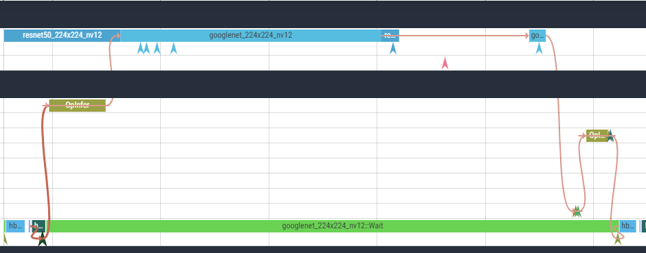

如上图所示，记录的trace信息汇总了单个任务从提交到结束的完整流程，其中关键路径可分为任务/算子两种类型的trace点。
#### 0.3.2.2 bpu trace


bpu trace可以清晰的显示timeline上实际运行的bpu任务，用户可通过任务执行的实际情况，包括先后顺序，是否发生抢占等来确认调度行为是否符合预期。
#### 0.3.2.3 线程状态查询
1. 线程状态大概分为以下几种
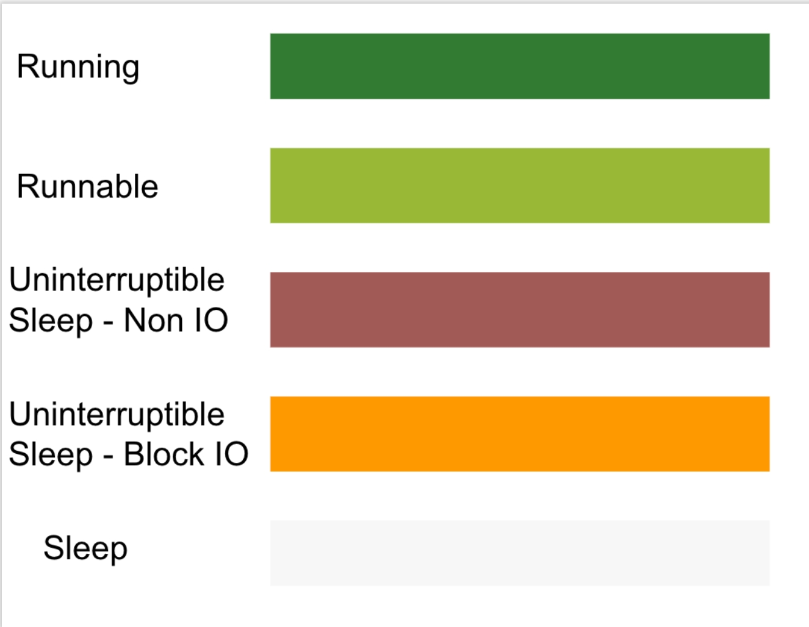

     通过鼠标选中这些状态可以显示更详细的线程信息，包括分配的cpu核心，前后相关的线程状态，以及可能存在的线程间唤醒关系等，下图以running为例
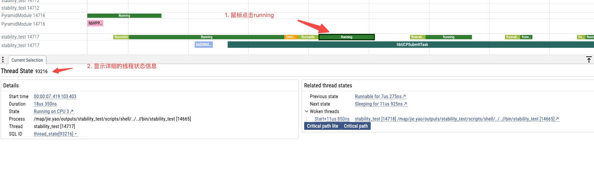

1. Running，表示方法实际的处理时间，此状态时间长可能存在以下一些原因
  1. 代码本身复杂度高，执行耗时久；
  1. cpu算力低，主频低等；
1. Runnable，表示线程正在等待cpu调度，runnable较多可能存在以下一些原因
  1. 优先级设置错误，导致部分关键路径的线程优先级低，Runnable 执行的概率更高，抢不到cpu使用权；
  1. 绑核不合理，有时候为了让线程运行得更快，会把线程绑定到大核，但是绑核一定要谨慎，因为一旦把线程绑定在某个核，表示线程只能运行在这个核上即使其它核很空闲。如果多个线程都绑定在某个核，当这个核很繁忙调度不过来时，这些线程就会出现 Runnable 时间很长的情况；
  1. CPU整体负载较高，需要找到高负载的应用做优化；
  1. cpu算力低，主频低等；
1. Uninterruptible Sleep/Sleep
  在 Systrace/Perfetto 中，Sleep 状态指的是 Linux 中的TASK_INTERUPTIBLE，trace 中的颜色为白色。Uninterruptible Sleep 指的是 Linux 中的 TASK_UNINTERRUPTIBLE，trace 中的颜色为橙色；本质上他们都是处于睡眠状态，拿不到 CPU的时间片，只有满足某些条件时才会拿到时间片，即变为 Runnable，随后是 Running。TASK_INTERRUPTIBLE 与 TASK_UNINTERRUPTIBLE 本质上都是 Sleep，**区别在于前者是可以处理 Signal 而后者不能，即使是 Kill 类型的Signal**。因此，除非是拿到自己等待的资源之外，没有其他方法可以唤醒它们。
  由此可知，sleep较多时可能是以下一些原因导致的
  1. 主动IO操作；
  1. 锁竞争等待等；
#### 0.3.2.4 全局Counter计数(DDR带宽/Hbmem等)
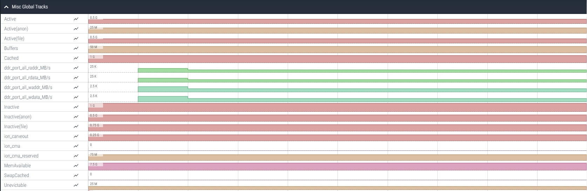

如图所示，能看出timeline上实时的一些全局的系统信息，对用户比较重要的有ddr带宽占用，hbmem占用，虚拟内存占用等。
### 0.3.3 性能监测工具monitor
monitor是板端性能监测工具，当前支持
1. 监控硬件 IP 占用率的工具，包括BPU，DSP，GDC，STITCH，PYM，ISP，Codec（VPU(Video Processing Unit) 和 JPU）；
1. DDR读写带宽占用；
1. 系统级别的hbmem内存占用；
1. 进程级别的rss/hbmem内存占用；
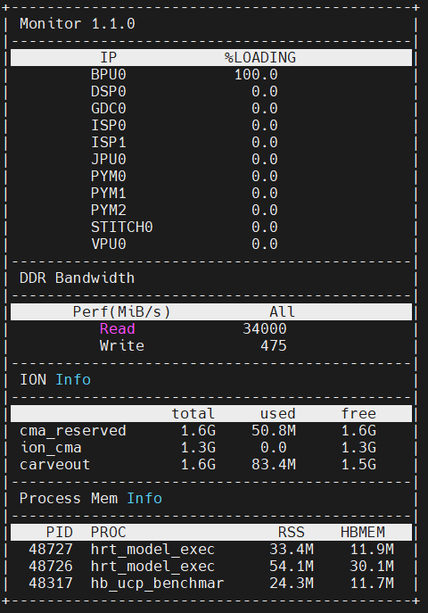

### 0.3.4 DEB包部署工具
UCP提供DEB部署包，旨在简化板端的部署过程。通过自动安装所需的二进制文件和相关依赖库后，用户可以快速部署并运行UCP相关的应用程序。该包会自动在板端安装ucp依赖的一系列动态库、中继模式需要的ucp_service以及monitor工具等，安装完成后，用户应用程序不需要再显示链接ucp动态库，而工具/service等命令亦可直接方便的使用。
1. deb安装/升级(升级失败支持回退)
```shell
dpkg -i hbucp_aarch64_xxxx.deb
```

1. deb卸载
```shell
dpkg -r hbucp
```

# 1 FAQ
### 1.1.1 调用hbUCPSubmitTask偶发性耗时很高，但是之后可以恢复正常
Re：检查dmesg日志中是否有Bpu reset的日志。如果存在相关日志，并且与hbUCPSubmitTask发生超时的时间能够匹配，则一般与功能安全有关，请将板端/log下的日志上报地平线相关同事。并且暂时卸载bpu_stl驱动暂时规避。
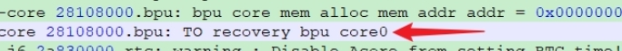

### 1.1.2 模型偶发性推理耗时不稳定，并且时有发生hbUCPWaitTaskDone超时是什么原因？
Re：请按照如下步骤依次检查并记录
- 按上一条检查是否发生BPU reset，如果发生，则可以按照1中的思路暂时规避，并将日志和问题描述上报地平线。
- 通过cat /sys/devices/system/bpu/bpu0/ratio检查BPU负载情况，若负载平均值较高，则需要分析是否推理任务太多，帧率太高，需要考虑降低部分低优任务的帧率。并且分析hbm模型的latency是否可以在编译期进一步优化。
- 通过top命令检查系统CPU负载，如果负载太高，需要考虑降低cpu负载，一般情况下，全功能运行时，cpu平均负载应当在80%以下，峰值不超过95%。
- 在板子上运行如下脚本检查系统中所有线程的优先级（脚本输出较多，建议将结果重定向到文件中查看）
<view type="1">

  <file token="NZBMbRpjloCZSVxlLaXcwpsanUk" name="hrut_ps"/>

</view>

保证应用所属的实时进程的优先级一般不超过50，检查BPU-LB和CPU-OP相关线程的优先级不低于大多数应用线程，避免bpu调度线程因得不到调度而阻塞。
- 通过hrut_ddr -t all命名检查系统ddr占用，一般平峰读写占用的ddr带宽占用不超过30GiB/s，否则可能因为等待访存而latency较长。


- 参考https://zhuanlan.zhihu.com/p/377378255抓取一份火焰图，尝试分析出问题的进程是否有异常，例如大量内存拷贝。
- 参考OE手册抓取ucp和bpu trace，分析trace中是否有不符合预期的调度情况。
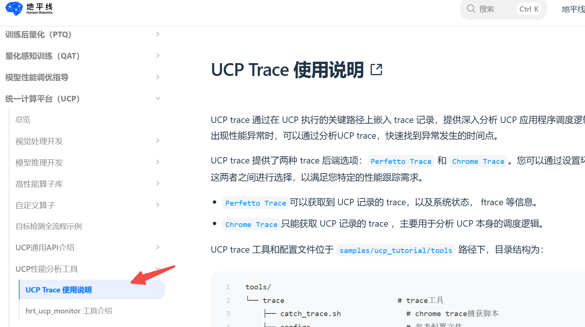

- 如果通过以上流程仍然不能找到问题的原因，请将上述排查步骤整理为文档，并将相关日志一起提交给地平线。
### 1.1.3 为什么我的模型加载失败
- 先使用随OE包释放的hrt_model_exec工具进行模型推理或者perf，如果hrt_model_exec可以正常执行模型，则hbm模型本身是没有问题。如果hbm不能推理，检查板端的hbm文件与负责模型编译的同事的文件md5码是否一致。若md5码一致，但是hrt_model_exec工具不能推理，则通过负责模型编译的同事联系地平线负责该项目的工具链相关同学寻求支持。
- 如果hrt_model_exec可以推理，但是在应用中不能推理，则检查ucp的版本号。ucp的版本号会在日志的较早期输出，相关日志参考如下截图。确保应用和hrt_model_exec使用相同的ucp版本号。
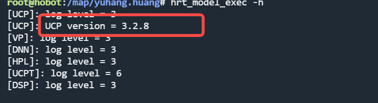

- 检查加载时的报错，例如如下报错意味着ion内存不足，J6上默认预留了5G左右的ion内存，理论上是够用的，如果报内存不够，需要检查应用是否有不合理使用ion内存的情况。
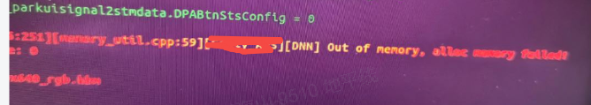

- 其他问题请找地平线相关同事解决。
### 1.1.4 我的应用里有多个模型，如何设置模型的优先级？
Re：ucp采用了三级抢占的优先级模型，<text color="red">**优先级范围为【0，255】，**</text><text color="red">**通过hbUCPSchedParam中的priority参数设置，其中0~253为低优先级**</text><text color="red">**（不支持抢占）**</text><text color="red">**，254为中优先级**</text><text color="red">**（可抢占低优先级）**</text><text color="red">**，255为高优先级**</text><text color="red">**（可抢占低优先级和中优先级）**</text>。0~253的优先级设置仅在当前进程的上下文有效，并且它只决定任务在ucp中的优先级。任务由ucp提交给libbpu后，在libbpu眼中统一视为低优任务，仅仅按照任务提交的先后顺序来决定先调度哪个任务。也就是A进程设置的253不比B进程设置的20更高优，谁优先执行仅仅取决于提交给libbpu的时间。如果设置优先级为254或255，则不仅任务会更先提交给libbpu，还能够抢占正在bpu上执行的其他任务。二者的区别在于，254的抢占级别是fc（bpu上的最小执行单元）级别的，255会终止正在执行的fc，实现更细粒度的抢占。
### 1.1.5 调用hbDNNInferV2时提示不能创建DNNTask？
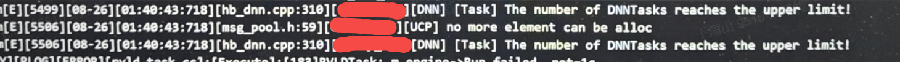

Re：检查日志中是否有以往推理失败的日志，并且推理失败（或者成功）后没有调用hbUCPReleaseTask释放任务。导致ucp中的task池耗尽了所有任务。此问题一般是应用bug。
### 1.1.6 如何分析模型各个阶段的执行耗时
Re：可以通过ucp trace工具抓取模型执行的细节。具体操作细节参考问题的解决思路。
### 1.1.7 如果一个模型的分段情况是bpu->cpu->bpu，在cpu阶段是否可以为我hold bpu资源，以便cpu阶段后尽快占用bpu完成模型推理？
Re：bpu资源不会被hold，但是可以通过将此任务的优先级设置为254/255，实现在cpu阶段结束后尽快获取bpu资源的目标。
### 1.1.8 日志提示hb_bpu_map failed，并且返回-2是什么原因？
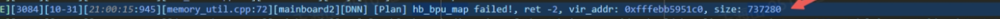

Re：一般情况是模型推理时传入的输入地址异常。可以关注后面的vir_addr和size，如果为0，则可能是应用中填充输入tensor的地址时出现异常。如果地址像上图，人眼看不出明显异常，则考虑应用中是否对图像内存通过加偏移地址进行抠图的情况，一般是offset越界引起的。可以通过调用hbmem提供的hb_mem_is_valid_buf API检查输入tensor的地址是否正常。
### 1.1.9 hbVPPyrDown算子指定HB_VP_INTER_GAUSSIAN插值和PYRAMID后端，提示不支持？
Re：J6上PYM只支持HB_VP_INTER_LINEAR插值，需修改插值方式为HB_VP_INTER_LINEAR；另外J6上建议通过底软vpm_config.json配置PYM图层，不建议调用UCP hbVPPyrDown算子指定PYM为后端的方式使用PYM

# 2 日志分析
## 2.1 UCP日志分析
### 2.1.1 开启debug级别日志
可通过如下方式开启ucp trace级别日志。ucp log等级可取值为0、1、2、3、4、5、6，分别对应trace、debug、info、warn、error、critical、never，默认为warn，量产时建议使用info或warn。
```python {wrap}
export HB_UCP_LOG_LEVEL=0
export HB_NN_LOG_LEVEL=0
```

### 2.1.2 日志存盘
```python {wrap}
export HB_UCP_LOG_PATH="xxxxx/ucp.log"
```

### 2.1.3 日志分析
如下是一份典型的正常日志
```python {wrap}
[UCP]: log level = 0
[UCP]: UCP version = 3.3.3
[VP]: log level = 3
[DNN]: log level = 0
[HPL]: log level = 3
[D][32932][01-17][10:50:34:937][configuration.cpp:276][hrt_model_exec][UCP] Bpu schedule max dispatch count: 3
[UCPT]: log level = 6
[D][32932][01-17][10:50:34:937][ucp_trace_manager.cpp:59][hrt_model_exec][UCP] UCP trace type: 2
[D][32932][01-17][10:50:34:938][backend_scheduler_factory.cpp:56][hrt_model_exec][UCP] backend 0 enable 1 cores, and select 0 type
[D][32932][01-17][10:50:34:938][backend_scheduler_factory.cpp:56][hrt_model_exec][UCP] backend 1 enable 1 cores, and select 0 type
[D][32932][01-17][10:50:34:938][backend_scheduler_factory.cpp:56][hrt_model_exec][UCP] backend 2 enable 1 cores, and select 0 type
[D][32932][01-17][10:50:34:938][backend_scheduler_factory.cpp:56][hrt_model_exec][UCP] backend 3 enable 1 cores, and select 0 type
[D][32932][01-17][10:50:34:938][backend_scheduler_factory.cpp:56][hrt_model_exec][UCP] backend 4 enable 1 cores, and select 0 type
[D][32932][01-17][10:50:34:938][backend_scheduler_factory.cpp:56][hrt_model_exec][UCP] backend 5 enable 1 cores, and select 0 type
[D][32932][01-17][10:50:34:938][backend_scheduler_factory.cpp:56][hrt_model_exec][UCP] backend 6 enable 0 cores, and select 0 type
[D][32932][01-17][10:50:34:938][backend_scheduler_factory.cpp:56][hrt_model_exec][UCP] backend 7 enable 3 cores, and select 0 type
[D][32932][01-17][10:50:34:938][backend_scheduler_factory.cpp:56][hrt_model_exec][UCP] backend 8 enable 2 cores, and select 0 type
[D][32932][01-17][10:50:34:938][backend_scheduler_factory.cpp:56][hrt_model_exec][UCP] backend 9 enable 6 cores, and select 0 type
[D][32932][01-17][10:50:34:939][backend_scheduler_factory.cpp:56][hrt_model_exec][UCP] backend 10 enable 0 cores, and select 0 type
[DSP]: log level = 3
hrt_model_exec perf --model_file models/multitask_v3.hbm

 [Warning]: These operators have range limitations on input data:
 [Acos, Acosh, Asin, Atanh, BevPoolV2, Div, Gather, GatherElements, GatherND, GridSample, ImageDecoder, IndexSelect, Log, Mod, Pow, Reciprocal, RoiAlign, ScatterElements, ScatterND, Slice, Sqrt, Tan
, Tile, Topk, Upsample].
 Please make sure that these operators are not in your model, when no input data is provided to the tool.
 [Suggestion]: Using --input_file command to specify perf input data, which can appoint valid input data.

[D][32932][01-17][10:50:34:978][configuration.cpp:89][hrt_model_exec][DNN] [Util] InitBPU start!
[BPU][[BPU_MONITOR]][281473422833504][INFO]BPULib verison(2, 1, 2)[0d3f195]!
[D][32932][01-17][10:50:35:408][configuration.cpp:110][hrt_model_exec][DNN] [Util] InitBPU end!
[D][32932][01-17][10:50:35:408][configuration.cpp:115][hrt_model_exec][DNN] [Util] InitPlatform start!
[D][32932][01-17][10:50:35:408][configuration.cpp:129][hrt_model_exec][DNN] [Util] core_type: 4, version: 12359
[D][32932][01-17][10:50:35:408][configuration.cpp:133][hrt_model_exec][DNN] [Util] BPU type is HB_PLATFORM_TYPE_J6E/M!
[D][32932][01-17][10:50:35:408][configuration.cpp:146][hrt_model_exec][DNN] [Util] InitPlatform end!
[D][32932][01-17][10:50:35:408][configuration.cpp:488][hrt_model_exec][DNN] [Util] Ude load libhbtl.so start!
[D][32932][01-17][10:50:35:408][configuration.cpp:488][hrt_model_exec][DNN] [Util] Ude load libhbtl_ext_dnn.so start!
[DNN] HBTL_EXT_DNN log level:6
[D][32932][01-17][10:50:35:409][configuration.cpp:196][hrt_model_exec][DNN] [Util] create hbrt instance start!
[D][32932][01-17][10:50:35:409][configuration.cpp:183][hrt_model_exec][DNN] [Util] Hbrt4 register jit kernel: jit::B30ResizeCompatibleMode start!
[D][32932][01-17][10:50:35:409][configuration.cpp:191][hrt_model_exec][DNN] [Util] Hbrt4 register jit kernel: jit::B30ResizeCompatibleMode end!
[D][32932][01-17][10:50:35:409][configuration.cpp:183][hrt_model_exec][DNN] [Util] Hbrt4 register jit kernel: jit::B30ResizeInputY start!
[D][32932][01-17][10:50:35:409][configuration.cpp:191][hrt_model_exec][DNN] [Util] Hbrt4 register jit kernel: jit::B30ResizeInputY end!
[D][32932][01-17][10:50:35:409][configuration.cpp:183][hrt_model_exec][DNN] [Util] Hbrt4 register jit kernel: jit::B30ResizeInputNV12 start!
[D][32932][01-17][10:50:35:409][configuration.cpp:191][hrt_model_exec][DNN] [Util] Hbrt4 register jit kernel: jit::B30ResizeInputNV12 end!
[D][32932][01-17][10:50:35:409][configuration.cpp:183][hrt_model_exec][DNN] [Util] Hbrt4 register jit kernel: jit::B30ResizeCompatibleMode_V2 start!
[D][32932][01-17][10:50:35:409][configuration.cpp:191][hrt_model_exec][DNN] [Util] Hbrt4 register jit kernel: jit::B30ResizeCompatibleMode_V2 end!
[D][32932][01-17][10:50:35:409][configuration.cpp:183][hrt_model_exec][DNN] [Util] Hbrt4 register jit kernel: jit::B30ResizeInputY_V2 start!
[D][32932][01-17][10:50:35:409][configuration.cpp:191][hrt_model_exec][DNN] [Util] Hbrt4 register jit kernel: jit::B30ResizeInputY_V2 end!
[D][32932][01-17][10:50:35:409][configuration.cpp:183][hrt_model_exec][DNN] [Util] Hbrt4 register jit kernel: jit::B30ResizeInputNV12_V2 start!
[D][32932][01-17][10:50:35:409][configuration.cpp:191][hrt_model_exec][DNN] [Util] Hbrt4 register jit kernel: jit::B30ResizeInputNV12_V2 end!
[D][32932][01-17][10:50:35:409][configuration.cpp:183][hrt_model_exec][DNN] [Util] Hbrt4 register jit kernel: jit::B30BatchResizerNV12 start!
[D][32932][01-17][10:50:35:409][configuration.cpp:191][hrt_model_exec][DNN] [Util] Hbrt4 register jit kernel: jit::B30BatchResizerNV12 end!
[D][32932][01-17][10:50:35:409][configuration.cpp:183][hrt_model_exec][DNN] [Util] Hbrt4 register jit kernel: jit::B30BatchResizerGray start!
[D][32932][01-17][10:50:35:409][configuration.cpp:191][hrt_model_exec][DNN] [Util] Hbrt4 register jit kernel: jit::B30BatchResizerGray end!
[D][32932][01-17][10:50:35:409][configuration.cpp:422][hrt_model_exec][DNN] [Util] program is running on the board
[D][32932][01-17][10:50:35:409][configuration.cpp:340][hrt_model_exec][DNN] [Util] Mem lru cache enable: false
[D][32932][01-17][10:50:35:409][configuration.cpp:347][hrt_model_exec][DNN] [Util] Mem lru cache capacity: -1
[D][32932][01-17][10:50:35:409][configuration.cpp:356][hrt_model_exec][DNN] [Util] Mem lru cache clean interval: 1000000
[DNN]: 3.3.3_(4.1.17 HBRT)
[D][32932][01-17][10:50:35:409][configuration.cpp:83][hrt_model_exec][DNN] [Util] Ude dispatcher dump: namespace: b25, name: AvgPool2d, DispatchKey: 0, signature: b25::AvgPool2d(Tensor, int64_t[], i
nt64_t[], int64_t[], int64_t, bool, int64_t, int64_t, int64_t, Str, bool) -> (Tensor)
namespace: b25, name: Binary, DispatchKey: 0, signature: b25::Binary(Tensor, Tensor, Str) -> (Tensor)
namespace: b25, name: ComplexBinary, DispatchKey: 0, signature: b25::ComplexBinary(Tensor, Tensor, Tensor, Str, Str, bool) -> (Tensor)
namespace: b25, name: Conv2d, DispatchKey: 0, signature: b25::Conv2d(Tensor, Tensor, Tensor, Tensor, Tensor, int64_t, int64_t[], int64_t[], int64_t[], int64_t, int64_t, bool, bool, bool) -> (Tensor)
namespace: b25, name: Lut, DispatchKey: 0, signature: b25::Lut(Tensor, Tensor, Tensor, Str, Str, bool) -> (Tensor)
namespace: b25, name: LutSimple, DispatchKey: 0, signature: b25::LutSimple(Tensor, Tensor) -> (Tensor)
namespace: b25, name: MaxPool2d, DispatchKey: 0, signature: b25::MaxPool2d(Tensor, int64_t[], int64_t[], int64_t[], int64_t, bool) -> (Tensor)
namespace: b25, name: Resize2d, Dispa
[D][32932][01-17][10:50:35:446][packed_model.cpp:442][hrt_model_exec][DNN] [Model] Model get build id: 4c74f6f07822b5aefdb6419b57df24f0cb0625576f4df71dd8558a77ce6e471a
[D][32932][01-17][10:50:35:446][packed_model.cpp:175][hrt_model_exec][DNN] [Model] LoadUnifiedHybridModel start!
[D][32932][01-17][10:50:35:516][unified_hybrid_graph.cpp:251][hrt_model_exec][DNN] [Model] begin to construct graph [name=model].
[D][32932][01-17][10:50:35:516][unified_hybrid_graph.cpp:26][hrt_model_exec][DNN] [Model] begin to construct graph nodes.
[D][32932][01-17][10:50:35:516][node.cpp:107][hrt_model_exec][DNN] [Model] Variable [_input_0_0_uv] is dynamic
[D][32932][01-17][10:50:35:516][node.cpp:107][hrt_model_exec][DNN] [Model] Variable [_input_0_0_y] is dynamic
[D][32932][01-17][10:50:35:516][node.cpp:107][hrt_model_exec][DNN] [Model] Variable [_input_0_1_uv] is dynamic
[D][32932][01-17][10:50:35:516][node.cpp:107][hrt_model_exec][DNN] [Model] Variable [_input_0_1_y] is dynamic
[D][32932][01-17][10:50:35:516][node.cpp:107][hrt_model_exec][DNN] [Model] Variable [_input_0_2_uv] is dynamic
[D][32932][01-17][10:50:35:516][node.cpp:107][hrt_model_exec][DNN] [Model] Variable [_input_0_2_y] is dynamic
[D][32932][01-17][10:50:35:516][node.cpp:107][hrt_model_exec][DNN] [Model] Variable [_input_0_3_uv] is dynamic
[D][32932][01-17][10:50:35:516][node.cpp:107][hrt_model_exec][DNN] [Model] Variable [_input_0_3_y] is dynamic
[D][32932][01-17][10:50:35:516][node.cpp:107][hrt_model_exec][DNN] [Model] Variable [_input_0_4_uv] is dynamic
[D][32932][01-17][10:50:35:516][node.cpp:107][hrt_model_exec][DNN] [Model] Variable [_input_0_4_y] is dynamic
[D][32932][01-17][10:50:35:516][node.cpp:107][hrt_model_exec][DNN] [Model] Variable [_input_0_5_uv] is dynamic
[D][32932][01-17][10:50:35:516][node.cpp:107][hrt_model_exec][DNN] [Model] Variable [_input_0_5_y] is dynamic
[D][32932][01-17][10:50:35:516][unified_hybrid_graph.cpp:38][hrt_model_exec][DNN] [Model] construct graph nodes succeed.
[D][32932][01-17][10:50:35:516][unified_hybrid_graph.cpp:184][hrt_model_exec][DNN] [Plan] AnalyzeDynamicVariables success! Dynamic variable number: 12
[D][32932][01-17][10:50:35:516][unified_hybrid_graph.cpp:269][hrt_model_exec][DNN] [Model] {
  "constant_memspace": [
    "region_constant"
  ],
  "inout_data_memspace": [
    "region_2009",
    "region_2006",
    "region_2004",
    "region_1001",
    "region_1003",
    "region_2005",
    "region_1013",
    "region_1006",
    "region_1002",
    "region_2000",
    "region_1012",
    "region_1005",
    "region_1004",
    "region_2002",
    "region_1014",
    "region_1007",
    "region_2007",
    "region_1009",
    "region_2003",
    "region_1008",
    "region_2001",
    "region_1011",
    "region_2008",
    "region_1000",
    "region_1010"
  ],
  "middle_data_memspace": [
    "region_3000"
  ],
  "node_cache_memspace": [],
  "nodes": {
    "unamed_hbir.linear_id_15861_bpu_segment_2": {
      "input": [
        "_input_0_0_uv",
        "_input_0_0_y",
        "_input_0_1_uv",
        "_input_0_1_y",
        "_input_0_2_uv",
        "_input_0_2_y",
        "_input_0_3_uv",
        "_input_0_3_y",
        "_input_0_4_uv",
        "_input_0_4_y",
        "_input_0_5_uv",
        "_input_0_5_y",
        "una
[D][32932][01-17][10:50:35:516][unified_hybrid_graph.cpp:270][hrt_model_exec][DNN] [Model] construct graph [name=model] succeed.
[D][32932][01-17][10:50:35:516][executor.cpp:20][hrt_model_exec][DNN] [Engine] begin to init executor.
[D][32932][01-17][10:50:35:516][engine.cpp:19][hrt_model_exec][DNN] [Engine] Begin init engine.
[D][32932][01-17][10:50:35:516][hbrt4_exec_plan.cpp:62][hrt_model_exec][DNN] [Plan] GraphSegment success!
[D][32932][01-17][10:50:35:516][dnn_op.cpp:328][hrt_model_exec][DNN] [Plan] PreparePlan for node[unamed_hbir.reshape_id_1228_cpu_segment_0] type[quant::qcast(Tensor, double[], int64_t[], bool, int64
_t, bool, bool) -> (Tensor)] start!
[D][32932][01-17][10:50:35:516][dnn_op.cpp:344][hrt_model_exec][DNN] [Plan] prepare variable name: unamed_hbir.reshape_id_1228: 0
[D][32932][01-17][10:50:35:516][dnn_op.cpp:344][hrt_model_exec][DNN] [Plan] prepare variable name: _input_1
[D][32932][01-17][10:50:35:516][dnn_op.cpp:344][hrt_model_exec][DNN] [Plan] prepare variable name: _hb_model_cpu_segment_0_cpu_extra_param_0
[D][32932][01-17][10:50:35:516][dnn_op.cpp:344][hrt_model_exec][DNN] [Plan] prepare variable name: _hb_model_cpu_segment_0_cpu_extra_param_1
[D][32932][01-17][10:50:35:516][dnn_op.cpp:344][hrt_model_exec][DNN] [Plan] prepare variable name: _hb_model_cpu_segment_0_cpu_extra_param_2
[D][32932][01-17][10:50:35:516][dnn_op.cpp:344][hrt_model_exec][DNN] [Plan] prepare variable name: _hb_model_cpu_segment_0_cpu_extra_param_3
[D][32932][01-17][10:50:35:516][dnn_op.cpp:344][hrt_model_exec][DNN] [Plan] prepare variable name: _hb_model_cpu_segment_0_cpu_extra_param_4
[D][32932][01-17][10:50:35:516][dnn_op.cpp:344][hrt_model_exec][DNN] [Plan] prepare variable name: _hb_model_cpu_segment_0_cpu_extra_param_5
[D][32932][01-17][10:50:35:516][dnn_op.cpp:358][hrt_model_exec][DNN] [Plan] PreparePlan for node[unamed_hbir.reshape_id_1228_cpu_segment_0] type[quant::qcast(Tensor, double[], int64_t[], bool, int64
_t, bool, bool) -> (Tensor)] end! Signature: quant::qcast(Tensor, double[], int64_t[], bool, int64_t, bool, bool) -> (Tensor)
[D][32932][01-17][10:50:35:516][dnn_op.cpp:328][hrt_model_exec][DNN] [Plan] PreparePlan for node[unamed_hbir.reshape_id_6676_cpu_segment_1] type[quant::qcast(Tensor, double[], int64_t[], bool, int64
_t, bool, bool) -> (Tensor)] start!
[D][32932][01-17][10:50:35:516][dnn_op.cpp:344][hrt_model_exec][DNN] [Plan] prepare variable name: unamed_hbir.reshape_id_6676: 0
[D][32932][01-17][10:50:35:516][dnn_op.cpp:344][hrt_model_exec][DNN] [Plan] prepare variable name: _input_1
[D][32932][01-17][10:50:35:516][dnn_op.cpp:344][hrt_model_exec][DNN] [Plan] prepare variable name: _hb_model_cpu_segment_1_cpu_extra_param_6
[D][32932][01-17][10:50:35:516][dnn_op.cpp:344][hrt_model_exec][DNN] [Plan] prepare variable name: _hb_model_cpu_segment_1_cpu_extra_param_7
[D][32932][01-17][10:50:35:516][dnn_op.cpp:344][hrt_model_exec][DNN] [Plan] prepare variable name: _hb_model_cpu_segment_1_cpu_extra_param_8
[D][32932][01-17][10:50:35:516][dnn_op.cpp:344][hrt_model_exec][DNN] [Plan] prepare variable name: _hb_model_cpu_segment_1_cpu_extra_param_9
[D][32932][01-17][10:50:35:516][dnn_op.cpp:344][hrt_model_exec][DNN] [Plan] prepare variable name: _hb_model_cpu_segment_1_cpu_extra_param_10
[D][32932][01-17][10:50:35:516][dnn_op.cpp:344][hrt_model_exec][DNN] [Plan] prepare variable name: _hb_model_cpu_segment_1_cpu_extra_param_11
[D][32932][01-17][10:50:35:516][dnn_op.cpp:358][hrt_model_exec][DNN] [Plan] PreparePlan for node[unamed_hbir.reshape_id_6676_cpu_segment_1] type[quant::qcast(Tensor, double[], int64_t[], bool, int64
_t, bool, bool) -> (Tensor)] end! Signature: quant::qcast(Tensor, double[], int64_t[], bool, int64_t, bool, bool) -> (Tensor)
[D][32932][01-17][10:50:35:516][hbrt4_exec_plan.cpp:157][hrt_model_exec][DNN] [Plan] Model[model] segment information: ([DNNCpuFusionOp ][DNNBpuFusionOp ])
[D][32932][01-17][10:50:35:516][hbrt4_mem_plan.cpp:145][hrt_model_exec][DNN] [Plan] Middle data memspace alloc size 384
[D][32932][01-17][10:50:35:516][hbrt4_mem_plan.cpp:170][hrt_model_exec][DNN] [Plan] Temp memspace alloc size 40611840
[D][32932][01-17][10:50:35:516][unified_hybrid_graph.cpp:292][hrt_model_exec][DNN] [Plan] Node cache memspace alloc size 0
[D][32932][01-17][10:50:35:516][hbrt4_exec_plan.cpp:197][hrt_model_exec][DNN] [Plan] CreateMemPlan success!
[D][32932][01-17][10:50:35:516][hbrt4_exec_plan.cpp:242][hrt_model_exec][DNN] [Plan] PrepareDslOpExecInfo start!
[D][32932][01-17][10:50:35:516][hbrt4_exec_plan.cpp:268][hrt_model_exec][DNN] [Plan] PrepareDslOpExecInfo end!
[D][32932][01-17][10:50:35:516][hbrt4_exec_plan.cpp:276][hrt_model_exec][DNN] [Plan] PrepareExecInfo success!
[D][32932][01-17][10:50:35:516][engine.cpp:21][hrt_model_exec][DNN] [Engine] Init engine succeed.
[D][32932][01-17][10:50:35:516][executor.cpp:27][hrt_model_exec][DNN] [Engine] init executor succeed.
[D][32932][01-17][10:50:35:516][unified_hybrid_model.cpp:424][hrt_model_exec][DNN] [Model] Begin to Build Graph Feature Info.
[D][32932][01-17][10:50:35:516][unified_hybrid_model.cpp:427][hrt_model_exec][DNN] [Model] Build Graph Feature Info succeed.
[D][32932][01-17][10:50:35:516][unified_hybrid_model.cpp:54][hrt_model_exec][DNN] [Model] Model init finished
[D][32932][01-17][10:50:35:516][packed_model.cpp:218][hrt_model_exec][DNN] [Model] load model success!
Load model to DDR cost 538.783ms.
[D][32932][01-17][10:50:35:516][hb_ucp_sys.cpp:76][hrt_model_exec][UCP] Allocate cached memory success! vir: 0xffffa0030000, phy: 17501454336, size: 180224
[I][32932][01-17][10:50:35:516][tensor_util.cpp:293][hrt_model_exec][HRT_MODEL_EXEC] Input[0] stride is dynamic, but you did not specify the stride, set as (180224,704,1,1)
[D][32932][01-17][10:50:35:516][hb_ucp_sys.cpp:76][hrt_model_exec][UCP] Allocate cached memory success! vir: 0xffffa0010000, phy: 17501650944, size: 90112
[I][32932][01-17][10:50:35:516][tensor_util.cpp:293][hrt_model_exec][HRT_MODEL_EXEC] Input[1] stride is dynamic, but you did not specify the stride, set as (90112,704,2,1)
[I][32932][01-17][10:50:35:516][tensor_util.cpp:293][hrt_model_exec][HRT_MODEL_EXEC] Input[2] stride is dynamic, but you did not specify the stride, set as (180224,704,1,1)
[I][32932][01-17][10:50:35:516][tensor_util.cpp:293][hrt_model_exec][HRT_MODEL_EXEC] Input[3] stride is dynamic, but you did not specify the stride, set as (90112,704,2,1)
[D][32932][01-17][10:50:35:516][hb_ucp_sys.cpp:76][hrt_model_exec][UCP] Allocate cached memory success! vir: 0xffff7fcf0000, phy: 17501782016, size: 180224
[I][32932][01-17][10:50:35:516][tensor_util.cpp:293][hrt_model_exec][HRT_MODEL_EXEC] Input[4] stride is dynamic, but you did not specify the stride, set as (180224,704,1,1)
[I][32932][01-17][10:50:35:516][tensor_util.cpp:293][hrt_model_exec][HRT_MODEL_EXEC] Input[5] stride is dynamic, but you did not specify the stride, set as (90112,704,2,1)
[D][32932][01-17][10:50:35:517][hb_ucp_sys.cpp:76][hrt_model_exec][UCP] Allocate cached memory success! vir: 0xffff7fcd0000, phy: 17501978624, size: 90112
[I][32932][01-17][10:50:35:516][tensor_util.cpp:293][hrt_model_exec][HRT_MODEL_EXEC] Input[6] stride is dynamic, but you did not specify the stride, set as (180224,704,1,1)
[D][32932][01-17][10:50:35:517][hb_ucp_sys.cpp:76][hrt_model_exec][UCP] Allocate cached memory success! vir: 0xffff7fca0000, phy: 17502109696, size: 180224
[I][32932][01-17][10:50:35:516][tensor_util.cpp:293][hrt_model_exec][HRT_MODEL_EXEC] Input[7] stride is dynamic, but you did not specify the stride, set as (90112,704,2,1)
[I][32932][01-17][10:50:35:516][tensor_util.cpp:293][hrt_model_exec][HRT_MODEL_EXEC] Input[8] stride is dynamic, but you did not specify the stride, set as (180224,704,1,1)
[D][32932][01-17][10:50:35:517][hb_ucp_sys.cpp:76][hrt_model_exec][UCP] Allocate cached memory success! vir: 0xffff7fc80000, phy: 17502306304, size: 90112
[I][32932][01-17][10:50:35:516][tensor_util.cpp:293][hrt_model_exec][HRT_MODEL_EXEC] Input[9] stride is dynamic, but you did not specify the stride, set as (90112,704,2,1)
[I][32932][01-17][10:50:35:516][tensor_util.cpp:293][hrt_model_exec][HRT_MODEL_EXEC] Input[10] stride is dynamic, but you did not specify the stride, set as (180224,704,1,1)
[I][32932][01-17][10:50:35:516][tensor_util.cpp:293][hrt_model_exec][HRT_MODEL_EXEC] Input[11] stride is dynamic, but you did not specify the stride, set as (90112,704,2,1)
[D][32932][01-17][10:50:35:517][hb_ucp_sys.cpp:76][hrt_model_exec][UCP] Allocate cached memory success! vir: 0xffff7fc50000, phy: 17502437376, size: 180224
[D][32932][01-17][10:50:35:517][hb_ucp_sys.cpp:76][hrt_model_exec][UCP] Allocate cached memory success! vir: 0xffff7fc30000, phy: 17502633984, size: 90112
[D][32932][01-17][10:50:35:517][hb_ucp_sys.cpp:76][hrt_model_exec][UCP] Allocate cached memory success! vir: 0xffff7fc00000, phy: 17502765056, size: 180224
[D][32932][01-17][10:50:35:517][hb_ucp_sys.cpp:76][hrt_model_exec][UCP] Allocate cached memory success! vir: 0xffff7fbe0000, phy: 17502961664, size: 90112
[D][32932][01-17][10:50:35:517][hb_ucp_sys.cpp:76][hrt_model_exec][UCP] Allocate cached memory success! vir: 0xffff7fbb0000, phy: 17503092736, size: 180224
[D][32932][01-17][10:50:35:517][hb_ucp_sys.cpp:76][hrt_model_exec][UCP] Allocate cached memory success! vir: 0xffff7fb90000, phy: 17503289344, size: 90112
[D][32932][01-17][10:50:35:517][hb_ucp_sys.cpp:76][hrt_model_exec][UCP] Allocate cached memory success! vir: 0xffffa0000000, phy: 17503420416, size: 384
[D][32932][01-17][10:50:35:517][hb_ucp_sys.cpp:76][hrt_model_exec][UCP] Allocate cached memory success! vir: 0xffff7fb80000, phy: 17503485952, size: 12288
[D][32932][01-17][10:50:35:517][hb_ucp_sys.cpp:76][hrt_model_exec][UCP] Allocate cached memory success! vir: 0xffff7fb60000, phy: 17503551488, size: 98304
[D][32932][01-17][10:50:35:517][hb_ucp_sys.cpp:76][hrt_model_exec][UCP] Allocate cached memory success! vir: 0xffff7fb50000, phy: 17503682560, size: 896
[D][32932][01-17][10:50:35:517][hb_ucp_sys.cpp:76][hrt_model_exec][UCP] Allocate cached memory success! vir: 0xffff7fb40000, phy: 17503748096, size: 6400
[D][32932][01-17][10:50:35:517][hb_ucp_sys.cpp:76][hrt_model_exec][UCP] Allocate cached memory success! vir: 0xffff7fb30000, phy: 17503813632, size: 32768
[D][32932][01-17][10:50:35:517][hb_ucp_sys.cpp:76][hrt_model_exec][UCP] Allocate cached memory success! vir: 0xffff7fb20000, phy: 17503879168, size: 16384
[D][32932][01-17][10:50:35:517][hb_ucp_sys.cpp:76][hrt_model_exec][UCP] Allocate cached memory success! vir: 0xffff7fb10000, phy: 17503944704, size: 4096
[D][32932][01-17][10:50:35:517][hb_ucp_sys.cpp:76][hrt_model_exec][UCP] Allocate cached memory success! vir: 0xffff7faf0000, phy: 17504010240, size: 131072
[D][32932][01-17][10:50:35:517][hb_ucp_sys.cpp:76][hrt_model_exec][UCP] Allocate cached memory success! vir: 0xffff7fae0000, phy: 17504141312, size: 24576
[D][32932][01-17][10:50:35:517][hb_ucp_sys.cpp:76][hrt_model_exec][UCP] Allocate cached memory success! vir: 0xffff7fad0000, phy: 17504206848, size: 12288
[D][32932][01-17][10:50:35:517][hb_ucp_sys.cpp:76][hrt_model_exec][UCP] Allocate cached memory success! vir: 0xffff7fac0000, phy: 17504272384, size: 3072
[D][32932][01-17][10:50:35:517][hb_ucp_sys.cpp:76][hrt_model_exec][UCP] Allocate cached memory success! vir: 0xffff7faa0000, phy: 17504337920, size: 98304
[D][32976][01-17][10:50:35:517][dnn_task.cpp:194][hrt_model_exec][DNN] [Task] user stride: (180224,704,1,1), min stride: (180224,704,1,1)
[D][32976][01-17][10:50:35:517][dnn_task.cpp:194][hrt_model_exec][DNN] [Task] user stride: (90112,704,2,1), min stride: (90112,704,2,1)
[D][32976][01-17][10:50:35:517][dnn_task.cpp:194][hrt_model_exec][DNN] [Task] user stride: (180224,704,1,1), min stride: (180224,704,1,1)
[D][32976][01-17][10:50:35:517][dnn_task.cpp:194][hrt_model_exec][DNN] [Task] user stride: (90112,704,2,1), min stride: (90112,704,2,1)
[D][32976][01-17][10:50:35:517][dnn_task.cpp:194][hrt_model_exec][DNN] [Task] user stride: (180224,704,1,1), min stride: (180224,704,1,1)
[D][32976][01-17][10:50:35:517][dnn_task.cpp:194][hrt_model_exec][DNN] [Task] user stride: (90112,704,2,1), min stride: (90112,704,2,1)
[D][32976][01-17][10:50:35:517][dnn_task.cpp:194][hrt_model_exec][DNN] [Task] user stride: (180224,704,1,1), min stride: (180224,704,1,1)
[D][32976][01-17][10:50:35:517][dnn_task.cpp:194][hrt_model_exec][DNN] [Task] user stride: (90112,704,2,1), min stride: (90112,704,2,1)
[D][32976][01-17][10:50:35:517][dnn_task.cpp:194][hrt_model_exec][DNN] [Task] user stride: (180224,704,1,1), min stride: (180224,704,1,1)
[D][32976][01-17][10:50:35:517][dnn_task.cpp:194][hrt_model_exec][DNN] [Task] user stride: (90112,704,2,1), min stride: (90112,704,2,1)
[D][32976][01-17][10:50:35:517][dnn_task.cpp:194][hrt_model_exec][DNN] [Task] user stride: (180224,704,1,1), min stride: (180224,704,1,1)
[D][32976][01-17][10:50:35:517][dnn_task.cpp:194][hrt_model_exec][DNN] [Task] user stride: (90112,704,2,1), min stride: (90112,704,2,1)
[D][32976][01-17][10:50:35:517][task.cpp:78][hrt_model_exec][UCP] UCP task run in async mode.
[D][32976][01-17][10:50:35:517][hbrt4_exec_plan.cpp:825][hrt_model_exec][DNN] [Plan] ExecPlan for modeltask[model] segment result: ([DNNCpuFusionOp ][DNNBpuFusionOp ])
[D][32976][01-17][10:50:35:517][dnn_task.cpp:503][hrt_model_exec][DNN] [Task] DnnTask[model] segment result([DNNCpuFusionOp ][DNNBpuFusionOp ])
[D][32976][01-17][10:50:35:517][task_scheduler.cpp:199][hrt_model_exec][UCP] start to schedule task 2
[D][32976][01-17][10:50:35:517][dnn_task.cpp:524][hrt_model_exec][DNN] [Task] NextSeg is DNNCpuFusionOp
[D][32976][01-17][10:50:35:517][task.cpp:99][hrt_model_exec][UCP] Get next seg with 1 ops of task 2.
[D][32976][01-17][10:50:35:517][task_scheduler.cpp:189][hrt_model_exec][UCP] op DNNCpuFusionOp of task model dispatch to core 0 of backend 0B1001
[D][32967][01-17][10:50:35:517][cpu_scheduler.cpp:28][hrt_model_exec][UCP] Op DNNCpuFusionOp of task 2 for infer start in CpuBackendSchedule with thread 6.
[D][32967][01-17][10:50:35:517][hbrt4_exec_plan.cpp:1150][hrt_model_exec][DNN] [Plan] Preprocess cpu node[unamed_hbir.reshape_id_1228_cpu_segment_0] start!
[D][32967][01-17][10:50:35:517][hbrt4_exec_plan.cpp:1245][hrt_model_exec][DNN] [Plan] Preprocess cpu node[unamed_hbir.reshape_id_1228_cpu_segment_0] end!
[D][32967][01-17][10:50:35:517][dnn_op.cpp:431][hrt_model_exec][DNN] Task: [2]; Node: [unamed_hbir.reshape_id_1228_cpu_segment_0]; OP:task is kernel's name is quant::qcast, schema is quant::qcast(Te
nsor, double[], int64_t[], bool, int64_t, bool, bool) -> (Tensor), DispatchKey is 4, args:(Tensor, Tensor
, Vector{double}[0.0343419], Vector{int64_t}[0], 0, 0, 0, 0)
[D][32967][01-17][10:50:35:517][hbrt4_exec_plan.cpp:1251][hrt_model_exec][DNN] [Plan] Postprocess cpu node[unamed_hbir.reshape_id_1228_cpu_segment_0] start!
[D][32967][01-17][10:50:35:517][hbrt4_exec_plan.cpp:1275][hrt_model_exec][DNN] [Plan] Flush variable: 298099392
[D][32967][01-17][10:50:35:517][hbrt4_exec_plan.cpp:1141][hrt_model_exec][DNN] [Plan] Flush addr: 281473366491136, size: 192
[D][32967][01-17][10:50:35:517][hbrt4_exec_plan.cpp:1326][hrt_model_exec][DNN] [Plan] Postprocess cpu node[unamed_hbir.reshape_id_1228_cpu_segment_0] end!
[D][32967][01-17][10:50:35:517][hbrt4_exec_plan.cpp:1150][hrt_model_exec][DNN] [Plan] Preprocess cpu node[unamed_hbir.reshape_id_6676_cpu_segment_1] start!
[D][32967][01-17][10:50:35:517][hbrt4_exec_plan.cpp:1245][hrt_model_exec][DNN] [Plan] Preprocess cpu node[unamed_hbir.reshape_id_6676_cpu_segment_1] end!
[D][32967][01-17][10:50:35:517][dnn_op.cpp:431][hrt_model_exec][DNN] Task: [2]; Node: [unamed_hbir.reshape_id_6676_cpu_segment_1]; OP:task is kernel's name is quant::qcast, schema is quant::qcast(Te
nsor, double[], int64_t[], bool, int64_t, bool, bool) -> (Tensor), DispatchKey is 4, args:(Tensor, Tensor,
 Vector{double}[0.0651361], Vector{int64_t}[0], 0, 0, 0, 0)
[D][32967][01-17][10:50:35:517][hbrt4_exec_plan.cpp:1251][hrt_model_exec][DNN] [Plan] Postprocess cpu node[unamed_hbir.reshape_id_6676_cpu_segment_1] start!
[D][32967][01-17][10:50:35:517][hbrt4_exec_plan.cpp:1275][hrt_model_exec][DNN] [Plan] Flush variable: 298101584
[D][32967][01-17][10:50:35:517][hbrt4_exec_plan.cpp:1141][hrt_model_exec][DNN] [Plan] Flush addr: 281473366491392, size: 96
[D][32967][01-17][10:50:35:518][hbrt4_exec_plan.cpp:1326][hrt_model_exec][DNN] [Plan] Postprocess cpu node[unamed_hbir.reshape_id_6676_cpu_segment_1] end!
[D][32967][01-17][10:50:35:518][cpu_scheduler.cpp:42][hrt_model_exec][UCP] Op DNNCpuFusionOp of task 2 for infer success in CpuBackendSchedule with thread 6.
[D][32967][01-17][10:50:35:518][dnn_task.cpp:524][hrt_model_exec][DNN] [Task] NextSeg is DNNBpuFusionOp
[D][32967][01-17][10:50:35:518][task.cpp:99][hrt_model_exec][UCP] Get next seg with 1 ops of task 2.
[D][32967][01-17][10:50:35:518][task_scheduler.cpp:189][hrt_model_exec][UCP] op DNNBpuFusionOp of task model dispatch to core 0 of backend 0B0
[D][32956][01-17][10:50:35:518][bpu_scheduler.cpp:245][hrt_model_exec][UCP] Op DNNBpuFusionOp of task 2 for infer start in BpuBackendSchedule.
[D][32956][01-17][10:50:35:518][hbrt4_exec_plan.cpp:1114][hrt_model_exec][DNN] [Plan] Generate command for bpu node[unamed_hbir.linear_id_15861_bpu_segment_2] start!
[D][32956][01-17][10:50:35:518][hbrt4_exec_plan.cpp:1028][hrt_model_exec][DNN] [Plan] Generate command by parameter start!
[D][32956][01-17][10:50:35:518][hbrt4_exec_plan.cpp:1055][hrt_model_exec][DNN] [Plan] Generate command by parameter end!
[D][32956][01-17][10:50:35:518][hbrt4_exec_plan.cpp:1121][hrt_model_exec][DNN] [Plan] Generate command for bpu node[unamed_hbir.linear_id_15861_bpu_segment_2] end!
[D][32956][01-17][10:50:35:518][dnn_op.cpp:83][hrt_model_exec][DNN] PrepareBpuTask start!
[D][32956][01-17][10:50:35:518][dnn_op.cpp:143][hrt_model_exec][DNN] PrepareBpuTask end!
[D][32956][01-17][10:50:35:518][dnn_op.cpp:162][hrt_model_exec][DNN] PostBpuTask start!
[D][32956][01-17][10:50:35:518][dnn_op.cpp:203][hrt_model_exec][DNN] set priority: 0
[D][32956][01-17][10:50:35:518][dnn_op.cpp:237][hrt_model_exec][DNN] PostBpuTask end!
[D][32974][01-17][10:50:35:564][dnn_op.cpp:150][hrt_model_exec][DNN] BpuTask finished! Task id: 2, Task status: 5
[D][32974][01-17][10:50:35:564][bpu_scheduler.cpp:85][hrt_model_exec][UCP] Op DNNBpuFusionOp of task 2 for infer finish in BpuBackendSchedule.
[D][32974][01-17][10:50:35:564][task.cpp:99][hrt_model_exec][UCP] Get next seg with 0 ops of task 2.
[D][32974][01-17][10:50:35:564][base_task.cpp:210][hrt_model_exec][UCP] task 2 finish.
[D][32976][01-17][10:50:35:564][base_task.cpp:65][hrt_model_exec][UCP] model WaitTaskDone.
[D][32976][01-17][10:50:35:565][dnn_task.cpp:194][hrt_model_exec][DNN] [Task] user stride: (180224,704,1,1), min stride: (180224,704,1,1)
[D][32976][01-17][10:50:35:565][dnn_task.cpp:194][hrt_model_exec][DNN] [Task] user stride: (90112,704,2,1), min stride: (90112,704,2,1)
[D][32976][01-17][10:50:35:565][dnn_task.cpp:194][hrt_model_exec][DNN] [Task] user stride: (180224,704,1,1), min stride: (180224,704,1,1)
[D][32976][01-17][10:50:35:565][dnn_task.cpp:194][hrt_model_exec][DNN] [Task] user stride: (90112,704,2,1), min stride: (90112,704,2,1)
[D][32976][01-17][10:50:35:565][dnn_task.cpp:194][hrt_model_exec][DNN] [Task] user stride: (180224,704,1,1), min stride: (180224,704,1,1)
[D][32976][01-17][10:50:35:565][dnn_task.cpp:194][hrt_model_exec][DNN] [Task] user stride: (90112,704,2,1), min stride: (90112,704,2,1)
[D][32976][01-17][10:50:35:565][dnn_task.cpp:194][hrt_model_exec][DNN] [Task] user stride: (180224,704,1,1), min stride: (180224,704,1,1)
[D][32976][01-17][10:50:35:565][dnn_task.cpp:194][hrt_model_exec][DNN] [Task] user stride: (90112,704,2,1), min stride: (90112,704,2,1)
[D][32976][01-17][10:50:35:565][dnn_task.cpp:194][hrt_model_exec][DNN] [Task] user stride: (180224,704,1,1), min stride: (180224,704,1,1)
[D][32976][01-17][10:50:35:565][dnn_task.cpp:194][hrt_model_exec][DNN] [Task] user stride: (90112,704,2,1), min stride: (90112,704,2,1)
[D][32976][01-17][10:50:35:565][dnn_task.cpp:194][hrt_model_exec][DNN] [Task] user stride: (180224,704,1,1), min stride: (180224,704,1,1)
[D][32976][01-17][10:50:35:565][dnn_task.cpp:194][hrt_model_exec][DNN] [Task] user stride: (90112,704,2,1), min stride: (90112,704,2,1)
[D][32976][01-17][10:50:35:565][task.cpp:78][hrt_model_exec][UCP] UCP task run in async mode.
[D][32976][01-17][10:50:35:565][hbrt4_exec_plan.cpp:825][hrt_model_exec][DNN] [Plan] ExecPlan for modeltask[model] segment result: ([DNNCpuFusionOp ][DNNBpuFusionOp ])
[D][32976][01-17][10:50:35:565][dnn_task.cpp:503][hrt_model_exec][DNN] [Task] DnnTask[model] segment result([DNNCpuFusionOp ][DNNBpuFusionOp ])
[D][32976][01-17][10:50:35:565][task_scheduler.cpp:199][hrt_model_exec][UCP] start to schedule task 3
[D][32976][01-17][10:50:35:565][dnn_task.cpp:524][hrt_model_exec][DNN] [Task] NextSeg is DNNCpuFusionOp
[D][32976][01-17][10:50:35:565][task.cpp:99][hrt_model_exec][UCP] Get next seg with 1 ops of task 3.
```

# 3 底层debug分析
参考 [J6 BPU模块](https://horizonrobotics.feishu.cn/docx/Gf16dopNWo2VKxxZDqKcfUDqndf)debug章节

相关文档
[J6 ION内存使用分析（外部）](https://horizonrobotics.feishu.cn/docx/RBOQdUoQQoULEexaDTFcYgObnIg)